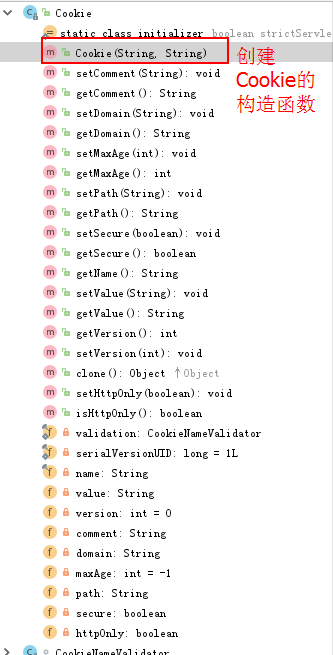
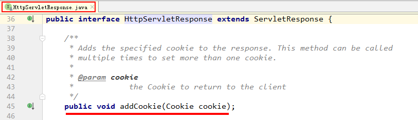
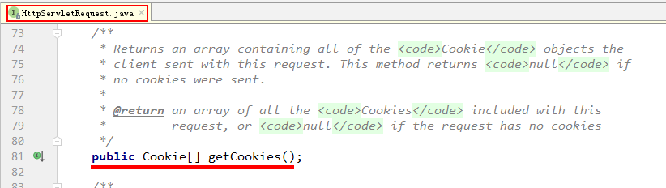
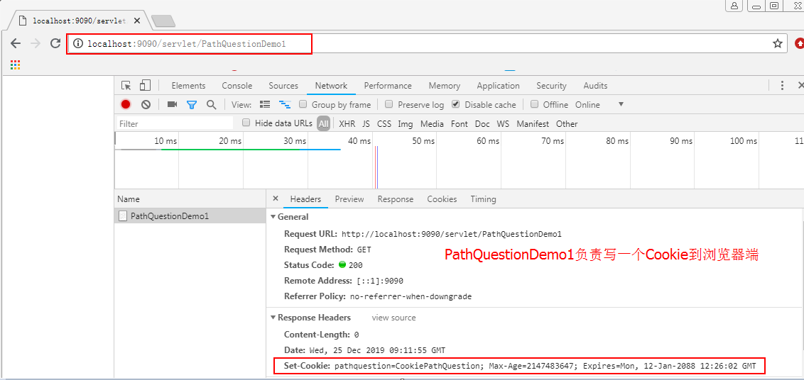
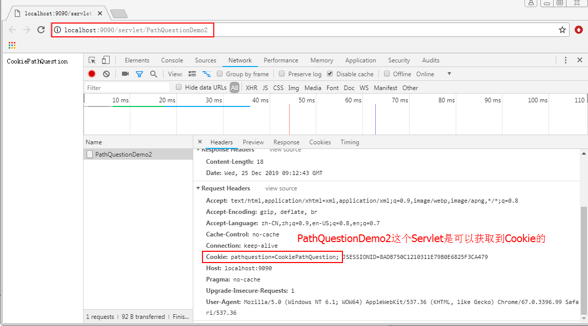
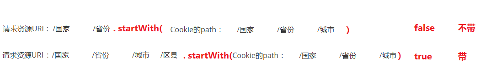
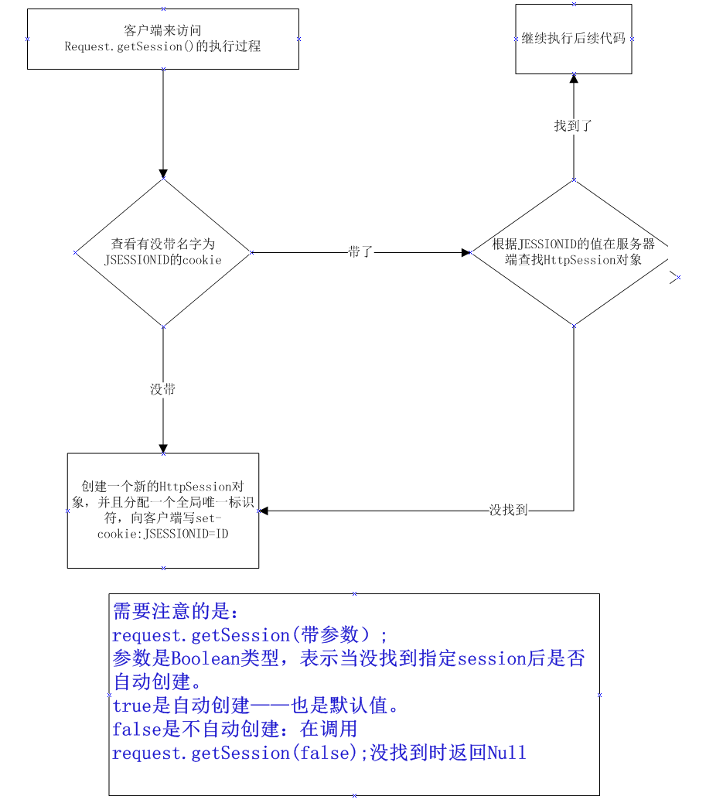
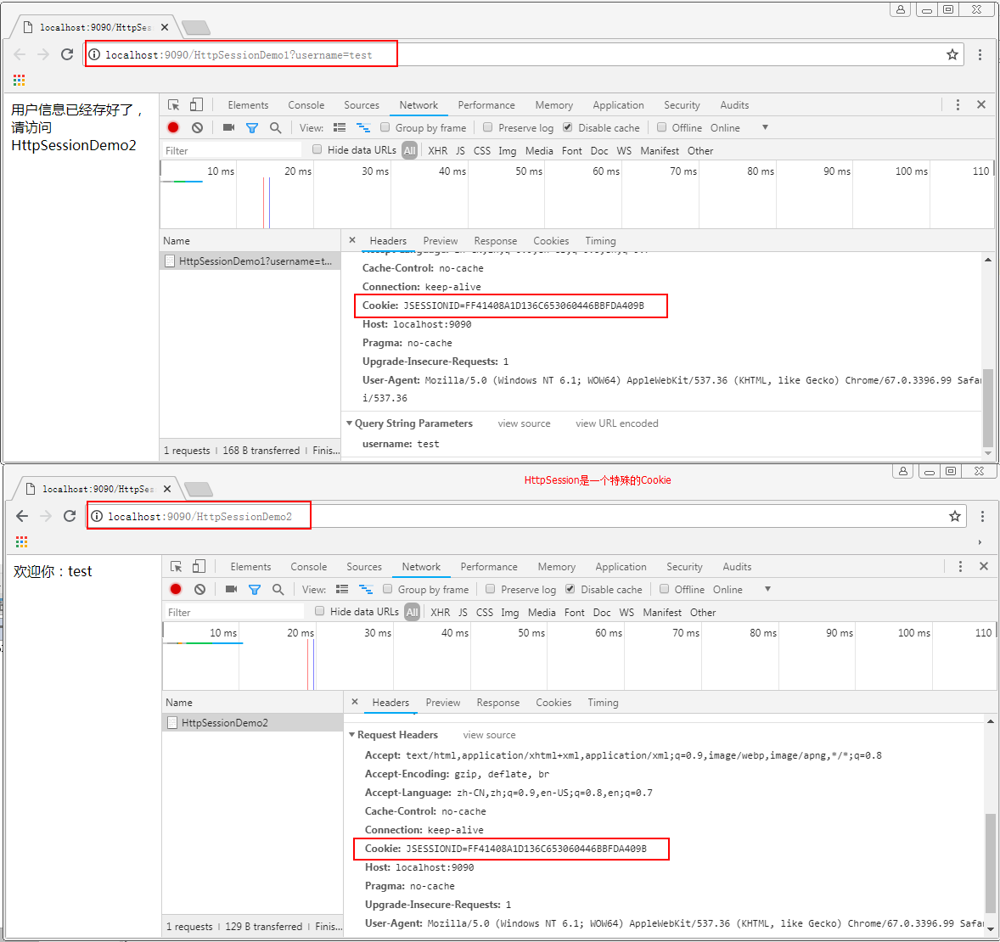

# Cookie&Session-会话技术

## 1 会话管理概述

### 1.1 什么是会话

这里的会话，指的是web开发中的一次通话过程，当打开浏览器，访问网站地址后，会话开始，当关闭浏览器（或者到了过期时间），会话结束。

举个例子：

​	例如，你在给家人打电话，这时突然有送快递的配送员敲门，你放下电话去开门，收完快递回来后，通话还在保持中，继续说话就行了。

### 1.2 会话管理作用

什么时候会用到会话管理呢？最常见的就是购物车，当我们登录成功后，把商品加入到购物车之中，此时我们无论再浏览什么商品，当点击购物车时，那些加入的商品都仍在购物车中。

在我们的实际开发中，还有很多地方都离不开会话管理技术。比如，我们在论坛发帖，没有登录的游客身份是不允许发帖的。所以当我们登录成功后，无论我们进入哪个版块发帖，只要权限允许的情况下，服务器都会认识我们，从而让我们发帖，因为登录成功的信息一直保留在服务器端的会话中。

通过上面的两个例子，我们可以看出，它是为我们共享数据用的，并且是在不同请求间实现数据共享。也就是说，如果我们需要在多次请求间实现数据共享，就可以考虑使用会话管理技术了。

### 1.3 会话管理分类

在JavaEE的项目中，会话管理分为两类。分别是：客户端会话管理技术和服务端会话管理技术。

**客户端会话管理技术**

​		它是把要共享的数据保存到了客户端（也就是浏览器端）。每次请求时，把会话信息带到服务器，从而实现多次请求的数据共享。

**服务端会话管理技术**

​		它本质仍是采用客户端会话管理技术，只不过保存到客户端的是一个特殊的标识，并且把要共享的数据保存到了服务端的内存对象中。每次请求时，把这个标识带到服务器端，然后使用这个标识，找到对应的内存空间，从而实现数据共享。

## 2 客户端会话管理技术

### 2.1 Cookie概述

#### 1）什么是Cookie

它是客户端浏览器的缓存文件，里面记录了客户浏览器访问网站的一些内容。同时，也是HTTP协议请求和响应消息头的一部分（在HTTP协议课程中，我们备注了它很重要）。

#### 2）Cookie的API详解

**作用**

它可以保存客户浏览器访问网站的相关内容（需要客户端不禁用Cookie）。从而在每次访问需要同一个内容时，先从本地缓存获取，使资源共享，提高效率。

**Cookie的属性**

| 属性名称 | 属性作用                 | 是否重要 |
| -------- | ------------------------ | -------- |
| name     | cookie的名称             | 必要属性 |
| value    | cookie的值（不能是中文） | 必要属性 |
| path     | cookie的路径             | 重要     |
| domain   | cookie的域名             | 重要     |
| maxAge   | cookie的生存时间。       | 重要     |
| version  | cookie的版本号。         | 不重要   |
| comment  | cookie的说明。           | 不重要   |

**细节**

Cookie有大小，个数限制。每个网站最多只能存20个cookie，且大小不能超过4kb。同时，所有网站的cookie总数不超过300个。

当删除Cookie时，设置maxAge值为0。当不设置maxAge时，使用的是浏览器的内存，当关闭浏览器之后，cookie将丢失。设置了此值，就会保存成缓存文件（值必须是大于0的,以秒为单位）。

#### 3）Cookie涉及的常用方法

**创建Cookie**



```java
/**
 * 通过指定的名称和值构造一个Cookie
 *
 * Cookie的名称必须遵循RFC 2109规范。这就意味着，它只能包含ASCII字母数字字符，
 * 不能包含逗号、分号或空格或以$字符开头。
 * 创建后无法更改cookie的名称。
 *
 * 该值可以是服务器选择发送的任何内容。
 * 它的价值可能只有服务器才感兴趣。
 * 创建之后，可以使用setValue方法更改cookie的值。
 */
public Cookie(String name, String value) {
	validation.validate(name);
	this.name = name;
	this.value = value;
}
```

**向浏览器添加Cookie**



```java
/**
 * 添加Cookie到响应中。此方法可以多次调用，用以添加多个Cookie。
 */
public void addCookie(Cookie cookie);
```

**从服务器端获取Cookie**



```java
/**
 * 这是HttpServletRequest中的方法。
 * 它返回一个Cookie的数组，包含客户端随此请求发送的所有Cookie对象。
 * 如果没有符合规则的cookie，则此方法返回null。
 */
 public Cookie[] getCookies();
```

### 2.2 Cookie的Path细节：浏览器什么时候带给服务器，什么时候不带

#### 1）需求说明

创建一个Cookie，设置Cookie的path，通过不同的路径访问，从而查看请求携带Cookie的情况。

#### 2）案例目的

通过此案例的讲解，同学们可以清晰的描述出，客户浏览器何时带cookie到服务器端，何时不带。

#### 3）案例步骤

**第一步：创建JavaWeb工程**

沿用第一个案例中的工程即可。

**第二步：编写Servlet**

```JAVA
/**
 * Cookie的路径问题
 * 前期准备：
 * 	1.在demo1中写一个cookie到客户端
 *  2.在demo2和demo3中分别去获取cookie
 *  	demo1的Servlet映射是   /servlet/PathQuestionDemo1
 *  	demo2的Servlet映射是   /servlet/PathQuestionDemo2
 *  	demo3的Servlet映射是   /PathQuestionDemo3
 *
 * @author 黑马程序员
 * @Company http://www.itheima.com
 *
 */
public class PathQuestionDemo1 extends HttpServlet {

	public void doGet(HttpServletRequest request, HttpServletResponse response)
			throws ServletException, IOException {
		//1.创建一个Cookie
		Cookie cookie = new Cookie("pathquestion","CookiePathQuestion");
		//2.设置cookie的最大存活时间
		cookie.setMaxAge(Integer.MAX_VALUE);
		//3.把cookie发送到客户端
		response.addCookie(cookie);//setHeader("Set-Cookie","cookie的值")
	}

	public void doPost(HttpServletRequest request, HttpServletResponse response)
			throws ServletException, IOException {
		doGet(request, response);
	}
}

```

```java
/**
 * 获取Cookie，名称是pathquestion
 * @author 黑马程序员
 * @Company http://www.itheima.com
 */
public class PathQuestionDemo2 extends HttpServlet {

	public void doGet(HttpServletRequest request, HttpServletResponse response)
			throws ServletException, IOException {
		//1.获取所有的cookie
		Cookie[] cs = request.getCookies();
		//2.遍历cookie的数组
		for(int i=0;cs!=null && i<cs.length;i++){
			if("pathquestion".equals(cs[i].getName())){
				//找到了我们想要的cookie，输出cookie的值
				response.getWriter().write(cs[i].getValue());
				return;
			}
		}
	}

	public void doPost(HttpServletRequest request, HttpServletResponse response)
			throws ServletException, IOException {
		doGet(request, response);
	}
}
```

```java
/**
 * 获取Cookie，名称是pathquestion
 * @author 黑马程序员
 * @Company http://www.itheima.com
 */
public class PathQuestionDemo3 extends HttpServlet {

	public void doGet(HttpServletRequest request, HttpServletResponse response)
			throws ServletException, IOException {
		//1.获取所有的cookie
		Cookie[] cs = request.getCookies();
		//2.遍历cookie的数组
		for(int i=0;cs!=null && i<cs.length;i++){
			if("pathquestion".equals(cs[i].getName())){
				//找到了我们想要的cookie，输出cookie的值
				response.getWriter().write(cs[i].getValue());
				return;
			}
		}
	}

	public void doPost(HttpServletRequest request, HttpServletResponse response)
			throws ServletException, IOException {
		doGet(request, response);
	}
}
```

**第三步：配置Servlet**

```xml
<!--配置Cookie路径问题案例的Servlet-->
<servlet>
    <servlet-name>PathQuestionDemo1</servlet-name>
    <servlet-class>com.itheima.web.servlet.pathquestion.PathQuestionDemo1</servlet-class>
</servlet>
<servlet-mapping>
    <servlet-name>PathQuestionDemo1</servlet-name>
    <url-pattern>/servlet/PathQuestionDemo1</url-pattern>
</servlet-mapping>

<servlet>
    <servlet-name>PathQuestionDemo2</servlet-name>
    <servlet-class>com.itheima.web.servlet.pathquestion.PathQuestionDemo2</servlet-class>
</servlet>
<servlet-mapping>
    <servlet-name>PathQuestionDemo2</servlet-name>
    <url-pattern>/servlet/PathQuestionDemo2</url-pattern>
</servlet-mapping>

<servlet>
    <servlet-name>PathQuestionDemo3</servlet-name>
    <servlet-class>com.itheima.web.servlet.pathquestion.PathQuestionDemo3</servlet-class>
</servlet>
<servlet-mapping>
    <servlet-name>PathQuestionDemo3</servlet-name>
    <url-pattern>/PathQuestionDemo3</url-pattern>
</servlet-mapping>
```

**第四步：部署工程**

沿用第一个案例中的工程部署即可。

#### 4）测试结果

通过分别运行PathQuestionDemo1，2和3这3个Servlet，我们发现由demo1写Cookie，在demo2中可以取到，但是到了demo3中就无法获取了，如下图所示：






#### 5）路径问题的分析及总结

**问题：**
 	 demo2和demo3谁能取到cookie？
 **答案：**
 	 demo2能取到，demo3取不到
**分析：**
 	 首先，我们要知道如何确定一个cookie？
 	 那就是使用cookie的三个属性组合：<font color='red'><b>domain+path+name</b></font>
 	 这里面，同一个应用的domain是一样的，在我们的案例中都是localhost。
​      并且，我们取的都是同一个cookie，所以name也是一样的，都是pathquestion。
​      那么，不一样的只能是path了。但是我们没有设置过cookie的path属性，这就表明path是有默认值的。
 	 接下来，我们打开这个cookie来看一看，在ie浏览器访问一次PathQuestionDemo1这个Servlet：

Cookie中的内容：
 		 
 我们是通过demo1写的cookie，demo1的访问路径是： http://localhost:9090/servlet/PathQuestionDemo1
 通过比较两个路径：请求资源地址和cookie的path，可以看出：cookie的path默认值是：请求资源URI，没有资源的部分（在我们的案例中，就是没有PathQuestionDemo1）。

**客户端什么时候带cookie到服务器，什么时候不带？**
​	就是看请求资源URI和cookie的path比较。

​	<font color='red'>请求资源URI.startWith(cookie的path) </font> 如果返回的是true就带，如果返回的是false就不带。

​	简单的说： 就是看谁的地址更精细

​	比如：Cookie的path：       /国家			/省份			/城市

 		 	 请求资源URI	:   	  /国家			/省份														  不带
 		 	 请求资源URI   ：	   /国家			/省份			/城市			/区县				带



在我们的案例中：

| 访问URL                                                      | URI部分                    | Cookie的Path | 是否携带Cookie | 能否取到Cookie |
| ------------------------------------------------------------ | -------------------------- | ------------ | -------------- | -------------- |
| [PathQuestionDemo2](http://localhost:9090/servlet/PathQuestionDemo2) | /servlet/PathQuestionDemo2 | /servlet/    | 带             | 能取到         |
| [PathQuestionDemo3](http://localhost:9090/PathQuestionDemo3) | /PathQuestionDemo3         | /servlet/    | 不带           | 不能取到       |

## 3 服务端会话管理概述

### 3.1 HttpSession概述

#### 1）HttpSession对象介绍

它是Servlet规范中提供的一个接口。该接口的实现由Servlet规范的实现提供商提供。我们使用的是Tomcat服务器，它对Servlet规范进行了实现，所以HttpSession接口的实现由Tomcat提供。该对象用于提供一种通过多个页面请求或访问网站来标识用户并存储有关该用户的信息的方法。简单说它就是一个服务端会话对象，用于存储用户的会话数据。

同时，它也是Servlet规范中四大域对象之一的会话域对象。并且它也是用于实现数据共享的。但它与我们之前讲解的应用域和请求域是有区别的。

| 域对象         | 作用范围     | 使用场景                                                     |
| -------------- | ------------ | ------------------------------------------------------------ |
| ServletContext | 整个应用范围 | 当前项目中需要数据共享时，可以使用此域对象。                 |
| ServletRequest | 当前请求范围 | 在请求或者当前请求转发时需要数据共享可以使用此域对象。       |
| HttpSession    | 会话返回     | 在当前会话范围中实现数据共享。它可以在多次请求中实现数据共享。 |

#### 2）HttpSession的获取

获取HttpSession是通过HttpServletRequest接口中的两个方法获取的，如下图所示：


这两个方法的区别：



#### 3）HttpSession的常用方法


### 3.2 HttpSession的入门案例

#### 1）需求说明

在请求HttpSessionDemo1这个Servlet时，携带用户名信息，并且把信息保存到会话域中，然后从HttpSessionDemo2这个Servlet中获取登录信息。

#### 2）案例目的

通过本案例的讲解，同学们可以清楚的认识到会话域的作用，即多次请求间的数据共享。因为是两次请求，请求域肯定不一样了，所以不能用请求域实现。

最终掌握HttpSession对象的获取和使用。

#### 3）原理分析

HttpSession，它虽然是服务端会话管理技术的对象，但它本质仍是一个Cookie。是一个由服务器自动创建的特殊的Cookie，Cookie的名称就是JSESSIONID，Cookie的值是服务器分配的一个唯一的标识。

当我们使用HttpSession时，浏览器在没有禁用Cookie的情况下，都会把这个Cookie带到服务器端，然后根据唯一标识去查找对应的HttpSession对象，找到了，我们就可以直接使用了。下图就是我们入门案例中，HttpSession分配的唯一标识，同学们可以看到两次请求的JSESSIONID的值是一样的：



### 3.3 HttpSession的钝化和活化

**什么是持久态**

​		把长时间不用，但还不到过期时间的HttpSession进行序列化，写到磁盘上。

​		我们把HttpSession持久态也叫做钝化。（与钝化相反的，我们叫活化。）

**什么时候使用持久化**

​		第一种情况：当访问量很大时，服务器会根据getLastAccessTime来进行排序，对长时间不用，但是还没到过期时间的HttpSession进行持久化。

​		第二种情况：当服务器进行重启的时候，为了保持客户HttpSession中的数据，也要对HttpSession进行持久化

**注意**

​		HttpSession的持久化由服务器来负责管理，我们不用关心。

​		只有实现了序列化接口的类才能被序列化，否则不行。
