# 2 Servlet规范中的过滤器-Filter

## 2.1 过滤器入门

### 2.1.1 过滤器概念及作用

过滤器——Filter，它是JavaWeb三大组件之一。另外两个是Servlet和Listener。

它是在2000年发布的Servlet2.3规范中加入的一个接口。是Servlet规范中非常实用的技术。

它可以对web应用中的所有资源进行拦截，并且在拦截之后进行一些特殊的操作。

常见应用场景：URL级别的权限控制；过滤敏感词汇；中文乱码问题等等。

### 2.1.2 过滤器的入门案例

#### 1）前期准备

**创建JavaWeb工程**

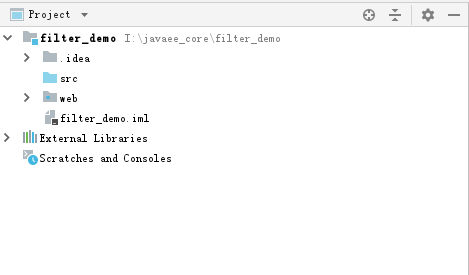

**编写和配置接收请求用的Servlet**

```java
/**
 * 用于接收和处理请求的Servlet
 * @author 黑马程序员
 * @Company http://www.itheima.com
 */
public class ServletDemo1 extends HttpServlet {

    /**
     * 处理请求的方法
     * @param req
     * @param resp
     * @throws ServletException
     * @throws IOException
     */
    @Override
    protected void doGet(HttpServletRequest req, HttpServletResponse resp) throws ServletException, IOException {
        System.out.println("ServletDemo1接收到了请求");
        req.getRequestDispatcher("/WEB-INF/pages/success.jsp").forward(req,resp);
    }

    @Override
    protected void doPost(HttpServletRequest req, HttpServletResponse resp) throws ServletException, IOException {
       doGet(req,resp);
    }
}
```

```xml
<?xml version="1.0" encoding="UTF-8"?>
<web-app xmlns="http://xmlns.jcp.org/xml/ns/javaee"
         xmlns:xsi="http://www.w3.org/2001/XMLSchema-instance"
         xsi:schemaLocation="http://xmlns.jcp.org/xml/ns/javaee
                      http://xmlns.jcp.org/xml/ns/javaee/web-app_3_1.xsd"
         version="3.1"
         metadata-complete="true">
    
    <!--配置Servlet-->
    <servlet>
        <servlet-name>ServletDemo1</servlet-name>
        <servlet-class>com.itheima.web.servlet.ServletDemo1</servlet-class>
    </servlet>
    <servlet-mapping>
        <servlet-name>ServletDemo1</servlet-name>
        <url-pattern>/ServletDemo1</url-pattern>
    </servlet-mapping>
</web-app>

```

**编写index.jsp**

```jsp
<%-- Created by IntelliJ IDEA. --%>
<%@ page contentType="text/html;charset=UTF-8" language="java" %>
<html>
  <head>
    <title>主页面</title>
  </head>
  <body>
    <a href="${pageContext.request.contextPath}/ServletDemo1">访问ServletDemo1</a>
  </body>
</html>
```

**编写success.jsp**

```jsp
<%@ page contentType="text/html;charset=UTF-8" language="java" %>
<html>
<head>
    <title>成功页面</title>
</head>
<body>
<%System.out.println("success.jsp执行了");%>
执行成功！
</body>
</html>

```

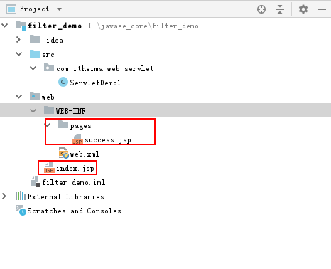

#### 2）过滤器的编写步骤

**编写过滤器**

```java
/**
 * Filter的入门案例
 * @author 黑马程序员
 * @Company http://www.itheima.com
 */
public class FilterDemo1 implements Filter {

    /**
     * 过滤器的核心方法
     * @param request
     * @param response
     * @param chain
     * @throws IOException
     * @throws ServletException
     */
    @Override
    public void doFilter(ServletRequest request, ServletResponse response, FilterChain chain) throws IOException, ServletException {
        /**
         * 如果不写此段代码，控制台会输出两次：FilterDemo1拦截到了请求。
         */
        HttpServletRequest req = (HttpServletRequest) request;
        String requestURI = req.getRequestURI();
        if (requestURI.contains("favicon.ico")) {
            return;
        }
        System.out.println("FilterDemo1拦截到了请求");
    }
}
```

**配置过滤器**

```xml
<!--配置过滤器-->
<filter>
    <filter-name>FilterDemo1</filter-name>
    <filter-class>com.itheima.web.filter.FilterDemo1</filter-class>
</filter>
<filter-mapping>
    <filter-name>FilterDemo1</filter-name>
    <url-pattern>/*</url-pattern>
</filter-mapping>
```

#### 3）测试部署

**部署项目**

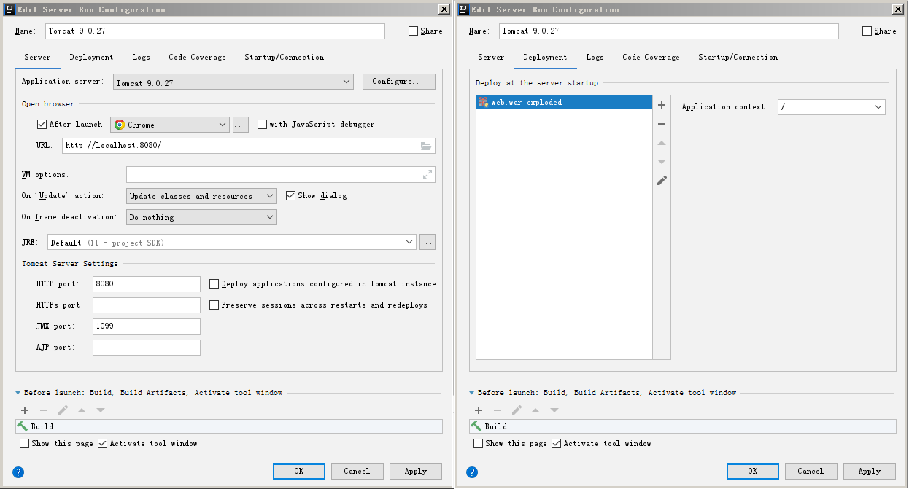

**测试结果**


**案例的问题分析及解决**

当我们启动服务，在地址栏输入访问地址后，发现浏览器任何内容都没有，控制台却输出了【FilterDemo1拦截到了请求】，也就是说在访问任何资源的时候，都先经过了过滤器。

这是因为：我们在配置过滤器的拦截规则时，使用了<font color='red' size="5"><b>/*</b></font>,表明访问当前应用下任何资源，此过滤器都会起作用。除了这种全部过滤的规则之外，它还支持特定类型的过滤配置。我们可以稍作调整，就可以不用加上面那段过滤图标的代码了。修改的方式如下：

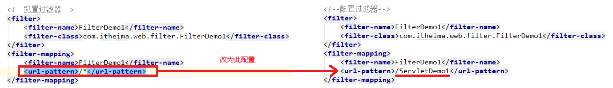

现在的问题是，我们拦截下来了，点击链接发送请求，运行结果是：

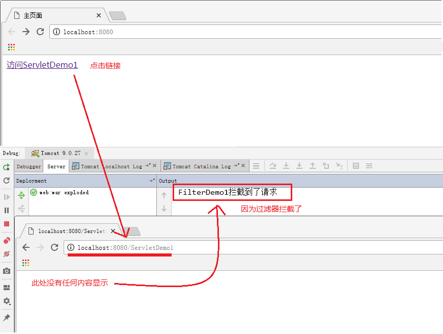

需要对过滤器执行放行操作，才能让他继续执行，那么如何放行的？

我们需要使用`FilterChain`中的`doFilter`方法放行。


## 2.2 过滤器的细节

### 2.2.1 过滤器API介绍

#### 1）Filter


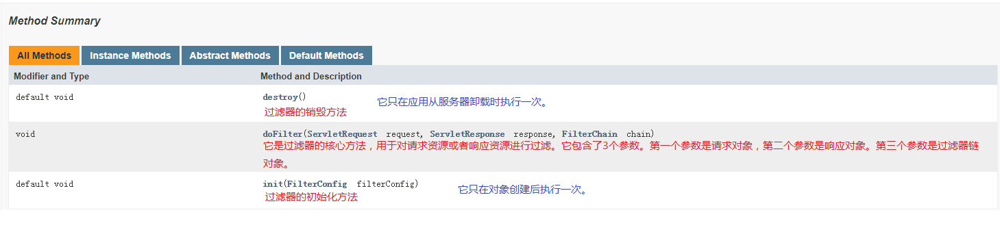

#### 2）FilterConfig


#### 3）FilterChain


### 2.2.2 入门案例过程及生命周期

#### 1）生命周期

**出生——活着——死亡**

**出生：**当应用加载的时候执行实例化和初始化方法。

**活着：**只要应用一直提供服务，对象就一直存在。

**死亡：**当应用卸载时，或者服务器宕机时，对象消亡。

**Filter的实例对象在内存中也只有一份。所以也是单例的。**

#### 2）过滤器核心方法的细节

在`FilterDemo1`的`doFilter`方法添加一行代码，如下：

```java
/**
     * 过滤器的核心方法
     * @param request
     * @param response
     * @param chain
     * @throws IOException
     * @throws ServletException
     */
    @Override
    public void doFilter(ServletRequest request, ServletResponse response, FilterChain chain) throws IOException, ServletException {
        /**
         * 如果不写此段代码，控制台会输出两次：FilterDemo1拦截到了请求。

        HttpServletRequest req = (HttpServletRequest) request;
        String requestURI = req.getRequestURI();
        if (requestURI.contains("favicon.ico")) {
            return;
        }*/
        System.out.println("FilterDemo1拦截到了请求");
        //过滤器放行
        chain.doFilter(request,response);
        System.out.println("FilterDemo1放行之后，又回到了doFilter方法");
    }
```

测试运行结果，我们发现过滤器放行之后执行完目标资源，仍会回到过滤器中：

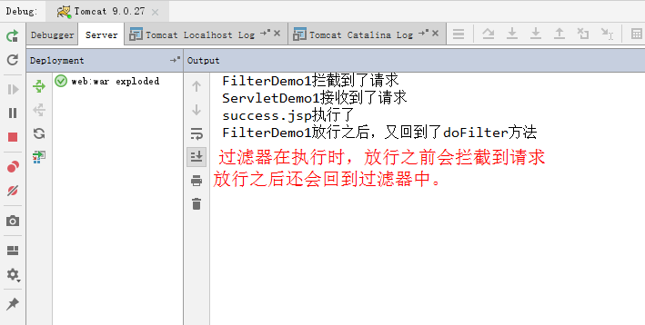

### 2.2.3 过滤器初始化参数配置

#### 1）创建过滤器FilterDemo2

```java
/**
 * Filter的初始化参数配置
 * @author 黑马程序员
 * @Company http://www.itheima.com
 */
public class FilterDemo2 implements Filter {

    private FilterConfig filterConfig;

    /**
     * 初始化方法
     * @param filterConfig
     * @throws ServletException
     */
    @Override
    public void init(FilterConfig filterConfig) throws ServletException {
        System.out.println("FilterDemo2的初始化方法执行了");
        //给过滤器配置对象赋值
        this.filterConfig = filterConfig;
    }

    /**
     * 过滤器的核心方法
     * @param request
     * @param response
     * @param chain
     * @throws IOException
     * @throws ServletException
     */
    @Override
    public void doFilter(ServletRequest request, ServletResponse response, FilterChain chain) throws IOException, ServletException {

        System.out.println("FilterDemo2拦截到了请求");
        //过滤器放行
        chain.doFilter(request,response);
    }
    
    /**
     * 销毁方法
     */
    @Override
    public void destroy() {
        System.out.println("FilterDemo2的销毁方法执行了");
    }
}
```

#### 2）配置FilterDemo2

```xml
<filter>
    <filter-name>FilterDemo2</filter-name>
    <filter-class>com.itheima.web.filter.FilterDemo2</filter-class>
    <!--配置过滤器的初始化参数-->
    <init-param>
        <param-name>filterInitParamName</param-name>
        <param-value>filterInitParamValue</param-value>
    </init-param>
</filter>
<filter-mapping>
    <filter-name>FilterDemo2</filter-name>
    <url-pattern>/ServletDemo1</url-pattern>
</filter-mapping>
```

#### 3）在FilterDemo2的doFilter方法中添加下面的代码

```java
//根据名称获取过滤器的初始化参数
String paramValue = filterConfig.getInitParameter("filterInitParamName");
System.out.println(paramValue);

//获取过滤器初始化参数名称的枚举
Enumeration<String> initNames = filterConfig.getInitParameterNames();
while(initNames.hasMoreElements()){
    String initName = initNames.nextElement();
    String initValue = filterConfig.getInitParameter(initName);
    System.out.println(initName+","+initValue);
}

//获取ServletContext对象
ServletContext servletContext = filterConfig.getServletContext();
System.out.println(servletContext);

//获取过滤器名称
String filterName = filterConfig.getFilterName();
System.out.println(filterName);
```

#### 4）测试运行结果

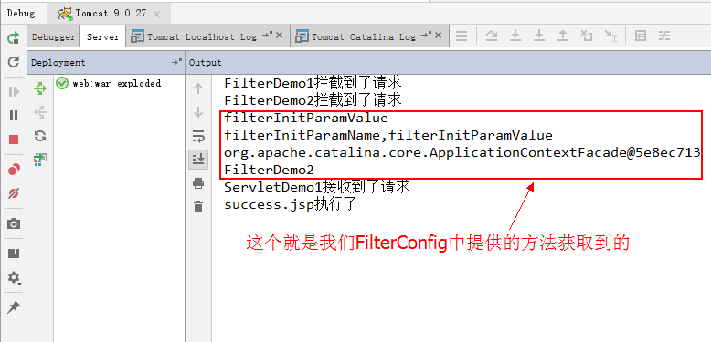

我们通过这个测试，看到了过滤器的初始化参数配置和获取的使用。但是同学们也肯定发现了，在我们的工程中两个过滤器都起作用了，这就是我们在API中说的链式调用，那么当有多个过滤器，它的执行顺序是什么样的呢？

我们来看下一小节。

### 2.2.5 多个过滤器的执行顺序

#### 1）修改FilterDemo1和FilterDemo2两个过滤器的代码，删掉多余的代码

```java
/**
 * Filter的入门案例
 * @author 黑马程序员
 * @Company http://www.itheima.com
 */
public class FilterDemo1 implements Filter {
    /**
     * 过滤器的核心方法
     * @param request
     * @param response
     * @param chain
     * @throws IOException
     * @throws ServletException
     */
    @Override
    public void doFilter(ServletRequest request, ServletResponse response, FilterChain chain) throws IOException, ServletException {
        
        System.out.println("FilterDemo1拦截到了请求");
        //过滤器放行
        chain.doFilter(request,response);
    }

    /**
     * 初始化方法
     * @param filterConfig
     * @throws ServletException
     */
    @Override
    public void init(FilterConfig filterConfig) throws ServletException {
        System.out.println("FilterDemo1的初始化方法执行了");
    }

    /**
     * 销毁方法
     */
    @Override
    public void destroy() {
        System.out.println("FilterDemo1的销毁方法执行了");
    }
}
```

```java
/**
 * Filter的初始化参数配置
 * @author 黑马程序员
 * @Company http://www.itheima.com
 */
public class FilterDemo2 implements Filter {

    /**
     * 初始化方法
     * @param filterConfig
     * @throws ServletException
     */
    @Override
    public void init(FilterConfig filterConfig) throws ServletException {
        System.out.println("FilterDemo2的初始化方法执行了");

    }

    /**
     * 过滤器的核心方法
     * @param request
     * @param response
     * @param chain
     * @throws IOException
     * @throws ServletException
     */
    @Override
    public void doFilter(ServletRequest request, ServletResponse response, FilterChain chain) throws IOException, ServletException {

        System.out.println("FilterDemo2拦截到了请求");
        //过滤器放行
        chain.doFilter(request,response);
    }

    /**
     * 销毁方法
     */
    @Override
    public void destroy() {
        System.out.println("FilterDemo2的销毁方法执行了");
    }
}
```

#### 2）修改两个过滤器的配置，删掉多余的配置

```xml
<!--配置过滤器-->
<filter>
    <filter-name>FilterDemo1</filter-name>
    <filter-class>com.itheima.web.filter.FilterDemo1</filter-class>
</filter>
<filter-mapping>
    <filter-name>FilterDemo1</filter-name>
    <url-pattern>/ServletDemo1</url-pattern>
</filter-mapping>


<filter>
    <filter-name>FilterDemo2</filter-name>
    <filter-class>com.itheima.web.filter.FilterDemo2</filter-class>
</filter>
<filter-mapping>
    <filter-name>FilterDemo2</filter-name>
    <url-pattern>/ServletDemo1</url-pattern>
</filter-mapping>
```

#### 3）测试运行结果


此处我们看到了多个过滤器的执行顺序，它正好和我们在web.xml中的配置顺序一致，如下图：

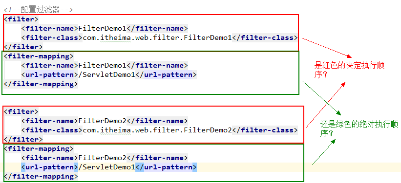

在过滤器的配置中，有过滤器的声明和过滤器的映射两部分，到底是声明决定顺序，还是映射决定顺序呢？

答案是：<font color='red'><b>`<filter-mapping>`的配置前后顺序决定过滤器的调用顺序，也就是由映射配置顺序决定。</b></font>

### 2.2.6 过滤器的五种拦截行为

我们的过滤器目前拦截的是请求，但是在实际开发中，我们还有请求转发和请求包含，以及由服务器触发调用的全局错误页面。默认情况下过滤器是不参与过滤的，要想使用，需要我们配置。配置的方式如下：

```xml
<!--配置过滤器-->
<filter>
    <filter-name>FilterDemo1</filter-name>
    <filter-class>com.itheima.web.filter.FilterDemo1</filter-class>
    <!--配置开启异步支持，当dispatcher配置ASYNC时，需要配置此行-->
    <async-supported>true</async-supported>
</filter>
<filter-mapping>
    <filter-name>FilterDemo1</filter-name>
    <url-pattern>/ServletDemo1</url-pattern>
    <!--过滤请求：默认值。-->
    <dispatcher>REQUEST</dispatcher>
    <!--过滤全局错误页面：当由服务器调用全局错误页面时，过滤器工作-->
    <dispatcher>ERROR</dispatcher>
    <!--过滤请求转发：当请求转发时，过滤器工作。-->
    <dispatcher>FORWARD</dispatcher>
    <!--过滤请求包含：当请求包含时，过滤器工作。它只能过滤动态包含，jsp的include指令是静态包含-->
    <dispatcher>INCLUDE</dispatcher>
    <!--过滤异步类型，它要求我们在filter标签中配置开启异步支持-->
    <dispatcher>ASYNC</dispatcher>
</filter-mapping>
```

### 2.2.4 过滤器与Servlet的区别

| 方法/类型                                          | Servlet                                                      | Filter                                                       | 备注                                                         |
| -------------------------------------------------- | ------------------------------------------------------------ | ------------------------------------------------------------ | ------------------------------------------------------------ |
| 初始化                                        方法 | `void   init(ServletConfig);   `                             | `void init(FilterConfig);   `                                | 几乎一样，都是在web.xml中配置参数，用该对象的方法可以获取到。 |
| 提供服务方法                                       | `void   service(request,response);                                               ` | `void   dofilter(request,response,FilterChain);                                   ` | Filter比Servlet多了一个FilterChain，它不仅能完成Servlet的功能，而且还可以决定程序是否能继续执行。所以过滤器比Servlet更为强大。   在Struts2中，核心控制器就是一个过滤器。 |
| 销毁方法                                           | `void destroy();`                                            | `void destroy();`                                            |                                                              |

## 2.3 过滤器的使用案例

### 2.3.1 静态资源设置缓存时间过滤器

#### 1） 需求说明

在我们访问html，js，image时，不需要每次都重新发送请求读取资源，就可以通过设置响应消息头的方式，设置缓存时间。但是如果每个Servlet都编写相同的代码，显然不符合我们统一调用和维护的理念。（此处有个非常重要的编程思想：AOP思想，在录制视频时提不提都可以）

因此，我们要采用过滤器来实现功能。

#### 2） 编写步骤

**第一步：创建JavaWeb工程**

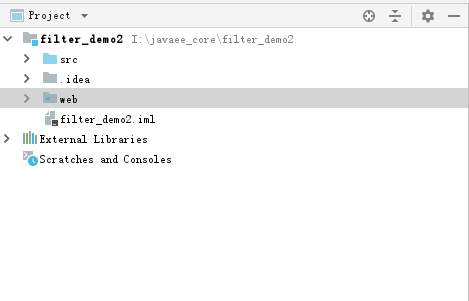

**第二步：导入静态资源**


**第三步：编写过滤器**

```java
/**
 * 静态资源设置缓存时间
 * 	html设置为1小时
 *  js设置为2小时
 *  css设置为3小时
 * @author 黑马程序员
 * @Company http://www.itheima.com
 */
public class StaticResourceNeedCacheFilter implements Filter {

    private FilterConfig filterConfig;

    public void init(FilterConfig filterConfig) throws ServletException {
        this.filterConfig = filterConfig;
    }


    public void doFilter(ServletRequest req, ServletResponse res,
                         FilterChain chain) throws IOException, ServletException {
        //1.把doFilter的请求和响应对象转换成跟http协议有关的对象
        HttpServletRequest  request;
        HttpServletResponse response;
        try {
            request = (HttpServletRequest) req;
            response = (HttpServletResponse) res;
        } catch (ClassCastException e) {
            throw new ServletException("non-HTTP request or response");
        }
        //2.获取请求资源URI
        String uri = request.getRequestURI();
        //3.得到请求资源到底是什么类型
        String extend = uri.substring(uri.lastIndexOf(".")+1);//我们只需要判断它是不是html,css,js。其他的不管
        //4.判断到底是什么类型的资源
        long time = 60*60*1000;
        if("html".equals(extend)){
            //html 缓存1小时
            String html = filterConfig.getInitParameter("html");
            time = time*Long.parseLong(html);
        }else if("js".equals(extend)){
            //js 缓存2小时
            String js = filterConfig.getInitParameter("js");
            time = time*Long.parseLong(js);
        }else if("css".equals(extend)){
            //css 缓存3小时
            String css = filterConfig.getInitParameter("css");
            time = time*Long.parseLong(css);

        }
        //5.设置响应消息头
        response.setDateHeader("Expires", System.currentTimeMillis()+time);
        //6.放行
        chain.doFilter(request, response);
    }


    public void destroy() {

    }

}
```

**第四步：配置过滤器**

```xml
<filter>
    <filter-name>StaticResourceNeedCacheFilter</filter-name>
    <filter-class>com.itheima.web.filter.StaticResourceNeedCacheFilter</filter-class>
    <init-param>
        <param-name>html</param-name>
        <param-value>3</param-value>
    </init-param>
    <init-param>
        <param-name>js</param-name>
        <param-value>4</param-value>
    </init-param>
    <init-param>
        <param-name>css</param-name>
        <param-value>5</param-value>
    </init-param>
</filter>
<filter-mapping>
    <filter-name>StaticResourceNeedCacheFilter</filter-name>
    <url-pattern>*.html</url-pattern>
</filter-mapping>
<filter-mapping>
    <filter-name>StaticResourceNeedCacheFilter</filter-name>
    <url-pattern>*.js</url-pattern>
</filter-mapping>
<filter-mapping>
    <filter-name>StaticResourceNeedCacheFilter</filter-name>
    <url-pattern>*.css</url-pattern>
</filter-mapping>
```

#### 3） 测试结果

> 此案例演示时需要注意一下，chrome浏览器刷新时，每次也都会发送请求，所以看不到304状态码。建议用IE浏览器，因为它在刷新时不会再次请求。


### 2.3.2 特殊字符过滤器

#### 1）需求说明

在实际开发中，可能会面临一个问题，就是很多输入框都会遇到特殊字符。此时，我们也可以通过过滤器来解决。

例如：

​	我们模拟一个论坛，有人发帖问：“在HTML中表示水平线的标签是哪个？”。

如果我们在文本框中直接输入`<hr/>`就会出现一条水平线，这个会让发帖人一脸懵。

我们接下来就用过滤器来解决一下。

#### 2）编写步骤

**第一步：创建JavaWeb工程**

沿用第一个案例的工程

**第二步：编写Servlet和JSP**

```java
/**
 * @author 黑马程序员
 * @Company http://www.itheima.com
 */
public class ServletDemo1 extends HttpServlet {

    public void doGet(HttpServletRequest request, HttpServletResponse response)
            throws ServletException, IOException {
        String content = request.getParameter("content");
        response.getWriter().write(content);
    }

    public void doPost(HttpServletRequest request, HttpServletResponse response)
            throws ServletException, IOException {
        doGet(request, response);
    }

}
```

```jsp
<servlet>
    <servlet-name>ServletDemo1</servlet-name>
    <servlet-class>com.itheima.web.servlet.ServletDemo1</servlet-class>
</servlet>
<servlet-mapping>
    <servlet-name>ServletDemo1</servlet-name>
    <url-pattern>/ServletDemo1</url-pattern>
</servlet-mapping>
```

```jsp
<%@ page language="java" import="java.util.*" pageEncoding="UTF-8"%>
<!DOCTYPE HTML PUBLIC "-//W3C//DTD HTML 4.01 Transitional//EN">
<html>
<head>
    <title></title>
</head>
<body>
<form action="${pageContext.request.contextPath}/ServletDemo1" method="POST">
    回帖：<textarea rows="5" cols="25" name="content"></textarea><br/>
    <input type="submit" value="发言">
</form>
</body>
</html>
```

**第三步：编写过滤器**

```java

/**
 * @author 黑马程序员
 * @Company http://www.itheima.com
 */
public class HTMLFilter implements Filter {

    public void init(FilterConfig filterConfig) throws ServletException {

    }


    public void doFilter(ServletRequest req, ServletResponse res,
                         FilterChain chain) throws IOException, ServletException {
        HttpServletRequest request;
        HttpServletResponse response;
        try {
            request = (HttpServletRequest) req;
            response = (HttpServletResponse) res;
        } catch (ClassCastException e) {
            throw new ServletException("non-HTTP request or response");
        }
        //创建一个自己的Request类
        MyHttpServletRequest2 myrequest = new MyHttpServletRequest2(request);
        //放行：
        chain.doFilter(myrequest, response);
    }

    public void destroy() {
    }
}
class MyHttpServletRequest2 extends HttpServletRequestWrapper {
    //提供一个构造方法
    public MyHttpServletRequest2(HttpServletRequest request){
        super(request);
    }

    //重写getParameter方法
    public String getParameter(String name) {
        //1.获取出请求正文： 调用父类的获取方法
        String value = super.getParameter(name);
        //2.判断value是否有值
        if(value == null){
            return null;
        }
        return htmlfilter(value);
    }

    private String htmlfilter(String message){
        if (message == null)
            return (null);

        char content[] = new char[message.length()];
        message.getChars(0, message.length(), content, 0);
        StringBuilder result = new StringBuilder(content.length + 50);
        for (int i = 0; i < content.length; i++) {
            switch (content[i]) {
                case '<':
                    result.append("&lt;");
                    break;
                case '>':
                    result.append("&gt;");
                    break;
                case '&':
                    result.append("&amp;");
                    break;
                case '"':
                    result.append("&quot;");
                    break;
                default:
                    result.append(content[i]);
            }
        }
        return (result.toString());
    }

}
```

**第四步：配置过滤器**

```xml
<filter>
    <filter-name>HTMLFilter</filter-name>
    <filter-class>com.itheima.web.filter.HTMLFilter</filter-class>
</filter>
<filter-mapping>
    <filter-name>HTMLFilter</filter-name>
    <url-pattern>/*</url-pattern>
</filter-mapping>
```

#### 3）测试结果

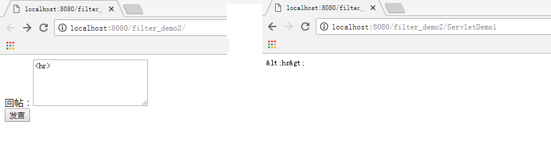

