# 1 CSS入门

## 1.1 初识CSS

### 1.1.1 概述

在学习了基本HTML标签和样式后，接下来学习前端开发的第二门技术。

我们发现，虽然标签的属性可以调整一些样式，但是效果不够理想，而我们更愿意把样式编写在`<style>` 标签中，让页面设计更美观更丰富，实际上，这是通过CSS实现的。那么什么是CSS呢？

如果说，HTML是网页的"素颜"，那么CSS就是页面的"美妆师"，它就是让网页的外观更漂亮！

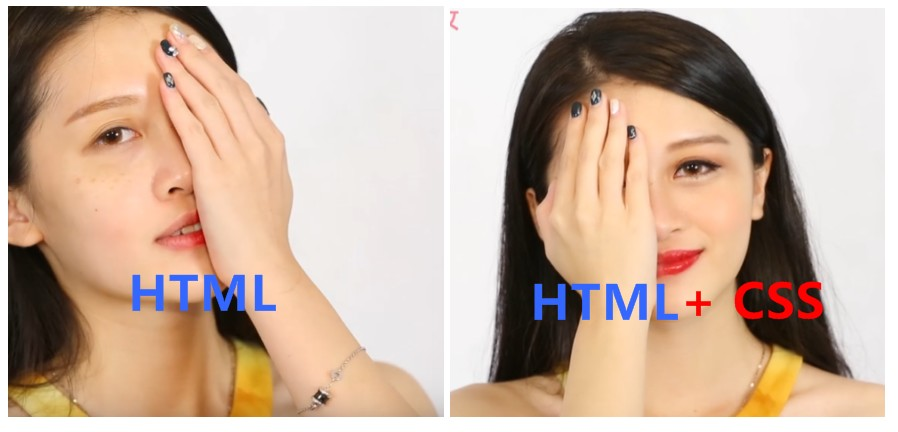

**CSS** (层叠样式表——Cascading Style Sheets，缩写为 **CSS**），简单的说，它是用于设置和布局网页的计算机语言。会告知浏览器如何渲染页面元素。例如，调整内容的字体，颜色，大小等样式，设置边框的样式，调整模块的间距等。

所谓`层叠` : 是指样式表允许以多种方式规定样式信息。可以规定在单个元素中，可以在页面头元素中，也可以在另一个CSS文件中，规定的方式会有次序的差别（讲解引入时说明）。

所谓`样式`：是指丰富的样式外观。拿边框距离来说，允许任何设置边框，允许设置边框与框内元素的距离，允许设置边框与边框的距离等等。

* **CSS发展简史【了解】**
  * [CSS](https://baike.baidu.com/item/CSS/5457?fr=aladdin#1)1：1994 年，Hkon Wium Lie 最初提出了 CSS 的想法，联合当时正在设计 Argo 的浏览器的Bert Bos，他们决定一起合作设计 CSS，于是创造了 CSS 的最初版本。1996 年 12 月，W3C 推出了 CSS 规范的第一版本。
  * CSS2：1998 年，W3C 发布了 CSS 的第二个版本，目前的主流浏览器都采用这标准。CSS2 的规范是基于 CSS1 设计的，包含了 CSS1 所有的功能，并扩充和改进了很多更加强大的属性。
  * CSS3：2005 年 12 月，W3C 开始 CSS3 标准的制定，并遵循模块化开发，所以没有固定的发布时间，而是一段时间发布一些特性模块。

> 图片了解资料：
>
> https://www.cnblogs.com/LO-ME/p/3651140.html
>
> 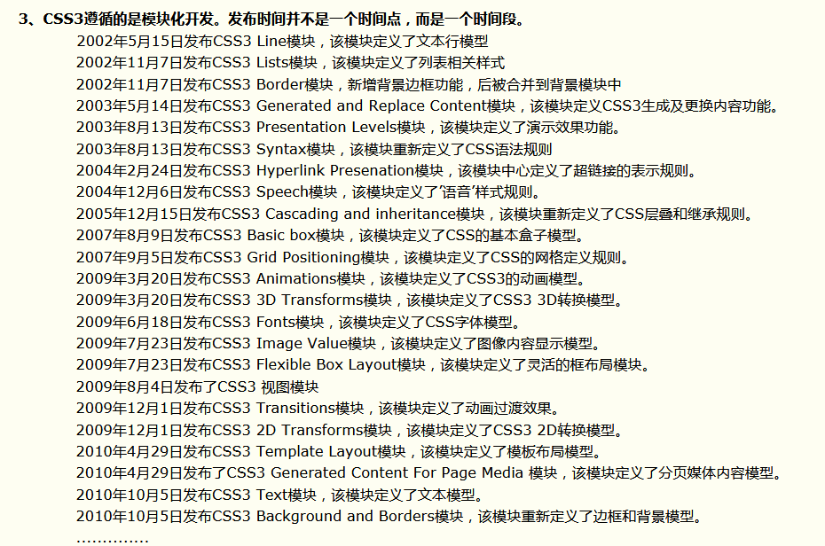

### 1.1.2 CSS的组成

CSS是一门基于规则的语言 — 你能定义用于你的网页中**特定元素**的一组**样式规则**。这里面提到了两个概念，一是特定元素，二是样式规则。对应CSS的语法，也就是**选择器（*selects*）**和**声明（*eclarations*）**。

* **选择器**：指定将要添加样式的 HTML元素的方式。可以使用标签名，class值，id值等多种方式。
* **声明**：形式为**属性(property):值(value)**，用于设置特定元素的属性信息。
  * 属性：指示文体特征，例如`font-size`，`width`，`background-color`。
  * 值：每个指定的属性都有一个值，该值指示您如何更改这些样式。

格式：

```css
选择器 {
    属性名:属性值;
    属性名:属性值;
    属性名:属性值;
}
```

举例：

```css
h1 {
    color: red;
    font-size: 5px;
}
```

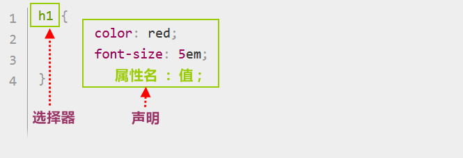

> 视频老师了解资料
>
> 格式简介：语法由一个 [选择器(selector)](https://developer.mozilla.org/en-US/docs/Glossary/CSS_Selector)起头。 它 *选择(selects)* 了我们将要用来添加样式的 HTML元素。 在这个例子中我们为一级标题添加样式。
>
> 接着输入一对大括号`{ }`。 在大括号内部定义一个或多个形式为 **属性(property):值(value);** 的 **声明(eclarations)**。每个声明都指定了我们所选择元素的一个属性，之后跟一个我们想赋给这个属性的值。
>
> 冒号之前是属性，冒号之后是值。不同的CSS [属性(properties)](https://developer.mozilla.org/en-US/docs/Glossary/property/CSS) 对应不同的合法值。在这个例子中，我们指定了 `color` 属性，它可以接受许多   [颜色值(lor values)](https://developer.mozilla.org/en-US/docs/Learn/CSS/Building_blocks/Values_and_units#Color)。 还有 `font-size` 属性， 它可以接收许多 [size units](https://developer.mozilla.org/en-US/docs/Learn/CSS/Building_blocks/Values_and_units#Numbers_lengths_and_percentages) 值。


## 1.2 入门案例

1. 在初始页面的` <body>`标签中，加入一对`<h1>` 标签。`<h1>`标签规定的固定的标题样式。

   ```html
   <!DOCTYPE html>
   <html>
     <head>
       <meta charset="utf-8">
       <title>页面标题</title>
     </head>
     <body>
         <h1>今天开始变漂亮!!!</h1>
     </body>
   </html>
   
   ```

2. 在`<head>`标签中加入一对`<style>` 标签中，表示准备应用样式。

   ```html
   <!DOCTYPE html>
   <html>
   <head>
       <meta charset="utf-8">
       <title>页面标题</title>
       <!-- 加入style标签 -->
       <style>
         
       </style>
   </head>
   <body>
   <h1 color="red">今天开始变漂亮!!!</h1>
   </body>
   </html>
   
   ```

3. 编写样式

   ```html
      <style>
           h1{
               color: red;  /* 设置颜色为红色*/
               font-size:100px; /* 设置字体大小为100像素*/
           }
       </style>
   ```

4. 打开浏览器查看，文字的颜色和大小都发生改变，应用了新的样式，效果如图：

   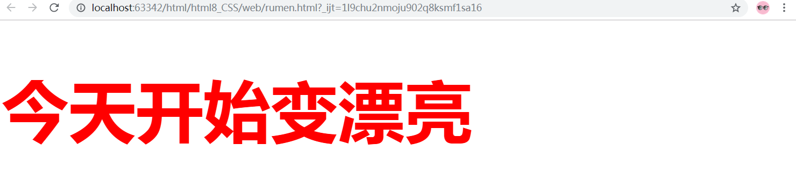


## 1.3 总结

**CSS**是对**HTML**的补充，指定页面如何展示的语言。

CSS的主要部分有：

1. 选择器：用来选择页面元素的方式。
2. 声明：用来设置样式，格式`属性名：值`。

在学习CSS时，要抓住两个方面：

1. 掌握多种选择器，能够灵活的选择页面元素。
2. 掌握样式的声明，能够使用多种属性来设置多样的效果。

# 2 基本语法

## 2.1 引入方式

### 2.1.1 内联样式

> 了解,几乎不用,维护艰难

内联样式是CSS声明在元素的`style`属性中，仅影响一个元素：

* **格式**：

```html
<标签 style="属性名:属性值; 属性名:属性值;">内容</标签>
```

* **举例**：

```html
<h1 style="color: blue;background-color: yellow;border: 1px solid black;">
    Hello World!
</h1>
```

* **效果如下**：

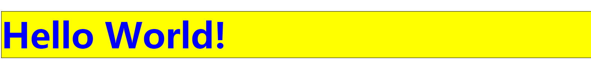

虽然格式简单，但是样式作用无法复用到多个元素上，不利于维护，此格式了解即可。

### 2.1.2 内部样式表

内部样式表是将CSS样式放在[`style`](https://developer.mozilla.org/zh-CN/docs/Web/HTML/Element/style)标签中，通常`style标签`编写在HTML 的[`head`](https://developer.mozilla.org/zh-CN/docs/Web/HTML/Element/head)标签内部。

* **格式**：

```html
<head>
    <style>
        选择器 {
            属性名: 属性值;
            属性名: 属性值;
        }
    </style>
</head>
```

* **举例**：

```html
  <head>
    <style>
      h1 {
        color: blue;
        background-color: yellow;
        border: 1px solid black;
      }
    </style>
  </head>

```

* **效果如下**：

  

  内部样式只能作用在当前页面上，如果是多个页面，就无法复用了。

### 2.1.3 外部样式表

外部样式表是CSS附加到文档中的最常见和最有用的方法，因为您可以将CSS文件链接到多个页面，从而允许您使用相同的样式表设置所有页面的样式。

外部样式表是指将CSS编写在扩展名为`.css` 的单独文件中，并从HTML`<link>` 元素引用它，通常`link标签`编写在HTML 的[`head`](https://developer.mozilla.org/zh-CN/docs/Web/HTML/Element/head)标签内部。：

* **格式**：

```html
<link rel="stylesheet" href="css文件">

rel：表示“关系 (relationship) ”，属性值指链接方式与包含它的文档之间的关系，引入css文件固定值为stylesheet。

href：属性需要引用某文件系统中的一个文件。

```

* **举例**：

1. 创建styles.css文件

```css
h1 {
  color: blue;
  background-color: yellow;
  border: 1px solid black;
}
```

2. link标签引入文件

```html
<!DOCTYPE html>
<html>
  <head>
    <meta charset="utf-8">
    <link rel="stylesheet" href="styles.css">
  </head>
  <body>
    <h1>Hello World!</h1>
  </body>
</html>
```

* **效果如下**：


当然也可以把CSS文件放在其他地方，并调整指定的路径以匹配，例如：

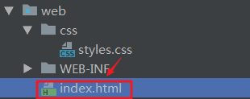

```html
<link rel="stylesheet" href="css/styles.css">
```

为了保证CSS文件的管理，建议在项目中创建一个`css文件夹`，专门保存样式文件。

> 注意：引入样式的优先级问题。
>
> 规则层叠于一个样式表中，其中数字 4 拥有最高的优先权：
>
> 1. 浏览器缺省设置
> 2. 外部样式表
> 3. 内部样式表（位于 <head> 标签内部）
> 4. 内联样式（在 HTML 元素内部）

## 2.2 关于注释

> 了解讲解：
>
> 简单格式，提一下就可以了

与HTML一样，鼓励您在CSS中进行注释，以帮助您理解几个月后返回的代码工作方式，并帮助其他使用该代码的人对其进行理解。

CSS中的注释以`/*`和开头`*/`。在下面的代码块中，我已使用注释标记了不同的不同代码段的开始。

格式：

```css
/* 设置h1的样式 */
h1 {
  color: blue;
  background-color: yellow;
  border: 1px solid black;
}
```


## 2.3 关于选择器

>重点讲解：
>
>选择器作为CSS的重要部分，这里强调基本选择器的使用和其他选择器的基本格式。

讲到CSS就不得不说到**选择器**，为了样式化某些元素，我们会通过选择器来选中HTML文档中的这些元素。如果你的样式没有生效，那很可能是你的选择器没有像你想象的那样选中你想要的元素。

每个CSS规则都以一个选择器或一组选择器为开始，去告诉浏览器这些规则应该应用到哪些元素上。

接下来我们将要详细的学习各种选择器的使用。

**选择器的分类**：

| 分类       | 名称       | 符号   | 作用                                                         | 示例         |
| ---------- | ---------- | ------ | ------------------------------------------------------------ | ------------ |
| 基本选择器 | 元素选择器 | 标签名 | 基于标签名匹配元素                                           | div{ }       |
|            | 类选择器   | `.`    | 基于class属性值匹配元素                                      | .center{ }   |
|            | ID选择器   | `#`    | 基于id属性值匹配元素                                         | #username{ } |
| 属性选择器 | 属性选择器 | `[]`   | 基于某属性匹配元素                                           | [type]{ }    |
| 伪类选择器 | 伪类选择器 | `:`    | 用于向某些选择器添加特殊的效果                               | a : hover{ } |
| 组合选择器 | 后代选择器 | `空格` | 使用`空格符号`结合两个选择器，基于第一个选择器，匹配第二个选择器的所有后代元素 | .top li{ }   |
|            | 子级选择器 | `>`    | 使用 `>` 结合两个选择器，基于第一个选择器，匹配第二个选择器的直接子级元素 | .top > li{ } |
|            | 同级选择器 | `~`    | 使用 `~` 结合两个选择器，基于第一个选择器，匹配第二个选择器的所有兄弟元素 | .l1 ~ li{ }  |
|            | 相邻选择器 | `+`    | 使用 `+` 结合两个选择器，基于第一个选择器，匹配第二个选择器的相邻兄弟元素 | .l1 + li{ }  |
|            | 通用选择器 | `*`    | 匹配文档中的所有内容                                         | *{ }         |


### 2.2.1 基本选择器

#### 1）元素选择器

**页面元素：**

```html
<div>
  <ul>
    <li>List item 1</li>
    <li>List item 2</li>
    <li>List item 3</li>
  </ul>
  <ol>
    <li>List item 1</li>
    <li>List item 2</li>
    <li>List item 3</li>
  </ol>
</div>
```

**选择器：**

```css
选择所有li标签,背景变成蓝色
li{
    background-color: aqua;
}
```

#### 2）类选择器

**页面元素：**

```html
<div>
    <ul>
        <li class="ulist l1">List item 1</li>
        <li class="l2">List item 2</li>
        <li class="l3">List item 3</li>
    </ul>
    <ol>
        <!--class 为两个值-->
        <li class="olist l1">List item 1</li>
        <li class="olist l2">List item 2</li>
        <li class="olist l3">List item 3</li>
    </ol>
</div>
```

**选择器：**

```css
选择class属性值为l2的,背景变成蓝色
.l2{
    background-color: aqua;
}
选择class属性值为olist l2的,字体为白色
.olist.l2{
   color: wheat;
}
```

#### 3）ID选择器

**页面元素：**

```html
<div>
    <ul>
        <li class="l1" id="one">List item 1</li>
        <li class="l2" id="two">List item 2</li>
        <li class="l3" id="three">List item 3</li>
    </ul>
    <ol>
        <li class="l1" id="four">List item 1</li>
        <li class="l2" id="five">List item 2</li>
        <li class="l3" id="six">List item 3</li>
    </ol>
</div>
```

**选择器：**

```css
#tow{
    background-color: aqua;
}
```

**效果如图：**

#### 4）通用选择器

**页面元素：**

```html
<div>
    <ul>
        <li class="l1" id="one">List item 1</li>
        <li class="l2" id="two">List item 2</li>
        <li class="l3" id="three">List item 3</li>
    </ul>
    <ol>
        <li class="l1" id="four">List item 1</li>
        <li class="l2" id="five">List item 2</li>
        <li class="l3" id="six">List item 3</li>
    </ol>
</div>
```

**选择器：**

```css
所有标签 
*{
    background-color: aqua;
}
```

### 2.2.2 属性选择器

**页面元素：**

```html
   <ul class="l1">
        <li  >List item 1</li>
        <li  >List item 2</li>
        <li  >List item 3</li>
    </ul>
    <ul class="l2">
        <li  id="four">List item 1</li>
        <li  id="five">List item 2</li>
        <li  id="six">List item 3</li>
    </ul>

    <p class="">
        p item
    </p>
```

**选择器和效果图，示例1**

```css
[属性名]{ }
```

**选择器和效果图，示例2**

```css
标签名[属性名]{ }
```

**选择器和效果图，示例3**

```css
标签名[属性名='属性值']{ }
```

### 2.2.3 伪类选择器

伪类选择器，用于选择处于特定状态的元素，例如，一些元素中的第一个元素，或者某个元素被鼠标指针悬停。

格式：

```css
标签名:伪类名{ }
```

常用伪类:

* 锚伪类

  在支持 CSS 的浏览器中，链接的不同状态都可以以不同的方式显示

  ```css
  a:link {color:#FF0000;} 	/* 未访问的链接 */
  a:visited {color:#00FF00;} 	/* 已访问的链接 */
  a:hover {color:#FF00FF;} 	/* 鼠标悬停链接 */
  a:active {color:#0000FF;} 	/* 已选中的链接 */
  ```

  >注意：
  >
  >伪类顺序 link ，visited，hover，active，否则有可能失效。

  代码示例：

  ```html
  HTML 代码 ： 
  <div>
      <a class="red" href="http://www.itheima.com">黑马</a> <br/>
      <a class="blue" href="http://www.itheima.com">传智</a>
  </div>
  
  
  CSS 代码 ： 
  /* 选择a标签,class值为red ,设置访问后为红色链接*/
  a.red:visited {
      color: red;
  }
  ```


### 2.2.4 组合选择器

**页面元素：**

```html
<div>
    <ul class="l1">
        <li>List item 1</li>
        <li>List item 2</li>
        <li>List item 3</li>
        <ul class="l2">
            <li id="four">List item 1</li>
            <li id="five">List item 2</li>
            <li id="six">List item 3</li>
        </ul>
    </ul>
</div>
```

#### 1）后代选择器

**选择器：**

```css
.l1 li{
    background-color: aqua;
}
```

#### 2）子级选择器

**选择器：**

```css
.l1 > li{
    background-color: aqua;
}
```

#### 3）同级选择器

**选择器：**

```css
.l1 ~ li{
    background-color: aqua;
}
```

#### 4）相邻选择器

**选择器：**

```css
.l1 + li{
    background-color: aqua;
}
```

## 2.4 总结

1. CSS的引入方式有三种，建议使用外部样式表。
2. 注释类似于java多行注释。
3. 选择器是CSS的重要部分：
   1. 基本选择器：可以通过元素，类，id来选择元素。
   2. 属性选择器：可以通过属性值选择元素
   3. 伪类选择器：可以指定元素的某种状态，比如链接
   4. 组合选择器：可以组合基本选择器，更加精细的划分如何选择

# 3 CSS案例-头条页面

## 3.1 案例效果

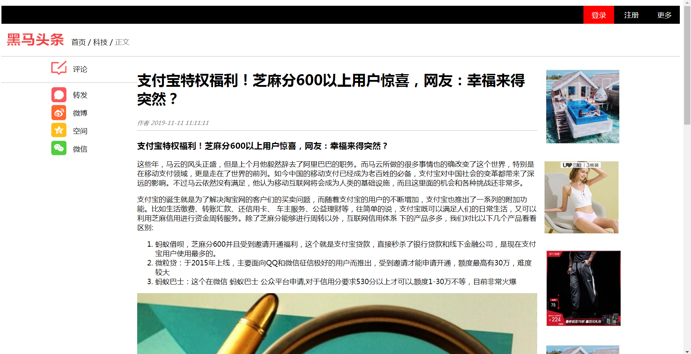

## 3.2 案例分析

### 3.2.1 语义化标签

> 了解讲解：
>
> 简单介绍作用即可，后续在案例中使用。

为了更好的组织文档，HTML5规范中设计了几个语义元素，可以将特殊含义传达给浏览器。

| 标签        | 名称     | 作用             | 备注                                                     |
| ----------- | -------- | ---------------- | -------------------------------------------------------- |
| **header**  | 标头元素 | 表示内容的介绍   | 块元素，文档中可以定义多个                               |
| **nav**     | 导航元素 | 表示导航链接     | 常见于网站的菜单，目录和索引等，可以嵌套在header中       |
| **article** | 文章元素 | 表示独立内容区域 | 标签定义的内容本身必须是有意义且必须独立于文档的其他部分 |
| **footer**  | 页脚元素 | 表示页面的底部   | 块元素，文档中可以定义多个                               |

标签结构示例如图：

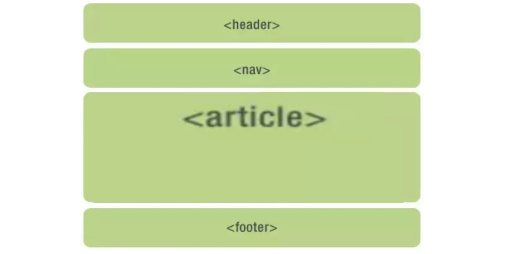

### 3.2.2 常见样式属性

其他属性：

| 分类 | 属性名              | 作用         |
| ---- | ------------------- | ------------ |
| 边框 | **border**          | 边框         |
|      | **border-top**      | 底部边框     |
|      | **border-radius**   | 设置边框圆角 |
| 文本 | **color**           | 颜色         |
|      | **font-family**     | 字体样式     |
|      | **font-size**       | 字体大小     |
|      | **text-decoration** | 下划线       |
|      | **text-align**      | 文本水平对齐 |
|      | **line-height**     | 行高，行间距 |
|      | **vertical-align**  | 文本垂直对齐 |

#### 1）边框样式

在之前学习了简写属性来设置边框样式，接下来我们将研究如何创造性地使用边框。

```html
<!--回顾简写样式 -->
div { 
  border: 1px solid black; 
} 
```

* **单个边框**

设置一个方向边框的宽度、样式和颜色，例如：

```html
.box { 
  border-top: 1px solid black; 
  border-left: 5px double yellow;
  border-bottom: 5px dotted green;
  border-right: 5px dashed red;
} 
border-top: 上边框
border-left: 左边框
border-bottom: 底边框
border-right:  右边框
```

* **无边框**

当border值为none时，可以让边框不显示，用于特殊效果。

```html
   div {
            width: 200px;
            height: 200px;
            border: none;
   }
```

* **圆角**

通过使用[`border-radius`](https://developer.mozilla.org/en-US/docs/Web/CSS/border-radius)属性设置盒子的圆角，虽然能分别设置四个角，但是通常我们使用一个值，来设置整体效果，例如

```html
    div {
            width: 200px;
            height: 200px;
            border: 10px solid blue;
            border-radius: 50px;
    }

```

#### 2）文本样式

* **颜色**

  该[`color`](https://developer.mozilla.org/en-US/docs/Web/CSS/color)属性设置所选元素的前景色的颜色

  ```html
  p {
    color: red;
  }
  ```

  颜色的值，可以由多种方式赋值，常见的有颜色单词，RGB十六进制，例如：

  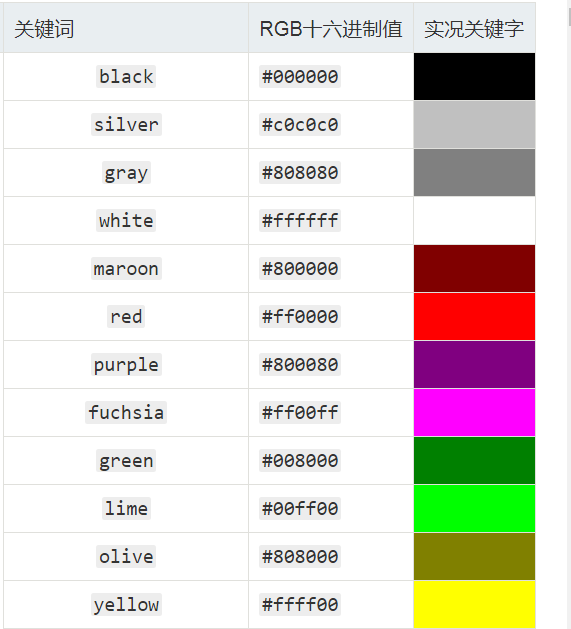

* **字体种类**

  使用[`font-family`](https://developer.mozilla.org/en-US/docs/Web/CSS/font-family)属性-这允许您指定一种字体

* **字体大小**

  字体大小使用[`font-size`](https://developer.mozilla.org/en-US/docs/Web/CSS/font-size)属性设置，可以采用常见单位：

  `px`：像素，文本高度像素绝对数值。

  `em`：1em等于我们要设置样式的当前元素的父元素上设置的字体大小，这是相对数值，能看懂即可。

* **文本修饰**

  [`text-decoration`](https://developer.mozilla.org/zh-CN/docs/Web/CSS/text-decoration):设置字体上的文本装饰线。

  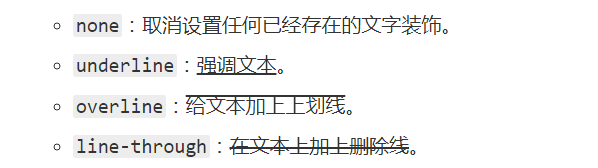

* **文本对齐**

  该[`text-align`](https://developer.mozilla.org/en-US/docs/Web/CSS/text-align)属性用于控制文本如何在其包含的内容框中对齐。可用值如下，它们的工作方式与常规字处理器应用程序中的工作方式几乎相同：

  - `left`：左对齐文本。
  - `right`：右对齐文本。
  - `center`：使文本居中。
  - `justify`：使文本散布，改变单词之间的间距，以使文本的所有行都具有相同的宽度。

* **行高**

  该[`line-height`](https://developer.mozilla.org/en-US/docs/Web/CSS/line-height)属性设置每行文本的高度，也就是行距。


# 4 CSS案例-登录页面

## 4.1 案例效果

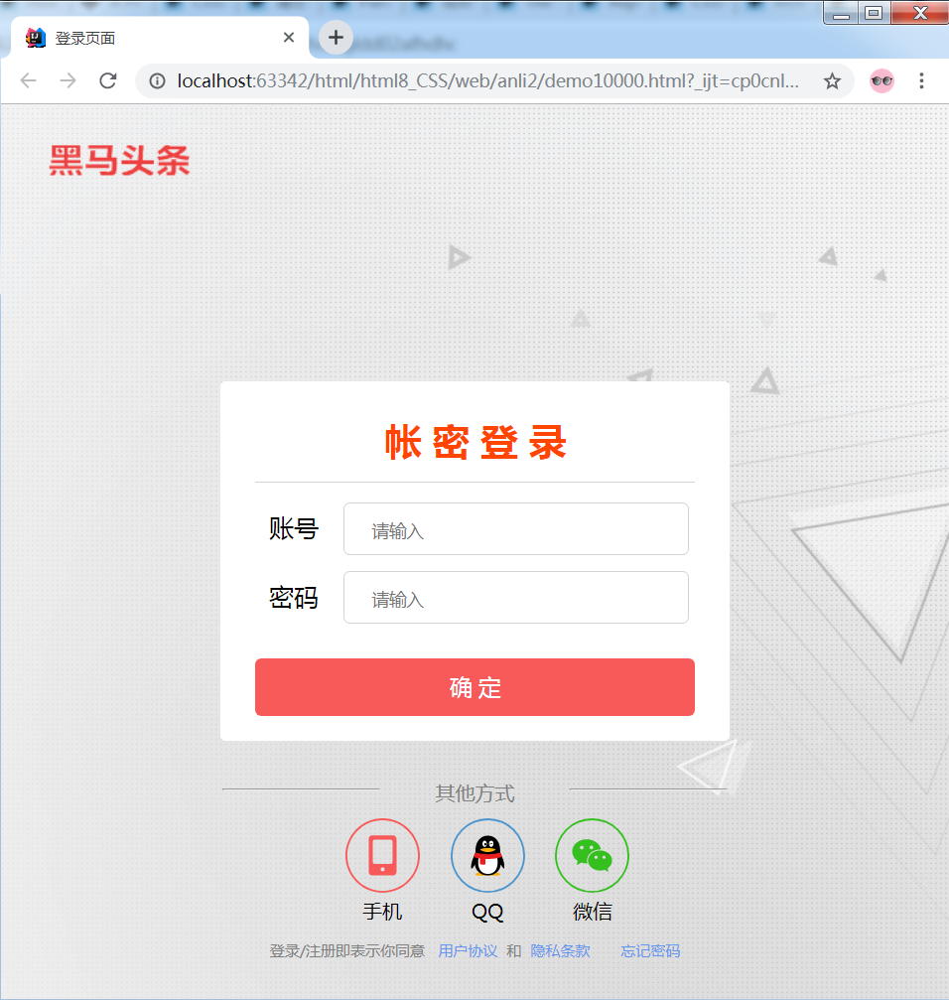

## 4.2 案例分析

### 4.2.1  Table标签

#### 1）什么是表格

表格是由行和列组成的结构化数据集(表格数据)。

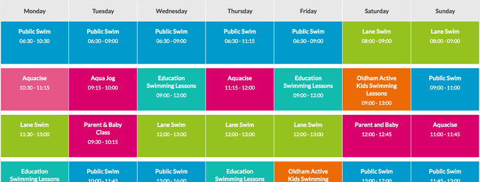

#### 2）表格标签

| 标签名 | 作用                                                 | 备注             |
| ------ | ---------------------------------------------------- | ---------------- |
| table  | 表示表格，是数据单元的行和列的两维表                 | 容器，默认无样式 |
| tr     | table row，表示表中单元的行                          |                  |
| td     | table data，表示表中一个单元格                       |                  |
| th     | table header，表格单元格的表头，通常字体样式加粗居中 |                  |

通过表格标签，我们可以创建出一张表格，代码如下

```html
<table>
      <tr>
        <th>First name</th>
        <th>Last name</th>
      </tr>
      <tr>
        <td>John</td>
        <td>Doe</td>
      </tr>
      <tr>
        <td>Jane</td>
        <td>Doe</td>
      </tr>
</table>

```

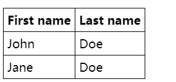

#### 3）跨行跨列

让我们使用 `colspan` 和 `rowspan` 来改进现有的表格。

```html
<table>
    <tr>
        <th rowspan="2">GROUP</th>
        <th colspan="2"> name</th>
    </tr>
    <tr>
        <th>First name</th>
        <th>Last name</th>
    </tr>
    <tr>
        <td rowspan="2">G1</td>
        <td>John</td>
        <td>Doe</td>
    </tr>
    <tr>
        <td>Jane</td>
        <td>Doe</td>
    </tr>

    <tr>
        <td rowspan="3">G2</td>
        <td>Aohn</td>
        <td>Doa</td>
    </tr>
    <tr>
        <td>Bane</td>
        <td>Dob</td>
    </tr>
    <tr>
        <td>Cane</td>
        <td>Doc</td>
    </tr>
</table>

```

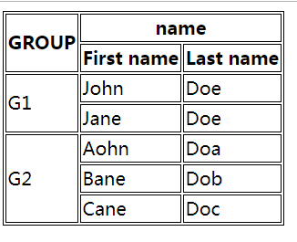

#### 4）表格结构

>了解讲解：
>
>表格布局标签，作为了解内容，案例中的使用部分，可以省略

| 标签名 | 作用                 | 备注                       |
| ------ | -------------------- | -------------------------- |
| thead  | 定义表格的列头的行   | 一个表格中仅有一个         |
| tbody  | 定义表格的主体       | 用来封装一组表行（tr元素） |
| tfoot  | 定义表格的各列汇总行 | 一个表格中仅有一个         |

示例：

```html
<table>
    <thead>
        <tr>
            <th>项目</th>
            <th >金额</th>
        </tr>
    </thead>
    <tbody>
        <tr>
            <td>手机</td>
            <td>3,000</td>
        </tr>
        <tr>
            <td>电脑</td>
            <td>18,000</td>
        </tr>
    </tbody>
</table>
```


### 4.2.2 常见样式属性

#### 1）背景

CSS [`background`](https://developer.mozilla.org/en-US/docs/Web/CSS/background)属性用来设置背景相关的样式。

* **背景色**

  该[`background-color`](https://developer.mozilla.org/en-US/docs/Web/CSS/background-color)属性定义CSS中任何元素的背景色。

  ```html
  .box {
    background-color: #567895;
  }
  ```

* **背景图**

  该[`background-image`](https://developer.mozilla.org/en-US/docs/Web/CSS/background-image)属性允许在元素的背景中显示图像。使用url函数指定图片路径。

  ```html
  body {
     background-image: url(bg.jpg);
  }
  ```

  **控制背景重复**

  该[`background-repeat`](https://developer.mozilla.org/en-US/docs/Web/CSS/background-repeat)属性用于控制图像的平铺行为。可用值为：

  - `no-repeat` -停止完全重复背景。
  - `repeat-x` —水平重复。  
  - `repeat-y` —反复重复。
  - `repeat`—默认值；双向重复。
  
  ```html
  body {
    background-image: url(star.png);
    background-repeat: no-repeat;
  }
  ```
  

#### 2）轮廓

轮廓**outline**：是绘制于元素周围的一条线，位于边框边缘的外围，可起到突出元素的作用。

```html
  <style>
        input {
            outline: dotted;
        }
    </style>

    <body>
        <input type="text">
     </body>

```

设置为none时，可以取消默认轮廓样式，用于特殊效果。

```css
 input {
        outline: none;
 }
```

#### 3）显示

**display**属性，用来设置一个元素应如何显示。可以设置块级和行内元素的切换，也可以设置元素隐藏。

* **元素显示**

  ```css
  /*   把列表项显示为内联元素，无长宽*/
  li {display:inline;}
  /*   把span元素作为块元素，有换行*/
  span {display:block;}
  /*   行内块元素，结合的行内和块级的优点，既可以行内显示，又可以设置长宽，*/
  li {display:inline-block;}
  ```
  
  ```css
  li {
    display: inline-block;
    width: 200px;
  }
  ```
  
* **元素隐藏**

  当设置为none时，可以隐藏元素。

  ```css
  li {
    display: none;
  }
  ```

### 4.2.3 盒子模型

万物皆"盒子"。盒子模型是通过设置**元素框**与**元素内容**和**外部元素**的边距，而进行布局的方式。

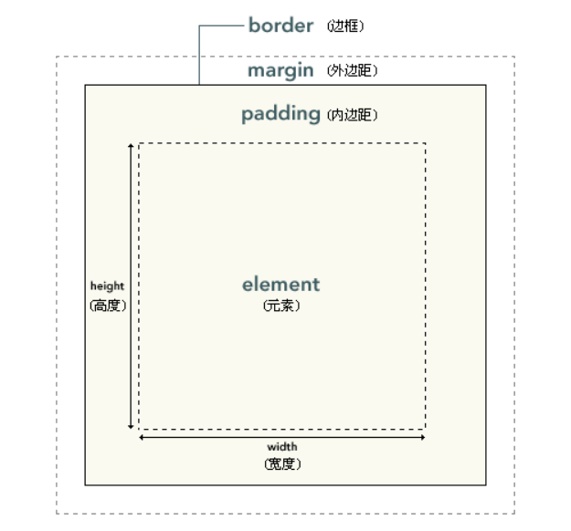

```html
- element : 元素。
- padding : 内边距，也有资料将其翻译为填充。
- border : 边框。
- margin : 外边距，也有资料将其翻译为空白或空白边。
```


**基本布局**

内边距、边框和外边距都是可选的，默认值是零。但是，许多元素将由用户代理样式表设置外边距和内边距。在 CSS 中，width 和 height 指的是内容区域的宽度和高度。

```html
<style>
  div{
      border: 2px solid blue;
  }

  .big{
      width: 200px;
      height: 200px;
  }

  .small{
      width: 100px;
      height: 100px;
      margin: 30px;/*  外边距 */
  }
</style>

<div class="big">
    <div class="small">

    </div>
</div>
```


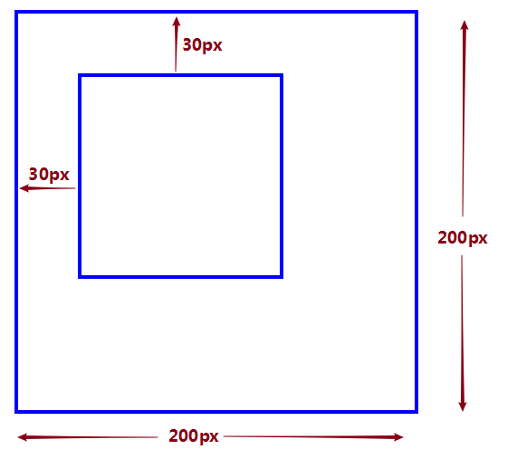

增加内边距会增加元素框的总尺寸。

```html
<style>
  div{
      border: 2px solid blue;
  }

  .big{
      width: 200px;
      height: 200px;
        padding: 30px;/*内边距 */
  }

  .small{
      width: 100px;
      height: 100px;
      
  }
</style>


<div class="big">
    <div class="small">

    </div>
</div>
```

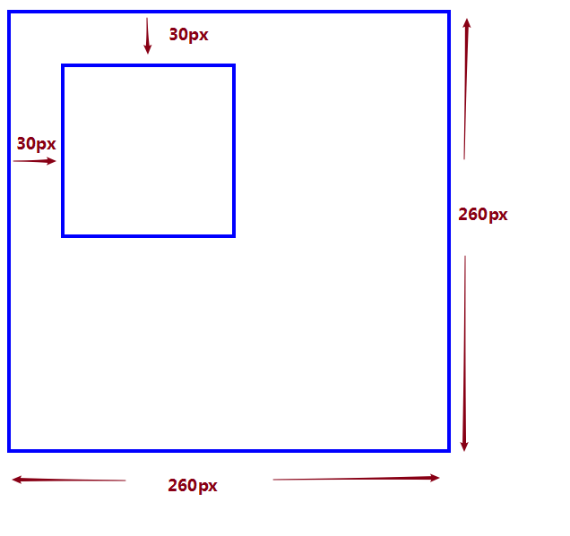

**外边距**

单独设置边框的外边距，设置上、右、下、左方向：

```css
margin-top
margin-right
margin-bottom
margin-left
```
值含义：

1. 一个值时

   ```css
   /*  所有 4 个外边距都是 10px */
   margin:10px;
   ```

2. 两个值时

   ```css
   /* 上外边距和下外边距是 10px
   右外边距和左外边距是 5px */
   
   margin:10px 5px;
   
   margin:10px auto;
   auto 浏览器自动计算外边距，具有居中效果。
   ```

3. 三个值时

   ```css
   /* 上外边距是 10px
   右外边距和左外边距是 5px
   下外边距是 15px*/
   
   margin:10px 5px 15px;
   ```

4. 四个值时

   ```css
   /*上外边距是 10px
   右外边距是 5px
   下外边距是 15px
   左外边距是 20px*/
   
   margin:10px 5px 15px 20px;
   ```


**内边距**

与外边距类似，单独设置边框的内边距，设置上、右、下、左方向：

```css
padding-top
padding-right
padding-bottom
padding-left
```


