# 1 HTML入门

## 1.1 初识HTML

### 1.1.1 概述

网络世界已经跟我们息息相关，当我们打开一个网站，首先映入眼帘的就是一个个华丽多彩的网页。这些网页，不仅呈现着基本的内容，还具备优雅的布局和丰富的动态效果，这一切都是如何做到的呢？前端入门课程，为您一层层的揭开网页的面纱。

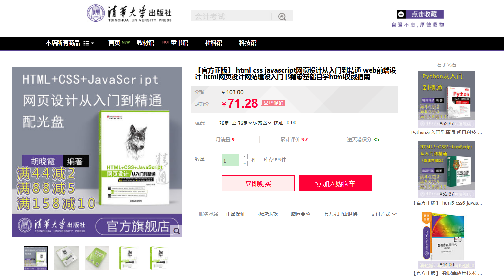


* **网页的构成**
  * [HTML](https://developer.mozilla.org/zh-CN/docs/Web/HTML)：通常用来定义网页内容的含义和基本结构。
  *  [CSS](https://developer.mozilla.org/zh-CN/docs/Web/CSS)：通常用来描述网页的表现与展示效果。
  *  [JavaScript](https://developer.mozilla.org/zh-CN/docs/Web/JavaScript)：通常用来执行网页的功能与行为。

**HTML**（超文本标记语言——HyperText Markup Language）是构成 Web 世界的一砖一瓦。它是一种用来告知浏览器如何组织页面的**标记语言**。

所谓`超文本Hypertext`，是指连接单个或者多个网站间的网页的链接。我们通过链接，就能访问互联网中的内容。

所谓`标记Markup` ，是用来注明文本，图片等内容，以便于在浏览器中显示，例如`<head>`,`<body>`等。

* **HTML发展简史【了解】**
  * HTML 1.0在1993年6月作为互联网工程工作小组（IETF）工作草案发布（并非标准）
  * HTML 2.0——1995年11月作为RFC 1866发布，在RFC 2854于2000年6月发布之后被宣布已经过时
  * HTML 3.2——1997年1月14日，W3C推荐标准
  * HTML 4.0——1997年12月18日，W3C推荐标准
  * HTML 4.01（微小改进）——1999年12月24日，W3C推荐标准
  * HTML5 —— 2014年10月29日，万维网联盟宣布，经过接近8年的艰苦努力，该标准规范终于制定完成。是目前最为流行的版本，提供了很多标签新特性，现代大多数浏览器已经具备了 HTML5的支持。

> 扩展资料：
>
> 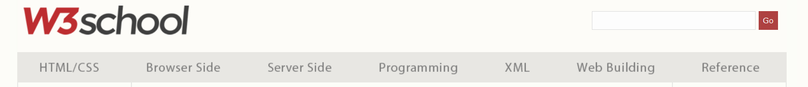
>
> w3c是万维网联盟（World Wide Web Consortium，[W3C](https://www.w3school.com.cn/index.html)），又称W3C理事会。1994年10月在麻省理工学院计算机科学实验室成立。建立者是万维网的发明者蒂姆·伯纳斯-李，负责制定web相关标准的制定。
>
> 

### 1.1.2 HTML的组成

HTML页面由一系列的**元素（[elements](https://developer.mozilla.org/zh-CN/docs/Web/HTML/Element)）** 组成，而元素是使用**标签**创建的。

#### 1）标签

一对标签（ [tags](https://developer.mozilla.org/en-US/docs/Glossary/Tag)）可以设置一段文字样式，添加一张图片或者添加超链接等等。 例如：

```html
<h1>今天是个好日子</h1>
```

在HTML中，`<h1>`标签表示**标题**，那么，我们可以使用**开始标签**和**结束标签**包围文本内容，这样其中的内容就以标题的形式显示了。

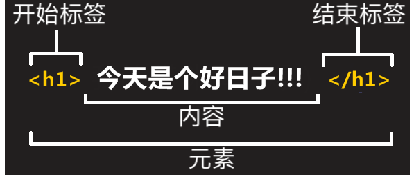

显示效果如下：

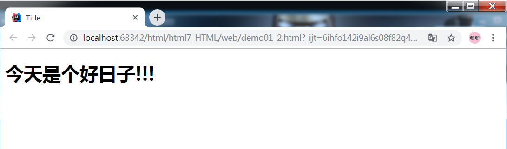

#### 2）属性

HTML标签可以拥有[属性](https://developer.mozilla.org/zh-CN/docs/Web/HTML/Attributes)。**属性**提供了有关 HTML 元素的**更多的信息**。我们只能在开始标签中，加入属性。通常以`名称=值 `成对的形式出现，**比如：name='value'**。例如：

```html
<h1 align="center">今天是个好日子!!!</h1>
```

在HTML标签中，`align`  属性表示**水平对齐方式**，我们可以赋值为 `center`  表示 **居中** 。

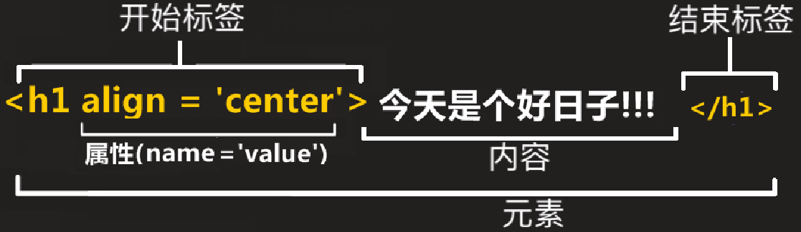

显示效果如下：

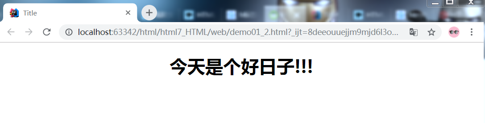

## 1.2 入门案例

### 1.2.1 初始页面

#### 1）创建一个标准的初始化页面

1. 右键点击创建新页面

   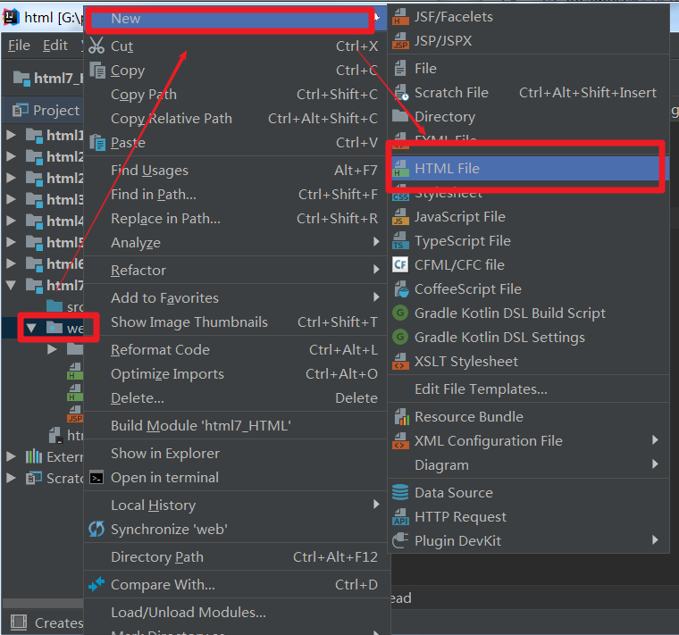

2. 自定义文件名字，比如index

   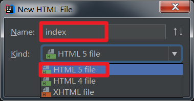

3. 点击ok，页面创建成功。

   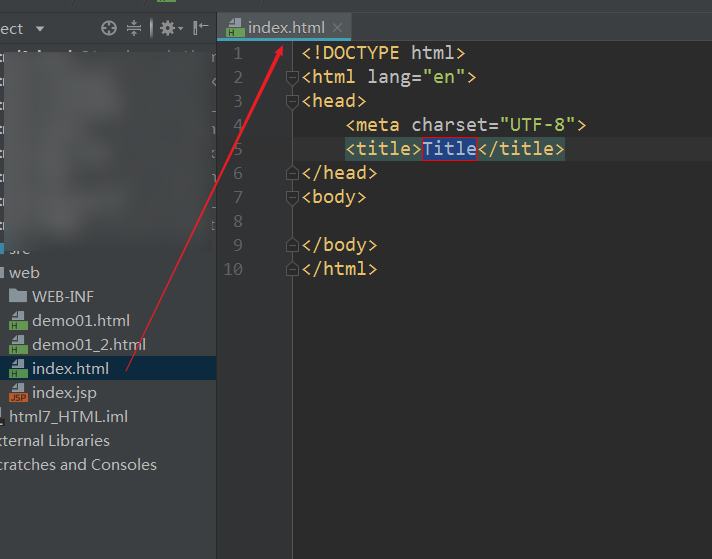


#### 2）页面说明

1. `<!DOCTYPE html>`: **声明文档类型**。规定了HTML页面必须遵从的良好规则，从HTML5后，`<!DOCTYPE html>`是最短的有效的文档声明。

   >  文字作为了解资料
   >
   > 很久以前，早期的HTML(大约1991年2月)，文档类型声明类似于链接，能自动检测错误和其他有用的东西。使用如下：    
   >
   > ```html
   > <!DOCTYPE html PUBLIC "-//W3C//DTD XHTML 1.0 Transitional//EN"
   > "http://www.w3.org/TR/xhtml1/DTD/xhtml1-transitional.dtd">
   > ```
   >
   > 然而现在没有人再这样写，需要保证每一个东西都正常工作已成为历史。

2. `<html>`：这个标签包裹了整个完整的页面，是一个**根元素（顶级元素）**。其他所有元素必须是此元素的后代，每篇HTML文档只有一个根元素。

3. `<head>`：这个标签是一个容器，它包含了所有你想包含在HTML页面中但不想在HTML页面中显示的内容。这些内容包括你想在搜索结果中出现的关键字和页面描述，CSS样式，字符集声明等等。以后的章节能学到更多关于`<head>` 元素的内容。目前主要了解两个标签：

   1. `<meta charset="utf-8">`：这个标签是页面的元数据信息，设置文档使用utf-8字符集编码，utf-8字符集包含了人类大部分的文字。基本上他能识别你放上去的所有文本内容，能够避免页面乱码问题。
   2. `<title>`：这个标签定义文档标题，位置出现在浏览器标签上，而不是页面正文中。在收藏页面时，它可用来描述页面。

4. ` <body> `：包含了文档内容，你访问页面时所有显示在页面上的文本，图片，音频，游戏等等。

   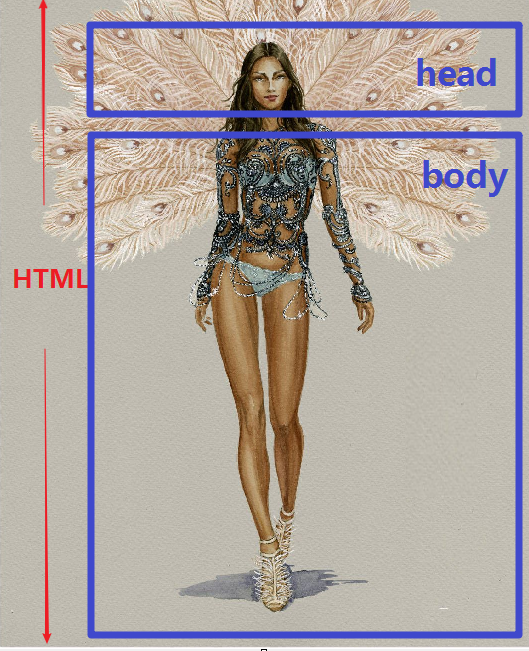

### 1.2.2 案例实现

1. 在初始化页面的` <body>`标签中，加入一对`<p>` 标签。`<p>`标签表示文本的一个段落，具有整段文本之间相分离的效果。

   ```html
   <!DOCTYPE html>
   <html>
     <head>
       <meta charset="utf-8">
       <title>页面标题</title>
     </head>
     <body>
     </body>
   </html>
   
   ```

2. 在一对`<p>` 标签中，编写文本内容。

   ```html
   
   <!DOCTYPE html>
   <html>
     <head>
       <meta charset="utf-8">
       <title>页面标题</title>
     </head>
     <body>
       <p>这是第一个页面</p>
     </body>
   </html>
   
   ```

3. 打开浏览器查看，效果如下：

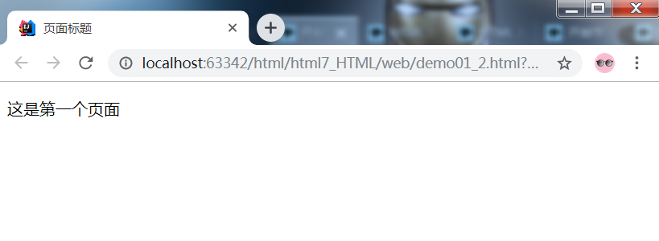

## 1.3 总结

* HTML是一种**标记语言**，用来组织页面，使用元素和属性。

* **这个元素的主要部分有：**

1. **元素**（Element）：开始标签、结束标签与内容相结合，便是一个完整的元素。
2. **开始标签**（Opening tag）：包含元素的名称（本例为 p），被左、右角括号所包围。表示元素从这里开始或者开始起作用 —— 在本例中即段落由此开始。
3. **结束标签**（Closing tag）：与开始标签相似，只是其在元素名之前包含了一个斜杠。这表示着元素的结尾 —— 在本例中即段落在此结束。初学者常常会犯忘记包含结束标签的错误，这可能会产生一些奇怪的结果。
4. **内容**（Content）：元素的内容，本例中就是所输入的文本本身。
5. **属性**（Attribute）：标签的附加信息。

* **在学习HTML时，要抓住两个方面：**

1. 掌握标签所代表的含义。
2. 掌握在标签中加入的属性的含义。

# 2 基本语法

## 2.1 关于注释

如同大部分的编程语言一样，在HTML中有一种可用的机制来在代码中书写注释。  

为了将一段HTML中的内容置为注释，你需要将其用特殊的记号<!--和-->包括起来， 比如：

```html
<p>我在注释外！</p>

<!-- <p>我在注释内！</p> -->
```

## 2.2 关于标签

### 2.2.1 空元素

不是所有元素都拥有开始标签，内容和结束标记。一些元素只有一个标签，叫做空元素。它是在开始标签中进行关闭的。例子如下：

```html
第一行文档<br/>
第二行文档<br/>
```

### 2.2.2 嵌套元素

你也可以把元素放到其它元素之中——这被称作嵌套。比如，我们想要强调`第一个`，可以将`<b>`标签包围第一个，这样`b标签`就是嵌套在了`p标签`中：

```html
<p>这是<b>第一个</b>页面</p>
```

### 2.2.3 块级和行内

#### 1）概念

在HTML中有两种重要元素类别，块级元素和内联元素。

- **块级元素**：

  **独占一行**。块级元素（block）在页面中以块的形式展现。相对于其前面的内容它会出现在新的一行，其后的内容也会被挤到下一行展现。比如`<p>` ，`<hr>`，`<li>` ，`<div>`等。

- **行内元素**

  **行内显示**。行内元素不会导致换行。通常出现在块级元素中并环绕文档内容的一小部分，而不是一整个段落或者一组内容。比如`<b>`，`<a>`，`<i>`，`<span>` 等。

  > 注意：一个块级元素不会被嵌套进内联元素中，但可以嵌套在其它块级元素中。
  >
  > 


#### 2）div和span

* `<div>` 是一个通用的内容容器，并没有任何特殊语义。它可以被用来对其它元素进行分组，一般用于样式化相关的需求。它是一个**块级元素**。

* ` <span>` 是短语内容的通用行内容器，并没有任何特殊语义。它可以被用来编组元素以达到某种样式。它是一个**行内元素**。

  >注意：div和span在页面布局中有重要作用。

## 2.3 关于属性

>【重点讲解】
>
>属性作为HTML的重要部分，这里强调属性的格式和作用。

标签属性，主要用于拓展标签。属性包含元素的额外信息，这些信息不会出现在实际的内容中。但是可以改变标签的一些行为或者提供数据，属性总是以`name = value`的格式展现。

* 属性名：同一个标签中，属性名不得重复。

* 大小写：属性和属性值对大小写不敏感。不过W3C标准中，推荐使用小写的属性/属性值。

* 引号：双引号是最常用的，不过使用单引号也没有问题。

* 常用属性：

  | 属性名 | 作用                                                         |
  | ------ | ------------------------------------------------------------ |
  | class  | 定义元素类名，用来选择和访问特定的元素                       |
  | id     | 定义元素唯一标识符，在整个文档中必须是唯一的                 |
  | name   | 定义元素名称，可以用于提交服务器的表单字段                   |
  | value  | 定义在元素内显示的默认值                                     |
  | style  | 定义CSS样式，这些样式会覆盖之前设置的样式（第一天简单了解，第二天主要内容） |

## 2.4 特殊字符

> 了解讲解：
>
> 内容简单，迅速带过。

在HTML中，字符 `<`, `>`,`"`,`'` 和 `&` 是特殊字符. 它们是HTML语法自身的一部分, 那么你如何将这些字符包含进你的文本中呢

| 原义字符 | 等价字符引用 |
| -------- | ------------ |
| <        | `&lt;`       |
| >        | `&gt;`       |
| "        | `&quot;`     |
| '        | `&apos;`     |
| &        | `&amp;`      |
| 空格     | `&nbsp;`     |

## 2.5 总结

HTML的基本语法比较简单，在使用的过程中注意写法即可。

# 3 HTML案例-新闻文本

> 重点讲解：
>
> 1. div布局的基本方式
> 2. 文本标签的基本使用

文本结构的页面基本是由**标题**和**段落**构成的，内容结构化会使读者的阅读体验更轻松。

## 3.1 案例效果

显示新闻文本。

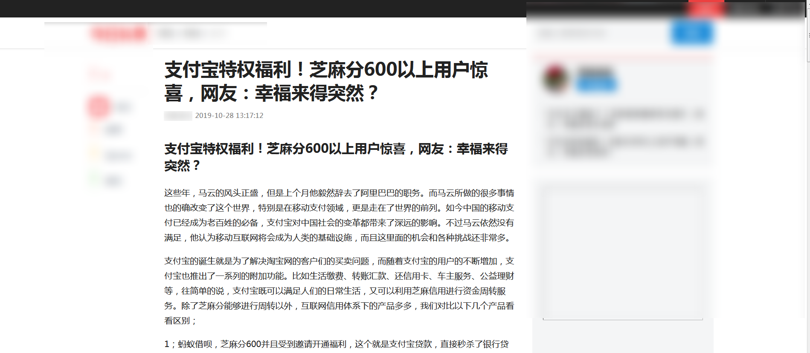

## 3.2 案例分析

### 3.2.1 div样式布局

文本由几部分构成，我们可以使用div将页面分割布局。先来了解一下，使用div如何进行简单的布局。

在head标签中，通过style标签加入样式。

**基本格式：**

```css
格式:
<style>
    标签名{
        属性名:属性值;
    }
</style>

```

**多个属性名格式：**

```html
<style>
    标签名{
        属性名1:属性值1;
        属性名2:属性值2;
        属性名3:属性值3;
    }
</style>

```

效果如下：

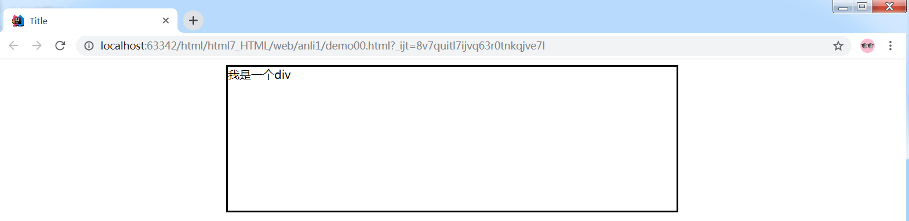

**div的多样式：**

一个属性名可以含有多个值，同时设置多样式。

格式:

```html
<style>
    标签名{
        属性名:属性值1 属性值2 属性值3; 
    }
</style>

```

> 【提示】
>
> 为了布局方便，我们通常可以先设置边框的样式，进行布局。结束后，再去掉边框，直观展示完整界面。

### 3.2.2 文本标签

使用文本内容标签设置文字基本样式。

| 标签名 | 作用                                                         |
| ------ | ------------------------------------------------------------ |
| p      | 表示文本的一个段落                                           |
| h      | 表示文档标题，`<h1>–<h6>` ，呈现了六个不同的级别的标题，`<h1>` 级别最高，而 `<h6>` 级别最低 |
| hr     | 表示段落级元素之间的主题转换，一般显示为水平线               |
| li     | 表示列表里的条目。                                           |
| ul     | 表示一个无序列表，可含多个元素，无编号显示。                 |
| ol     | 表示一个有序列表，通常渲染为有带编号的列表                   |
| em     | 表示文本着重，一般用斜体显示                                 |
| strong | 表示文本重要，一般用粗体显示                                 |
| font   | 表示字体，可以设置样式（已过时）                             |
| i      | 表示斜体                                                     |
| b      | 表示加粗文本                                                 |


**重点演示li的不换行效果：**

```css
li{ display: inline; // 内联样式,有宽度,无高度}
li{ display: inline-block; // 内联样式,有宽度,有高度}
```

# 4 HTML案例-头条页面

## 4.1 案例效果

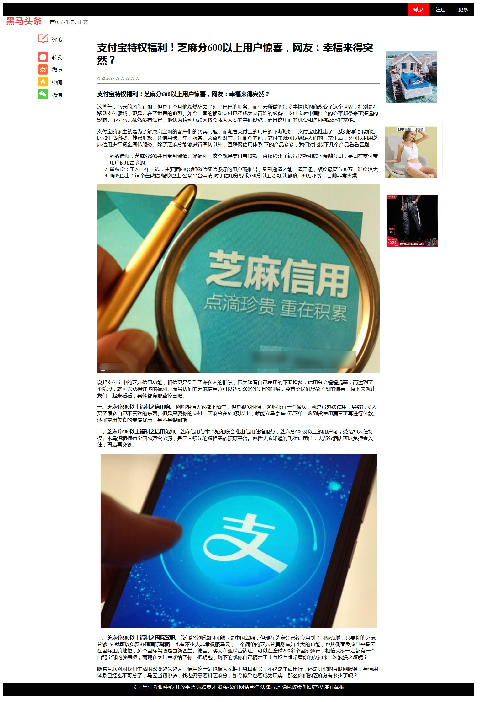 

## 4.2 案例分析

### 4.2.1 div布局的进阶

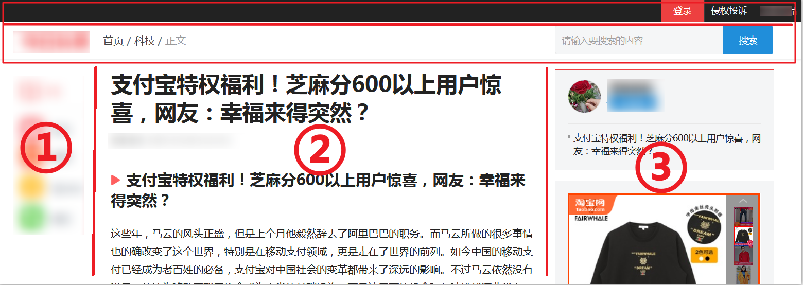

想要将div布局成案例效果，首先需要对多个div进行区分，再分别设置每一个div自身的效果。

#### 1）div的class值

首先编写三个div，设置边框样式

```html
<style>
     div{ border: 1px solid blue;}
</style>


<div >left</div>
<div >center</div>
<div>right</div>
```

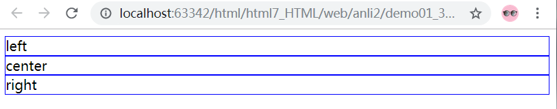

发现通过div设置的样式都是一致的，无法个性化布局。如何区分不同的div呢？ 

使用class的值，格式：

```html

.class值{
    属性名:属性值;
}

<标签名 class="class值">  
 提示: class是自定义的值
```

所以，使用class属性值，可以帮助我们区分div，更加精确的设置标签的样式。

#### 2）浮动布局和清除

主体部分分为三列，而div是独占一行的，所以想要使用div布局，就还需要加入`浮动` 属性。

* **概念**

  **float**：指定一个元素应沿其容器的左侧或右侧放置，允许文本或者内联元素环绕它，该元素从网页的正常流动中移除，其他部分保持正常文档流顺序。

  格式：

  ```css
  <!-- 加入浮动 -->
  float：none；不浮动
  float：left；左浮动
  float：right；右浮动
  
  <!-- 清除浮动 -->
  clear：both；清除两侧浮动，此元素不再收浮动元素布局影响。
  ```
  


1. 加入三部分div

```html
<div class="left">left</div>
<div class="center">center</div>
<div class="right">right</div>
```

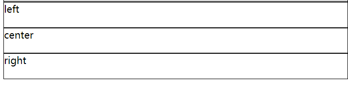

2. 浮动布局

```css
        .left{
            width: 20%;
            float: left;
        }

        .center{
            width: 59%;
            float: left;
        }


        .right{
            width: 20%;
            float: left;
        }

```

至此完成左中右三部分的布局。

3. 加入`footer` 部分

```html
   .footer{
      border: 5px solid blue;
    }
    <div class="footer">footer</div>
```

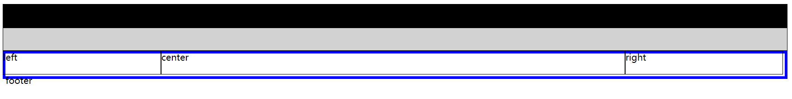

发现蓝色`footer`的div，延续正常文档流布局，摆放在`navbar`的下方，与浮动元素重叠。想要清除浮动影响，所以要设置清除浮动属性`clear`。

```html
 .footer{
        border: 5px solid blue;
		 clear: both;  
  }

 <div class="footer">footer</div>

```

4. 设置`center`

增加`center` 高度，完成基本的布局效果。

```css
.center{
            width: 59%;
            float: left;
            height: 600px;
 }
```

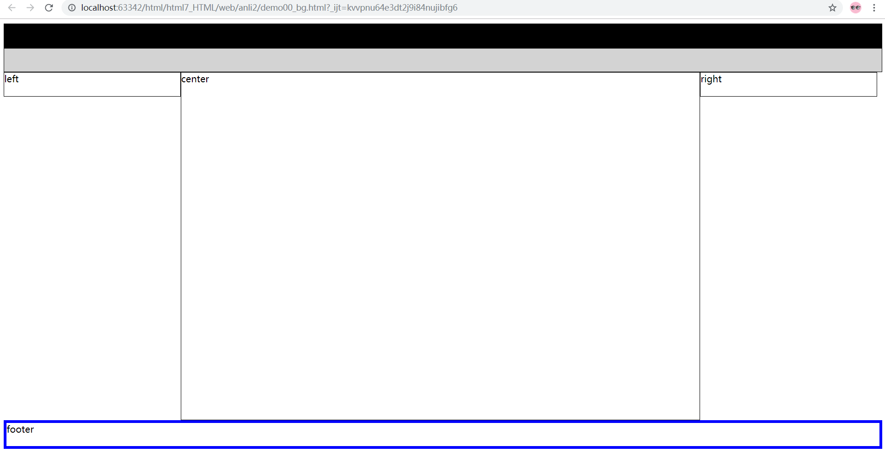

### 4.2.2 设置背景

- **设置背景的格式**：

  ```css
  背景色:
  	 background-color: black;
  背景图:
  	 background-image: url("../img/bg.png");
  ```

请设置如下布局，效果如下


代码实现

```html
  <!-- 简化版-->
    <style>
        div{
            height: 666px;
            background-color: gray;
        }
        /*左侧分享*/
        .left {
            width: 10%;
            float: left;
        }

        /*中间文本*/
        .center {
            width: 80%;/*最后去除边框宽度恢复为60%*/
            float: left;
            background-image: url("../img/star.gif");
        }

        /*右侧广告*/
        .right {
            width: 10%;
            float: left;
        }


    </style>

<div class="left"></div>
<div class="center"></div>
<div class="right"></div>

```

### 4.2.3 图片标签

| 标签名  | 作用                         | 备注                                              |
| ------- | ---------------------------- | ------------------------------------------------- |
| **img** | 可以显示一张图片(本地或网络) | **src属性**，这是一个必需的属性，表示图片的地址。 |

其他属性：

| 属性名     | 作用                          | 备注 |
| ---------- | ----------------------------- | ---- |
| **title**  | 鼠标悬停（hover）时显示文本。 |      |
| **alt**    | 图形不显示时的替换文本。      |      |
| **height** | 图像的高度。                  |      |
| **width**  | 图像的宽度。                  |      |

### 4.2.4 超链接

| 标签名 | 作用         | 备注                                    |
| ------ | ------------ | --------------------------------------- |
| **a**  | 表示超链接。 | **href属性**，表示超链接指向的URL地址。 |

| 属性名 | 作用                                           |
| ------ | ---------------------------------------------- |
| target | 页面的打开方式(_self当前页   _blank新标签页)。 |

**去掉下划线**

根据某些样式的布局需求，去除下划线更为美观。

```css
a { 
    text-decoration:none;  // none 表示不显示
}
```


## 4.3 案例实现

### 4.3.1 实现顶部条

**HTML代码**

```html
<div class="top_bar">
    
</div>

```

**样式代码**

```css
     img{
            width: 100%;
     }
```


效果如下：

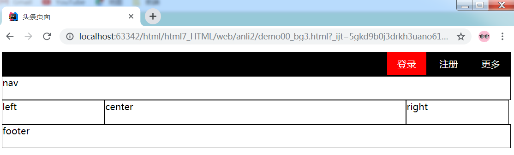


### 4.3.2 实现导航条

**HTML代码**

```html
<div class="nav_bar">
    
</div>
<!-- 加入分割线  -->
<hr size="1"/>

```

**样式代码**

```css
      hr {
            color: lightgrey;
            size: 1px;
        }
```


效果如下：

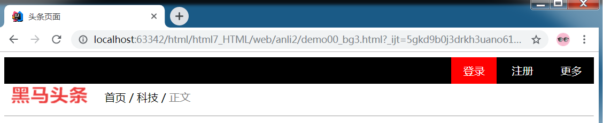

###4.5.4 实现左部分享

**HTML代码**

```html
<div class="left">
    
</div>

```

效果如下：

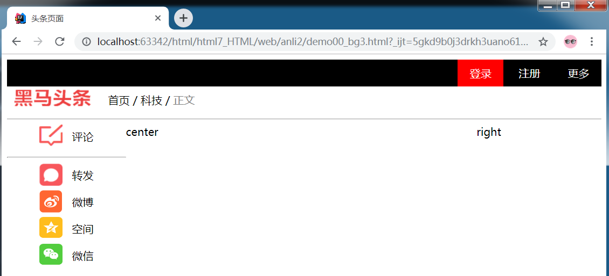

### 4.3.3 实现中部正文

**HTML代码**

```html
<div class="center">

    <div >
        <h1>支付宝特权福利！芝麻分600以上用户惊喜，网友：幸福来得突然？</h1>
    </div>
    <div>
        <font color="gray" size="2"> <em> 作者 2019-11-11 11:11:11</em></font> <br/>
        <hr/>
    </div>
    <div>
        <h3>支付宝特权福利！芝麻分600以上用户惊喜，网友：幸福来得突然？</h3>
    </div>

    <div>
        <p>
            这些年，马云的风头正盛，但是上个月他毅然辞去了阿里巴巴的职务。而马云所做的很多事情也的确改变了这个世界，特别是在移动支付领域，更是走在了世界的前列。如今中国的移动支付已经成为老百姓的必备，支付宝对中国社会的变革都带来了深远的影响。不过马云依然没有满足，他认为移动互联网将会成为人类的基础设施，而且这里面的机会和各种挑战还非常多。
        </p>

        <p>
            支付宝的诞生就是为了解决淘宝网的客户们的买卖问题，而随着支付宝的用户的不断增加，支付宝也推出了一系列的附加功能。比如生活缴费、转账汇款、还信用卡、
            车主服务、公益理财等，往简单的说，支付宝既可以满足人们的日常生活，又可以利用芝麻信用进行资金周转服务。除了芝麻分能够进行周转以外，互联网信用体系 下的产品多多，我们对比以下几个产品看看区别:
        <ol type="1">
            <li>
                蚂蚁借呗，芝麻分600并且受到邀请开通福利，这个就是支付宝贷款，直接秒杀了银行贷款和线下金融公司，是现在支付宝用户使用最多的。
            </li>

            <li>
                微粒贷：于2015年上线，主要面向QQ和微信征信极好的用户而推出，受到邀请才能申请开通，额度最高有30万，难度较大
            </li>

            <li>
                蚂蚁巴士：这个在微信 蚂蚁巴士 公众平台申请,对于信用分要求530分以上才可以,额度1-30万不等，目前非常火爆
            </li>
        </ol>

        
        </p>

        <p>
            说起支付宝中的芝麻信用功能，相信更是受到了许多人的推崇，因为随着自己使用的不断增多，信用分会慢慢提高，而达到了一个阶段，就可以获得许多的福利。而当
            我们的芝麻信用分可以达到600分以上的时候，会有令我们想象不到的惊喜，接下来就让我们一起来看看，具体都有哪些惊喜吧。
        </p>
        <p>
            <strong>一、芝麻分600以上福利之信用购。</strong>
            网购相信大家都不陌生，但是很多时候，网购都有一个通病，就是没办法试用，导致很多人买了很多自己不喜欢的东西。但是只要你的支付宝芝麻分在650及以上，就能立马享有0元下单，收到货使用满意了再进行付款。还能享用美食的专属优惠，是不是很耐斯
        </p>
        <p>

            <strong>二、芝麻分600以上福利之信用免押。</strong>芝麻信用与木鸟短租联合推出信用住宿服务，芝麻分600及以上的用户可享受免押入住特权。木鸟短租拥有全国50万套房源，是国内领先的短租民宿预订平台。包括大家知道的飞猪信用住，大部分酒店可以免押金入住，离店再交钱。
        </p>

        
        <p>
            <strong> 三、芝麻分600以上福利之国际驾照。</strong>我们经常听说的可能只是中国驾照，但现在芝麻分已经应用到了国际领域，只要你的芝麻分够550就可以免费办理国际驾照，也有不少人非常佩服马云，一个简单的芝麻分居然有如此大的功能，也从侧面反应出来马云在国际上的地位，这个国际驾照是由新西兰、德国、澳大利亚联合认证，可以在全球200多个国家通行，相信大家一定都有一个自驾全球的梦想吧，而现在支付宝就给了你一把钥匙，剩下的就你自己搞定了！有没有想带着你的女神来一次浪漫之旅呢？
        </p>

        <p>
            随着互联网对我们生活的改变越来越大，信用这一词也被大家推上风口浪尖，不论是生活出行，还是其他的互联网服务，与信用体系已经密不可分了，马云当初说道，找老婆需要拼芝麻分，如今似乎也要成为现实，那么你们的芝麻分有多少了呢？
        </p>
    </div>
</div>

```

**样式代码**

```css
  .center {
            width: 60%;  /*最后去除边框宽度恢复为60%*/
            float: left;            
   }
```


### 4.3.4 实现右侧广告

**HTML代码**

```html

<div class="right">
    <div class="right_ad">
        
    </div>

    <div class="right_ad">
        
    </div>

    <div class="right_ad">
        
    </div>

    <div class="right_ad">
        
    </div>

    <div class="right_ad">
        
    </div>

    <div class="right_ad">
        
    </div>
</div>
```

效果如下：

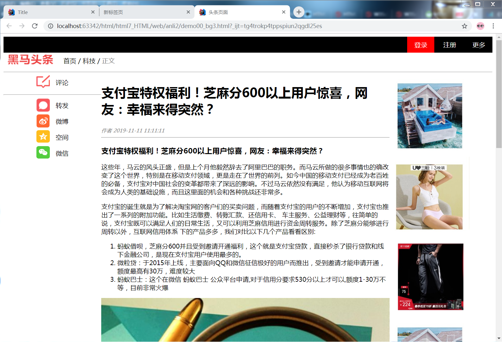

### 4.3.5 实现底部页脚

**HTML代码**

```html
<div class="footer">
    <a href="#">关于黑马&nbsp;</a>
    <a href="#">帮助中心&nbsp;</a>
    <a href="#">开放平台&nbsp;</a>
    <a href="#">诚聘英才&nbsp;</a>
    <a href="#">联系我们&nbsp;</a>
    <a href="#">法律声明&nbsp;</a>
    <a href="#">隐私政策&nbsp;</a>
    <a href="#">知识产权&nbsp;</a>
    <a href="#">廉正举报&nbsp;</a>
</div>
```

**样式代码**

```css

        .footer {
            clear: both;
            background-color: cornflowerblue;
            text-align: center;
        }

        a{
            text-decoration: none;
            color: white;
        }
```

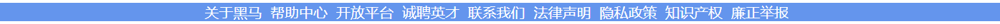

# 5 HTML案例-登录页面

## 5.1 案例效果

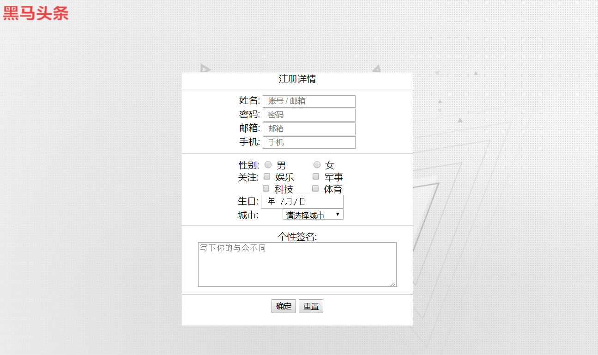

## 5.2 案例分析

### 5.2.1 表单标签

| 标签名   | 作用                                                         | 备注 |
| -------- | ------------------------------------------------------------ | ---- |
| **form** | 表示表单，是用来收集用户输入信息并向 Web 服务器提交的一个容器 |      |

举例：

```html
<form >
    //表单元素
</form>
```

**表单的属性**

| 属性名           | 作用                                                         | 备注                           |
| ---------------- | ------------------------------------------------------------ | ------------------------------ |
| **action**       | 处理此表单信息的Web服务器的URL地址                           |                                |
| **method**       | 提交此表单信息到Web服务器的方式                              | 可能的值有get和post，默认为get |
| **autocomplete** | 自动补全，指示表单元素是否能够拥有一个默认值，配合input标签使用 | HTML5                          |

举例：

```html
<!-- 一个简单的表单，会发送一个 GET 请求 -->
<form action="/web/login" method="get">
</form>

<!-- 一个简单的表单，发送 POST 请求 -->
<form action="/web/reg" method="post">
</form>
```

**GET与POST说明：**

`post`：指的是 HTTP [POST 方法](http://www.w3.org/Protocols/rfc2616/rfc2616-sec9.html#sec9.5)；表单数据会包含在表单体内然后发送给服务器。

`get`：指的是 HTTP [GET 方法](http://www.w3.org/Protocols/rfc2616/rfc2616-sec9.html#sec9.3)；表单数据会附加在 `action` 属性的URI中，并以 '?' 作为分隔符，然后这样得到的 URI 再发送给服务器。

GET方式举例：


**GET与POST对比：**

|      | 地址栏可见 | 数据安全 | 数据大小               |
| ---- | ---------- | -------- | ---------------------- |
| GET  | 可见       | 不安全   | 有限制（取决于浏览器） |
| POST | 不可见     | 相对安全 | 无限制                 |

### 5.2.2 表单元素入门

表单元素指的是 input 元素、复选框、下拉框、提交按钮等等。

| 标签名     | 作用                                               | 备注                              |
| ---------- | -------------------------------------------------- | --------------------------------- |
| **label** | 表单元素的说明，配合表单元素使用                   | for属性值为相关表单元素的id属性值 |
| **input**  | 表单中输入控件，多种输入类型，用于接受来自用户数据 | type属性值决定输入类型            |
| **button** | 页面中可点击的按钮，可以配合表单进行提交           | type属性值决定按钮类型            |

#### 1）简单的文本输入框

* label标签：表单的说明。
  * for属性值：匹配input标签的id属性值

* input标签：输入控件。
  * type属性：表示输入类型，text值为普通文本框
  * id属性：表示标签唯一标识
  * name属性：表示标签名称
  * value属性：表示标签数据值

**代码实现：**

```html
<form action="" method="post">
  <label for="username">Username:</label>
  <input type="text" id="username"  name="username" value="tom">
</form>
```

**效果如图：**

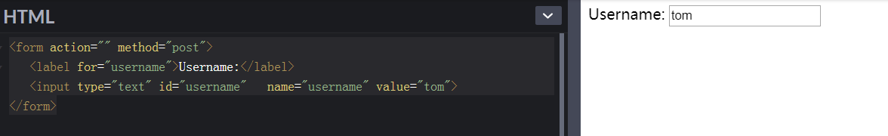


#### 2）提交用户名的表单

* button标签：表示按钮。
  * type属性：表示按钮类型，submit值为提交按钮。

```html
<form action="" method="post">
  <label for="username">Username:</label>
  <input type="text" id="username"  name="username" value="tom">
  <button type="submit" >login</button>
</form>
```

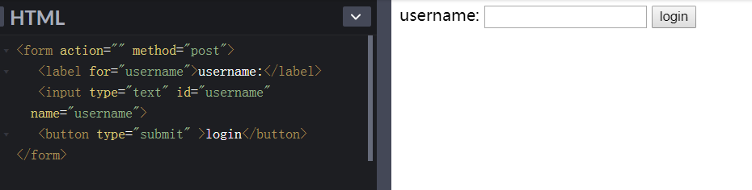

### 5.2.3 关于属性值

#### 1）NAME和VALUE属性

| 属性名    | 作用                                                         |
| --------- | ------------------------------------------------------------ |
| **name**  | `<input>`的名字，在提交整个表单数据时，可以用于区分属于不同`<input>`的值 |
| **value** | 这个`<input>`元素当前的值，允许用户通过页面输入              |

使用方式：

以name属性值作为键，value属性值作为值，构成键值对提交到服务器，多个键值对浏览器使用`&`进行分隔。

举例：

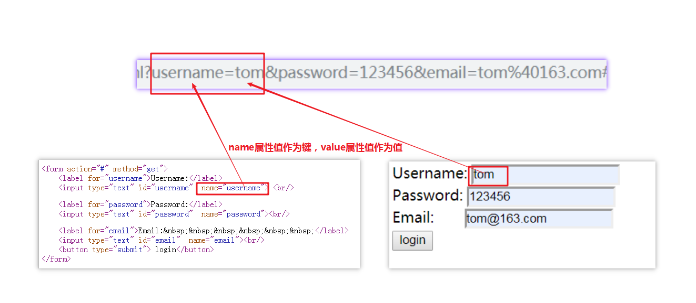


#### 2）TYPE属性

* **input标签的type属性**

  >【建议】
  >
  >这是今天的重点讲解内容，type的值决定输入的类型

  * **基本的文本属性**

    | 属性值   | 作用                                                 | 备注  |
    | -------- | ---------------------------------------------------- | ----- |
    | text     | 单行文本字段                                         |       |
    | password | 单行文本字段，值被遮盖                               |       |
    | email    | 用于编辑 e-mail 的字段，可以对e-mail地址进行简单校验 | HTML5 |

    举例：

    ```html
      <form action="#" method="get">
          <label for="username">Username:</label>
          <input type="text" id="username"  name="username"> <br/>
      
          <label for="password">Password:</label>
          <input type="password" id="password"  name="password"><br/>
      
          <label for="email">Email:&nbsp;&nbsp;&nbsp;&nbsp;&nbsp;&nbsp;</label>
          <input type="email" id="email"  name="email"><br/>
          <button type="submit"> login</button>
      </form>
      
    ```

    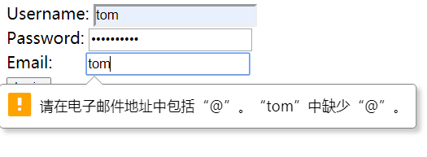


  * **单选多选属性**

    | 属性值   | 作用                                                         |
    | -------- | ------------------------------------------------------------ |
    | radio    | 单选按钮。 1. 在同一个”单选按钮组“中，所有单选按钮的 name 属性使用同一个值；一个单选按钮组中是，同一时间只有一个单选按钮可以被选择。 2. 必须使用 value 属性定义此控件被提交时的值。 3. 使用checked 必须指示控件是否缺省被选择。 |
    | checkbox | 复选框。 1. 必须使用 value 属性定义此控件被提交时的值。 2. 使用 checked 属性指示控件是否被选择。 3. 选中多个值时，所有的值会构成一个数组而提交到Web服务器 |

    举例：

    ```html
    <form action="#" method="get">
        <label for="gender">性别:</label>
        <input type="radio" id="gender" name="gender" value="boy"/>男
        <input type="radio" name="gender" value="girl" checked="checked"/>女
    
        <hr/>
        <label for="hobby">爱好: </label>
        <input type="checkbox" id="hobby" name="hobby" value="sport"/> 体育
        <input type="checkbox"  name="hobby" value="tech"/> 科技
        <input type="checkbox" name="hobby" value="fun" /> 娱乐
        <input type="checkbox" name="hobby" value="video" checked="checked"/> 短视频
    </form>
    ```

    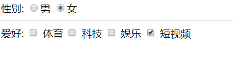

  * **按钮属性**

    | 属性值 | 作用                                                         |
    | ------ | ------------------------------------------------------------ |
    | button | 无行为按钮，用于结合JavaScript实现自定义动态效果             |
    | submit | 提交按钮，用于提交表单数据。                                 |
    | reset  | 重置按钮，用于将表单中内容恢复为默认值。                     |
    | image  | 图片提交按钮。必须使用 src 属性定义图片的来源及使用 alt 定义替代文本。还可以使用 height 和 width 属性以像素为单位定义图片的大小。 |


  * **HTML5新增的type值**

    | 属性值         | 作用                                   | 备注                                                         |
    | -------------- | -------------------------------------- | ------------------------------------------------------------ |
    | date           | HTML5 用于输入日期的控件               | 年，月，日，不包括时间                                       |
    | time           | HTML5 用于输入时间的控件               | 不含时区                                                     |
    | datetime-local | HTML5 用于输入日期时间的控件           | 不包含时区                                                   |
    | number         | HTML5 用于输入浮点数的控件             |                                                              |
    | range          | HTML5 用于输入不精确值控件             | max-规定最大值<br/>min-规定最小值 <br/>step-规定步进值 <br/>value-规定默认值 |
    | search         | HTML5 用于输入搜索字符串的单行文本字段 | 可以点击`x`清除内容                                          |
    | tel            | HTML5 用于输入电话号码的控件           |                                                              |
    | url            | HTML5 用于编辑URL的字段                | 可以校验URL地址格式                                          |
    | file   | 此控件可以让用户选择文件，用于文件上传。                     | 使用 accept 属性可以定义控件可以选择的文件类型。 |
    | hidden | 此控件用户在页面上不可见，但它的值会被提交到服务器，用于传递隐藏值 |                                                  |

* **button标签的type属性**

  | 属性值 | 作用                                                         | 备注                         |
  | ------ | ------------------------------------------------------------ | ---------------------------- |
  | submit | 此按钮将表单数据提交给服务器。如果未指定属性，或者属性动态更改为空值或无效值，则此值为默认值。 | 同 `<input type="submit"/> ` |
  | reset  | 此按钮重置所有组件为初始值。                                 | 同`<input type="reset"`/>    |
  | button | 此按钮没有默认行为。它可以有与元素事件相关的客户端脚本，当事件出现时可触发。 | 同`<input type="button"/>`   |


#### 3）HTML5新增属性

| 属性名           | 作用                                                         | 备注                                                         |
| ---------------- | ------------------------------------------------------------ | ------------------------------------------------------------ |
| **placeholder**  | 提示用户输入框的作用。用于提示的占位符文本不能包含回车或换行。 | 仅适用于当**type** 属性为text, search, tel, url or email时; 否则会被忽略。 |
| **required**     | 这个属性指定用户在提交表单之前必须为该元素填充值             | 1. 布尔属性，可省略属性值表示true<br/>2. 当type属性是hidden,image或者button类型时不可使用 |
| **autocomplete** | 自动补全，规定表单或输入字段是否应该自动完成。当自动完成开启，浏览器会基于用户之前的输入值自动填写值。 | 1. 开启为on，关闭为off<br/>2. 可以设置指定的字段为off，关闭自动补全 |

### 5.2.4 更多表单元素

| 标签名 | 作用 | 备注 |
| ---- | ---- | ---- |
| **select**  | 表单的控件，下拉选项菜单                                     | 与option配合实用 |
| **optgroup** | option的分组标签 | 与option配合实用 |
| **option**  | select的子标签，表示一个选项                                 |                                |
| **textarea** | 表示多行纯文本编辑控件 | rows表示行高度， cols表示列宽度 |
| **fieldset** | 用来对表单中的控制元素进行分组(也包括 label 元素) |                                |
| **legend**   | 用于表示它的**fieldset**内容的标题。 | **fieldset** 的子元素 |

**select举例：**

```html

<label for="pet-select">Choose a pet:</label>

<select name="pets" id="pet-select">
    <option value="">--Please choose an option--</option>
    <option value="dog">Dog</option>
    <option value="cat">Cat</option>
    <option value="hamster">Hamster</option>
    <option value="parrot">Parrot</option>
    <option value="spider">Spider</option>
    <option value="goldfish">Goldfish</option>
</select>

<!--  
  select的name属性值与option的value属性值,构成键值对,提交到Web服务器
-->
```

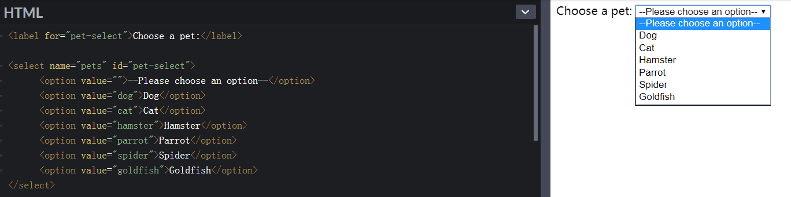

**textarea举例：**

```html
<textarea name="textarea" rows="10" cols="50">Write something here</textarea>

```

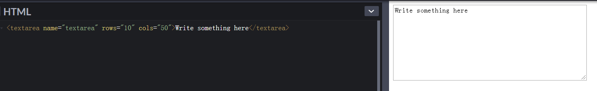

**fieldset举例：**

```html

<form action="#" method="post">
  <fieldset>
    	<legend>是否同意</legend>
        <input type="radio" id="radio_y" name="agree" value="y"> 
      	<label for="radio_y">同意</label>
        <input type="radio" id="radio_n" name="agree" value="n"> 
      	<label for="radio_n">不同意</label>
  </fieldset>
</form>

```

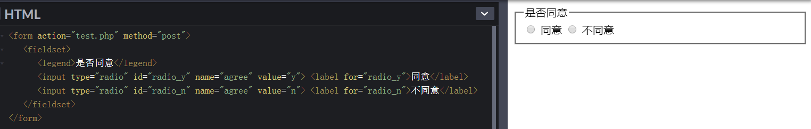

