# 1、JavaScript快速入门

## 1.1、JavaScript介绍

- JavaScript 是一种客户端脚本语言。运行在客户端浏览器中，每一个浏览器都具备解析 JavaScript 的引擎。

- 脚本语言：不需要编译，就可以被浏览器直接解析执行了。

- 核心功能就是增强用户和 HTML 页面的交互过程，让页面有一些动态效果。以此来增强用户的体验！

  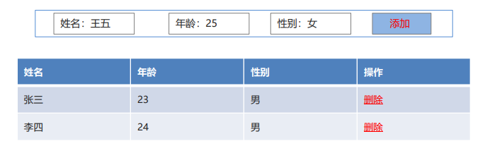
  
  ```tex
  1995 年，NetScape (网景)公司，开发的一门客户端脚本语言：LiveScript。后来，请来 SUN 公司的专家来 进行修改，后命名为：JavaScript。
  1996 年，微软抄袭 JavaScript 开发出 JScript 脚本语言。 
  1997 年，ECMA (欧洲计算机制造商协会)，制定出客户端脚本语言的标准：ECMAScript，统一了所有客户 端脚本语言的编码方式。
  ```
  
  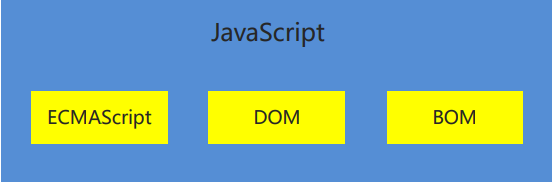

## 1.2、快速入门

- **实现步骤**

1. 创建一个 HTML。
2. 在标签下面编写一个`<script>`标签。
3. 在`<script>`标签中编写代码。
4. 通过浏览器查看

- **具体实现**

```html
<!DOCTYPE html>
<html lang="en">
<head>
    <meta charset="UTF-8">
    <title>JS快速入门</title>
</head>
<body>
    <button id="btn">点我呀</button>
</body>
</html>
```

###  引入js的方式一：内部方式

```html
<script>
    document.getElementById("btn").onclick=function () {
        alert("点我干嘛？");
    }
</script>
```

### 引入js的方式一：外部方式

- **创建js文件**

  ```js
  document.getElementById("btn").onclick=function () {
      alert("点我干嘛？");
  }
  ```

- **在html中引用外部js文件**

  ```js
  <script src="js/my.js"></script>
  ```

## 1.3、快速入门总结

- JavaScript 是一种客户端脚本语言。

- 组成部分

  ```tex
  ECMAScript、DOM、BOM
  ```

- 和 HTML 结合方式

  ```tex
  内部方式：<script></script>
  外部方式：<script src=文件路径></script>
  ```

# 2、JavaScript基本语法

## 2.1、注释

- 单行注释

  ```js
  // 注释的内容
  ```

- 多行注释

  ```js
  /*
  注释的内容
  */
  ```

## 2.2、输入输出语句

- 输入框 prompt(“提示内容”);
- 弹出警告框 alert(“提示内容”); 
-  控制台输出 console.log(“显示内容”); 
-  页面内容输出 document.write(“显示内容”);

## 2.3、变量和常量

​	JavaScript 属于弱类型的语言，定义变量时不区分具体的数据类型。

- 定义局部变量 let 变量名 = 值; 

  ```js
  //1.定义局部变量
  let name = "张三";
  let age = 23;
  document.write(name + "," + age +"<br>");
  ```

  补充说明：
  - `let`是ES6新增的命令，具有**块作用域**
  - 在此之前，JS只有全局作用域和函数作用域，使用`var`声明**函数作用域**变量

- 定义全局变量 变量名 = 值; 

  ```js
  //2.定义全局变量
  {
      let l1 = "aa";
      l2 = "bb";
  }
  //document.write(l1);
  document.write(l2 + "<br>");
  ```

- 定义常量 const 常量名 = 值;

  ```js
  //3.定义常量
  const PI = 3.1415926;
  //PI = 3.15;
  document.write(PI);
  ```

## 2.4、原始数据类型和typeof方法

### 2.4.1、原始数据类型

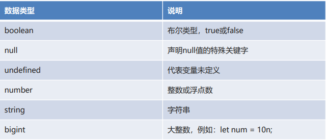

### 2.4.2、typeof

**typeof 用于判断变量的数据类型**

```js
let age = 18; 
document.write(typeof(age)); // number
```

未定义变量使用typeof返回`undefined`

## 2.5、运算符

- **算数运算符**

  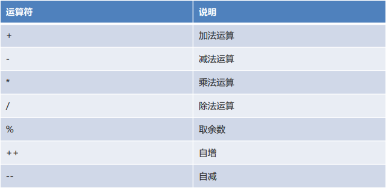

- **赋值运算符**

  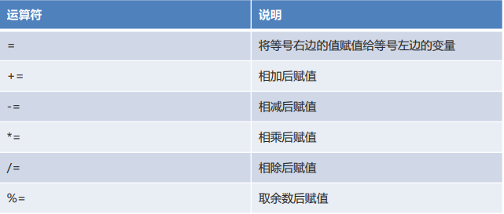

- **比较运算符**

  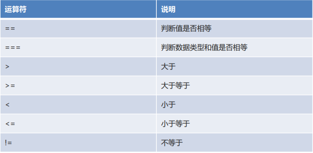

- 逻辑运算符

  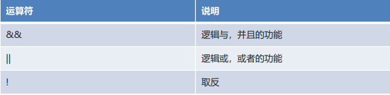

- **三元运算符**

    `(比较表达式) ? true时表达式1 : false时表达式2;` 

## 2.6、流程控制和循环语句

- **if 语句**

  ```js
  //if语句
  let month = 3;
  if(month >= 3 && month <= 5) {
      document.write("春季");
  }else if(month >= 6 && month <= 8) {
      document.write("夏季");
  }else if(month >= 9 && month <= 11) {
      document.write("秋季");
  }else if(month == 12 || month == 1 || month == 2) {
      document.write("冬季");
  }else {
      document.write("月份有误");
  }
  
  document.write("<br>");
  ```

- **switch 语句**

  ```js
  //switch语句
  switch(month){
      case 3:
      case 4:
      case 5:
          document.write("春季");
          break;
      case 6:
      case 7:
      case 8:
          document.write("夏季");
          break;
      case 9:
      case 10:
      case 11:
          document.write("秋季");
          break;
      case 12:
      case 1:
      case 2:
          document.write("冬季");
          break;
      default:
          document.write("月份有误");
          break;
  }
  
  document.write("<br>");
  ```

- **for循环**

  ```js
  //for循环
  for(let i = 1; i <= 5; i++) {
      document.write(i + "<br>");
  }
  ```

- **while 循环**

  ```js
  //while循环
  let n = 6;
  while(n <= 10) {
      document.write(n + "<br>");
      n++;
  }
  ```

## 2.7、数组

- 数组的使用和 java 中的数组基本一致，但是在 JavaScript 中的数组更加灵活，数据类型和长度都没有限制。

- 定义格式
  
  - `let 数组名 = [元素1,元素2,…];
  
    ```js
    let arr = [10,20,30];
    ```
  
    
- 索引范围
  
  - 从 0 开始，最大到数组长度-1
- 数组长度 
  
  - 数组名.length
  
    ```js
    for(let i = 0; i < arr.length; i++) {
        document.write(arr[i] + "<br>");
    }
    document.write("==============<br>");
    ```
  
    
- 数组高级运算符… 
  - 数组复制
  
    ```js
     //复制数组
     let arr2 = [...arr];
     //遍历数组
     for(let i = 0; i < arr2.length; i++) {
     document.write(arr2[i] + "<br>");
     }
     document.write("==============<br>");
    ```
  
  - 合并数组
  
    ```js
    //合并数组
    let arr3 = [40,50,60];
    let arr4 = [...arr2 , ...arr3];
    //遍历数组
    for(let i = 0; i < arr4.length; i++) {
    document.write(arr4[i] + "<br>");
    }
    document.write("==============<br>");
    ```
  
  - 字符串转数组
  
    ```js
    //将字符串转成数组
    let arr5 = [..."heima"];
    //遍历数组
    for(let i = 0; i < arr5.length; i++) {
    document.write(arr5[i] + "<br>");
    }
    ```
  
    

## 2.8、函数

- 函数类似于 java 中的方法，可以将一些代码进行抽取，达到复用的效果

- 定义格式

  ```js
  function 方法名(参数列表) {
      方法体; 
      return 返回值; 
  }
  ```

- 可变参数

  ```js
  function 方法名(…参数名) {
      方法体; 
      return 返回值; 
  }
  ```

  

- 匿名函数

  ```js
  function(参数列表) {
      方法体; 
  }
  ```

# 3、JavaScript DOM

## 3.1、DOM介绍

- DOM(Document Object Model)：文档对象模型。
- 将 HTML 文档的各个组成部分，封装为对象。借助这些对象，可以对 HTML 文档进行增删改查的动态操作。

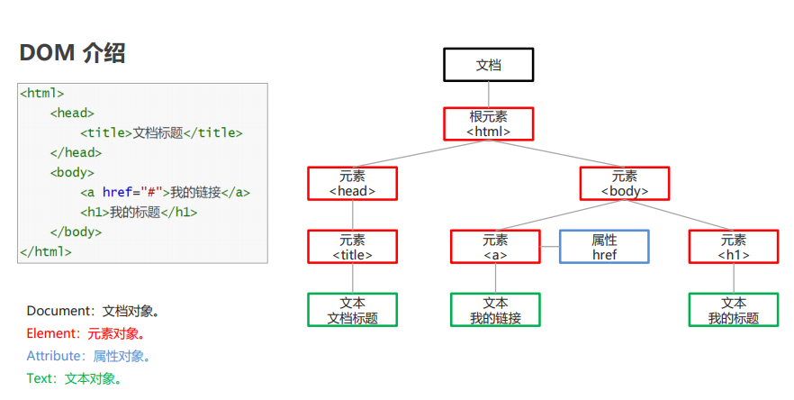

## 3.2、Element元素的获取操作

- 具体方法

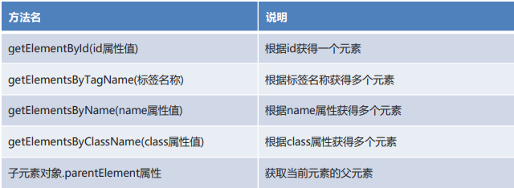

- 代码实现

```html
<!DOCTYPE html>
<html lang="en">
<head>
    <meta charset="UTF-8">
    <meta name="viewport" content="width=device-width, initial-scale=1.0">
    <title>元素的获取</title>
</head>
<body>
    <div id="div1">div1</div>
    <div id="div2">div2</div>
    <div class="cls">div3</div>
    <div class="cls">div4</div>
    <input type="text" name="username"/>
</body>
<script>
    //1. getElementById()   根据id属性值获取元素对象
    let div1 = document.getElementById("div1");
    //alert(div1);

    //2. getElementsByTagName()   根据元素名称获取元素对象们，返回数组
    let divs = document.getElementsByTagName("div");
    //alert(divs.length);

    //3. getElementsByClassName()  根据class属性值获取元素对象们，返回数组
    let cls = document.getElementsByClassName("cls");
    //alert(cls.length);

    //4. getElementsByName()   根据name属性值获取元素对象们，返回数组
    let username = document.getElementsByName("username");
    //alert(username.length);

    //5. 子元素对象.parentElement属性   获取当前元素的父元素
    let body = div1.parentElement;
    alert(body);
</script>
</html>
```

## 3.3、Element元素的增删改操作

- **具体方法**

  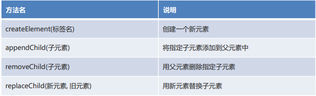

- **代码实现**

  ```html
  <!DOCTYPE html>
  <html lang="en">
  <head>
      <meta charset="UTF-8">
      <meta name="viewport" content="width=device-width, initial-scale=1.0">
      <title>元素的增删改</title>
  </head>
  <body>
      <select id="s">
          <option>---请选择---</option>
          <option>北京</option>
          <option>上海</option>
          <option>广州</option>
      </select>
  </body>
  <script>
      //1. createElement()   创建新的元素
      let option = document.createElement("option");
      //为option添加文本内容
      option.innerText = "深圳";
  
      //2. appendChild()     将子元素添加到父元素中
      let select = document.getElementById("s");
      select.appendChild(option);
  
      //3. removeChild()     通过父元素删除子元素
      //select.removeChild(option);
  
      //4. replaceChild()    用新元素替换老元素
      let option2 = document.createElement("option");
      option2.innerText = "杭州";
      select.replaceChild(option2,option);
  
  </script>
  </html>
  ```

## 3.4、Attribute属性的操作

- **具体方法**

  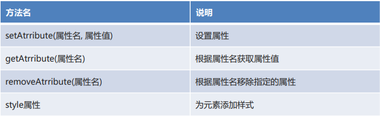

- **代码实现**

  ```html
  <!DOCTYPE html>
  <html lang="en">
  <head>
      <meta charset="UTF-8">
      <meta name="viewport" content="width=device-width, initial-scale=1.0">
      <title>属性的操作</title>
      <style>
          .aColor{
              color: blue;
          }
      </style>
  </head>
  <body>
      <a>点我呀</a>
  </body>
  <script>
      //1. setAttribute()    添加属性
      let a = document.getElementsByTagName("a")[0];
      a.setAttribute("href","https://www.baidu.com");
  
      //2. getAttribute()    获取属性
      let value = a.getAttribute("href");
      //alert(value);
  
      //3. removeAttribute()  删除属性
      //a.removeAttribute("href");
  
      //4. style属性   添加样式
      //a.style.color = "red";
  
      //5. className属性   添加指定样式
      a.className = "aColor";
  
  </script>
  </html>
  ```

## 3.5、Text文本的操作

- **具体方法**

  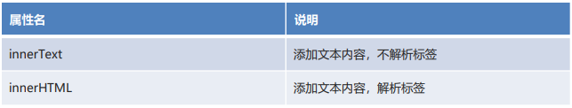

- **代码实现**

  ```html
  <!DOCTYPE html>
  <html lang="en">
  <head>
      <meta charset="UTF-8">
      <meta name="viewport" content="width=device-width, initial-scale=1.0">
      <title>文本的操作</title>
  </head>
  <body>
      <div id="div"></div>
  </body>
  <script>
      //1. innerText   添加文本内容，不解析标签
      let div = document.getElementById("div");
      div.innerText = "我是div";
      //div.innerText = "<b>我是div</b>";
  
      //2. innerHTML   添加文本内容，解析标签
      div.innerHTML = "<b>我是div</b>";
  
  </script>
  </html>
  ```

## 3.6、DOM小结

- DOM(Document Object Model)：文档对象模型 

  - Document：文档对象
- Element：元素对象
  - Attribute：属性对象
- Text：文本对象
- 元素的操作
  - getElementById()
  - getElementsByTagName()
  - getElementsByName()
  - getElementsByClassName()
  - 子元素对象.parentElement属性
  - createElement()
  - appendChild()
  - removeChild()
  - replaceChild()
- 属性的操作
  - setAtrribute()
  - getAtrribute()
  - removeAtrribute()
  - style属性
- 文本的操作
  - innerText
  - innerHTML

# 4、JavaScript 事件

## 4.1、事件介绍

事件指的就是当某些组件执行了某些操作后，会触发某些代码的执行。

- **常用的事件**

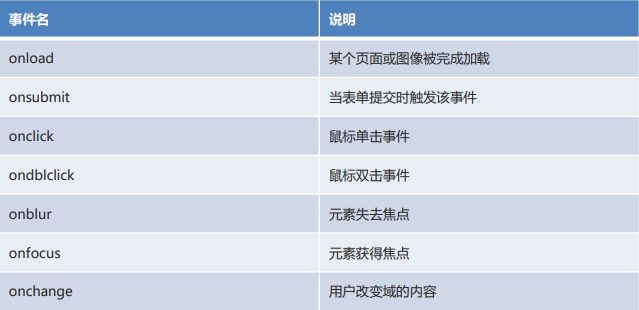

- **了解的事件**

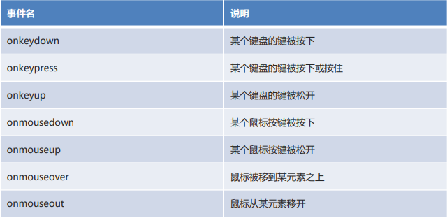

## 4.2、事件操作

绑定事件

- **方式一**

  通过标签中的事件属性进行绑定。

  ```html
  <button id="btn" onclick="执行的功能"></button>
  ```

- **方式二**

  通过 DOM 元素属性绑定。

  ```js
  document.getElementById("btn").onclick = 执行的功能
  ```


# 5、JavaScript综合案例

## 5.1、案例效果介绍

- 在“姓名、年龄、性别”三个文本框中填写信息后，添加到“学生信息表”列表（表格）中。

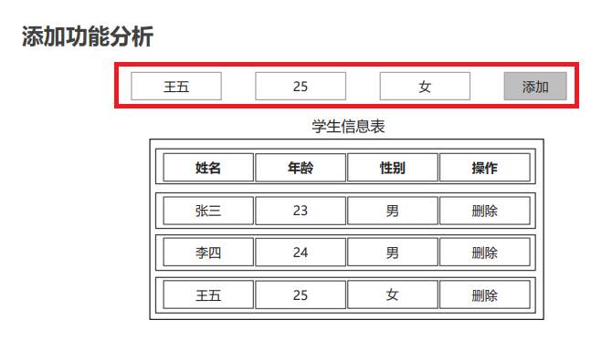

## 5.2、添加功能的分析

1. 为添加按钮绑定单击事件。
2. 创建 tr 元素。
3. 创建 4 个 td 元素。
4. 将 td 添加到 tr 中。
5.  获取文本框输入的信息。
6. 创建 3 个文本元素。
7. 将文本元素添加到对应的 td 中。
8. 创建 a 元素。
9. 将 a 元素添加到对应的 td 中。
10. 将 tr 添加到 table 中。

## 5.3、添加功能的实现

```html
<!DOCTYPE html>
<html lang="en">
<head>
    <meta charset="UTF-8">
    <title>动态表格</title>

    <style>
        table{
            border: 1px solid;
            margin: auto;
            width: 500px;
        }

        td,th{
            text-align: center;
            border: 1px solid;
        }
        div{
            text-align: center;
            margin: 50px;
        }
    </style>

</head>
<body>

<div>
    <input type="text" id="name" placeholder="请输入姓名" autocomplete="off">
    <input type="text" id="age"  placeholder="请输入年龄" autocomplete="off">
    <input type="text" id="gender"  placeholder="请输入性别" autocomplete="off">
    <input type="button" value="添加" id="add">
</div>

    <table id="tb">
        <caption>学生信息表</caption>
        <tr>
            <th>姓名</th>
            <th>年龄</th>
            <th>性别</th>
            <th>操作</th>
        </tr>

        <tr>
            <td>张三</td>
            <td>23</td>
            <td>男</td>
            <td><a href="JavaScript:void(0);" onclick="drop(this)">删除</a></td>
        </tr>

        <tr>
            <td>李四</td>
            <td>24</td>
            <td>男</td>
            <td><a href="JavaScript:void(0);" onclick="drop(this)">删除</a></td>
        </tr>

    </table>

</body>
<script>
    //一、添加功能
    //1.为添加按钮绑定单击事件
    document.getElementById("add").onclick = function(){
        //2.创建行元素
        let tr = document.createElement("tr");
        //3.创建4个单元格元素
        let nameTd = document.createElement("td");
        let ageTd = document.createElement("td");
        let genderTd = document.createElement("td");
        let deleteTd = document.createElement("td");
        //4.将td添加到tr中
        tr.appendChild(nameTd);
        tr.appendChild(ageTd);
        tr.appendChild(genderTd);
        tr.appendChild(deleteTd);
        //5.获取输入框的文本信息
        let name = document.getElementById("name").value;
        let age = document.getElementById("age").value;
        let gender = document.getElementById("gender").value;
        //6.根据获取到的信息创建3个文本元素
        let nameText = document.createTextNode(name);
        let ageText = document.createTextNode(age);
        let genderText = document.createTextNode(gender);
        //7.将3个文本元素添加到td中
        nameTd.appendChild(nameText);
        ageTd.appendChild(ageText);
        genderTd.appendChild(genderText);
        //8.创建超链接元素和显示的文本以及添加href属性
        let a = document.createElement("a");
        let aText = document.createTextNode("删除");
        a.setAttribute("href","JavaScript:void(0);");
        a.setAttribute("onclick","drop(this)");
        a.appendChild(aText);
        //9.将超链接元素添加到td中
        deleteTd.appendChild(a);
        //10.获取table元素，将tr添加到table中
        let table = document.getElementById("tb");
        table.appendChild(tr);
    }
</script>
</html>
```

## 5.4、删除功能的分析

- **删除功能介绍**

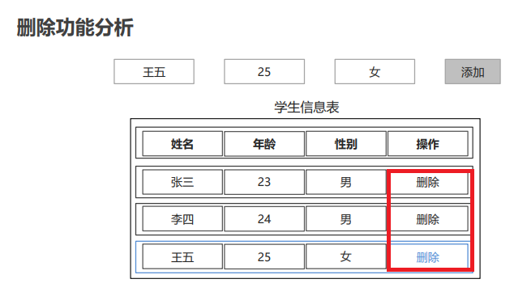

- **删除功能分析**

1. 为每个删除超链接添加单击事件属性。
2. 定义删除的方法。
3. 获取 table 元素。
4. 获取 tr 元素。
5. 通过 table 删除 tr。

## 5.5、删除功能的实现

```js
//二、删除的功能
//1.为每个删除超链接标签添加单击事件的属性
//2.定义删除的方法
function drop(obj){
    //3.获取table元素
    let table = obj.parentElement.parentElement.parentElement;
    //4.获取tr元素
    let tr = obj.parentElement.parentElement;
    //5.通过table删除tr
    table.removeChild(tr);
}
```


# 6、JavaScript面向对象

## 6.1、面向对象介绍

​		在 Java 中我们学习过面向对象，核心思想是万物皆对象。在 JavaScript 中同样也有面向对象。思想类似。

​		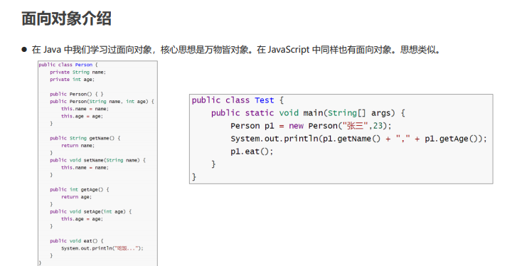

## 6.2、类的定义和使用

- **结构说明**

    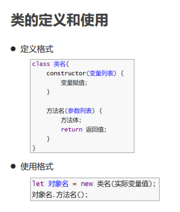

- **代码实现**

  ```html
  <!DOCTYPE html>
  <html lang="en">
  <head>
      <meta charset="UTF-8">
      <meta name="viewport" content="width=device-width, initial-scale=1.0">
      <title>类的定义和使用</title>
  </head>
  <body>
      
  </body>
  <script>
      //定义Person类
      class Person{
          //构造方法
          constructor(name,age){
              this.name = name;
              this.age = age;
          }
  
          //show方法
          show(){
              document.write(this.name + "," + this.age + "<br>");
          }
  
          //eat方法
          eat(){
              document.write("吃饭...");
          }
      }
  
      //使用Person类
      let p = new Person("张三",23);
      p.show();
      p.eat();
  </script>
  </html>
  ```

## 6.4、字面量类的定义和使用

- **结构说明**

    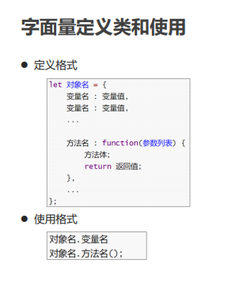

- **代码实现**

  ```html
  <!DOCTYPE html>
  <html lang="en">
  <head>
      <meta charset="UTF-8">
      <meta name="viewport" content="width=device-width, initial-scale=1.0">
      <title>字面量定义类和使用</title>
  </head>
  <body>
      
  </body>
  <script>
      //定义person
      let person = {
          name : "张三",
          age : 23,
          hobby : ["听课","学习"],
  
          eat : function() {
              document.write("吃饭...");
          }
      };
  
      //使用person
      document.write(person.name + "," + person.age + "," + person.hobby[0] + "," + person.hobby[1] + "<br>");
      person.eat();
  </script>
  </html>
  ```

## 6.5、继承

- 继承：让类与类产生子父类的关系，子类可以使用父类有权限的成员。

- 继承关键字：`extends`

- 顶级父类：`Object`

  ```html
  <!DOCTYPE html>
  <html lang="en">
  <head>
      <meta charset="UTF-8">
      <meta name="viewport" content="width=device-width, initial-scale=1.0">
      <title>继承</title>
  </head>
  <body>
      
  </body>
  <script>
      //定义Person类
      class Person{
          //构造方法
          constructor(name,age){
              this.name = name;
              this.age = age;
          }
  
          //eat方法
          eat(){
              document.write("吃饭...");
          }
      }
  
      //定义Worker类继承Person
      class Worker extends Person{
          constructor(name,age,salary){
              super(name,age);
              this.salary = salary;
          }
  
          show(){
              document.write(this.name + "," + this.age + "," + this.salary + "<br>");
          }
      }
  
      //使用Worker
      let w = new Worker("张三",23,10000);
      w.show();
      w.eat();
  </script>
  </html>
  ```


# 7、JavaScript内置对象

## 7.1、Number

- **方法介绍**

    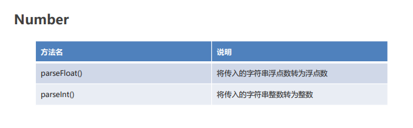

- **代码实现**

```html
<!DOCTYPE html>
<html lang="en">
<head>
    <meta charset="UTF-8">
    <meta name="viewport" content="width=device-width, initial-scale=1.0">
    <title>Number</title>
</head>
<body>
    
</body>
<script>
    //1. parseFloat()  将传入的字符串浮点数转为浮点数
    document.write(Number.parseFloat("3.14") + "<br>");

    //2. parseInt()    将传入的字符串整数转为整数
    document.write(Number.parseInt("100") + "<br>");
    document.write(Number.parseInt("200abc") + "<br>"); // 从数字开始转换，直到不是数字为止

</script>
</html>
```

## 7.2、Math

- **方法介绍**

    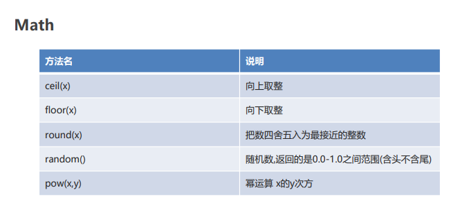

- **代码实现**

```html
<!DOCTYPE html>
<html lang="en">
<head>
    <meta charset="UTF-8">
    <meta name="viewport" content="width=device-width, initial-scale=1.0">
    <title>Math</title>
</head>
<body>
    
</body>
<script>
    //1. ceil(x) 向上取整
    document.write(Math.ceil(4.4) + "<br>");    // 5
    
    //2. floor(x) 向下取整
    document.write(Math.floor(4.4) + "<br>");   // 4
    
    //3. round(x) 把数四舍五入为最接近的整数
    document.write(Math.round(4.1) + "<br>");   // 4
    document.write(Math.round(4.6) + "<br>");   // 5
    
    //4. random() 随机数,返回的是0.0-1.0之间范围(含头不含尾)
    document.write(Math.random() + "<br>"); // 随机数
    
    //5. pow(x,y) 幂运算 x的y次方
    document.write(Math.pow(2,3) + "<br>"); // 8
</script>
</html>
```

## 7.3、Date

- **方法说明**

  - **构造方法**

    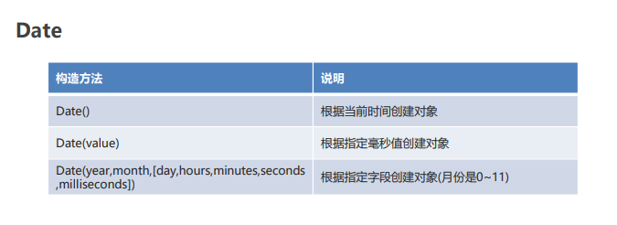

    - 传入月份如果超过11，会自动计入下一年，如`new Date(2022,12)`表示2023年1月；
    - 同理如果小于0，会自动计入上一年，如`new Date(2022,-1)`表示2021年12月

  - **成员方法**

    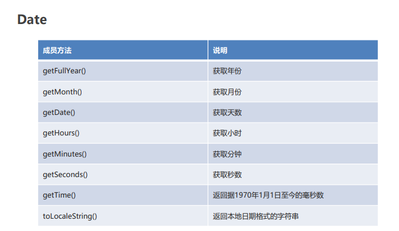

    `getMonth()`返回值也是0~11

- **代码实现**

    ```html
    <!DOCTYPE html>
    <html lang="en">
    <head>
        <meta charset="UTF-8">
        <meta name="viewport" content="width=device-width, initial-scale=1.0">
        <title>Date</title>
    </head>
    <body>
        
    </body>
    <script>
        //构造方法
        //1. Date()  根据当前时间创建对象
        let d1 = new Date();
        document.write(d1 + "<br>");

        //2. Date(value) 根据指定毫秒值创建对象
        let d2 = new Date(10000);
        document.write(d2 + "<br>");

        //3. Date(year,month,[day,hours,minutes,seconds,milliseconds]) 根据指定字段创建对象(月份是0~11)
        let d3 = new Date(2222,2,2,20,20,20);
        document.write(d3 + "<br>");

        //成员方法
        //1. getFullYear() 获取年份
        document.write(d3.getFullYear() + "<br>");

        //2. getMonth() 获取月份
        document.write(d3.getMonth() + "<br>");

        //3. getDate() 获取天数
        document.write(d3.getDate() + "<br>");

        //4. toLocaleString() 返回本地日期格式的字符串
        document.write(d3.toLocaleString());
    </script>
    </html>
    ```

## 7.4、String

- **方法说明**

  - **构造方法**

    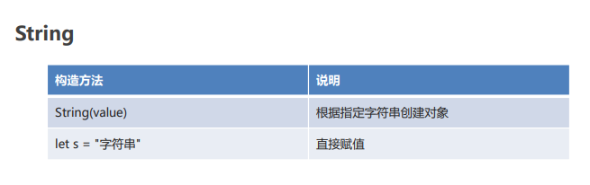

  - **成员方法**

    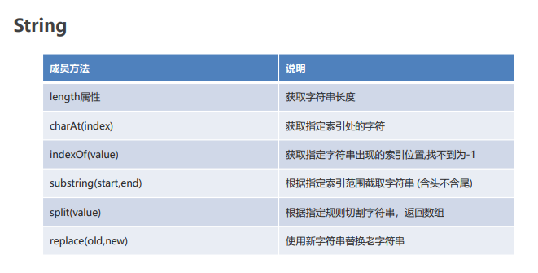

- **代码实现**

```html
<!DOCTYPE html>
<html lang="en">
<head>
    <meta charset="UTF-8">
    <meta name="viewport" content="width=device-width, initial-scale=1.0">
    <title>String</title>
</head>
<body>
    
</body>
<script>
    //1. 构造方法创建字符串对象
    let s1 = new String("hello");
    document.write(s1 + "<br>");

    //2. 直接赋值
    let s2 = "hello";
    document.write(s2 + "<br>");

    //属性
    //1. length   获取字符串的长度
    document.write(s2.length + "<br>");

    //成员方法
    //1. charAt(index)     获取指定索引处的字符
    document.write(s2.charAt(1) + "<br>");

    //2. indexOf(value)    获取指定字符串出现的索引位置
    document.write(s2.indexOf("l") + "<br>");

    //3. substring(start,end)   根据指定索引范围截取字符串(含头不含尾)
    document.write(s2.substring(2,4) + "<br>");

    //4. split(value)   根据指定规则切割字符串，返回数组
    let s3 = "张三,23,男";
    let arr = s3.split(",");
    for(let i = 0; i < arr.length; i++) {
        document.write(arr[i] + "<br>");
    }

    //5. replace(old,new)   使用新字符串替换老字符串
    let s4 = "你会不会跳伞啊？让我落地成盒。你妹的。";
    let s5 = s4.replace("你妹的","***");
    document.write(s5 + "<br>");
</script>
</html>
```

## 7.5、RegExp

正则表达式：是一种对字符串进行匹配的规则。

- **方法说明**

  - 构造方法&成员方法

    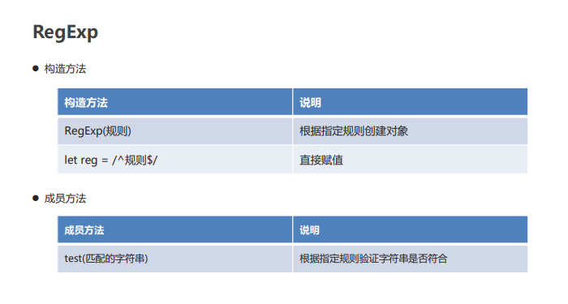

  - 规则

    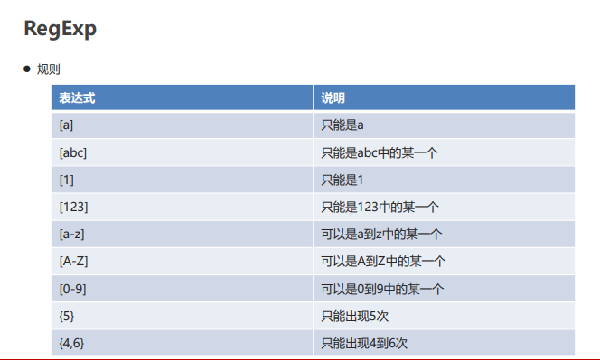

- **代码实现**

    ```html
    <!DOCTYPE html>
    <html lang="en">
    <head>
        <meta charset="UTF-8">
        <meta name="viewport" content="width=device-width, initial-scale=1.0">
        <title>RegExp</title>
    </head>
    <body>
        
    </body>
    <script>
        //1.验证手机号
        //规则：第一位1，第二位358，第三到十一位必须是数字。总长度11
        let reg1 = /^[1][358][0-9]{9}$/;
        document.write(reg1.test("18688888888") + "<br>");

        //2.验证用户名
        //规则：字母、数字、下划线组成。总长度4~16
        let reg2 = /^[a-zA-Z_0-9]{4,16}$/;
        document.write(reg2.test("zhang_san123"));
    </script>
    </html>
    ```

## 7.6、Array

- **成员方法**

    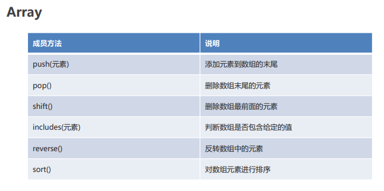

- **代码实现**

    ```html
    <!DOCTYPE html>
    <html lang="en">
    <head>
        <meta charset="UTF-8">
        <meta name="viewport" content="width=device-width, initial-scale=1.0">
        <title>Array</title>
    </head>
    <body>
        
    </body>
    <script>

        let arr = [1,2,3,4,5];

        //1. push(元素)    添加元素到数组的末尾
        arr.push(6);
        document.write(arr + "<br>");

        //2. pop()         删除数组末尾的元素
        arr.pop();
        document.write(arr + "<br>");

        //3. shift()       删除数组最前面的元素
        arr.shift();
        document.write(arr + "<br>");

        //4. includes(元素)  判断数组中是否包含指定的元素
        document.write(arr.includes(2) + "<br>");

        //5. reverse()      反转数组元素
        arr.reverse();
        document.write(arr + "<br>");

        //6. sort()         对数组元素排序
        arr.sort();
        document.write(arr + "<br>");

    </script>
    </html>
    ```

## 7.7、Set

JavaScript 中的 Set 集合，元素唯一，存取顺序一致。

- **方法说明**

    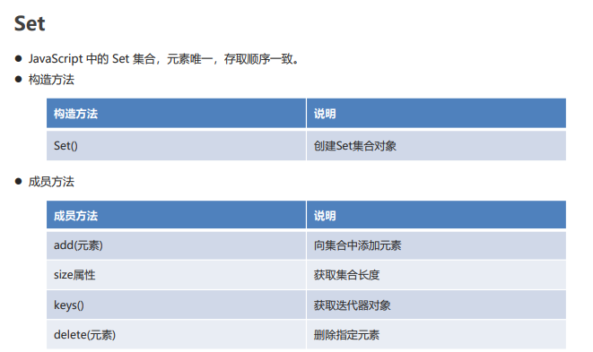

- **代码实现**

    ```html
    <!DOCTYPE html>
    <html lang="en">
    <head>
        <meta charset="UTF-8">
        <meta name="viewport" content="width=device-width, initial-scale=1.0">
        <title>Set</title>
    </head>
    <body>
        
    </body>
    <script>
        // Set()   创建集合对象
        let s = new Set();

        // add(元素)   添加元素
        s.add("a");
        s.add("b");
        s.add("c");
        s.add("c");

        // size属性    获取集合的长度
        document.write(s.size + "<br>");    // 3

        // keys()      获取迭代器对象
        let st = s.keys();
        for(let i = 0; i < s.size; i++){
            document.write(st.next().value + "<br>");
        }

        // delete(元素) 删除指定元素
        document.write(s.delete("c") + "<br>");
        let st2 = s.keys();
        for(let i = 0; i < s.size; i++){
            document.write(st2.next().value + "<br>");
        }
    </script>
    </html>
    ```

## 7.8、Map

JavaScript 中的 Map 集合，key 唯一，存取顺序一致。

- **方法说明**

    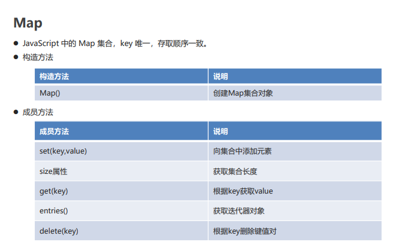

- **代码实现**

    ```html
    <!DOCTYPE html>
    <html lang="en">
    <head>
        <meta charset="UTF-8">
        <meta name="viewport" content="width=device-width, initial-scale=1.0">
        <title>Map</title>
    </head>
    <body>
        
    </body>
    <script>
        // Map()   创建Map集合对象
        let map = new Map();

        // set(key,value)  添加元素
        map.set("张三",23);
        map.set("李四",24);
        map.set("李四",25);

        // size属性     获取集合的长度
        document.write(map.size + "<br>");

        // get(key)     根据key获取value
        document.write(map.get("李四") + "<br>");

        // entries()    获取迭代器对象
        let et = map.entries();
        for(let i = 0; i < map.size; i++){
            document.write(et.next().value + "<br>");
        }

        // delete(key)  根据key删除键值对
        document.write(map.delete("李四") + "<br>");
        let et2 = map.entries();
        for(let i = 0; i < map.size; i++){
            document.write(et2.next().value + "<br>");
        }
    </script>
    </html>
    ```

## 7.9、Json

- JSON(JavaScript Object Notation)：是一种轻量级的数据交换格式。
  - 它是基于 ECMAScript 规范的一个子集，采用完全独立于编程语言的文本格式来存储和表示数据。
  - 简洁和清晰的层次结构使得 JSON 成为理想的数据交换语言。易于人阅读和编写，同时也易于计算机解析和 生成，并有效的提升网络传输效率。

  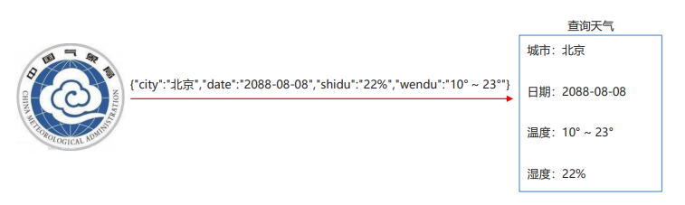

- **方法说明**

    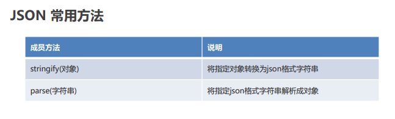

- **代码实现**

    ```html
    <!DOCTYPE html>
    <html lang="en">
    <head>
        <meta charset="UTF-8">
        <meta name="viewport" content="width=device-width, initial-scale=1.0">
        <title>JSON</title>
    </head>
    <body>
        
    </body>
    <script>
        //定义天气对象
        let weather = {
            city : "北京",
            date : "2088-08-08",
            wendu : "10° ~ 23°",
            shidu : "22%"
        };

        //1.将天气对象转换为JSON格式的字符串
        let str = JSON.stringify(weather);
        document.write(str + "<br>");

        //2.将JSON格式字符串解析成JS对象
        let weather2 = JSON.parse(str);
        document.write("城市：" + weather2.city + "<br>");
        document.write("日期：" + weather2.date + "<br>");
        document.write("温度：" + weather2.wendu + "<br>");
        document.write("湿度：" + weather2.shidu + "<br>");
    </script>
    </html>
    ```

## 7.10、表单校验

- **案例说明**

    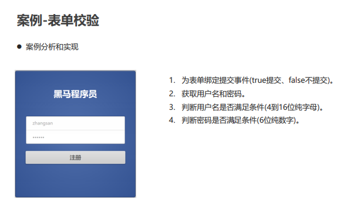

- **代码实现**

    ```html
    <!DOCTYPE html>
    <html lang="en">
    <head>
        <meta charset="UTF-8">
        <meta name="viewport" content="width=device-width, initial-scale=1.0">
        <title>表单校验</title>
        <link rel="stylesheet" href="css/style.css"></link>
    </head>
    <body>
        <div class="login-form-wrap">
            <h1>黑马程序员</h1>
            <form class="login-form" action="#" id="regist" method="get" autocomplete="off">
                <label>
                    <input type="text" id="username" name="username" placeholder="Username..." value="">
                </label>
                <label>
                    <input type="password" id="password" name="password" placeholder="Password..." value="">
                </label>
                <input type="submit" value="注册">
            </form>
        </div>
    </body>
    <script>
        //1.为表单绑定提交事件
        document.getElementById("regist").onsubmit = function() {
            //2.获取填写的用户名和密码
            let username = document.getElementById("username").value;
            let password = document.getElementById("password").value;

            //3.判断用户名是否符合规则  4~16位纯字母
            let reg1 = /^[a-zA-Z]{4,16}$/;
            if(!reg1.test(username)) {
                alert("用户名不符合规则，请输入4到16位的纯字母！");
                return false;
            }

            //4.判断密码是否符合规则  6位纯数字
            let reg2 = /^[\d]{6}$/;
            if(!reg2.test(password)) {
                alert("密码不符合规则，请输入6位纯数字的密码！");
                return false;
            }

            //5.如果所有条件都不满足，则提交表单
            return true;
        }
        
    </script>
    </html>
    ```

## 7.11、小结

- 内置对象是 JavaScript 提供的带有属性和方法的特殊数据类型。
- 数字日期 Number Math Date 
- 字符串 String RegExp 
- 数组集合 Array Set Map 
- 结构化数据 JSON

# 8、JavaScript BOM

- BOM(Browser Object Model)：浏览器对象模型。
- 将浏览器的各个组成部分封装成不同的对象，方便我们进行操作。

    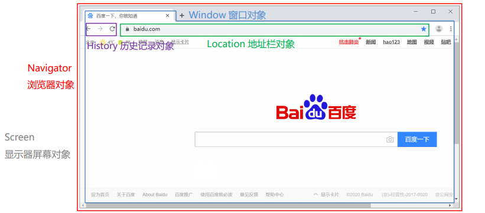

## 8.1、Windows窗口对象

- **定时器**
  - `唯一标识 setTimeout(功能, 毫秒值)`：设置一次性定时器。
  - `clearTimeout(标识)`：取消一次性定时器。
  - `唯一标识 setInterval(功能, 毫秒值)`：设置循环定时器。
  - `clearInterval(标识)`：取消循环定时器。
- **加载事件**
  - `window.onload`：在页面加载完毕后触发此事件的功能。
- **代码实现**

    ```html
    <!DOCTYPE html>
    <html lang="en">
    <head>
        <meta charset="UTF-8">
        <meta name="viewport" content="width=device-width, initial-scale=1.0">
        <title>window窗口对象</title>
        <script>
            //一、定时器
            function fun(){
                alert("该起床了！");
            }
        
            //设置一次性定时器
            //let d1 = setTimeout("fun()",3000);
            //取消一次性定时器
            //clearTimeout(d1);
        
            //设置循环定时器
            //let d2 = setInterval("fun()",3000);
            //取消循环定时器
            //clearInterval(d2);
        
            //加载事件
            window.onload = function(){
                let div = document.getElementById("div");
                alert(div);
            }
        </script>
    </head>
    <body>
        <div id="div">dddd</div>
    </body>
    <!-- <script>
        //一、定时器
        function fun(){
            alert("该起床了！");
        }

        //设置一次性定时器
        //let d1 = setTimeout("fun()",3000);
        //取消一次性定时器
        //clearTimeout(d1);

        //设置循环定时器
        //let d2 = setInterval("fun()",3000);
        //取消循环定时器
        //clearInterval(d2);

        //加载事件
        let div = document.getElementById("div");
        alert(div);
    </script> -->
    </html>
    ```

## 8.2、Location地址栏对象

- **href 属性**

  就是浏览器的地址栏。我们可以通过为该属性设置新的 URL，使浏览器读取并显示新的 URL 的内容。

  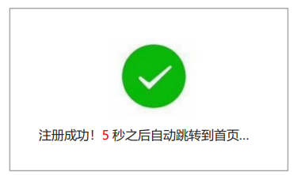

- **代码实现**

    ```html
    <!DOCTYPE html>
    <html lang="en">
    <head>
        <meta charset="UTF-8">
        <meta name="viewport" content="width=device-width, initial-scale=1.0">
        <title>location地址栏对象</title>
        <style>
            p{
                text-align: center;
            }
            span{
                color: red;
            }
        </style>
    </head>
    <body>
        <p>
            注册成功！<span id="time">5</span>秒之后自动跳转到首页...
        </p>
    </body>
    <script>
        //1.定义方法。改变秒数，跳转页面
        let num = 5;
        function showTime() {
            num--;

            if(num <= 0) {
                //跳转首页
                location.href = "index.html";
            }

            let span = document.getElementById("time");
            span.innerHTML = num;
        }

        //2.设置循环定时器，每1秒钟执行showTime方法
        setInterval("showTime()",1000);
    </script>
    </html>
    ```

## 8.3、案例-动态广告

- **案例分析和实现**

```html
<!-- 广告图片 -->

```

- **在 css 样式中，display 属性可以控制元素是否显示**

```css
style="display: none;"
```

- **设置定时器，3 秒后显示广告图片**

```js
//1.设置定时器，3秒后显示广告图片
setTimeout(function(){
    let img = document.getElementById("ad_big");
    img.style.display = "block";
},3000);
```

- **设置定时器，3 秒后隐藏广告图片**

```js
//2.设置定时器，3秒后隐藏广告图片
setTimeout(function(){
    let img = document.getElementById("ad_big");
    img.style.display = "none";
},6000);
```

## 8.4、小结

- **BOM(Browser Object Model)：** 浏览器对象模型。
- **将浏览器的各个组成部分封装成不同的对象，方便我们进行操作。**
  - Window：窗口对象 
  - Location：地址栏对象 
  - Navigator：浏览器对象 
  - History：当前窗口历史记录对象 
  - Screen：显示器屏幕对象 
- **Window 窗口对象**
  - setTimeout()、clearTimeout()：一次性定时器
  - setInterval()、clearInterval()：循环定时器
  - onload 事件：页面加载完毕触发执行功能
- **Location 地址栏对象 href 属性：跳转到指定的 URL 地址**

# 9、JavaScript封装

**封装思想**

- **封装：** 将复杂的操作进行封装隐藏，对外提供更加简单的操作。

- **获取元素的方法**

  - `document.getElementById(id值)`：根据 id 值获取**元素**
  - `document.getElementsByName(name值)`：根据 name 属性值获取**元素列表**
  - `document.getElementsByTagName(标签名)`：根据标签名获取**元素列表**

- **代码实现**

  ```html
  <!DOCTYPE html>
  <html lang="en">
  <head>
      <meta charset="UTF-8">
      <meta name="viewport" content="width=device-width, initial-scale=1.0">
      <title>封装</title>
  </head>
  <body>
      <div id="div1">div1</div>
      <div name="div2">div2</div>
  </body>
  <script src="my.js"></script>
  <script>
      let div1 = getById("div1");
      alert(div1);
  
      // let div1 = document.getElementById("div1");
      // alert(div1);
  
      // let divs = document.getElementsByName("div2");
      // alert(divs.length);
  
      // let divs2 = document.getElementsByTagName("div");
      // alert(divs2.length);
  </script>
  </html>
  ```

  **js封装**

  ```js
  function getById(id){
      return document.getElementById(id);
  }
  
  function getByName(name) {
      return document.getElementsByName(name);
  }
  
  function getByTag(tag) {
      return document.getElementsByTagName(tag);
  }
  ```

