# 0. 学习目标

- 能够说出什么是消息中间件
- 能够安装RabbitMQ
- 能够编写RabbitMQ的入门程序
- 能够说出RabbitMQ的5种模式特征
- 能够使用Spring整合RabbitMQ


# 1. 消息中间件概述

## 1.1. 什么是消息中间件

MQ全称为Message Queue，消息队列是应用程序和应用程序之间的通信方法。

 

- 为什么使用MQ

  在项目中，可将一些无需即时返回且耗时的操作提取出来，进行**异步处理**，而这种异步处理的方式大大的节省了服务器的请求响应时间，从而**提高**了**系统**的**吞吐量**。

  

- 开发中消息队列通常有如下应用场景：
  
  1、任务**异步**处理
  
  将不需要同步处理的并且耗时长的操作由消息队列通知消息接收方进行异步处理。提高了应用程序的响应时间。
  
  2、应用程序**解耦合**
  
  MQ相当于一个中介，生产方通过MQ与消费方交互，它将应用程序进行解耦合。
  
  3、**削峰填谷**
  
  如订单系统，在下单的时候就会往数据库写数据。但是数据库只能支撑每秒1000左右的并发写入，并发量再高就容易宕机。低峰期的时候并发也就100多个，但是在高峰期时候，并发量会突然激增到5000以上，这个时候数据库肯定卡死了。
  
  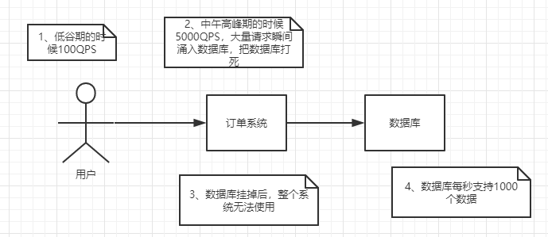
  
  消息被MQ保存起来了，然后系统就可以按照自己的消费能力来消费，比如每秒1000个数据，这样慢慢写入数据库，这样就不会卡死数据库了。
  
  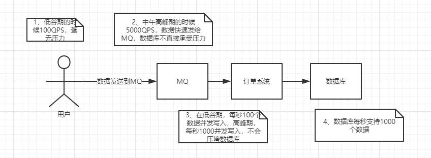
  
  但是使用了MQ之后，限制消费消息的速度为1000，但是这样一来，高峰期产生的数据势必会被积压在MQ中，高峰就被“削”掉了。但是因为消息积压，在高峰期过后的一段时间内，消费消息的速度还是会维持在1000QPS，直到消费完积压的消息,这就叫做“填谷”
  
  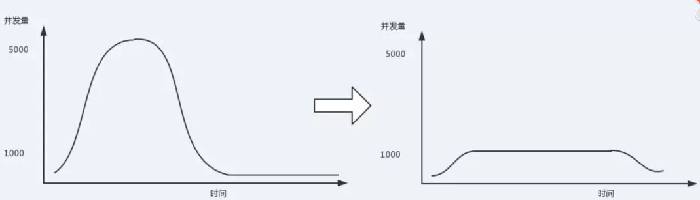


## 1.2. AMQP 和 JMS

MQ是消息通信的模型；实现MQ的大致有两种主流方式：AMQP、JMS。

### 1.2.1. AMQP

AMQP是一种协议，更准确的说是一种binary wire-level protocol（链接协议）。这是其和JMS的本质差别，AMQP不从API层进行限定，而是直接定义网络交换的数据格式。


### 1.2.2. JMS

JMS即Java消息服务（JavaMessage Service）应用程序接口，是一个Java平台中关于面向消息中间件（MOM）的API，用于在两个应用程序之间，或分布式系统中发送消息，进行异步通信。


### 1.2.3. AMQP 与 JMS 区别

- JMS是定义了统一的接口，来对消息操作进行统一；AMQP是通过规定协议来统一数据交互的格式
- JMS限定了必须使用Java语言；AMQP只是协议，不规定实现方式，因此是跨语言的。
- JMS规定了两种消息模式；而AMQP的消息模式更加丰富


## 1.3. 消息队列产品

市场上常见的消息队列有如下：

- ActiveMQ：基于JMS
- ZeroMQ：基于C语言开发
- RabbitMQ：基于AMQP协议，erlang语言开发，稳定性好
- RocketMQ：基于JMS，阿里巴巴产品
- Kafka：类似MQ的产品；分布式消息系统，高吞吐量


## 1.4. RabbitMQ

RabbitMQ是由erlang语言开发，基于AMQP（Advanced Message Queue 高级消息队列协议）协议实现的消息队列，它是一种应用程序之间的通信方法，消息队列在分布式系统开发中应用非常广泛。

RabbitMQ官方地址：http://www.rabbitmq.com/


RabbitMQ提供了6种模式：简单模式，work模式，Publish/Subscribe发布与订阅模式，Routing路由模式，Topics主题模式，RPC远程调用模式（远程调用，不太算MQ；暂不作介绍）；

官网对应模式介绍：https://www.rabbitmq.com/getstarted.html


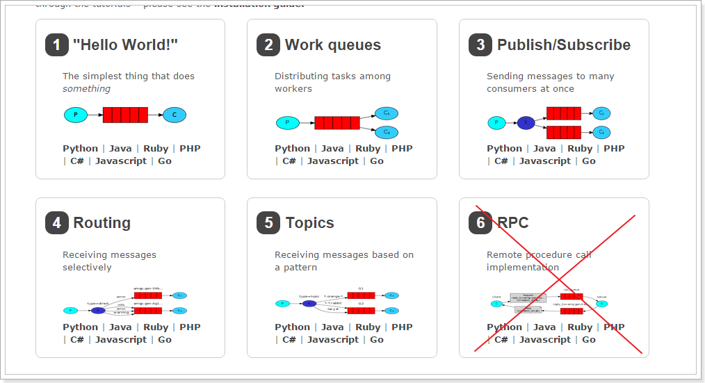


# 2. 安装及配置RabbitMQ

详细查看 `资料/软件/安装RabbitMQ.md` 文档。


# 3. RabbitMQ入门

## 3.1. 搭建示例工程

### 3.1.1. 创建工程

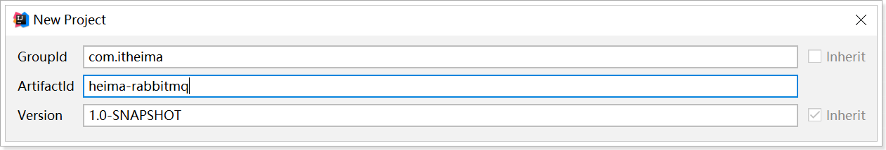


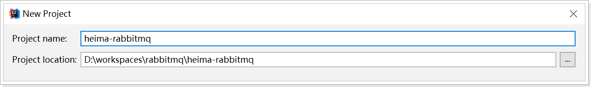

### 3.1.2. 添加依赖

往heima-rabbitmq的pom.xml文件中添加如下依赖：

```xml
        <dependency>
            <groupId>com.rabbitmq</groupId>
            <artifactId>amqp-client</artifactId>
            <version>5.6.0</version>
        </dependency>
```


## 3.2. 编写生产者

编写消息生产者com.itheima.rabbitmq.simple.Producer

```java
package com.itheima.rabbitmq.simple;

import com.rabbitmq.client.Channel;
import com.rabbitmq.client.Connection;
import com.rabbitmq.client.ConnectionFactory;

public class Producer {

    static final String QUEUE_NAME = "simple_queue";

    public static void main(String[] args) throws Exception {
        //创建连接工厂
        ConnectionFactory connectionFactory = new ConnectionFactory();
        //主机地址;默认为 localhost
        connectionFactory.setHost("localhost");
        //连接端口;默认为 5672
        connectionFactory.setPort(5672);
        //虚拟主机名称;默认为 /
        connectionFactory.setVirtualHost("/itcast");
        //连接用户名；默认为guest
        connectionFactory.setUsername("heima");
        //连接密码；默认为guest
        connectionFactory.setPassword("heima");

        //创建连接
        Connection connection = connectionFactory.newConnection();

        // 创建频道
        Channel channel = connection.createChannel();

        // 声明（创建）队列
        /**
         * 参数1：队列名称
         * 参数2：是否定义持久化队列
         * 参数3：是否独占本次连接
         * 参数4：是否在不使用的时候自动删除队列
         * 参数5：队列其它参数
         */
        channel.queueDeclare(QUEUE_NAME, true, false, false, null);

        // 要发送的信息
        String message = "你好；小兔子！";
        /**
         * 参数1：交换机名称，如果没有指定则使用默认Default Exchage
         * 参数2：路由key,简单模式可以传递队列名称
         * 参数3：消息其它属性
         * 参数4：消息内容
         */
        channel.basicPublish("", QUEUE_NAME, null, message.getBytes());
        System.out.println("已发送消息：" + message);

        // 关闭资源
        channel.close();
        connection.close();
    }
}

```


在执行上述的消息发送之后；可以登录rabbitMQ的管理控制台，可以发现队列和其消息：

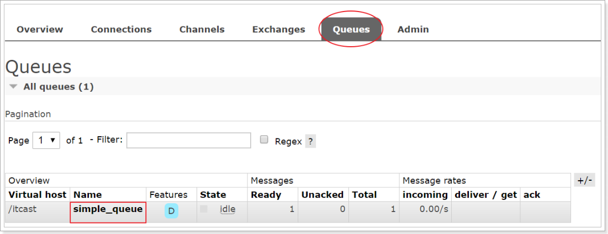


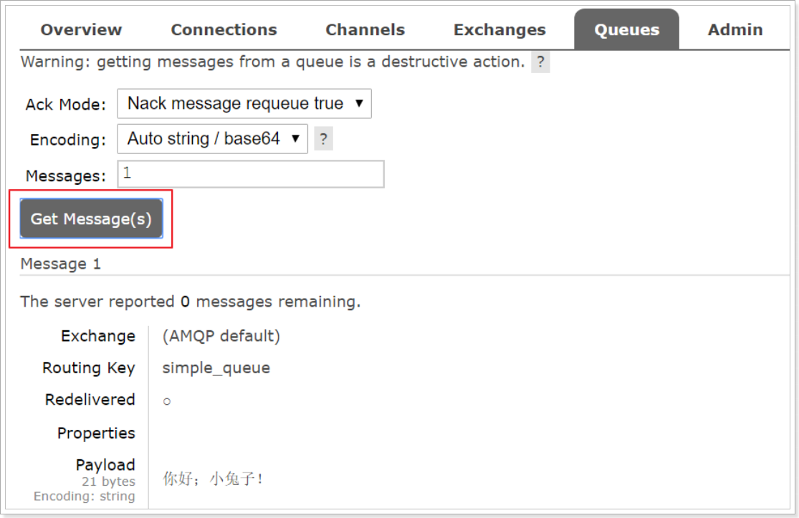

## 3.3. 编写消费者

抽取创建connection的工具类com.itheima.rabbitmq.util.ConnectionUtil；

```java
package com.itheima.rabbitmq.util;

import com.rabbitmq.client.Connection;
import com.rabbitmq.client.ConnectionFactory;

public class ConnectionUtil {

    public static Connection getConnection() throws Exception {
        //创建连接工厂
        ConnectionFactory connectionFactory = new ConnectionFactory();
        //主机地址;默认为 localhost
        connectionFactory.setHost("localhost");
        //连接端口;默认为 5672
        connectionFactory.setPort(5672);
        //虚拟主机名称;默认为 /
        connectionFactory.setVirtualHost("/itcast");
        //连接用户名；默认为guest
        connectionFactory.setUsername("heima");
        //连接密码；默认为guest
        connectionFactory.setPassword("heima");

        //创建连接
        return connectionFactory.newConnection();
    }

}

```


编写消息的消费者com.itheima.rabbitmq.simple.Consumer

```java
package com.itheima.rabbitmq.simple;

import com.itheima.rabbitmq.util.ConnectionUtil;
import com.rabbitmq.client.*;

import java.io.IOException;

public class Consumer {

    public static void main(String[] args) throws Exception {
        Connection connection = ConnectionUtil.getConnection();

        // 创建频道
        Channel channel = connection.createChannel();

        // 声明（创建）队列
        /**
         * 参数1：队列名称
         * 参数2：是否定义持久化队列
         * 参数3：是否独占本次连接
         * 参数4：是否在不使用的时候自动删除队列
         * 参数5：队列其它参数
         */
        channel.queueDeclare(Producer.QUEUE_NAME, true, false, false, null);

        //创建消费者；并设置消息处理
        DefaultConsumer consumer = new DefaultConsumer(channel){
            @Override
            /**
             * consumerTag 消息者标签，在channel.basicConsume时候可以指定
             * envelope 消息包的内容，可从中获取消息id，消息routingkey，交换机，消息和重传标志(收到消息失败后是否需要重新发送)
             * properties 属性信息
             * body 消息
             */
            public void handleDelivery(String consumerTag, Envelope envelope, AMQP.BasicProperties properties, byte[] body) throws IOException {
                //路由key
                System.out.println("路由key为：" + envelope.getRoutingKey());
                //交换机
                System.out.println("交换机为：" + envelope.getExchange());
                //消息id
                System.out.println("消息id为：" + envelope.getDeliveryTag());
                //收到的消息
                System.out.println("接收到的消息为：" + new String(body, "utf-8"));
            }
        };
        //监听消息
        /**
         * 参数1：队列名称
         * 参数2：是否自动确认，设置为true为表示消息接收到自动向mq回复接收到了，mq接收到回复会删除消息，设置为false则需要手动确认
         * 参数3：消息接收到后回调
         */
        channel.basicConsume(Producer.QUEUE_NAME, true, consumer);

        //不关闭资源，应该一直监听消息
        //channel.close();
        //connection.close();
    }
}
```


## 3.4. 小结

上述的入门案例中中其实使用的是如下的简单模式：


在上图的模型中，有以下概念：

- P：生产者，也就是要发送消息的程序
- C：消费者：消息的接受者，会一直等待消息到来。
- queue：消息队列，图中红色部分。类似一个邮箱，可以缓存消息；生产者向其中投递消息，消费者从其中取出消息。


# 4. AMQP

## 4.1. 相关概念介绍

AMQP  一个提供统一消息服务的应用层标准高级消息队列协议，是应用层协议的一个开放标准，为面向消息的中间件设计。

AMQP是一个二进制协议，拥有一些现代化特点：多信道、协商式，异步，安全，扩平台，中立，高效。

RabbitMQ是AMQP协议的Erlang的实现。

| 概念           | 说明                                                         |
| -------------- | ------------------------------------------------------------ |
| 连接Connection | 一个网络连接，比如TCP/IP套接字连接。                         |
| 会话Session    | 端点之间的命名对话。在一个会话上下文中，保证“恰好传递一次”。 |
| 信道Channel    | 多路复用连接中的一条独立的双向数据流通道。为会话提供物理传输介质。 |
| 客户端Client   | AMQP连接或者会话的发起者。AMQP是非对称的，客户端生产和消费消息，服务器存储和路由这些消息。 |
| 服务节点Broker | 消息中间件的服务节点；一般情况下可以将一个RabbitMQ Broker看作一台RabbitMQ 服务器。 |
| 端点           | AMQP对话的任意一方。一个AMQP连接包括两个端点（一个是客户端，一个是服务器）。 |
| 消费者Consumer | 一个从消息队列里请求消息的客户端程序。                       |
| 生产者Producer | 一个向交换机发布消息的客户端应用程序。                       |

## 4.2. RabbitMQ运转流程

在入门案例中：

- 生产者发送消息
  1. 生产者创建连接（Connection），开启一个信道（Channel），连接到RabbitMQ Broker；
  2. 声明队列并设置属性；如是否排它，是否持久化，是否自动删除；
  3. 将路由键（空字符串）与队列绑定起来；
  4. 发送消息至RabbitMQ Broker；
  5. 关闭信道；
  6. 关闭连接；
- 消费者接收消息
  1. 消费者创建连接（Connection），开启一个信道（Channel），连接到RabbitMQ Broker
  2. 向Broker 请求消费相应队列中的消息，设置相应的回调函数；
  3. 等待Broker回应闭关投递响应队列中的消息，消费者接收消息；
  4. 确认（ack，自动确认）接收到的消息；
  5. RabbitMQ从队列中删除相应已经被确认的消息；
  6. 关闭信道；
  7. 关闭连接；

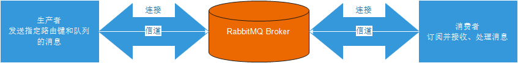


## 4.3. 生产者流转过程说明

1. 客户端与代理服务器Broker建立连接。会调用newConnection() 方法,这个方法会进一步封装Protocol Header 0-9-1 的报文头发送给Broker ，以此通知Broker 本次交互采用的是AMQPO-9-1 协议，紧接着Broker 返回Connection.Start 来建立连接，在连接的过程中涉及Connection.Start/.Start-OK 、Connection.Tune/.Tune-Ok ，Connection.Open/ .Open-Ok 这6 个命令的交互。
2. 客户端调用connection.createChannel方法。此方法开启信道，其包装的channel.open命令发送给Broker,等待channel.basicPublish方法，对应的AMQP命令为Basic.Publish,这个命令包含了content Header 和content Body()。content Header 包含了消息体的属性，例如:投递模式，优先级等，content Body 包含了消息体本身。
3. 客户端发送完消息需要关闭资源时，涉及到Channel.Close和Channl.Close-Ok 与Connetion.Close和Connection.Close-Ok的命令交互。

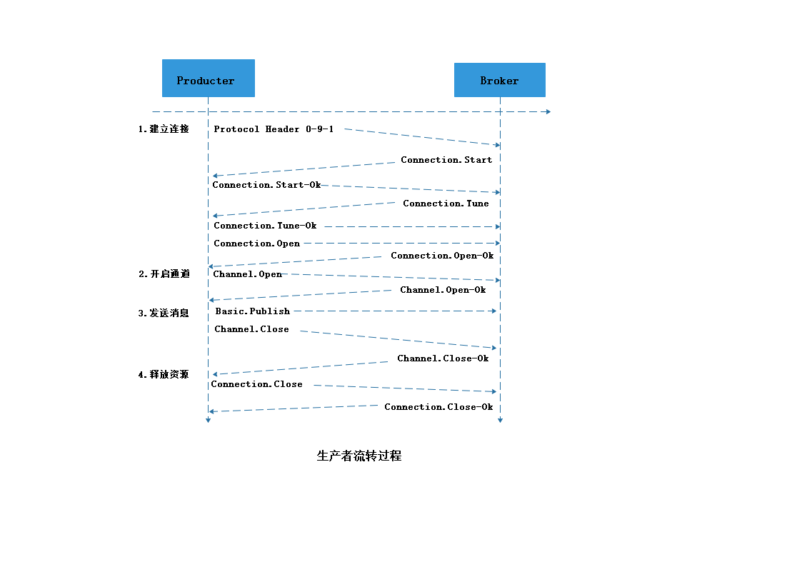

## 4.4. 消费者流转过程说明

1. 消费者客户端与代理服务器Broker建立连接。会调用newConnection() 方法,这个方法会进一步封装Protocol Header 0-9-1 的报文头发送给Broker ，以此通知Broker 本次交互采用的是AMQPO-9-1 协议，紧接着Broker 返回Connection.Start 来建立连接，在连接的过程中涉及Connection.Start/.Start-OK 、Connection.Tune/.Tune-Ok ，Connection.Open/ .Open-Ok 这6 个命令的交互。
2. 消费者客户端调用connection.createChannel方法。和生产者客户端一样，协议涉及Channel . Open/Open-Ok命令。
3. 在真正消费之前，消费者客户端需要向Broker 发送Basic.Consume 命令(即调用channel.basicConsume 方法〉将Channel 置为接收模式，之后Broker 回执Basic . Consume - Ok 以告诉消费者客户端准备好消费消息。
4. Broker 向消费者客户端推送(Push) 消息，即Basic.Deliver 命令，这个命令和Basic.Publish 命令一样会携带Content Header 和Content Body。
5. 消费者接收到消息并正确消费之后，向Broker 发送确认，即Basic.Ack 命令。
6. 客户端发送完消息需要关闭资源时，涉及到Channel.Close和Channl.Close-Ok 与Connetion.Close和Connection.Close-Ok的命令交互。

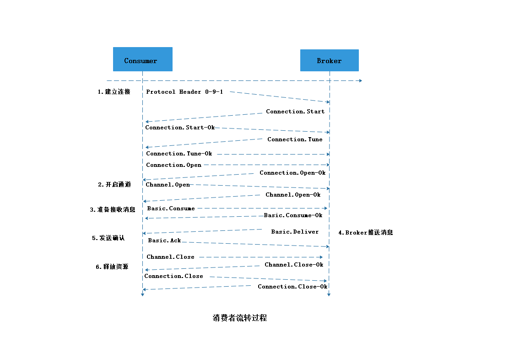


# 5. RabbitMQ工作模式

## 4.1. Work queues工作队列模式

### 4.1.1. 模式说明

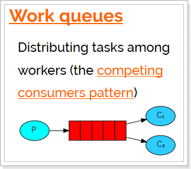

`Work Queues`与入门程序的`简单模式`相比，多了一个或一些消费端，多个消费端共同消费同一个队列中的消息。

**应用场景**：对于 任务过重或任务较多情况使用工作队列可以提高任务处理的速度。

### 4.1.2. 代码

`Work Queues`与入门程序的`简单模式`的代码是几乎一样的；可以完全复制，并复制多一个消费者进行多个消费者同时消费消息的测试。

#### 1）生产者

```java
package com.itheima.rabbitmq.work;

import com.itheima.rabbitmq.util.ConnectionUtil;
import com.rabbitmq.client.Channel;
import com.rabbitmq.client.Connection;
import com.rabbitmq.client.ConnectionFactory;

public class Producer {

    static final String QUEUE_NAME = "work_queue";

    public static void main(String[] args) throws Exception {

        //创建连接
        Connection connection = ConnectionUtil.getConnection();

        // 创建频道
        Channel channel = connection.createChannel();

        // 声明（创建）队列
        /**
         * 参数1：队列名称
         * 参数2：是否定义持久化队列
         * 参数3：是否独占本次连接
         * 参数4：是否在不使用的时候自动删除队列
         * 参数5：队列其它参数
         */
        channel.queueDeclare(QUEUE_NAME, true, false, false, null);

        for (int i = 1; i <= 30; i++) {
            // 发送信息
            String message = "你好；小兔子！work模式--" + i;
            /**
             * 参数1：交换机名称，如果没有指定则使用默认Default Exchage
             * 参数2：路由key,简单模式可以传递队列名称
             * 参数3：消息其它属性
             * 参数4：消息内容
             */
            channel.basicPublish("", QUEUE_NAME, null, message.getBytes());
            System.out.println("已发送消息：" + message);
        }

        // 关闭资源
        channel.close();
        connection.close();
    }
}

```

#### 2）消费者1

```java
package com.itheima.rabbitmq.work;

import com.itheima.rabbitmq.util.ConnectionUtil;
import com.rabbitmq.client.*;

import java.io.IOException;

public class Consumer1 {

    public static void main(String[] args) throws Exception {
        Connection connection = ConnectionUtil.getConnection();

        // 创建频道
        Channel channel = connection.createChannel();

        // 声明（创建）队列
        /**
         * 参数1：队列名称
         * 参数2：是否定义持久化队列
         * 参数3：是否独占本次连接
         * 参数4：是否在不使用的时候自动删除队列
         * 参数5：队列其它参数
         */
        channel.queueDeclare(Producer.QUEUE_NAME, true, false, false, null);

        //一次只能接收并处理一个消息
        channel.basicQos(1);

        //创建消费者；并设置消息处理
        DefaultConsumer consumer = new DefaultConsumer(channel){
            @Override
            /**
             * consumerTag 消息者标签，在channel.basicConsume时候可以指定
             * envelope 消息包的内容，可从中获取消息id，消息routingkey，交换机，消息和重传标志(收到消息失败后是否需要重新发送)
             * properties 属性信息
             * body 消息
             */
            public void handleDelivery(String consumerTag, Envelope envelope, AMQP.BasicProperties properties, byte[] body) throws IOException {
                try {
                    //路由key
                    System.out.println("路由key为：" + envelope.getRoutingKey());
                    //交换机
                    System.out.println("交换机为：" + envelope.getExchange());
                    //消息id
                    System.out.println("消息id为：" + envelope.getDeliveryTag());
                    //收到的消息
                    System.out.println("消费者1-接收到的消息为：" + new String(body, "utf-8"));
                    Thread.sleep(1000);

                    //确认消息
                    channel.basicAck(envelope.getDeliveryTag(), false);
                } catch (InterruptedException e) {
                    e.printStackTrace();
                }
            }
        };
        //监听消息
        /**
         * 参数1：队列名称
         * 参数2：是否自动确认，设置为true为表示消息接收到自动向mq回复接收到了，mq接收到回复会删除消息，设置为false则需要手动确认
         * 参数3：消息接收到后回调
         */
        channel.basicConsume(Producer.QUEUE_NAME, false, consumer);
    }
}
```

#### 3）消费者2

```java
package com.itheima.rabbitmq.work;

import com.itheima.rabbitmq.util.ConnectionUtil;
import com.rabbitmq.client.*;

import java.io.IOException;

public class Consumer2 {

    public static void main(String[] args) throws Exception {
        Connection connection = ConnectionUtil.getConnection();

        // 创建频道
        Channel channel = connection.createChannel();

        // 声明（创建）队列
        /**
         * 参数1：队列名称
         * 参数2：是否定义持久化队列
         * 参数3：是否独占本次连接
         * 参数4：是否在不使用的时候自动删除队列
         * 参数5：队列其它参数
         */
        channel.queueDeclare(Producer.QUEUE_NAME, true, false, false, null);

        //一次只能接收并处理一个消息
        channel.basicQos(1);

        //创建消费者；并设置消息处理
        DefaultConsumer consumer = new DefaultConsumer(channel){
            @Override
            /**
             * consumerTag 消息者标签，在channel.basicConsume时候可以指定
             * envelope 消息包的内容，可从中获取消息id，消息routingkey，交换机，消息和重传标志(收到消息失败后是否需要重新发送)
             * properties 属性信息
             * body 消息
             */
            public void handleDelivery(String consumerTag, Envelope envelope, AMQP.BasicProperties properties, byte[] body) throws IOException {
                try {
                    //路由key
                    System.out.println("路由key为：" + envelope.getRoutingKey());
                    //交换机
                    System.out.println("交换机为：" + envelope.getExchange());
                    //消息id
                    System.out.println("消息id为：" + envelope.getDeliveryTag());
                    //收到的消息
                    System.out.println("消费者2-接收到的消息为：" + new String(body, "utf-8"));
                    Thread.sleep(1000);

                    //确认消息
                    channel.basicAck(envelope.getDeliveryTag(), false);
                } catch (InterruptedException e) {
                    e.printStackTrace();
                }
            }
        };
        //监听消息
        /**
         * 参数1：队列名称
         * 参数2：是否自动确认，设置为true为表示消息接收到自动向mq回复接收到了，mq接收到回复会删除消息，设置为false则需要手动确认
         * 参数3：消息接收到后回调
         */
        channel.basicConsume(Producer.QUEUE_NAME, false, consumer);
    }
}

```


### 4.1.3. 测试

启动两个消费者，然后再启动生产者发送消息；到IDEA的两个消费者对应的控制台查看是否竞争性的接收到消息。

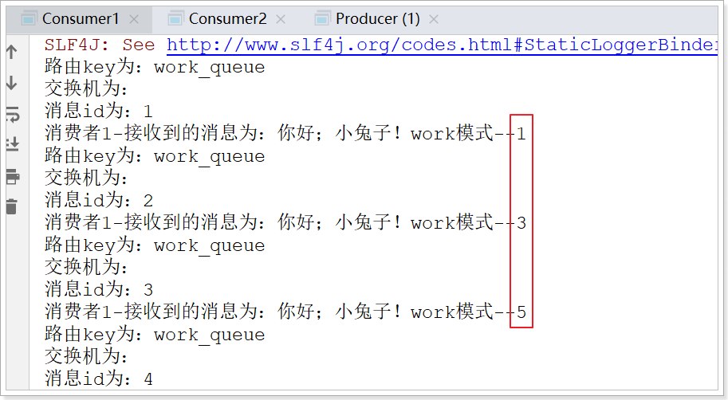


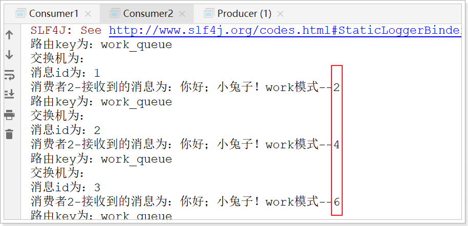

### 4.1.4. 小结

在一个队列中如果有多个消费者，那么消费者之间对于同一个消息的关系是**竞争**的关系。


## 4.2. 订阅模式类型

订阅模式示例图：

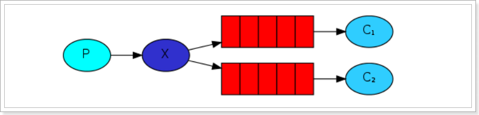

前面2个案例中，只有3个角色：

- P：生产者，也就是要发送消息的程序
- C：消费者：消息的接受者，会一直等待消息到来。
- queue：消息队列，图中红色部分


而在订阅模型中，多了一个exchange角色，而且过程略有变化：

- P：生产者，也就是要发送消息的程序，但是不再发送到队列中，而是发给X（交换机）
- C：消费者，消息的接受者，会一直等待消息到来。
- Queue：消息队列，接收消息、缓存消息。
- Exchange：交换机，图中的X。一方面，接收生产者发送的消息。另一方面，知道如何处理消息，例如递交给某个特别队列、递交给所有队列、或是将消息丢弃。到底如何操作，取决于Exchange的类型。Exchange有常见以下3种类型：
  - Fanout：广播，将消息交给所有绑定到交换机的队列
  - Direct：定向，把消息交给符合指定routing key 的队列
  - Topic：通配符，把消息交给符合routing pattern（路由模式） 的队列

**Exchange（交换机）只负责转发消息，不具备存储消息的能力**，因此如果没有任何队列与Exchange绑定，或者没有符合路由规则的队列，那么消息会丢失！


## 4.3. Publish/Subscribe发布与订阅模式

### 4.3.1. 模式说明

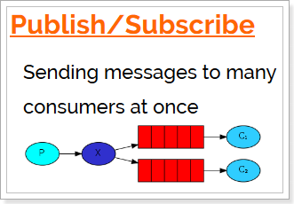

发布订阅模式：
1、每个消费者监听自己的队列。
2、生产者将消息发给broker，由交换机将消息转发到绑定此交换机的每个队列，每个绑定交换机的队列都将接收
到消息


### 4.3.2. 代码

#### 1）生产者

```java
package com.itheima.rabbitmq.ps;

import com.itheima.rabbitmq.util.ConnectionUtil;
import com.rabbitmq.client.BuiltinExchangeType;
import com.rabbitmq.client.Channel;
import com.rabbitmq.client.Connection;

/**
 * 发布与订阅使用的交换机类型为：fanout
 */
public class Producer {

    //交换机名称
    static final String FANOUT_EXCHAGE = "fanout_exchange";
    //队列名称
    static final String FANOUT_QUEUE_1 = "fanout_queue_1";
    //队列名称
    static final String FANOUT_QUEUE_2 = "fanout_queue_2";

    public static void main(String[] args) throws Exception {

        //创建连接
        Connection connection = ConnectionUtil.getConnection();

        // 创建频道
        Channel channel = connection.createChannel();

        /**
         * 声明交换机
         * 参数1：交换机名称
         * 参数2：交换机类型，fanout、topic、direct、headers
         */
        channel.exchangeDeclare(FANOUT_EXCHAGE, BuiltinExchangeType.FANOUT);

        // 声明（创建）队列
        /**
         * 参数1：队列名称
         * 参数2：是否定义持久化队列
         * 参数3：是否独占本次连接
         * 参数4：是否在不使用的时候自动删除队列
         * 参数5：队列其它参数
         */
        channel.queueDeclare(FANOUT_QUEUE_1, true, false, false, null);
        channel.queueDeclare(FANOUT_QUEUE_2, true, false, false, null);

        //队列绑定交换机
        channel.queueBind(FANOUT_QUEUE_1, FANOUT_EXCHAGE, "");
        channel.queueBind(FANOUT_QUEUE_2, FANOUT_EXCHAGE, "");

        for (int i = 1; i <= 10; i++) {
            // 发送信息
            String message = "你好；小兔子！发布订阅模式--" + i;
            /**
             * 参数1：交换机名称，如果没有指定则使用默认Default Exchage
             * 参数2：路由key,简单模式可以传递队列名称
             * 参数3：消息其它属性
             * 参数4：消息内容
             */
            channel.basicPublish(FANOUT_EXCHAGE, "", null, message.getBytes());
            System.out.println("已发送消息：" + message);
        }

        // 关闭资源
        channel.close();
        connection.close();
    }
}
```


#### 2）消费者1

```java
package com.itheima.rabbitmq.ps;

import com.itheima.rabbitmq.util.ConnectionUtil;
import com.rabbitmq.client.*;

import java.io.IOException;

public class Consumer1 {

    public static void main(String[] args) throws Exception {
        Connection connection = ConnectionUtil.getConnection();

        // 创建频道
        Channel channel = connection.createChannel();

        //声明交换机
        channel.exchangeDeclare(Producer.FANOUT_EXCHAGE, BuiltinExchangeType.FANOUT);

        // 声明（创建）队列
        /**
         * 参数1：队列名称
         * 参数2：是否定义持久化队列
         * 参数3：是否独占本次连接
         * 参数4：是否在不使用的时候自动删除队列
         * 参数5：队列其它参数
         */
        channel.queueDeclare(Producer.FANOUT_QUEUE_1, true, false, false, null);

        //队列绑定交换机
        channel.queueBind(Producer.FANOUT_QUEUE_1, Producer.FANOUT_EXCHAGE, "");

        //创建消费者；并设置消息处理
        DefaultConsumer consumer = new DefaultConsumer(channel){
            @Override
            /**
             * consumerTag 消息者标签，在channel.basicConsume时候可以指定
             * envelope 消息包的内容，可从中获取消息id，消息routingkey，交换机，消息和重传标志(收到消息失败后是否需要重新发送)
             * properties 属性信息
             * body 消息
             */
            public void handleDelivery(String consumerTag, Envelope envelope, AMQP.BasicProperties properties, byte[] body) throws IOException {
                //路由key
                System.out.println("路由key为：" + envelope.getRoutingKey());
                //交换机
                System.out.println("交换机为：" + envelope.getExchange());
                //消息id
                System.out.println("消息id为：" + envelope.getDeliveryTag());
                //收到的消息
                System.out.println("消费者1-接收到的消息为：" + new String(body, "utf-8"));
            }
        };
        //监听消息
        /**
         * 参数1：队列名称
         * 参数2：是否自动确认，设置为true为表示消息接收到自动向mq回复接收到了，mq接收到回复会删除消息，设置为false则需要手动确认
         * 参数3：消息接收到后回调
         */
        channel.basicConsume(Producer.FANOUT_QUEUE_1, true, consumer);
    }
}

```

#### 3）消费者2

```java
package com.itheima.rabbitmq.ps;

import com.itheima.rabbitmq.util.ConnectionUtil;
import com.rabbitmq.client.*;

import java.io.IOException;

public class Consumer2 {

    public static void main(String[] args) throws Exception {
        Connection connection = ConnectionUtil.getConnection();

        // 创建频道
        Channel channel = connection.createChannel();

        //声明交换机
        channel.exchangeDeclare(Producer.FANOUT_EXCHAGE, BuiltinExchangeType.FANOUT);

        // 声明（创建）队列
        /**
         * 参数1：队列名称
         * 参数2：是否定义持久化队列
         * 参数3：是否独占本次连接
         * 参数4：是否在不使用的时候自动删除队列
         * 参数5：队列其它参数
         */
        channel.queueDeclare(Producer.FANOUT_QUEUE_2, true, false, false, null);

        //队列绑定交换机
        channel.queueBind(Producer.FANOUT_QUEUE_2, Producer.FANOUT_EXCHAGE, "");

        //创建消费者；并设置消息处理
        DefaultConsumer consumer = new DefaultConsumer(channel){
            @Override
            /**
             * consumerTag 消息者标签，在channel.basicConsume时候可以指定
             * envelope 消息包的内容，可从中获取消息id，消息routingkey，交换机，消息和重传标志(收到消息失败后是否需要重新发送)
             * properties 属性信息
             * body 消息
             */
            public void handleDelivery(String consumerTag, Envelope envelope, AMQP.BasicProperties properties, byte[] body) throws IOException {
                //路由key
                System.out.println("路由key为：" + envelope.getRoutingKey());
                //交换机
                System.out.println("交换机为：" + envelope.getExchange());
                //消息id
                System.out.println("消息id为：" + envelope.getDeliveryTag());
                //收到的消息
                System.out.println("消费者2-接收到的消息为：" + new String(body, "utf-8"));
            }
        };
        //监听消息
        /**
         * 参数1：队列名称
         * 参数2：是否自动确认，设置为true为表示消息接收到自动向mq回复接收到了，mq接收到回复会删除消息，设置为false则需要手动确认
         * 参数3：消息接收到后回调
         */
        channel.basicConsume(Producer.FANOUT_QUEUE_2, true, consumer);
    }
}
```


### 4.3.3. 测试

启动所有消费者，然后使用生产者发送消息；在每个消费者对应的控制台可以查看到生产者发送的所有消息；到达**广播**的效果。

在执行完测试代码后，其实到RabbitMQ的管理后台找到`Exchanges`选项卡，点击 `fanout_exchange` 的交换机，可以查看到如下的绑定：

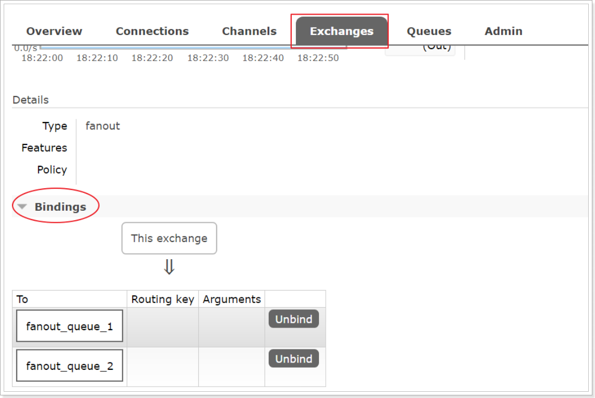

### 4.3.4. 小结

交换机需要与队列进行绑定，绑定之后；一个消息可以被多个消费者都收到。


**发布订阅模式与工作队列模式的区别**

1、工作队列模式不用定义交换机，而发布/订阅模式需要定义交换机。 

2、发布/订阅模式的生产方是面向交换机发送消息，工作队列模式的生产方是面向队列发送消息(底层使用默认交换机)。

3、发布/订阅模式需要设置队列和交换机的绑定，工作队列模式不需要设置，实际上工作队列模式会将队列绑 定到默认的交换机 。

## 4.4. Routing路由模式

### 4.4.1. 模式说明

路由模式特点：

- 队列与交换机的绑定，不能是任意绑定了，而是要指定一个`RoutingKey`（路由key）
- 消息的发送方在 向 Exchange发送消息时，也必须指定消息的 `RoutingKey`。
- Exchange不再把消息交给每一个绑定的队列，而是根据消息的`Routing Key`进行判断，只有队列的`Routingkey`与消息的 `Routing key`完全一致，才会接收到消息

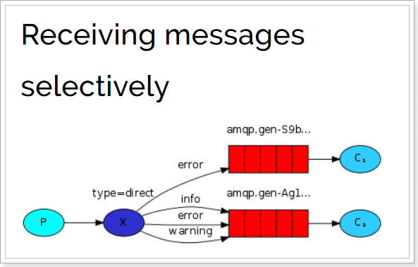

图解：

- P：生产者，向Exchange发送消息，发送消息时，会指定一个routing key。
- X：Exchange（交换机），接收生产者的消息，然后把消息递交给 与routing key完全匹配的队列
- C1：消费者，其所在队列指定了需要routing key 为 error 的消息
- C2：消费者，其所在队列指定了需要routing key 为 info、error、warning 的消息


### 4.4.2. 代码

在编码上与 `Publish/Subscribe发布与订阅模式` 的区别是交换机的类型为：Direct，还有队列绑定交换机的时候需要指定routing key。

#### 1）生产者

```java
package com.itheima.rabbitmq.routing;

import com.itheima.rabbitmq.util.ConnectionUtil;
import com.rabbitmq.client.BuiltinExchangeType;
import com.rabbitmq.client.Channel;
import com.rabbitmq.client.Connection;

/**
 * 路由模式的交换机类型为：direct
 */
public class Producer {

    //交换机名称
    static final String DIRECT_EXCHAGE = "direct_exchange";
    //队列名称
    static final String DIRECT_QUEUE_INSERT = "direct_queue_insert";
    //队列名称
    static final String DIRECT_QUEUE_UPDATE = "direct_queue_update";

    public static void main(String[] args) throws Exception {

        //创建连接
        Connection connection = ConnectionUtil.getConnection();

        // 创建频道
        Channel channel = connection.createChannel();

        /**
         * 声明交换机
         * 参数1：交换机名称
         * 参数2：交换机类型，fanout、topic、direct、headers
         */
        channel.exchangeDeclare(DIRECT_EXCHAGE, BuiltinExchangeType.DIRECT);

        // 声明（创建）队列
        /**
         * 参数1：队列名称
         * 参数2：是否定义持久化队列
         * 参数3：是否独占本次连接
         * 参数4：是否在不使用的时候自动删除队列
         * 参数5：队列其它参数
         */
        channel.queueDeclare(DIRECT_QUEUE_INSERT, true, false, false, null);
        channel.queueDeclare(DIRECT_QUEUE_UPDATE, true, false, false, null);

        //队列绑定交换机
        channel.queueBind(DIRECT_QUEUE_INSERT, DIRECT_EXCHAGE, "insert");
        channel.queueBind(DIRECT_QUEUE_UPDATE, DIRECT_EXCHAGE, "update");

        // 发送信息
        String message = "新增了商品。路由模式；routing key 为 insert " ;
        /**
         * 参数1：交换机名称，如果没有指定则使用默认Default Exchage
         * 参数2：路由key,简单模式可以传递队列名称
         * 参数3：消息其它属性
         * 参数4：消息内容
         */
        channel.basicPublish(DIRECT_EXCHAGE, "insert", null, message.getBytes());
        System.out.println("已发送消息：" + message);

        // 发送信息
        message = "修改了商品。路由模式；routing key 为 update" ;
        /**
         * 参数1：交换机名称，如果没有指定则使用默认Default Exchage
         * 参数2：路由key,简单模式可以传递队列名称
         * 参数3：消息其它属性
         * 参数4：消息内容
         */
        channel.basicPublish(DIRECT_EXCHAGE, "update", null, message.getBytes());
        System.out.println("已发送消息：" + message);

        // 关闭资源
        channel.close();
        connection.close();
    }
}

```
#### 2）消费者1

```java
package com.itheima.rabbitmq.routing;

import com.itheima.rabbitmq.util.ConnectionUtil;
import com.rabbitmq.client.*;

import java.io.IOException;

public class Consumer1 {

    public static void main(String[] args) throws Exception {
        Connection connection = ConnectionUtil.getConnection();

        // 创建频道
        Channel channel = connection.createChannel();

        //声明交换机
        channel.exchangeDeclare(Producer.DIRECT_EXCHAGE, BuiltinExchangeType.DIRECT);

        // 声明（创建）队列
        /**
         * 参数1：队列名称
         * 参数2：是否定义持久化队列
         * 参数3：是否独占本次连接
         * 参数4：是否在不使用的时候自动删除队列
         * 参数5：队列其它参数
         */
        channel.queueDeclare(Producer.DIRECT_QUEUE_INSERT, true, false, false, null);

        //队列绑定交换机
        channel.queueBind(Producer.DIRECT_QUEUE_INSERT, Producer.DIRECT_EXCHAGE, "insert");

        //创建消费者；并设置消息处理
        DefaultConsumer consumer = new DefaultConsumer(channel){
            @Override
            /**
             * consumerTag 消息者标签，在channel.basicConsume时候可以指定
             * envelope 消息包的内容，可从中获取消息id，消息routingkey，交换机，消息和重传标志(收到消息失败后是否需要重新发送)
             * properties 属性信息
             * body 消息
             */
            public void handleDelivery(String consumerTag, Envelope envelope, AMQP.BasicProperties properties, byte[] body) throws IOException {
                //路由key
                System.out.println("路由key为：" + envelope.getRoutingKey());
                //交换机
                System.out.println("交换机为：" + envelope.getExchange());
                //消息id
                System.out.println("消息id为：" + envelope.getDeliveryTag());
                //收到的消息
                System.out.println("消费者1-接收到的消息为：" + new String(body, "utf-8"));
            }
        };
        //监听消息
        /**
         * 参数1：队列名称
         * 参数2：是否自动确认，设置为true为表示消息接收到自动向mq回复接收到了，mq接收到回复会删除消息，设置为false则需要手动确认
         * 参数3：消息接收到后回调
         */
        channel.basicConsume(Producer.DIRECT_QUEUE_INSERT, true, consumer);
    }
}

```
#### 3）消费者2

```java
package com.itheima.rabbitmq.routing;

import com.itheima.rabbitmq.util.ConnectionUtil;
import com.rabbitmq.client.*;

import java.io.IOException;

public class Consumer2 {

    public static void main(String[] args) throws Exception {
        Connection connection = ConnectionUtil.getConnection();

        // 创建频道
        Channel channel = connection.createChannel();

        //声明交换机
        channel.exchangeDeclare(Producer.DIRECT_EXCHAGE, BuiltinExchangeType.DIRECT);

        // 声明（创建）队列
        /**
         * 参数1：队列名称
         * 参数2：是否定义持久化队列
         * 参数3：是否独占本次连接
         * 参数4：是否在不使用的时候自动删除队列
         * 参数5：队列其它参数
         */
        channel.queueDeclare(Producer.DIRECT_QUEUE_UPDATE, true, false, false, null);

        //队列绑定交换机
        channel.queueBind(Producer.DIRECT_QUEUE_UPDATE, Producer.DIRECT_EXCHAGE, "update");

        //创建消费者；并设置消息处理
        DefaultConsumer consumer = new DefaultConsumer(channel){
            @Override
            /**
             * consumerTag 消息者标签，在channel.basicConsume时候可以指定
             * envelope 消息包的内容，可从中获取消息id，消息routingkey，交换机，消息和重传标志(收到消息失败后是否需要重新发送)
             * properties 属性信息
             * body 消息
             */
            public void handleDelivery(String consumerTag, Envelope envelope, AMQP.BasicProperties properties, byte[] body) throws IOException {
                //路由key
                System.out.println("路由key为：" + envelope.getRoutingKey());
                //交换机
                System.out.println("交换机为：" + envelope.getExchange());
                //消息id
                System.out.println("消息id为：" + envelope.getDeliveryTag());
                //收到的消息
                System.out.println("消费者2-接收到的消息为：" + new String(body, "utf-8"));
            }
        };
        //监听消息
        /**
         * 参数1：队列名称
         * 参数2：是否自动确认，设置为true为表示消息接收到自动向mq回复接收到了，mq接收到回复会删除消息，设置为false则需要手动确认
         * 参数3：消息接收到后回调
         */
        channel.basicConsume(Producer.DIRECT_QUEUE_UPDATE, true, consumer);
    }
}

```


### 4.4.3. 测试

启动所有消费者，然后使用生产者发送消息；在消费者对应的控制台可以查看到生产者发送对应routing key对应队列的消息；到达**按照需要接收**的效果。

在执行完测试代码后，其实到RabbitMQ的管理后台找到`Exchanges`选项卡，点击 `direct_exchange` 的交换机，可以查看到如下的绑定：

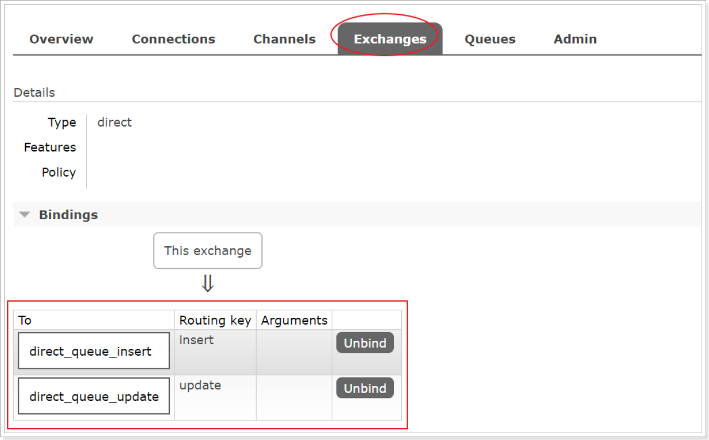

### 4.4.4. 小结

Routing模式要求队列在绑定交换机时要指定routing key，消息会转发到符合routing key的队列。


## 4.5. Topics通配符模式

### 4.5.1. 模式说明

`Topic`类型与`Direct`相比，都是可以根据`RoutingKey`把消息路由到不同的队列。只不过`Topic`类型`Exchange`可以让队列在绑定`Routing key` 的时候**使用通配符**！


`Routingkey` 一般都是有一个或多个单词组成，多个单词之间以”.”分割，例如： `item.insert`

 通配符规则：

`#`：匹配一个或多个词

`*`：匹配不多不少恰好1个词

举例：

`item.#`：能够匹配`item.insert.abc` 或者 `item.insert`

`item.*`：只能匹配`item.insert`

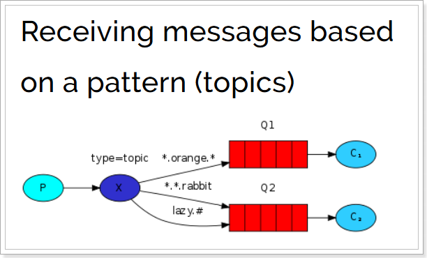


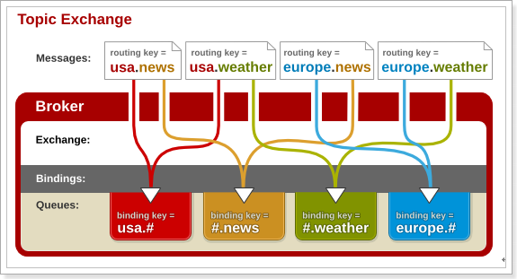

图解：

- 红色Queue：绑定的是`usa.#` ，因此凡是以 `usa.`开头的`routing key` 都会被匹配到
- 黄色Queue：绑定的是`#.news` ，因此凡是以 `.news`结尾的 `routing key` 都会被匹配


### 4.5.2. 代码

#### 1）生产者

使用topic类型的Exchange，发送消息的routing key有3种： `item.insert`、`item.update`、`item.delete`：

```java
package com.itheima.rabbitmq.topic;

import com.itheima.rabbitmq.util.ConnectionUtil;
import com.rabbitmq.client.BuiltinExchangeType;
import com.rabbitmq.client.Channel;
import com.rabbitmq.client.Connection;

/**
 * 通配符Topic的交换机类型为：topic
 */
public class Producer {

    //交换机名称
    static final String TOPIC_EXCHAGE = "topic_exchange";
    //队列名称
    static final String TOPIC_QUEUE_1 = "topic_queue_1";
    //队列名称
    static final String TOPIC_QUEUE_2 = "topic_queue_2";

    public static void main(String[] args) throws Exception {

        //创建连接
        Connection connection = ConnectionUtil.getConnection();

        // 创建频道
        Channel channel = connection.createChannel();

        /**
         * 声明交换机
         * 参数1：交换机名称
         * 参数2：交换机类型，fanout、topic、topic、headers
         */
        channel.exchangeDeclare(TOPIC_EXCHAGE, BuiltinExchangeType.TOPIC);


        // 发送信息
        String message = "新增了商品。Topic模式；routing key 为 item.insert " ;
        channel.basicPublish(TOPIC_EXCHAGE, "item.insert", null, message.getBytes());
        System.out.println("已发送消息：" + message);

        // 发送信息
        message = "修改了商品。Topic模式；routing key 为 item.update" ;
        channel.basicPublish(TOPIC_EXCHAGE, "item.update", null, message.getBytes());
        System.out.println("已发送消息：" + message);

        // 发送信息
        message = "删除了商品。Topic模式；routing key 为 item.delete" ;
        channel.basicPublish(TOPIC_EXCHAGE, "item.delete", null, message.getBytes());
        System.out.println("已发送消息：" + message);

        // 关闭资源
        channel.close();
        connection.close();
    }
}

```
#### 2）消费者1

接收两种类型的消息：更新商品和删除商品

```java
package com.itheima.rabbitmq.topic;

import com.itheima.rabbitmq.util.ConnectionUtil;
import com.rabbitmq.client.*;

import java.io.IOException;

public class Consumer1 {

    public static void main(String[] args) throws Exception {
        Connection connection = ConnectionUtil.getConnection();

        // 创建频道
        Channel channel = connection.createChannel();

        //声明交换机
        channel.exchangeDeclare(Producer.TOPIC_EXCHAGE, BuiltinExchangeType.TOPIC);

        // 声明（创建）队列
        /**
         * 参数1：队列名称
         * 参数2：是否定义持久化队列
         * 参数3：是否独占本次连接
         * 参数4：是否在不使用的时候自动删除队列
         * 参数5：队列其它参数
         */
        channel.queueDeclare(Producer.TOPIC_QUEUE_1, true, false, false, null);

        //队列绑定交换机
        channel.queueBind(Producer.TOPIC_QUEUE_1, Producer.TOPIC_EXCHAGE, "item.update");
        channel.queueBind(Producer.TOPIC_QUEUE_1, Producer.TOPIC_EXCHAGE, "item.delete");

        //创建消费者；并设置消息处理
        DefaultConsumer consumer = new DefaultConsumer(channel){
            @Override
            /**
             * consumerTag 消息者标签，在channel.basicConsume时候可以指定
             * envelope 消息包的内容，可从中获取消息id，消息routingkey，交换机，消息和重传标志(收到消息失败后是否需要重新发送)
             * properties 属性信息
             * body 消息
             */
            public void handleDelivery(String consumerTag, Envelope envelope, AMQP.BasicProperties properties, byte[] body) throws IOException {
                //路由key
                System.out.println("路由key为：" + envelope.getRoutingKey());
                //交换机
                System.out.println("交换机为：" + envelope.getExchange());
                //消息id
                System.out.println("消息id为：" + envelope.getDeliveryTag());
                //收到的消息
                System.out.println("消费者1-接收到的消息为：" + new String(body, "utf-8"));
            }
        };
        //监听消息
        /**
         * 参数1：队列名称
         * 参数2：是否自动确认，设置为true为表示消息接收到自动向mq回复接收到了，mq接收到回复会删除消息，设置为false则需要手动确认
         * 参数3：消息接收到后回调
         */
        channel.basicConsume(Producer.TOPIC_QUEUE_1, true, consumer);
    }
}

```
#### 3）消费者2

接收所有类型的消息：新增商品，更新商品和删除商品。

```java
package com.itheima.rabbitmq.topic;

import com.itheima.rabbitmq.util.ConnectionUtil;
import com.rabbitmq.client.*;

import java.io.IOException;

public class Consumer2 {

    public static void main(String[] args) throws Exception {
        Connection connection = ConnectionUtil.getConnection();

        // 创建频道
        Channel channel = connection.createChannel();

        //声明交换机
        channel.exchangeDeclare(Producer.TOPIC_EXCHAGE, BuiltinExchangeType.TOPIC);

        // 声明（创建）队列
        /**
         * 参数1：队列名称
         * 参数2：是否定义持久化队列
         * 参数3：是否独占本次连接
         * 参数4：是否在不使用的时候自动删除队列
         * 参数5：队列其它参数
         */
        channel.queueDeclare(Producer.TOPIC_QUEUE_2, true, false, false, null);

        //队列绑定交换机
        channel.queueBind(Producer.TOPIC_QUEUE_2, Producer.TOPIC_EXCHAGE, "item.*");

        //创建消费者；并设置消息处理
        DefaultConsumer consumer = new DefaultConsumer(channel){
            @Override
            /**
             * consumerTag 消息者标签，在channel.basicConsume时候可以指定
             * envelope 消息包的内容，可从中获取消息id，消息routingkey，交换机，消息和重传标志(收到消息失败后是否需要重新发送)
             * properties 属性信息
             * body 消息
             */
            public void handleDelivery(String consumerTag, Envelope envelope, AMQP.BasicProperties properties, byte[] body) throws IOException {
                //路由key
                System.out.println("路由key为：" + envelope.getRoutingKey());
                //交换机
                System.out.println("交换机为：" + envelope.getExchange());
                //消息id
                System.out.println("消息id为：" + envelope.getDeliveryTag());
                //收到的消息
                System.out.println("消费者2-接收到的消息为：" + new String(body, "utf-8"));
            }
        };
        //监听消息
        /**
         * 参数1：队列名称
         * 参数2：是否自动确认，设置为true为表示消息接收到自动向mq回复接收到了，mq接收到回复会删除消息，设置为false则需要手动确认
         * 参数3：消息接收到后回调
         */
        channel.basicConsume(Producer.TOPIC_QUEUE_2, true, consumer);
    }
}

```

### 4.5.3. 测试

启动所有消费者，然后使用生产者发送消息；在消费者对应的控制台可以查看到生产者发送对应routing key对应队列的消息；到达**按照需要接收**的效果；并且这些routing key可以使用通配符。

在执行完测试代码后，其实到RabbitMQ的管理后台找到`Exchanges`选项卡，点击 `topic_exchange` 的交换机，可以查看到如下的绑定：

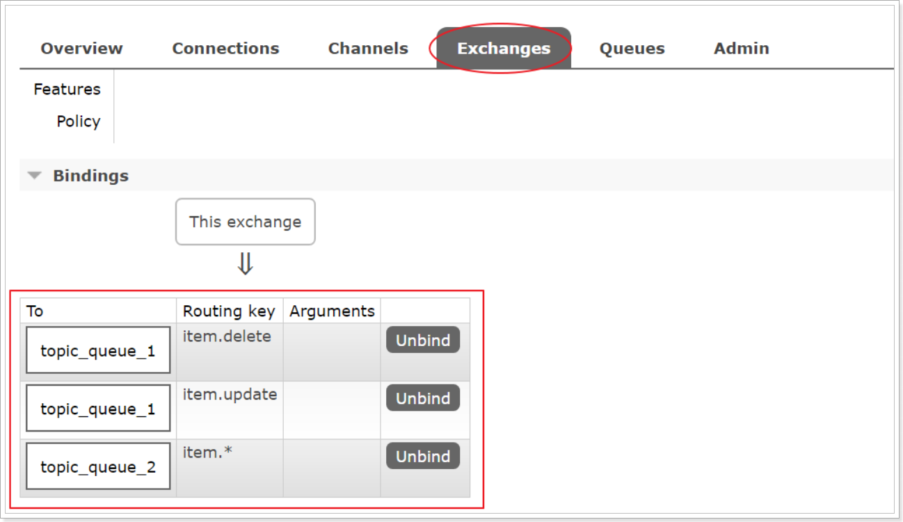

### 4.5.4. 小结

Topic主题模式可以实现 `Publish/Subscribe发布与订阅模式` 和 ` Routing路由模式` 的功能；只是Topic在配置routing key 的时候可以使用通配符，显得更加灵活。

## 4.6. 模式总结

RabbitMQ工作模式：
**1、简单模式 HelloWorld**
一个生产者、一个消费者，不需要设置交换机（使用默认的交换机）

**2、工作队列模式 Work Queue**
一个生产者、多个消费者（竞争关系），不需要设置交换机（使用默认的交换机）

**3、发布订阅模式 Publish/subscribe**
需要设置类型为fanout的交换机，并且交换机和队列进行绑定，当发送消息到交换机后，交换机会将消息发送到绑定的队列

**4、路由模式 Routing**
需要设置类型为direct的交换机，交换机和队列进行绑定，并且指定routing key，当发送消息到交换机后，交换机会根据routing key将消息发送到对应的队列

**5、通配符模式 Topic**
需要设置类型为topic的交换机，交换机和队列进行绑定，并且指定通配符方式的routing key，当发送消息到交换机后，交换机会根据routing key将消息发送到对应的队列


# 5. Spring 整合RabbitMQ

## 5.1. 搭建生产者工程

### 5.1.1. 创建工程

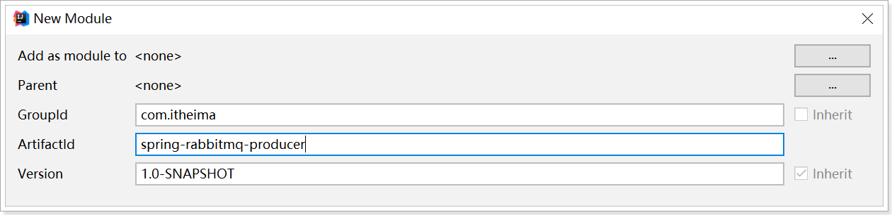

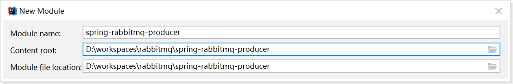

### 5.1.2. 添加依赖

修改pom.xml文件内容为如下：

```xml
<?xml version="1.0" encoding="UTF-8"?>
<project xmlns="http://maven.apache.org/POM/4.0.0"
         xmlns:xsi="http://www.w3.org/2001/XMLSchema-instance"
         xsi:schemaLocation="http://maven.apache.org/POM/4.0.0 http://maven.apache.org/xsd/maven-4.0.0.xsd">
    <modelVersion>4.0.0</modelVersion>

    <groupId>com.itheima</groupId>
    <artifactId>spring-rabbitmq-producer</artifactId>
    <version>1.0-SNAPSHOT</version>

    <dependencies>
        <dependency>
            <groupId>org.springframework</groupId>
            <artifactId>spring-context</artifactId>
            <version>5.1.7.RELEASE</version>
        </dependency>

        <dependency>
            <groupId>org.springframework.amqp</groupId>
            <artifactId>spring-rabbit</artifactId>
            <version>2.1.8.RELEASE</version>
        </dependency>

        <dependency>
            <groupId>junit</groupId>
            <artifactId>junit</artifactId>
            <version>4.12</version>
        </dependency>

        <dependency>
            <groupId>org.springframework</groupId>
            <artifactId>spring-test</artifactId>
            <version>5.1.7.RELEASE</version>
        </dependency>
    </dependencies>

</project>
```


### 5.1.3. 配置整合

1. 创建`spring-rabbitmq-producer\src\main\resources\properties\rabbitmq.properties`连接参数等配置文件；

```properties
rabbitmq.host=192.168.12.135
rabbitmq.port=5672
rabbitmq.username=heima
rabbitmq.password=heima
rabbitmq.virtual-host=/itcast
```


2. 创建 `spring-rabbitmq-producer\src\main\resources\spring\spring-rabbitmq.xml` 整合配置文件；

```xml
<?xml version="1.0" encoding="UTF-8"?>
<beans xmlns="http://www.springframework.org/schema/beans"
       xmlns:xsi="http://www.w3.org/2001/XMLSchema-instance"
       xmlns:context="http://www.springframework.org/schema/context"
       xmlns:rabbit="http://www.springframework.org/schema/rabbit"
       xsi:schemaLocation="http://www.springframework.org/schema/beans
       http://www.springframework.org/schema/beans/spring-beans.xsd
       http://www.springframework.org/schema/context
       https://www.springframework.org/schema/context/spring-context.xsd
       http://www.springframework.org/schema/rabbit
       http://www.springframework.org/schema/rabbit/spring-rabbit.xsd">
    <!--加载配置文件-->
    <context:property-placeholder location="classpath:properties/rabbitmq.properties"/>

    <!-- 定义rabbitmq connectionFactory -->
    <rabbit:connection-factory id="connectionFactory" host="${rabbitmq.host}"
                               port="${rabbitmq.port}"
                               username="${rabbitmq.username}"
                               password="${rabbitmq.password}"
                               virtual-host="${rabbitmq.virtual-host}"/>
    <!--定义管理交换机、队列-->
    <rabbit:admin connection-factory="connectionFactory"/>

    <!--定义持久化队列，不存在则自动创建；不绑定到交换机则绑定到默认交换机
    默认交换机类型为direct，名字为：""，路由键为队列的名称
    -->
    <rabbit:queue id="spring_queue" name="spring_queue" auto-declare="true"/>

    <!-- ~~~~~~~~~~~~~~~~~~~~~~~~~~~~广播；所有队列都能收到消息~~~~~~~~~~~~~~~~~~~~~~~~~~~~ -->
    <!--定义广播交换机中的持久化队列，不存在则自动创建-->
    <rabbit:queue id="spring_fanout_queue_1" name="spring_fanout_queue_1" auto-declare="true"/>

    <!--定义广播交换机中的持久化队列，不存在则自动创建-->
    <rabbit:queue id="spring_fanout_queue_2" name="spring_fanout_queue_2" auto-declare="true"/>

    <!--定义广播类型交换机；并绑定上述两个队列-->
    <rabbit:fanout-exchange id="spring_fanout_exchange" name="spring_fanout_exchange" auto-declare="true">
        <rabbit:bindings>
            <rabbit:binding queue="spring_fanout_queue_1"/>
            <rabbit:binding queue="spring_fanout_queue_2"/>
        </rabbit:bindings>
    </rabbit:fanout-exchange>

    <!-- ~~~~~~~~~~~~~~~~~~~~~~~~~~~~通配符；*匹配一个单词，#匹配多个单词 ~~~~~~~~~~~~~~~~~~~~~~~~~~~~ -->
    <!--定义广播交换机中的持久化队列，不存在则自动创建-->
    <rabbit:queue id="spring_topic_queue_star" name="spring_topic_queue_star" auto-declare="true"/>
    <!--定义广播交换机中的持久化队列，不存在则自动创建-->
    <rabbit:queue id="spring_topic_queue_well" name="spring_topic_queue_well" auto-declare="true"/>
    <!--定义广播交换机中的持久化队列，不存在则自动创建-->
    <rabbit:queue id="spring_topic_queue_well2" name="spring_topic_queue_well2" auto-declare="true"/>

    <rabbit:topic-exchange id="spring_topic_exchange" name="spring_topic_exchange" auto-declare="true">
        <rabbit:bindings>
            <rabbit:binding pattern="heima.*" queue="spring_topic_queue_star"/>
            <rabbit:binding pattern="heima.#" queue="spring_topic_queue_well"/>
            <rabbit:binding pattern="itcast.#" queue="spring_topic_queue_well2"/>
        </rabbit:bindings>
    </rabbit:topic-exchange>

    <!--定义rabbitTemplate对象操作可以在代码中方便发送消息-->
    <rabbit:template id="rabbitTemplate" connection-factory="connectionFactory"/>
</beans>
```


### 5.1.4. 发送消息

创建测试文件 `spring-rabbitmq-producer\src\test\java\com\itheima\rabbitmq\ProducerTest.java`

```java
@RunWith(SpringJUnit4ClassRunner.class)
@ContextConfiguration(locations = "classpath:spring/spring-rabbitmq.xml")
public class ProducerTest {

    @Autowired
    private RabbitTemplate rabbitTemplate;

    /**
     * 只发队列消息
     * 默认交换机类型为 direct
     * 交换机的名称为空，路由键为队列的名称
     */
    @Test
    public void queueTest(){
        //路由键与队列同名
        rabbitTemplate.convertAndSend("spring_queue", "只发队列spring_queue的消息。");
    }

    /**
     * 发送广播
     * 交换机类型为 fanout
     * 绑定到该交换机的所有队列都能够收到消息
     */
    @Test
    public void fanoutTest(){
        /**
         * 参数1：交换机名称
         * 参数2：路由键名（广播设置为空）
         * 参数3：发送的消息内容
         */
        rabbitTemplate.convertAndSend("spring_fanout_exchange", "", "发送到spring_fanout_exchange交换机的广播消息");
    }

    /**
     * 通配符
     * 交换机类型为 topic
     * 匹配路由键的通配符，*表示一个单词，#表示多个单词
     * 绑定到该交换机的匹配队列能够收到对应消息
     */
    @Test
    public void topicTest(){
        /**
         * 参数1：交换机名称
         * 参数2：路由键名
         * 参数3：发送的消息内容
         */
        rabbitTemplate.convertAndSend("spring_topic_exchange", "heima.bj", "发送到spring_topic_exchange交换机heima.bj的消息");
        rabbitTemplate.convertAndSend("spring_topic_exchange", "heima.bj.1", "发送到spring_topic_exchange交换机heima.bj.1的消息");
        rabbitTemplate.convertAndSend("spring_topic_exchange", "heima.bj.2", "发送到spring_topic_exchange交换机heima.bj.2的消息");
        rabbitTemplate.convertAndSend("spring_topic_exchange", "itcast.cn", "发送到spring_topic_exchange交换机itcast.cn的消息");
    }
}

```


## 5.2. 搭建消费者工程

### 5.2.1. 创建工程

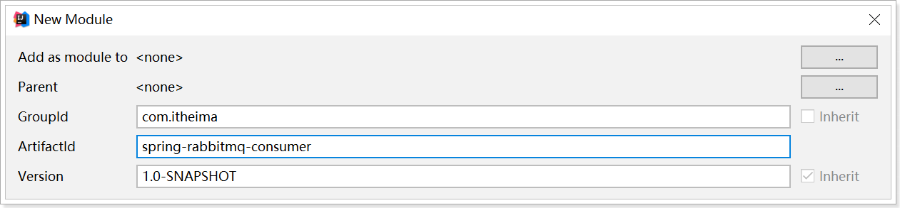

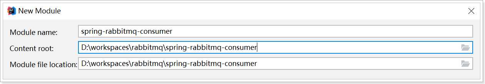

### 5.2.2. 添加依赖
修改pom.xml文件内容为如下：

```xml
<?xml version="1.0" encoding="UTF-8"?>
<project xmlns="http://maven.apache.org/POM/4.0.0"
         xmlns:xsi="http://www.w3.org/2001/XMLSchema-instance"
         xsi:schemaLocation="http://maven.apache.org/POM/4.0.0 http://maven.apache.org/xsd/maven-4.0.0.xsd">
    <modelVersion>4.0.0</modelVersion>

    <groupId>com.itheima</groupId>
    <artifactId>spring-rabbitmq-consumer</artifactId>
    <version>1.0-SNAPSHOT</version>
    <dependencies>
        <dependency>
            <groupId>org.springframework</groupId>
            <artifactId>spring-context</artifactId>
            <version>5.1.7.RELEASE</version>
        </dependency>

        <dependency>
            <groupId>org.springframework.amqp</groupId>
            <artifactId>spring-rabbit</artifactId>
            <version>2.1.8.RELEASE</version>
        </dependency>
    </dependencies>


</project>
```

### 5.2.3. 配置整合
1. 创建`spring-rabbitmq-consumer\src\main\resources\properties\rabbitmq.properties`连接参数等配置文件；

```properties
rabbitmq.host=192.168.12.135
rabbitmq.port=5672
rabbitmq.username=heima
rabbitmq.password=heima
rabbitmq.virtual-host=/itcast
```


2. 创建 `spring-rabbitmq-consumer\src\main\resources\spring\spring-rabbitmq.xml` 整合配置文件；

```xml
<?xml version="1.0" encoding="UTF-8"?>
<beans xmlns="http://www.springframework.org/schema/beans"
       xmlns:xsi="http://www.w3.org/2001/XMLSchema-instance"
       xmlns:context="http://www.springframework.org/schema/context"
       xmlns:rabbit="http://www.springframework.org/schema/rabbit"
       xsi:schemaLocation="http://www.springframework.org/schema/beans
       http://www.springframework.org/schema/beans/spring-beans.xsd
       http://www.springframework.org/schema/context
       https://www.springframework.org/schema/context/spring-context.xsd
       http://www.springframework.org/schema/rabbit
       http://www.springframework.org/schema/rabbit/spring-rabbit.xsd">
    <!--加载配置文件-->
    <context:property-placeholder location="classpath:properties/rabbitmq.properties"/>

    <!-- 定义rabbitmq connectionFactory -->
    <rabbit:connection-factory id="connectionFactory" host="${rabbitmq.host}"
                               port="${rabbitmq.port}"
                               username="${rabbitmq.username}"
                               password="${rabbitmq.password}"
                               virtual-host="${rabbitmq.virtual-host}"/>

    <bean id="springQueueListener" class="com.itheima.rabbitmq.listener.SpringQueueListener"/>
    <bean id="fanoutListener1" class="com.itheima.rabbitmq.listener.FanoutListener1"/>
    <bean id="fanoutListener2" class="com.itheima.rabbitmq.listener.FanoutListener2"/>
    <bean id="topicListenerStar" class="com.itheima.rabbitmq.listener.TopicListenerStar"/>
    <bean id="topicListenerWell" class="com.itheima.rabbitmq.listener.TopicListenerWell"/>
    <bean id="topicListenerWell2" class="com.itheima.rabbitmq.listener.TopicListenerWell2"/>

    <rabbit:listener-container connection-factory="connectionFactory" auto-declare="true">
        <rabbit:listener ref="springQueueListener" queue-names="spring_queue"/>
        <rabbit:listener ref="fanoutListener1" queue-names="spring_fanout_queue_1"/>
        <rabbit:listener ref="fanoutListener2" queue-names="spring_fanout_queue_2"/>
        <rabbit:listener ref="topicListenerStar" queue-names="spring_topic_queue_star"/>
        <rabbit:listener ref="topicListenerWell" queue-names="spring_topic_queue_well"/>
        <rabbit:listener ref="topicListenerWell2" queue-names="spring_topic_queue_well2"/>
    </rabbit:listener-container>
</beans>
```

### 5.2.4. 消息监听器

#### 1）队列监听器

创建 `spring-rabbitmq-consumer\src\main\java\com\itheima\rabbitmq\listener\SpringQueueListener.java`

```java
public class SpringQueueListener implements MessageListener {
    public void onMessage(Message message) {
        try {
            String msg = new String(message.getBody(), "utf-8");

            System.out.printf("接收路由名称为：%s，路由键为：%s，队列名为：%s的消息：%s \n",
                    message.getMessageProperties().getReceivedExchange(),
                    message.getMessageProperties().getReceivedRoutingKey(),
                    message.getMessageProperties().getConsumerQueue(),
                    msg);
        } catch (Exception e) {
            e.printStackTrace();
        }
    }
}
```


#### 2）广播监听器1
创建 `spring-rabbitmq-consumer\src\main\java\com\itheima\rabbitmq\listener\FanoutListener1.java`

```java
public class FanoutListener1 implements MessageListener {
    public void onMessage(Message message) {
        try {
            String msg = new String(message.getBody(), "utf-8");

            System.out.printf("广播监听器1：接收路由名称为：%s，路由键为：%s，队列名为：%s的消息：%s \n",
                    message.getMessageProperties().getReceivedExchange(),
                    message.getMessageProperties().getReceivedRoutingKey(),
                    message.getMessageProperties().getConsumerQueue(),
                    msg);
        } catch (Exception e) {
            e.printStackTrace();
        }
    }
}

```

#### 3）广播监听器2
创建 `spring-rabbitmq-consumer\src\main\java\com\itheima\rabbitmq\listener\FanoutListener2.java`

```java
public class FanoutListener2 implements MessageListener {
    public void onMessage(Message message) {
        try {
            String msg = new String(message.getBody(), "utf-8");

            System.out.printf("广播监听器2：接收路由名称为：%s，路由键为：%s，队列名为：%s的消息：%s \n",
                    message.getMessageProperties().getReceivedExchange(),
                    message.getMessageProperties().getReceivedRoutingKey(),
                    message.getMessageProperties().getConsumerQueue(),
                    msg);
        } catch (Exception e) {
            e.printStackTrace();
        }
    }
}
```

#### 4）星号通配符监听器
创建 `spring-rabbitmq-consumer\src\main\java\com\itheima\rabbitmq\listener\TopicListenerStar.java`

```java
public class TopicListenerStar implements MessageListener {
    public void onMessage(Message message) {
        try {
            String msg = new String(message.getBody(), "utf-8");

            System.out.printf("通配符*监听器：接收路由名称为：%s，路由键为：%s，队列名为：%s的消息：%s \n",
                    message.getMessageProperties().getReceivedExchange(),
                    message.getMessageProperties().getReceivedRoutingKey(),
                    message.getMessageProperties().getConsumerQueue(),
                    msg);
        } catch (Exception e) {
            e.printStackTrace();
        }
    }
}

```

#### 5）井号通配符监听器
创建 `spring-rabbitmq-consumer\src\main\java\com\itheima\rabbitmq\listener\TopicListenerWell.java`

```java
public class TopicListenerWell implements MessageListener {
    public void onMessage(Message message) {
        try {
            String msg = new String(message.getBody(), "utf-8");

            System.out.printf("通配符#监听器：接收路由名称为：%s，路由键为：%s，队列名为：%s的消息：%s \n",
                    message.getMessageProperties().getReceivedExchange(),
                    message.getMessageProperties().getReceivedRoutingKey(),
                    message.getMessageProperties().getConsumerQueue(),
                    msg);
        } catch (Exception e) {
            e.printStackTrace();
        }
    }
}

```

#### 6）井号通配符监听器2
创建 `spring-rabbitmq-consumer\src\main\java\com\itheima\rabbitmq\listener\TopicListenerWell2.java`

```java
public class TopicListenerWell2 implements MessageListener {
    public void onMessage(Message message) {
        try {
            String msg = new String(message.getBody(), "utf-8");

            System.out.printf("通配符#监听器2：接收路由名称为：%s，路由键为：%s，队列名为：%s的消息：%s \n",
                    message.getMessageProperties().getReceivedExchange(),
                    message.getMessageProperties().getReceivedRoutingKey(),
                    message.getMessageProperties().getConsumerQueue(),
                    msg);
        } catch (Exception e) {
            e.printStackTrace();
        }
    }
}

```


# 6. Spring Boot整合RabbitMQ


## 6.1. 简介

在Spring项目中，可以使用Spring-Rabbit去操作RabbitMQ
https://github.com/spring-projects/spring-amqp

尤其是在spring boot项目中只需要引入对应的amqp启动器依赖即可，方便的使用RabbitTemplate发送消息，使用注解接收消息。


*一般在开发过程中*：

**生产者工程：**

1. application.yml文件配置RabbitMQ相关信息；
2. 在生产者工程中编写配置类，用于创建交换机和队列，并进行绑定

3. 注入RabbitTemplate对象，通过RabbitTemplate对象发送消息到交换机


**消费者工程：**

1. application.yml文件配置RabbitMQ相关信息

2. 创建消息处理类，用于接收队列中的消息并进行处理


## 5.2. 搭建生产者工程

### 5.2.1. 创建工程

创建生产者工程springboot-rabbitmq-producer

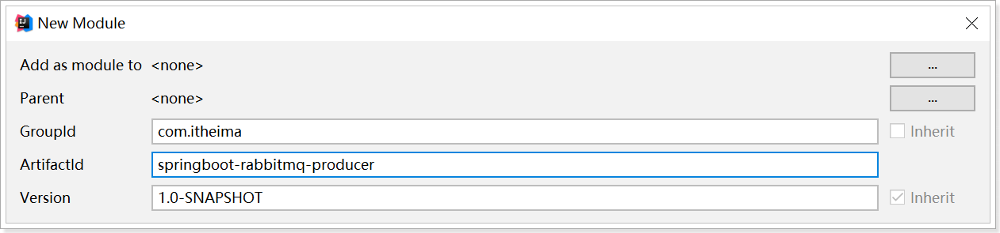

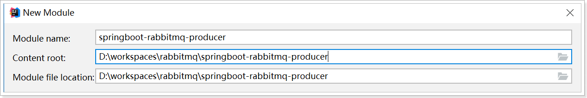

### 5.2.2. 添加依赖

修改pom.xml文件内容为如下：

```xml
<?xml version="1.0" encoding="UTF-8"?>
<project xmlns="http://maven.apache.org/POM/4.0.0"
         xmlns:xsi="http://www.w3.org/2001/XMLSchema-instance"
         xsi:schemaLocation="http://maven.apache.org/POM/4.0.0 http://maven.apache.org/xsd/maven-4.0.0.xsd">
    <modelVersion>4.0.0</modelVersion>
    <parent>
        <groupId>org.springframework.boot</groupId>
        <artifactId>spring-boot-starter-parent</artifactId>
        <version>2.1.4.RELEASE</version>
    </parent>
    <groupId>com.itheima</groupId>
    <artifactId>springboot-rabbitmq-producer</artifactId>
    <version>1.0-SNAPSHOT</version>

    <dependencies>
        <dependency>
            <groupId>org.springframework.boot</groupId>
            <artifactId>spring-boot-starter-amqp</artifactId>
        </dependency>
        <dependency>
            <groupId>org.springframework.boot</groupId>
            <artifactId>spring-boot-starter-test</artifactId>
        </dependency>
    </dependencies>
</project>
```


### 5.2.3. 启动类

```java
package com.itheima.rabbitmq;

import org.springframework.boot.SpringApplication;
import org.springframework.boot.autoconfigure.SpringBootApplication;

@SpringBootApplication
public class ProducerApplication {
    public static void main(String[] args) {
        SpringApplication.run(ProducerApplication.class);
    }
}

```


### 5.2.4. 配置RabbitMQ

#### 1）配置文件

创建application.yml，内容如下：

```yml
spring:
  rabbitmq:
    host: localhost
    port: 5672
    virtual-host: /itcast
    username: heima
    password: heima
```


#### 2）绑定交换机和队列

创建RabbitMQ队列与交换机绑定的配置类com.itheima.rabbitmq.config.RabbitMQConfig

```java
package com.itheima.rabbitmq.config;

import org.springframework.amqp.core.*;
import org.springframework.beans.factory.annotation.Qualifier;
import org.springframework.context.annotation.Bean;
import org.springframework.context.annotation.Configuration;

@Configuration
public class RabbitMQConfig {
    //交换机名称
    public static final String ITEM_TOPIC_EXCHANGE = "item_topic_exchange";
    //队列名称
    public static final String ITEM_QUEUE = "item_queue";

    //声明交换机
    @Bean("itemTopicExchange")
    public Exchange topicExchange(){
        return ExchangeBuilder.topicExchange(ITEM_TOPIC_EXCHANGE).durable(true).build();
    }

    //声明队列
    @Bean("itemQueue")
    public Queue itemQueue(){
        return QueueBuilder.durable(ITEM_QUEUE).build();
    }

    //绑定队列和交换机
    @Bean
    public Binding itemQueueExchange(@Qualifier("itemQueue") Queue queue,
                                     @Qualifier("itemTopicExchange") Exchange exchange){
        return BindingBuilder.bind(queue).to(exchange).with("item.#").noargs();
    }

}
```


## 5.3. 搭建消费者工程

### 5.3.1. 创建工程

创建消费者工程springboot-rabbitmq-consumer

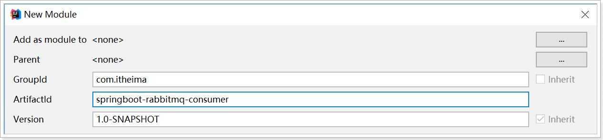

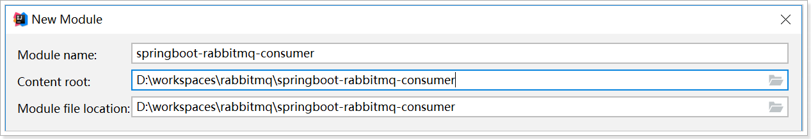

### 5.3.2. 添加依赖

修改pom.xml文件内容为如下：

```xml
<?xml version="1.0" encoding="UTF-8"?>
<project xmlns="http://maven.apache.org/POM/4.0.0"
         xmlns:xsi="http://www.w3.org/2001/XMLSchema-instance"
         xsi:schemaLocation="http://maven.apache.org/POM/4.0.0 http://maven.apache.org/xsd/maven-4.0.0.xsd">
    <modelVersion>4.0.0</modelVersion>
    <parent>
        <groupId>org.springframework.boot</groupId>
        <artifactId>spring-boot-starter-parent</artifactId>
        <version>2.1.4.RELEASE</version>
    </parent>
    <groupId>com.itheima</groupId>
    <artifactId>springboot-rabbitmq-consumer</artifactId>
    <version>1.0-SNAPSHOT</version>

    <dependencies>
        <dependency>
            <groupId>org.springframework.boot</groupId>
            <artifactId>spring-boot-starter-amqp</artifactId>
        </dependency>
    </dependencies>

</project>
```


### 5.3.3. 启动类

```java
package com.itheima.rabbitmq;

import org.springframework.boot.SpringApplication;
import org.springframework.boot.autoconfigure.SpringBootApplication;

@SpringBootApplication
public class ConsumerApplication {
    public static void main(String[] args) {
        SpringApplication.run(ConsumerApplication.class);
    }
}
```


### 5.3.4. 配置RabbitMQ

创建application.yml，内容如下：

```yml
spring:
  rabbitmq:
    host: localhost
    port: 5672
    virtual-host: /itcast
    username: heima
    password: heima
```


### 5.3.5. 消息监听处理类

编写消息监听器com.itheima.rabbitmq.listener.MyListener

```java
package com.itheima.rabbitmq.listener;

import org.springframework.amqp.rabbit.annotation.RabbitListener;
import org.springframework.stereotype.Component;

@Component
public class MyListener {

    /**
     * 监听某个队列的消息
     * @param message 接收到的消息
     */
    @RabbitListener(queues = "item_queue")
    public void myListener1(String message){
        System.out.println("消费者接收到的消息为：" + message);
    }
}

```


## 5.4. 测试

在生产者工程springboot-rabbitmq-producer中创建测试类，发送消息：

```java
package com.itheima.rabbitmq;

import com.itheima.rabbitmq.config.RabbitMQConfig;
import org.junit.Test;
import org.junit.runner.RunWith;
import org.springframework.amqp.rabbit.core.RabbitTemplate;
import org.springframework.beans.factory.annotation.Autowired;
import org.springframework.boot.test.context.SpringBootTest;
import org.springframework.test.context.junit4.SpringRunner;

@RunWith(SpringRunner.class)
@SpringBootTest
public class RabbitMQTest {

    @Autowired
    private RabbitTemplate rabbitTemplate;

    @Test
    public void test(){
        rabbitTemplate.convertAndSend(RabbitMQConfig.ITEM_TOPIC_EXCHANGE, "item.insert", "商品新增，routing key 为item.insert");
        rabbitTemplate.convertAndSend(RabbitMQConfig.ITEM_TOPIC_EXCHANGE, "item.update", "商品修改，routing key 为item.update");
        rabbitTemplate.convertAndSend(RabbitMQConfig.ITEM_TOPIC_EXCHANGE, "item.delete", "商品删除，routing key 为item.delete");
    }
}
```


先运行上述测试程序（交换机和队列才能先被声明和绑定），然后启动消费者；在消费者工程springboot-rabbitmq-consumer中控制台查看是否接收到对应消息。


另外；也可以在RabbitMQ的管理控制台中查看到交换机与队列的绑定：

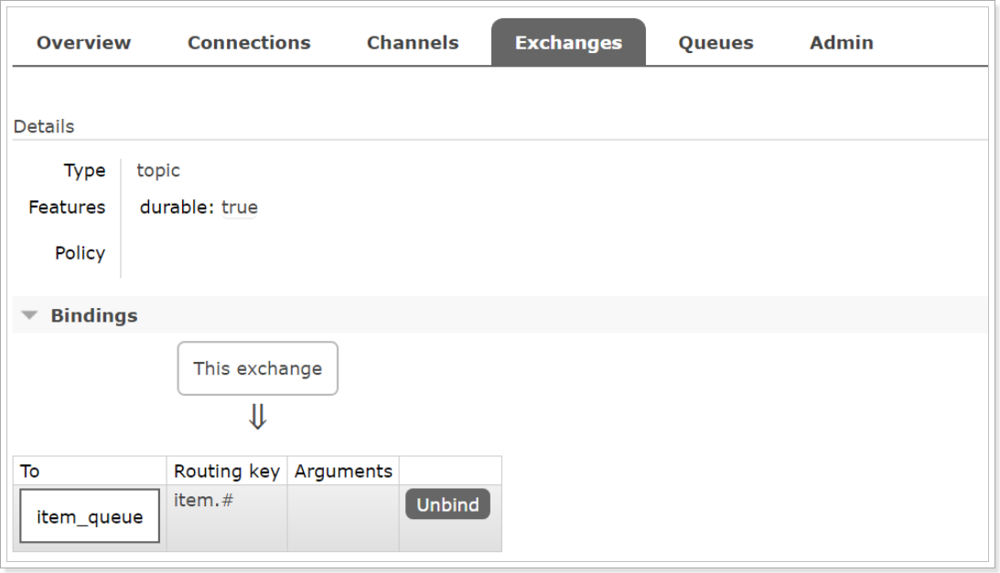

# 服务异步通信-高级篇


消息队列在使用过程中，面临着很多实际问题需要思考：

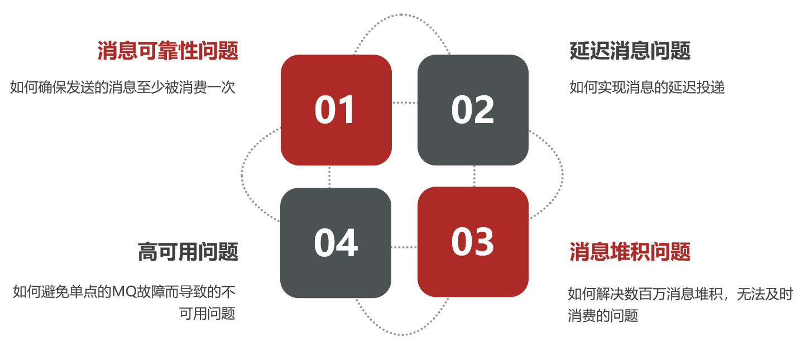


# 6.消息可靠性

消息从发送，到消费者接收，会经理多个过程：

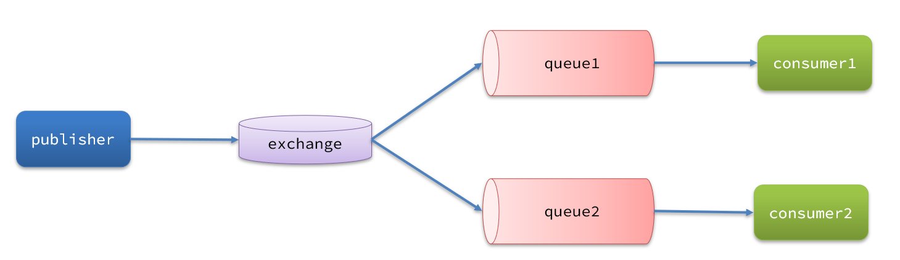


其中的每一步都可能导致消息丢失，常见的丢失原因包括：

- 发送时丢失：
  - 生产者发送的消息未送达exchange
  - 消息到达exchange后未到达queue
- MQ宕机，queue将消息丢失
- consumer接收到消息后未消费就宕机


针对这些问题，RabbitMQ分别给出了解决方案：

- 生产者确认机制
- mq持久化
- 消费者确认机制
- 失败重试机制


下面我们就通过案例来演示每一个步骤。

首先，导入课前资料提供的demo工程：


项目结构如下：

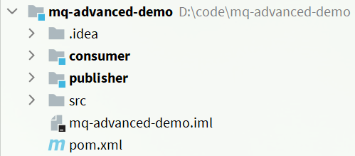


## 6.1.生产者消息确认

RabbitMQ提供了publisher confirm机制来避免消息发送到MQ过程中丢失。这种机制必须给每个消息指定一个唯一ID。消息发送到MQ以后，会返回一个结果给发送者，表示消息是否处理成功。

返回结果有两种方式：

- publisher-confirm，发送者确认
  - 消息成功投递到交换机，返回ack
  - 消息未投递到交换机，返回nack
- publisher-return，发送者回执
  - 消息投递到交换机了，但是没有路由到队列。返回ACK，及路由失败原因。


注意：

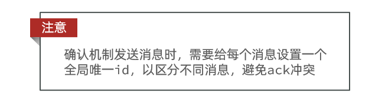


### 6.1.1.修改配置

首先，修改publisher服务中的application.yml文件，添加下面的内容：

```yaml
spring:
  rabbitmq:
    publisher-confirm-type: correlated
    publisher-returns: true
    template:
      mandatory: true
   
```

说明：

- `publish-confirm-type`：开启publisher-confirm，这里支持两种类型：
  - `simple`：同步等待confirm结果，直到超时
  - `correlated`：异步回调，定义ConfirmCallback，MQ返回结果时会回调这个ConfirmCallback
- `publish-returns`：开启publish-return功能，同样是基于callback机制，不过是定义ReturnCallback
- `template.mandatory`：定义消息路由失败时的策略。true，则调用ReturnCallback；false：则直接丢弃消息


### 6.1.2.定义Return回调

每个RabbitTemplate只能配置一个ReturnCallback，因此需要在项目加载时配置：

修改publisher服务，添加一个：

```java
package cn.itcast.mq.config;

import lombok.extern.slf4j.Slf4j;
import org.springframework.amqp.rabbit.core.RabbitTemplate;
import org.springframework.beans.BeansException;
import org.springframework.context.ApplicationContext;
import org.springframework.context.ApplicationContextAware;
import org.springframework.context.annotation.Configuration;

@Slf4j
@Configuration
public class CommonConfig implements ApplicationContextAware {
    @Override
    public void setApplicationContext(ApplicationContext applicationContext) throws BeansException {
        // 获取RabbitTemplate
        RabbitTemplate rabbitTemplate = applicationContext.getBean(RabbitTemplate.class);
        // 设置ReturnCallback
        rabbitTemplate.setReturnCallback((message, replyCode, replyText, exchange, routingKey) -> {
            // 投递失败，记录日志
            log.info("消息发送失败，应答码{}，原因{}，交换机{}，路由键{},消息{}",
                     replyCode, replyText, exchange, routingKey, message.toString());
            // 如果有业务需要，可以重发消息
        });
    }
}
```


### 6.1.3.定义ConfirmCallback

ConfirmCallback可以在发送消息时指定，因为每个业务处理confirm成功或失败的逻辑不一定相同。

在publisher服务的cn.itcast.mq.spring.SpringAmqpTest类中，定义一个单元测试方法：

```java
public void testSendMessage2SimpleQueue() throws InterruptedException {
    // 1.消息体
    String message = "hello, spring amqp!";
    // 2.全局唯一的消息ID，需要封装到CorrelationData中
    CorrelationData correlationData = new CorrelationData(UUID.randomUUID().toString());
    // 3.添加callback
    correlationData.getFuture().addCallback(
        result -> {
            if(result.isAck()){
                // 3.1.ack，消息成功
                log.debug("消息发送成功, ID:{}", correlationData.getId());
            }else{
                // 3.2.nack，消息失败
                log.error("消息发送失败, ID:{}, 原因{}",correlationData.getId(), result.getReason());
            }
        },
        ex -> log.error("消息发送异常, ID:{}, 原因{}",correlationData.getId(),ex.getMessage())
    );
    // 4.发送消息
    rabbitTemplate.convertAndSend("task.direct", "task", message, correlationData);

    // 休眠一会儿，等待ack回执
    Thread.sleep(2000);
}
```


## 6.2.消息持久化

生产者确认可以确保消息投递到RabbitMQ的队列中，但是消息发送到RabbitMQ以后，如果突然宕机，也可能导致消息丢失。

要想确保消息在RabbitMQ中安全保存，必须开启消息持久化机制。

- 交换机持久化
- 队列持久化
- 消息持久化


### 6.2.1.交换机持久化

RabbitMQ中交换机默认是非持久化的，mq重启后就丢失。

SpringAMQP中可以通过代码指定交换机持久化：

```java
@Bean
public DirectExchange simpleExchange(){
    // 三个参数：交换机名称、是否持久化、当没有queue与其绑定时是否自动删除
    return new DirectExchange("simple.direct", true, false);
}
```

事实上，默认情况下，由SpringAMQP声明的交换机都是持久化的。


可以在RabbitMQ控制台看到持久化的交换机都会带上`D`的标示：

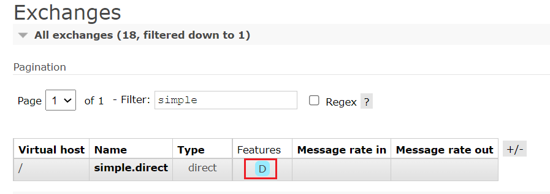


### 6.2.2.队列持久化

RabbitMQ中队列默认是非持久化的，mq重启后就丢失。

SpringAMQP中可以通过代码指定交换机持久化：

```java
@Bean
public Queue simpleQueue(){
    // 使用QueueBuilder构建队列，durable就是持久化的
    return QueueBuilder.durable("simple.queue").build();
}
```

事实上，默认情况下，由SpringAMQP声明的队列都是持久化的。

可以在RabbitMQ控制台看到持久化的队列都会带上`D`的标示：

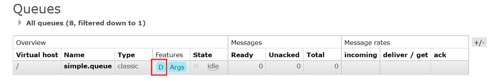


### 6.2.3.消息持久化

利用SpringAMQP发送消息时，可以设置消息的属性（MessageProperties），指定delivery-mode：

- 1：非持久化
- 2：持久化

用java代码指定：

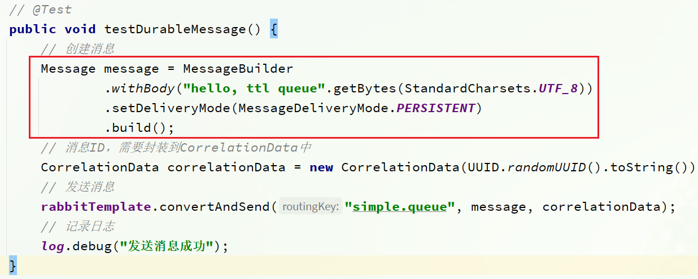


默认情况下，SpringAMQP发出的任何消息都是持久化的，不用特意指定。


## 6.3.消费者消息确认

RabbitMQ是**阅后即焚**机制，RabbitMQ确认消息被消费者消费后会立刻删除。

而RabbitMQ是通过消费者回执来确认消费者是否成功处理消息的：消费者获取消息后，应该向RabbitMQ发送ACK回执，表明自己已经处理消息。


设想这样的场景：

- 1）RabbitMQ投递消息给消费者
- 2）消费者获取消息后，返回ACK给RabbitMQ
- 3）RabbitMQ删除消息
- 4）消费者宕机，消息尚未处理

这样，消息就丢失了。因此消费者返回ACK的时机非常重要。


而SpringAMQP则允许配置三种确认模式：

•manual：手动ack，需要在业务代码结束后，调用api发送ack。

•auto：自动ack，由spring监测listener代码是否出现异常，没有异常则返回ack；抛出异常则返回nack

•none：关闭ack，MQ假定消费者获取消息后会成功处理，因此消息投递后立即被删除


由此可知：

- none模式下，消息投递是不可靠的，可能丢失
- auto模式类似事务机制，出现异常时返回nack，消息回滚到mq；没有异常，返回ack
- manual：自己根据业务情况，判断什么时候该ack

一般，我们都是使用默认的auto即可。


### 6.3.1.演示none模式

修改consumer服务的application.yml文件，添加下面内容：

```yaml
spring:
  rabbitmq:
    listener:
      simple:
        acknowledge-mode: none # 关闭ack
```

修改consumer服务的SpringRabbitListener类中的方法，模拟一个消息处理异常：

```java
@RabbitListener(queues = "simple.queue")
public void listenSimpleQueue(String msg) {
    log.info("消费者接收到simple.queue的消息：【{}】", msg);
    // 模拟异常
    System.out.println(1 / 0);
    log.debug("消息处理完成！");
}
```

测试可以发现，当消息处理抛异常时，消息依然被RabbitMQ删除了。


### 6.3.2.演示auto模式

再次把确认机制修改为auto:

```yaml
spring:
  rabbitmq:
    listener:
      simple:
        acknowledge-mode: auto # 关闭ack
```

在异常位置打断点，再次发送消息，程序卡在断点时，可以发现此时消息状态为unack（未确定状态）：

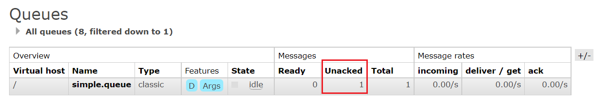

抛出异常后，因为Spring会自动返回nack，所以消息恢复至Ready状态，并且没有被RabbitMQ删除：

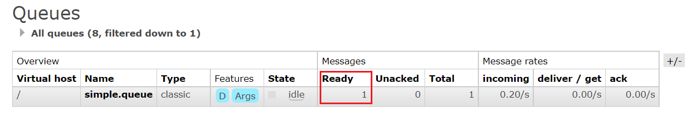


## 6.4.消费失败重试机制

当消费者出现异常后，消息会不断requeue（重入队）到队列，再重新发送给消费者，然后再次异常，再次requeue，无限循环，导致mq的消息处理飙升，带来不必要的压力：

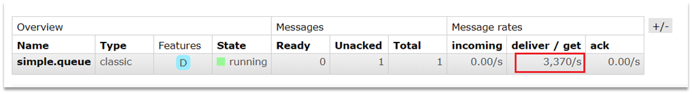

怎么办呢？


### 6.4.1.本地重试

我们可以利用Spring的retry机制，在消费者出现异常时利用本地重试，而不是无限制的requeue到mq队列。

修改consumer服务的application.yml文件，添加内容：

```yaml
spring:
  rabbitmq:
    listener:
      simple:
        retry:
          enabled: true # 开启消费者失败重试
          initial-interval: 1000 # 初识的失败等待时长为1秒
          multiplier: 1 # 失败的等待时长倍数，下次等待时长 = multiplier * last-interval
          max-attempts: 3 # 最大重试次数
          stateless: true # true无状态；false有状态。如果业务中包含事务，这里改为false
```


重启consumer服务，重复之前的测试。可以发现：

- 在重试3次后，SpringAMQP会抛出异常AmqpRejectAndDontRequeueException，说明本地重试触发了
- 查看RabbitMQ控制台，发现消息被删除了，说明最后SpringAMQP返回的是ack，mq删除消息了


结论：

- 开启本地重试时，消息处理过程中抛出异常，不会requeue到队列，而是在消费者本地重试
- 重试达到最大次数后，Spring会返回ack，消息会被丢弃


### 6.4.2.失败策略

在之前的测试中，达到最大重试次数后，消息会被丢弃，这是由Spring内部机制决定的。

在开启重试模式后，重试次数耗尽，如果消息依然失败，则需要有MessageRecovery接口来处理，它包含三种不同的实现：

- RejectAndDontRequeueRecoverer：重试耗尽后，直接reject，丢弃消息。默认就是这种方式

- ImmediateRequeueMessageRecoverer：重试耗尽后，返回nack，消息重新入队

- RepublishMessageRecoverer：重试耗尽后，将失败消息投递到指定的交换机


比较优雅的一种处理方案是RepublishMessageRecoverer，失败后将消息投递到一个指定的，专门存放异常消息的队列，后续由人工集中处理。


1）在consumer服务中定义处理失败消息的交换机和队列

```java
@Bean
public DirectExchange errorMessageExchange(){
    return new DirectExchange("error.direct");
}
@Bean
public Queue errorQueue(){
    return new Queue("error.queue", true);
}
@Bean
public Binding errorBinding(Queue errorQueue, DirectExchange errorMessageExchange){
    return BindingBuilder.bind(errorQueue).to(errorMessageExchange).with("error");
}
```


2）定义一个RepublishMessageRecoverer，关联队列和交换机

```java
@Bean
public MessageRecoverer republishMessageRecoverer(RabbitTemplate rabbitTemplate){
    return new RepublishMessageRecoverer(rabbitTemplate, "error.direct", "error");
}
```


完整代码：

```java
package cn.itcast.mq.config;

import org.springframework.amqp.core.Binding;
import org.springframework.amqp.core.BindingBuilder;
import org.springframework.amqp.core.DirectExchange;
import org.springframework.amqp.core.Queue;
import org.springframework.amqp.rabbit.core.RabbitTemplate;
import org.springframework.amqp.rabbit.retry.MessageRecoverer;
import org.springframework.amqp.rabbit.retry.RepublishMessageRecoverer;
import org.springframework.context.annotation.Bean;

@Configuration
public class ErrorMessageConfig {
    @Bean
    public DirectExchange errorMessageExchange(){
        return new DirectExchange("error.direct");
    }
    @Bean
    public Queue errorQueue(){
        return new Queue("error.queue", true);
    }
    @Bean
    public Binding errorBinding(Queue errorQueue, DirectExchange errorMessageExchange){
        return BindingBuilder.bind(errorQueue).to(errorMessageExchange).with("error");
    }

    @Bean
    public MessageRecoverer republishMessageRecoverer(RabbitTemplate rabbitTemplate){
        return new RepublishMessageRecoverer(rabbitTemplate, "error.direct", "error");
    }
}
```


## 6.5.总结

如何确保RabbitMQ消息的可靠性？

- 开启生产者确认机制，确保生产者的消息能到达队列
- 开启持久化功能，确保消息未消费前在队列中不会丢失
- 开启消费者确认机制为auto，由spring确认消息处理成功后完成ack
- 开启消费者失败重试机制，并设置MessageRecoverer，多次重试失败后将消息投递到异常交换机，交由人工处理


# 7.死信交换机


## 7.1.初识死信交换机


### 7.1.1.什么是死信交换机

什么是死信？

当一个队列中的消息满足下列情况之一时，可以成为死信（dead letter）：

- 消费者使用basic.reject或 basic.nack声明消费失败，并且消息的requeue参数设置为false
- 消息是一个过期消息，超时无人消费
- 要投递的队列消息满了，无法投递


如果这个包含死信的队列配置了`dead-letter-exchange`属性，指定了一个交换机，那么队列中的死信就会投递到这个交换机中，而这个交换机称为**死信交换机**（Dead Letter Exchange，检查DLX）。


如图，一个消息被消费者拒绝了，变成了死信：

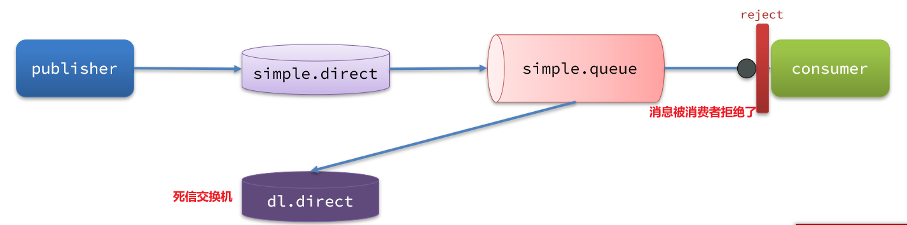

因为simple.queue绑定了死信交换机 dl.direct，因此死信会投递给这个交换机：

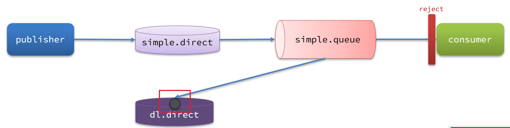

如果这个死信交换机也绑定了一个队列，则消息最终会进入这个存放死信的队列：


另外，队列将死信投递给死信交换机时，必须知道两个信息：

- 死信交换机名称
- 死信交换机与死信队列绑定的RoutingKey

这样才能确保投递的消息能到达死信交换机，并且正确的路由到死信队列。

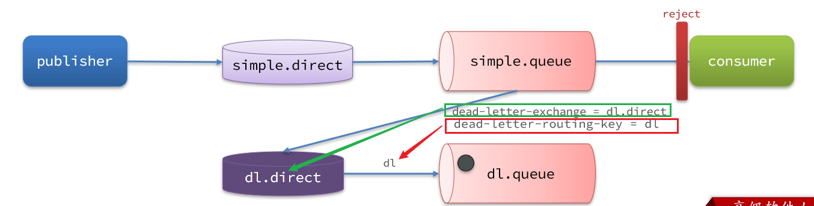


### 7.1.2.利用死信交换机接收死信（拓展）

在失败重试策略中，默认的RejectAndDontRequeueRecoverer会在本地重试次数耗尽后，发送reject给RabbitMQ，消息变成死信，被丢弃。


我们可以给simple.queue添加一个死信交换机，给死信交换机绑定一个队列。这样消息变成死信后也不会丢弃，而是最终投递到死信交换机，路由到与死信交换机绑定的队列。


我们在consumer服务中，定义一组死信交换机、死信队列：

```java
// 声明普通的 simple.queue队列，并且为其指定死信交换机：dl.direct
@Bean
public Queue simpleQueue2(){
    return QueueBuilder.durable("simple.queue") // 指定队列名称，并持久化
        .deadLetterExchange("dl.direct") // 指定死信交换机
        .build();
}
// 声明死信交换机 dl.direct
@Bean
public DirectExchange dlExchange(){
    return new DirectExchange("dl.direct", true, false);
}
// 声明存储死信的队列 dl.queue
@Bean
public Queue dlQueue(){
    return new Queue("dl.queue", true);
}
// 将死信队列 与 死信交换机绑定
@Bean
public Binding dlBinding(){
    return BindingBuilder.bind(dlQueue()).to(dlExchange()).with("simple");
}
```


### 7.1.3.总结

什么样的消息会成为死信？

- 消息被消费者reject或者返回nack
- 消息超时未消费
- 队列满了

死信交换机的使用场景是什么？

- 如果队列绑定了死信交换机，死信会投递到死信交换机；
- 可以利用死信交换机收集所有消费者处理失败的消息（死信），交由人工处理，进一步提高消息队列的可靠性。


## 7.2.TTL

一个队列中的消息如果超时未消费，则会变为死信，超时分为两种情况：

- 消息所在的队列设置了超时时间
- 消息本身设置了超时时间


### 7.2.1.接收超时死信的死信交换机

在consumer服务的SpringRabbitListener中，定义一个新的消费者，并且声明 死信交换机、死信队列：

```java
@RabbitListener(bindings = @QueueBinding(
    value = @Queue(name = "dl.ttl.queue", durable = "true"),
    exchange = @Exchange(name = "dl.ttl.direct"),
    key = "ttl"
))
public void listenDlQueue(String msg){
    log.info("接收到 dl.ttl.queue的延迟消息：{}", msg);
}
```


### 7.2.2.声明一个队列，并且指定TTL

要给队列设置超时时间，需要在声明队列时配置x-message-ttl属性：

```java
@Bean
public Queue ttlQueue(){
    return QueueBuilder.durable("ttl.queue") // 指定队列名称，并持久化
        .ttl(10000) // 设置队列的超时时间，10秒
        .deadLetterExchange("dl.ttl.direct") // 指定死信交换机
        .build();
}
```

注意，这个队列设定了死信交换机为`dl.ttl.direct`


声明交换机，将ttl与交换机绑定：

```java
@Bean
public DirectExchange ttlExchange(){
    return new DirectExchange("ttl.direct");
}
@Bean
public Binding ttlBinding(){
    return BindingBuilder.bind(ttlQueue()).to(ttlExchange()).with("ttl");
}
```


发送消息，但是不要指定TTL：

```java
@Test
public void testTTLQueue() {
    // 创建消息
    String message = "hello, ttl queue";
    // 消息ID，需要封装到CorrelationData中
    CorrelationData correlationData = new CorrelationData(UUID.randomUUID().toString());
    // 发送消息
    rabbitTemplate.convertAndSend("ttl.direct", "ttl", message, correlationData);
    // 记录日志
    log.debug("发送消息成功");
}
```

发送消息的日志：

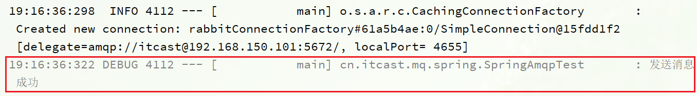


查看下接收消息的日志：

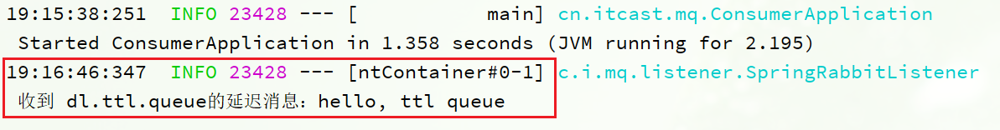


因为队列的TTL值是10000ms，也就是10秒。可以看到消息发送与接收之间的时差刚好是10秒。


### 7.2.3.发送消息时，设定TTL

在发送消息时，也可以指定TTL：

```java
@Test
public void testTTLMsg() {
    // 创建消息
    Message message = MessageBuilder
        .withBody("hello, ttl message".getBytes(StandardCharsets.UTF_8))
        .setExpiration("5000")
        .build();
    // 消息ID，需要封装到CorrelationData中
    CorrelationData correlationData = new CorrelationData(UUID.randomUUID().toString());
    // 发送消息
    rabbitTemplate.convertAndSend("ttl.direct", "ttl", message, correlationData);
    log.debug("发送消息成功");
}
```


查看发送消息日志：

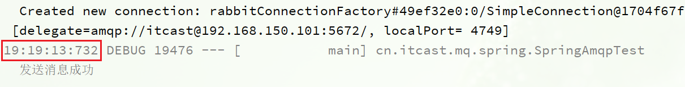

接收消息日志：

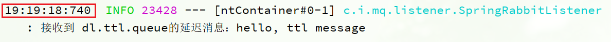


这次，发送与接收的延迟只有5秒。说明当队列、消息都设置了TTL时，任意一个到期就会成为死信。


### 7.2.4.总结

消息超时的两种方式是？

- 给队列设置ttl属性，进入队列后超过ttl时间的消息变为死信
- 给消息设置ttl属性，队列接收到消息超过ttl时间后变为死信

如何实现发送一个消息20秒后消费者才收到消息？

- 给消息的目标队列指定死信交换机
- 将消费者监听的队列绑定到死信交换机
- 发送消息时给消息设置超时时间为20秒


## 7.3.延迟队列

利用TTL结合死信交换机，我们实现了消息发出后，消费者延迟收到消息的效果。这种消息模式就称为延迟队列（Delay Queue）模式。

延迟队列的使用场景包括：

- 延迟发送短信
- 用户下单，如果用户在15 分钟内未支付，则自动取消
- 预约工作会议，20分钟后自动通知所有参会人员


因为延迟队列的需求非常多，所以RabbitMQ的官方也推出了一个插件，原生支持延迟队列效果。

这个插件就是DelayExchange插件。参考RabbitMQ的插件列表页面：https://www.rabbitmq.com/community-plugins.html

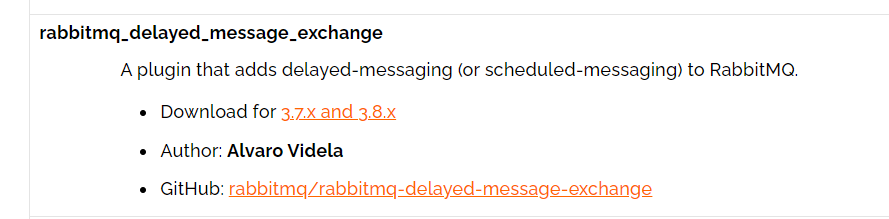


使用方式可以参考官网地址：https://blog.rabbitmq.com/posts/2015/04/scheduling-messages-with-rabbitmq


### 7.3.1.安装DelayExchange插件

参考课前资料：

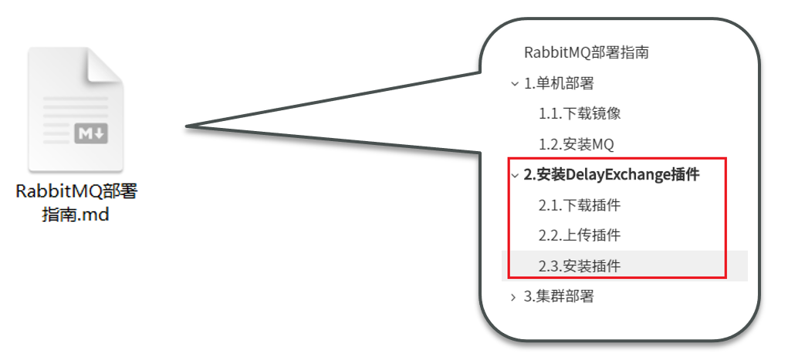


### 7.3.2.DelayExchange原理

DelayExchange需要将一个交换机声明为delayed类型。当我们发送消息到delayExchange时，流程如下：

- 接收消息
- 判断消息是否具备x-delay属性
- 如果有x-delay属性，说明是延迟消息，持久化到硬盘，读取x-delay值，作为延迟时间
- 返回routing not found结果给消息发送者
- x-delay时间到期后，重新投递消息到指定队列


### 7.3.3.使用DelayExchange

插件的使用也非常简单：声明一个交换机，交换机的类型可以是任意类型，只需要设定delayed属性为true即可，然后声明队列与其绑定即可。

#### 6）声明DelayExchange交换机

基于注解方式（推荐）：

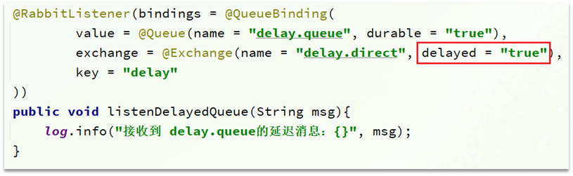

也可以基于@Bean的方式：

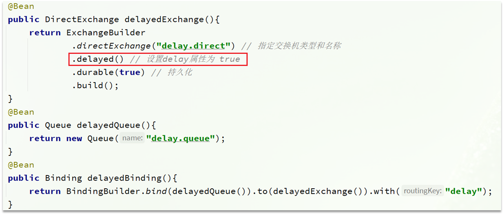


#### 7）发送消息

发送消息时，一定要携带x-delay属性，指定延迟的时间：

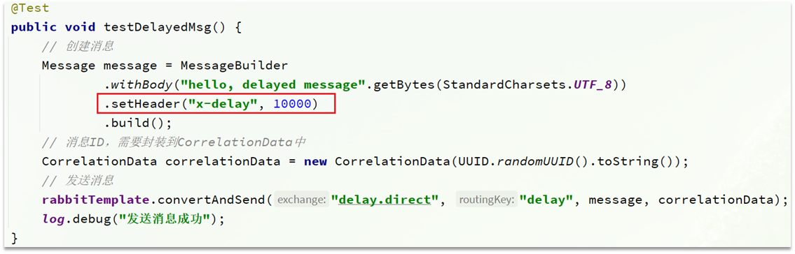


### 7.3.4.总结

延迟队列插件的使用步骤包括哪些？

•声明一个交换机，添加delayed属性为true

•发送消息时，添加x-delay头，值为超时时间


# 8.惰性队列

## 8.1.消息堆积问题

当生产者发送消息的速度超过了消费者处理消息的速度，就会导致队列中的消息堆积，直到队列存储消息达到上限。之后发送的消息就会成为死信，可能会被丢弃，这就是消息堆积问题。


解决消息堆积有两种思路：

- 增加更多消费者，提高消费速度。也就是我们之前说的work queue模式
- 扩大队列容积，提高堆积上限


要提升队列容积，把消息保存在内存中显然是不行的。


## 8.2.惰性队列

从RabbitMQ的3.6.0版本开始，就增加了Lazy Queues的概念，也就是惰性队列。惰性队列的特征如下：

- 接收到消息后直接存入磁盘而非内存
- 消费者要消费消息时才会从磁盘中读取并加载到内存
- 支持数百万条的消息存储


### 8.2.1.基于命令行设置lazy-queue

而要设置一个队列为惰性队列，只需要在声明队列时，指定x-queue-mode属性为lazy即可。可以通过命令行将一个运行中的队列修改为惰性队列：

```sh
rabbitmqctl set_policy Lazy "^lazy-queue$" '{"queue-mode":"lazy"}' --apply-to queues  
```

命令解读：

- `rabbitmqctl` ：RabbitMQ的命令行工具
- `set_policy` ：添加一个策略
- `Lazy` ：策略名称，可以自定义
- `"^lazy-queue$"` ：用正则表达式匹配队列的名字
- `'{"queue-mode":"lazy"}'` ：设置队列模式为lazy模式
- `--apply-to queues  `：策略的作用对象，是所有的队列


### 8.2.2.基于@Bean声明lazy-queue

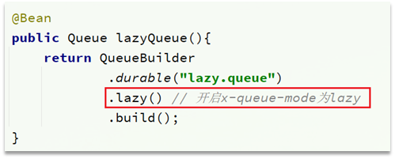

### 8.2.3.基于@RabbitListener声明LazyQueue

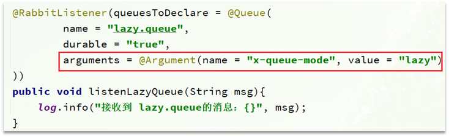


### 8.3.总结

消息堆积问题的解决方案？

- 队列上绑定多个消费者，提高消费速度
- 使用惰性队列，可以再mq中保存更多消息

惰性队列的优点有哪些？

- 基于磁盘存储，消息上限高
- 没有间歇性的page-out，性能比较稳定

惰性队列的缺点有哪些？

- 基于磁盘存储，消息时效性会降低
- 性能受限于磁盘的IO


# 9.MQ集群


## 9.1.集群分类

RabbitMQ的是基于Erlang语言编写，而Erlang又是一个面向并发的语言，天然支持集群模式。RabbitMQ的集群有两种模式：

•**普通集群**：是一种分布式集群，将队列分散到集群的各个节点，从而提高整个集群的并发能力。

•**镜像集群**：是一种主从集群，普通集群的基础上，添加了主从备份功能，提高集群的数据可用性。


镜像集群虽然支持主从，但主从同步并不是强一致的，某些情况下可能有数据丢失的风险。因此在RabbitMQ的3.8版本以后，推出了新的功能：**仲裁队列**来代替镜像集群，底层采用Raft协议确保主从的数据一致性。


## 9.2.普通集群


### 9.2.1.集群结构和特征

普通集群，或者叫标准集群（classic cluster），具备下列特征：

- 会在集群的各个节点间共享部分数据，包括：交换机、队列元信息。不包含队列中的消息。
- 当访问集群某节点时，如果队列不在该节点，会从数据所在节点传递到当前节点并返回
- 队列所在节点宕机，队列中的消息就会丢失

结构如图：


### 9.2.2.部署

参考课前资料：《RabbitMQ部署指南.md》


## 9.3.镜像集群


### 9.3.1.集群结构和特征

镜像集群：本质是主从模式，具备下面的特征：

- 交换机、队列、队列中的消息会在各个mq的镜像节点之间同步备份。
- 创建队列的节点被称为该队列的**主节点，**备份到的其它节点叫做该队列的**镜像**节点。
- 一个队列的主节点可能是另一个队列的镜像节点
- 所有操作都是主节点完成，然后同步给镜像节点
- 主宕机后，镜像节点会替代成新的主

结构如图：


### 9.3.2.部署

参考课前资料：《RabbitMQ部署指南.md》


## 9.4.仲裁队列


### 9.4.1.集群特征

仲裁队列：仲裁队列是3.8版本以后才有的新功能，用来替代镜像队列，具备下列特征：

- 与镜像队列一样，都是主从模式，支持主从数据同步
- 使用非常简单，没有复杂的配置
- 主从同步基于Raft协议，强一致


### 9.4.2.部署

参考课前资料：《RabbitMQ部署指南.md》


### 9.4.3.Java代码创建仲裁队列

```java
@Bean
public Queue quorumQueue() {
    return QueueBuilder
        .durable("quorum.queue") // 持久化
        .quorum() // 仲裁队列
        .build();
}
```


### 9.4.4.SpringAMQP连接MQ集群

注意，这里用address来代替host、port方式

```java
spring:
  rabbitmq:
    addresses: 192.168.150.105:8071, 192.168.150.105:8072, 192.168.150.105:8073
    username: itcast
    password: 123321
    virtual-host: /
```
