# JSP-页面技术

## 1 JSP基础

### 1.1 JSP简介

JSP全称是Java Server Page，它和Servlet一样，也是sun公司推出的一套开发动态web资源的技术，称为JSP/Servlet规范。JSP的本质其实就是一个Servlet。

### 1.2 JSP和HTML以及Servlet的适用场景

| 类别    | 适用场景                                                     |
| ------- | ------------------------------------------------------------ |
| HTML    | 只能开发静态资源，不能包含java代码，无法添加动态数据。       |
| Servlet | 写java代码，可以输出页面内容，但是很不方便，开发效率极低。   |
| JSP     | 它包括了HTML的展示技术，同时具备Servlet输出动态资源的能力。但是不适合作为控制器来用。 |

### 1.3 JSP简单入门

**创建JavaWeb工程**

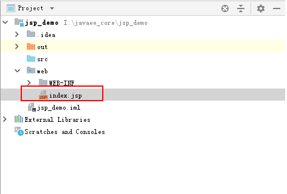

**在index.jsp中填写内容**

```jsp
<%@ page contentType="text/html;charset=UTF-8" language="java" %>
<html>
  <head>
    <title>JSP的入门</title>
  </head>
  <body>
      这是第一个JSP页面
  </body>
</html>
```

**部署项目**

沿用会话管理工程的部署方式即可。

**测试运行**

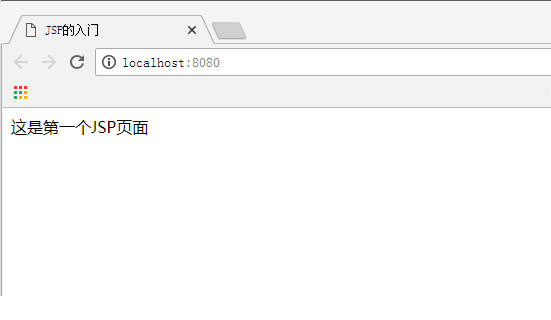

### 1.4 JSP说明

写在之前： 明确JSP就是一个Servlet。是一个特殊的Servlet。

JSP的原理：

​           客户端提交请求

​				——Tomcat服务器解析请求地址

​						——找到JSP页面

​								——Tomcat将JSP页面翻译成Servlet的java文件

​										——将翻译好的.java文件编译成.class文件

​												——返回到客户浏览器上。

#### 1）执行过程分析图


#### 2）JSP的.java文件内容分析

当我们打开index.jsp翻译的java文件看到的就是`public final class index_jsp extends org.apache.jasper.runtime.HttpJspBase`类的声明，然后我们在Tomcat的源码中找到类的声明，如下图：


这张图一出场，就表明我们写的JSP它本质就是一个HttpServlet了。

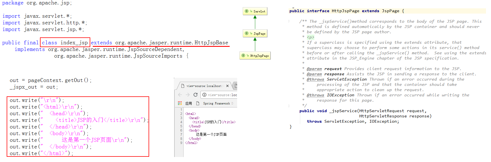

同时，我们在index_jsp.java文件中找到了输出页面的代码，并且在浏览器端查看源文件，看到的内容是一样的。这也就是说明，我们的浏览器上的内容，在通过jsp展示时，本质都是用out.write()输出出来的。

讲到这里，我们应该清楚的认识到，JSP它是一个特殊的Servlet，主要是用于展示动态数据。它展示的方式是用流把数据输出出来，而我们在使用JSP时，涉及HTML的部分，都与HTML的用法一致，这部分称为jsp中的模板元素，在开发过程中，先写好这些模板元素，因为它们决定了页面的外观。

## 2 JSP应用

### 2.1 JSP语法

#### 1）Java代码块

在jsp中，可以使用java脚本代码。形式为：<font color='red'><b><% 此处写java代码 %></b></font>

但是，在实际开发中，极少使用此种形式编写java代码。同时需要注意的是：

```jsp
<%
	在里面写java程序脚本需要注意：这里面的内容由tomcat负责翻译，翻译之后是service方法的成员变量
%>
```

**示例：**

```jsp
<!--Java代码块-->
<% out.println("这是Java代码块");%>
<hr/>
```

#### 2）JSP表达式

在jsp中，可以使用特定表达式语法，形式为：<font color='red'><b><%=表达式%></b></font>

jsp在翻译完后是out.print(表达式内容);

所以：<%out.print("当前时间);%>和<%="当前时间"%>是一样的。

在实际开发中，这种表达式语法用的也很少使用。

**示例：**

```jsp
<!--JSP表达式-->
<%="这是JSP表达式"%><br/>
就相当于<br/>
<%out.println("这是没有JSP表达式输出的");%>
```

#### 3）JSP声明

在JSP中也可以声明一些变量，方法，静态方法，形式为：<font color='red'><b><%! 声明的内容 %></b></font>

使用JSP声明需要注意：

```jsp
<%! 
	需要注意的是： 写在里面的内容将会被tomcat翻译成全局的属性或者类方法。
%>                                    
```

**示例：**

```jsp
<!--JSP声明-->
<%! String str = "声明语法格式";%>
<%=str%>
```

#### 4）JSP注释

在使用JSP时，它有自己的注释，形式为：<font color='red'><b><%--注释--%></b></font>

需要注意的是：

​      在Jsp中可以使用html的注释，但是只能注释html元素，不能注释java程序片段和表达式。同时，被html注释部分会参与翻译，并且会在浏览器上显示

​      jsp的注释不仅可以注释java程序片段，也可以注释html元素，并且被jsp注释的部分不会参与翻译成.java文件，也不会在浏览器上显示。

**示例：**

```jsp
<%--JSP注释--%>
<!--HTML注释-->
```

#### 5）语法的示例

**JSP语法完整示例代码**

```jsp
<%@ page contentType="text/html;charset=UTF-8" language="java" %>
<html>
<head>
    <title>JSP语法</title>
</head>
<body>

<!--Java代码块-->
<% out.println("这是Java代码块");%>
<hr/>

<!--JSP表达式-->
<%="这是JSP表达式"%><br/>
就相当于<br/>
<%out.println("这是没有JSP表达式输出的");%>

<hr/>
<!--JSP声明-->
<%! String str = "声明语法格式";%>
<%=str%>

<hr/>

<%--JSP注释--%>
<!--HTML注释-->

</body>
</html>
```

**JSP语法运行结果**

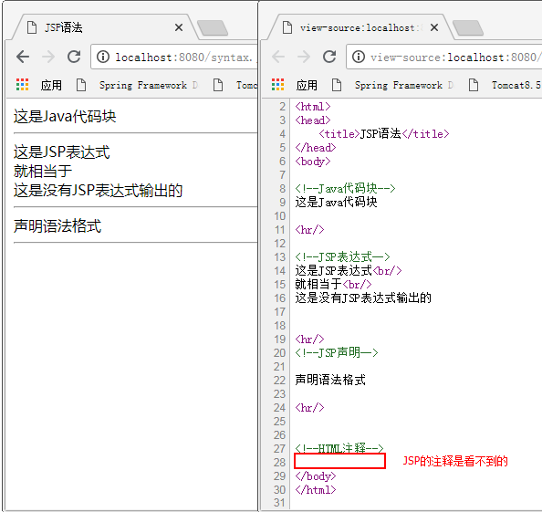

### 2.2 JSP指令

#### 1）page指令

**language:**告知引擎，脚本使用的是java，默认是java，支持java。不写也行。

**extends**：告知引擎，JSP对应的Servlet的父类是哪个，不需要写，也不需要改。

**import**：告知引擎，导入哪些包（类）。

​                **注意：引擎会自动导入：java.lang.\*,javax.servlet.\*,javax.servlet.http.\*,javax.servlet.jsp.\***

​                    **导入的形式：** 

​                         **<%@page import=”java.util.Date,java.util.UUID”%>或者：**

​                         **<%@page import=”java.util.Date”%>**

​                         **<%@page import=”java.util.UUID”%>**  **用Eclipse：Alt+/ 自动导入**

**session**：告知引擎是否产生HttpSession对象，即是否在代码中调用request.getSession()。默认是true。

**buffer**：JspWriter用于输出JSP内容到页面上。告知引擎，设定他的缓存大小。默认8kb。

**errorPage**：告知引擎，当前页面出现异常后，应该转发到哪个页面上（路径写法：/代表当前应用）

​                	**小贴士：当在errorpage上使用了isErrorPage=true之后，ie8有时候不能正常显示**

​            		 **配置全局错误页面：web.xml**


```xml
<error-page>    
    <exception-type>java.lang.Exception</exception-type>    			
    <location>/error.jsp</location>
</error-page>
<error-page>
    <error-code>404</error-code>
    <location>/404.html</location>
</error-page>                                 
```

​           		 **当使用了全局错误页面，就无须再写errorPage来实现转到错误页面，而是由服务器负责跳转到错误页面。**

**isErrorPage**：告知引擎，是否抓住异常。如果该属性为true，页面中就可以使用exception对象，打印异常的详细信息。默认值是false。

**contentType**：告知引擎，响应正文的MIME类型。contentType="text/html;charset=UTF-8"

​               			相当于response.setContentType("text/html;charset=UTF-8");

**pageEncoding**：告知引擎，翻译jsp时（从磁盘上读取jsp文件）所用的码表。pageEncoding="UTF-8"相当于告知引擎用UTF-8读取JSP

**isELIgnored***：告知引擎，是否忽略EL表达式，默认值是false，不忽略。

#### 2）include指令

语法格式：<%@include file="" %>该指令是包含外部页面。 

属性：file，以/开头，就代表当前应用。

**使用示例**


**静态包含的特点**


#### 3）taglib指令

语法格式：<%taglib uri="" prefix=""%>

作用：该指令用于引入外部标签库。html标签和jsp标签不用引入。

属性：                                                                                   

​       uri：外部标签的URI地址。

​       prefix：使用标签时的前缀。

### 2.3 JSP细节

#### 1）九大隐式对象

什么是隐式对象呢？它指的是在jsp中，可以不声明就直接使用的对象。它只存在于jsp中，因为java类中的变量必须要先声明再使用。其实jsp中的隐式对象也并非是未声明，只是它是在翻译成.java文件时声明的。所以我们在jsp中可以直接使用。

| 隐式对象名称 | 类型                                   | 备注                          |
| ------------ | -------------------------------------- | ----------------------------- |
| request      | javax.servlet.http.HttpServletRequest  |                               |
| response     | javax.servlet.http.HttpServletResponse |                               |
| session      | javax.servlet.http.HttpSession         | Page指令可以控制开关          |
| application  | javax.servlet.ServletContext           |                               |
| page         | Java.lang.Object                       | 当前jsp对应的servlet引用实例  |
| config       | javax.servlet.ServletConfig            |                               |
| exception    | java.lang.Throwable                    | page指令有开关                |
| out          | javax.servlet.jsp.JspWriter            | 字符输出流，相当于printwriter |
| pageContext  | javax.servlet.jsp.PageContext          | 很重要                        |

#### 2）PageContext对象

**简介**

它是JSP独有的对象，Servlet中没有这个对象。本身也是一个域（作用范围）对象，但是它可以操作其他3个域对象中的属性。而且还可以获取其他8个隐式对象。

**生命周期**

它是一个局部变量，所以它的生命周期随着JSP的创建而诞生，随着JSP的结束而消失。每个JSP页面都有一个独立的PageContext。

**常用方法**

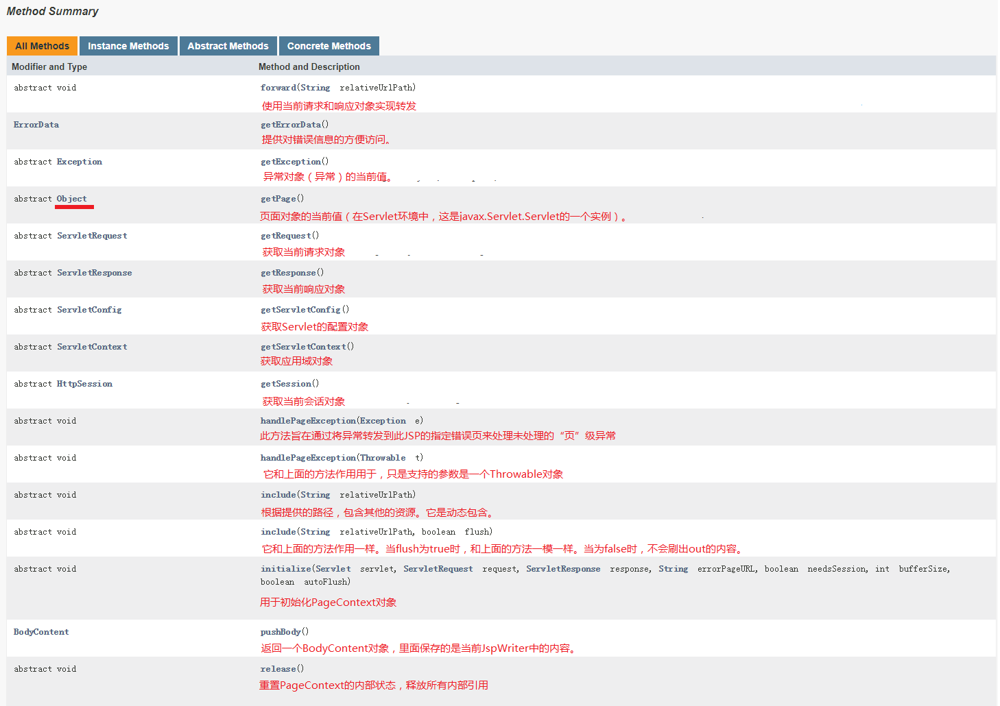

在上图中，同学们发现没有页面域操作的方法，其实是定义在了PageContext的父类JspContext中，如下图所示：

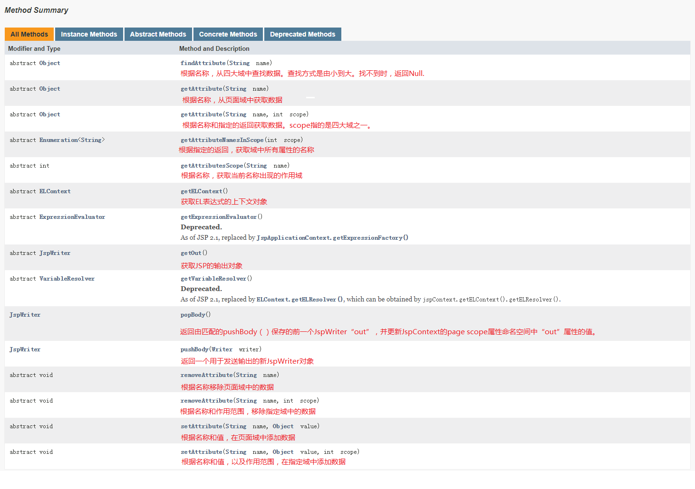

#### 3）四大域对象

| 域对象名称     | 范围     | 级别                     | 备注                                     |
| -------------- | -------- | ------------------------ | ---------------------------------------- |
| PageContext    | 页面范围 | 最小，只能在当前页面用   | 因范围太小，开发中用的很少               |
| ServletRequest | 请求范围 | 一次请求或当期请求转发用 | 当请求转发之后，再次转发时请求域丢失     |
| HttpSession    | 会话范围 | 多次请求数据共享时使用   | 多次请求共享数据，但不同的客户端不能共享 |
| ServletContext | 应用范围 | 最大，整个应用都可以使用 | 尽量少用，如果对数据有修改需要做同步处理 |

### 2.4 JSP最佳实战-MVC模型

**Servlet：**擅长处理业务逻辑，不擅长输出显示界面。在web开发中多用于控制程序逻辑（流程）。所以我们称之为：控制器。

**JSP：**擅长显示界面，不擅长处理程序逻辑。在web开发中多用于展示动态界面。所以我们称之为：视图。

例如:               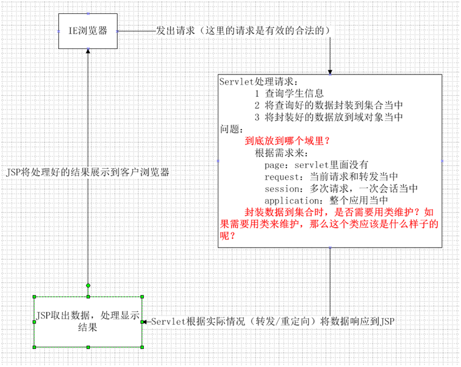                                                                      

M：model      ，通常用于封装数据，封装的是数据模型。

V：view	       ，通常用于展示数据。动态展示用jsp页面，静态数据展示用html。

C：controller ，通常用于处理请求和响应。一般指的是Servlet。


## 3 EL表达式

### 3.1 EL表达式

#### 3.1.1 EL表达式概述

**基本概念**

EL表达式，全称是Expression Language。意为表达式语言。它是Servlet规范中的一部分，是JSP2.0规范加入的内容。其作用是用于在JSP页面中获取数据，从而让我们的JSP脱离java代码块和JSP表达式。

**基本语法**

EL表达式的语法格式非常简单，写为 <b><font color='red' size='5'>${表达式内容}</font></b>

例如：在浏览器中输出请求域中名称为message的内容。

假定，我们在请求域中存入了一个名称为message的数据（`request.setAttribute("message","EL");`），此时在jsp中获取的方式，如下表显示：

| Java代码块                                                   | JSP表达式                              | EL表达式                              |
| :----------------------------------------------------------- | :------------------------------------- | :------------------------------------ |
| `<%<br/> <br/> String message = (String)request.getAttribute("message");<br/> out.write(message);<br/>%>` | `<%=request.getAttribute("message")%>` | <font color='red'>`${message}`</font> |

通过上面我们可以看出，都可以从请求域中获取数据，但是EL表达式写起来是最简单的方式。这也是以后我们在实际开发中，当使用JSP作为视图时，绝大多数都会采用的方式。

#### 3.1.2 EL表达式的入门案例

**第一步：创建JavaWeb工程**

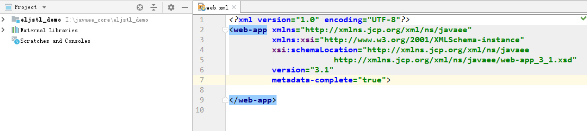

**第二步：创建jsp页面**

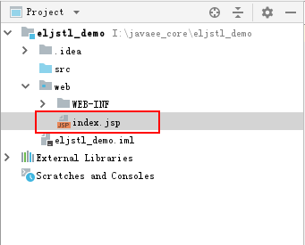

**第三步：在JSP页面中编写代码**

```jsp
<%@ page contentType="text/html;charset=UTF-8" language="java" %>
<html>
  <head>
    <title>EL表达式入门案例</title>
  </head>
  <body>
    <%--使用java代码在请求域中存入一个名称为message的数据--%>
    <% request.setAttribute("message","Expression Language");%>

    Java代码块获取：<% out.print(request.getAttribute("message"));%>
    <br/>
    JSP表达式获取：<%=request.getAttribute("message")%>
    <br/>
    EL表达式获取：${message}
  </body>
</html>
```

**第四步：部署工程**

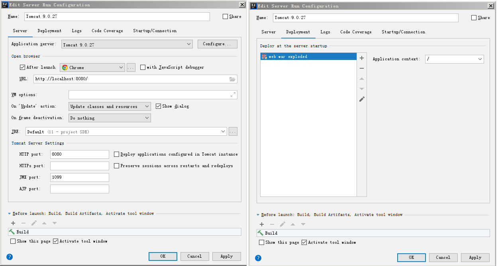

**第五步：运行测试**

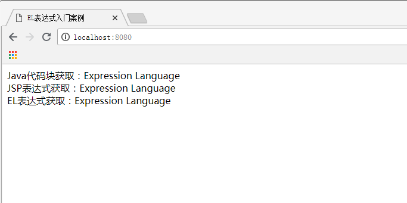

### 3.2 EL表达式基本用法

在前面的概述介绍中，我们介绍了EL表达式的作用，它就是用于获取数据的，那么它是从哪获取数据呢？

#### 1）获取四大域中的数据

它只能从四大域中获取数据，调用的就是`findAttribute(name,value);`方法，根据名称由小到大逐个域中查找，找到就返回，找不到就什么都不显示。

它可以获取对象，可以是对象中关联其他对象，可以是一个List集合，也可以是一个Map集合。具体代码如下：

**创建两个实体类，User和Address**

```java
/**
 * 用户的实体类
 * @author 黑马程序员
 * @Company http://www.itheima.com
 */
public class User implements Serializable{

	private String name = "黑马程序员";
	private int age = 18;
	private Address address = new Address();
	
	public String getName() {
		return name;
	}
	public void setName(String name) {
		this.name = name;
	}
	public int getAge() {
		return age;
	}
	public void setAge(int age) {
		this.age = age;
	}
	public Address getAddress() {
		return address;
	}
	public void setAddress(Address address) {
		this.address = address;
	}	
}
```

```java
/**
 * 地址的实体类
 * @author 黑马程序员
 * @Company http://www.itheima.com
 */
public class Address implements Serializable {

	private String province = "北京";
	private String city = "昌平区";
	public String getProvince() {
		return province;
	}
	public void setProvince(String province) {
		this.province = province;
	}
	public String getCity() {
		return city;
	}
	public void setCity(String city) {
		this.city = city;
	}
}
```

**JSP代码**

```jsp
<%@ page language="java" import="java.util.*" pageEncoding="UTF-8"%>
<%@ page import="com.itheima.domain.User" %>
<!DOCTYPE HTML PUBLIC "-//W3C//DTD HTML 4.01 Transitional//EN">
<html>
	<head>
		<title>EL入门</title>
	</head>
	<body>
		<%--EL表达式概念：
				它是Expression Language的缩写。它是一种替换jsp表达式的语言。
			EL表达式的语法：
				${表达式}
				表达式的特点：有明确的返回值。
				EL表达式就是把内容输出到页面上
			EL表达式的注意事项：
				1.EL表达式没有空指针异常
				2.EL表达式没有数组下标越界
				3.EL表达式没有字符串拼接
			EL表达式的数据获取：
				它只能在四大域对象中获取数据，不在四大域对象中的数据它取不到。
				它的获取方式就是findAttribute(String name)
		 --%>
		 <br/>-----------获取对象数据---------------------<br/>
		 <% //1.把用户信息存入域中
		 	User user = new User();
		 	pageContext.setAttribute("u",user);
		  %>
		  ${u}===============输出的是内存地址<%--就相当于调用此行代码<%=pageContext.findAttribute("u")%> --%><br/>
		  ${u.name}<%--就相当于调用此行代码<% User user = (User) pageContext.findAttribute("u");out.print(user.getName());%> --%><br/>
		  ${u.age}
		 <br/>-----------获取关联对象数据------------------<br/>
		 ${u.address}==========输出的address对象的地址<br/>
		 ${u.address.province}${u.address.city}<br/>
		 ${u["address"]['province']}
		 <br/>-----------获取数组数据---------------------<br/>
		 <% String[] strs = new String[]{"He","llo","Expression","Language"}; 
		 	pageContext.setAttribute("strs", strs);
		 %>
		 ${strs[0]}==========取的数组中下标为0的元素<br/>
		 ${strs[3]}
		 ${strs[5]}===========如果超过了数组的下标，则什么都不显示<br/>
		 ${strs["2"]}=========会自动为我们转换成下标<br/>
		 ${strs['1']}
		 <br/>-----------获取List集合数据-----------------<br/>
		 <% List<String> list = new ArrayList<String>();
		 	list.add("AAA");
		 	list.add("BBB");
		 	list.add("CCC");
		 	list.add("DDD");
		 	pageContext.setAttribute("list", list);
		  %>
		 ${list}<br/>
		 ${list[0] }<br/>
		 ${list[3] }<br/>	 
		 <br/>-----------获取Map集合数据------------------<br/>
		 <% Map<String,User> map = new HashMap<String,User>();
		 	map.put("aaa",new User());
		 	pageContext.setAttribute("map", map);
		  %>
		  ${map}<br/>
		  ${map.aaa}<%--获取map的value，是通过get(Key) --%><br/>
		  ${map.aaa.name}${map.aaa.age}<br/>
		  ${map["aaa"].name }
	</body>
</html>
```

运行结果如图：


#### 2）EL表达式的注意事项

在使用EL表达式时，它帮我们做了一些处理，使我们在使用时可以避免一些错误。它没有空指针异常，没有数组下标越界，没有字符串拼接。

```jsp
<%@ page contentType="text/html;charset=UTF-8" language="java" %>
<html>
  <head>
    <title>EL表达式的注意事项</title>
  </head>
  <body>
    <%--EL表达式的三个没有--%>
    第一个：没有空指针异常<br/>
    <% String str = null;
       request.setAttribute("testNull",str);
    %>
    ${testNull}
    <hr/>
    第二个：没有数组下标越界<br/>
    <% String[] strs = new String[]{"a","b","c"};
       request.setAttribute("strs",strs);
    %>
    取第一个元素：${strs[0]}
    取第六个元素：${strs[5]}
    <hr/>
    第三个：没有字符串拼接<br/>
    <%--${strs[0]+strs[1]}--%>
    ${strs[0]}+${strs[1]}
  </body>
</html>
```

运行结果图：

\\

#### 3）EL表达式的使用细节

EL表达式除了能在四大域中获取数据，同时它可以访问其他隐式对象，并且访问对象有返回值的方法.

#### 4）EL表达式的运算符

EL表达式中运算符如下图所示，它们都是一目了然的：

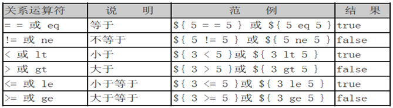

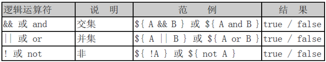

但是有两个特殊的运算符，使用方式的代码如下：

```jsp
<%@ page language="java" import="java.util.*" pageEncoding="UTF-8"%>
<%@ page import="com.itheima.domain.User" %>
<!DOCTYPE HTML PUBLIC "-//W3C//DTD HTML 4.01 Transitional//EN">
<html>
	<head>
		<title>EL两个特殊的运算符</title>
	</head>
	<body>
		<%--empty运算符：
			它会判断：对象是否为null，字符串是否为空字符串，集合中元素是否是0个
		--%>
		<% String str = null;
		  String str1 = "";
		  List<String> slist = new ArrayList<String>();
		  pageContext.setAttribute("str", str);
		  pageContext.setAttribute("str1", str1);
		  pageContext.setAttribute("slist", slist);
		%>
		${empty str}============当对象为null返回true<br/>
		${empty str1 }==========当字符串为空字符串是返回true(注意：它不会调用trim()方法)<br>
		${empty slist}==========当集合中的元素是0个时，是true
		<hr/>
		<%--三元运算符 
			 条件?真:假
		--%>
		<% request.setAttribute("gender", "female"); %>
		<input type="radio" name="gender" value="male" ${gender eq "male"?"checked":""} >男
		<input type="radio" name="gender" value="female" ${gender eq "female"?"checked":""}>女
	</body>
</html>
```

运行结果图：


### 3.3 EL表达式的11个隐式对象

#### 1）隐式对象介绍

EL表达式也为我们提供隐式对象，可以让我们不声明直接来使用，十一个对象见下表，需要注意的是，它和JSP的隐式对象不是一回事：

| EL中的隐式对象   | 类型                          | 对应JSP隐式对象 | 备注                                    |
| ---------------- | ----------------------------- | --------------- | --------------------------------------- |
| PageContext      | Javax.serlvet.jsp.PageContext | PageContext     | 完全一样                                |
| ApplicationScope | Java.util.Map                 | 没有            | 应用层范围                              |
| SessionScope     | Java.util.Map                 | 没有            | 会话范围                                |
| RequestScope     | Java.util.Map                 | 没有            | 请求范围                                |
| PageScope        | Java.util.Map                 | 没有            | 页面层范围                              |
| Header           | Java.util.Map                 | 没有            | 请求消息头key，值是value（一个）        |
| HeaderValues     | Java.util.Map                 | 没有            | 请求消息头key，值是数组（一个头多个值） |
| Param            | Java.util.Map                 | 没有            | 请求参数key，值是value（一个）          |
| ParamValues      | Java.util.Map                 | 没有            | 请求参数key，值是数组（一个名称多个值） |
| InitParam        | Java.util.Map                 | 没有            | 全局参数，key是参数名称，value是参数值  |
| Cookie           | Java.util.Map                 | 没有            | Key是cookie的名称，value是cookie对象    |

## 4 JSTL

### 4.1 JSTL概述

#### 1）简介

JSTL的全称是：JSP Standard Tag Libary。它是JSP中标准的标签库。它是由Apache实现的。

它由以下5个部分组成：

| 组成      | 作用         | 说明                           |
| --------- | ------------ | ------------------------------ |
| Core      | 核心标签库。 | 通用逻辑处理                   |
| Fmt       | 国际化有关。 | 需要不同地域显示不同语言时使用 |
| Functions | EL函数       | EL表达式可以使用的方法         |
| SQL       | 操作数据库。 | 不用                           |
| XML       | 操作XML。    | 不用                           |

#### 2）使用要求

要想使用JSTL标签库，在javaweb工程中需要导入坐标。首先是在工程的WEB-INF目录中创建一个lib目录，接下来把jstl的jar拷贝到lib目录中，最后在jar包上点击右键，然后选择【Add as Libary】添加。如下图所示：

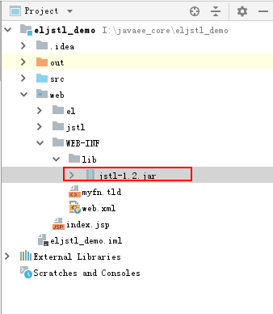

### 4.2 核心标签库

在我们实际开发中，用到的jstl标签库主要以核心标签库为准，偶尔会用到国际化标签库的标签。下表中把我们经常可能用到的标签列在此处，其余标签库请同学们参考【JSTL标签库.doc】文档。

| 标签名称                             | 功能分类 | 分类       | 作用             |
| ------------------------------------ | -------- | ---------- | ---------------- |
| `<c:if>`                             | 流程控制 | 核心标签库 | 用于判断         |
| `<c:choose> ,<c:when>,<c:otherwise>` | 流程控制 | 核心标签库 | 用于多个条件判断 |
| `<c:foreache>`                       | 迭代操作 | 核心标签库 | 用于循环遍历     |

### 4.3 JSTL使用

```jsp
<%@ page language="java" import="java.util.*" pageEncoding="UTF-8"%>
<%--导入jstl标签库 --%>
<%@ taglib uri="http://java.sun.com/jsp/jstl/core" prefix="c" %>
<!DOCTYPE HTML PUBLIC "-//W3C//DTD HTML 4.01 Transitional//EN">
<html>
  <head>
    <title>JSTL的常用标签</title>
  </head>
  <body>
    <%-- c:if  c:choose   c:when c:otherwise --%>
    <% pageContext.setAttribute("score","F"); %>
    <c:if test="${pageScope.score eq 'A' }">
    	优秀
    </c:if>
    <c:if	test="${pageScope.score eq 'C' }">
    	一般
    </c:if>
    <hr/>
    <c:choose>
    	<c:when test="${pageScope.score eq 'A' }">
    		AAA
    	</c:when>
    	<c:when test="${pageScope.score eq 'B' }">BBB
    	</c:when>
    	<c:when test="${pageScope.score eq 'C' }">CCC
    	</c:when>
    	<c:when test="${pageScope.score eq 'D' }">DDD
    	</c:when>
    	<c:otherwise>其他</c:otherwise>
    </c:choose>
    
    <%-- c:forEach 它是用来遍历集合的
    	 属性：
    	 	items：要遍历的集合，它可以是EL表达式取出来的
    	 	var：把当前遍历的元素放入指定的page域中。 var的取值就是key,当前遍历的元素就是value
    	 		注意：它不能支持EL表达式，只能是字符串常量
    	 	begin:开始遍历的索引
    	 	end:结束遍历的索引
    	 	step：步长。i+=step
    	 	varStatus：它是一个计数器对象。里面有两个属性，一个是用于记录索引。一个是用于计数。
    	 			   索引是从0开始。计数是从1开始
    --%>
    <hr/>
    <% List<String> list = new ArrayList<String>();
       list.add("AAA");
       list.add("BBB");
       list.add("CCC");
       list.add("DDD");
       list.add("EEE");
       list.add("FFF");
       list.add("GGG");
       list.add("HHH");
       list.add("III");
       list.add("JJJ");
       list.add("KKK");
       list.add("LLL");
       pageContext.setAttribute("list",list);
     %>
	<c:forEach items="${list}" var="s" begin="1" end="7" step="2">
    	${s}<br/>
    </c:forEach>
    <hr/>
    <c:forEach begin="1" end="9" var="num">
    	<a href="#">${num}</a>
    </c:forEach>
    <hr/>
    <table>
    	<tr>
    		<td>索引</td>
    		<td>序号</td>
    		<td>信息</td>
    	</tr>
    <c:forEach items="${list}" var="s" varStatus="vs">
    	<tr>
    		<td>${vs.index}</td>
    		<td>${vs.count}</td>
    		<td>${s}</td>
    	</tr>
    </c:forEach>
    </table>
  </body>
</html>
```
