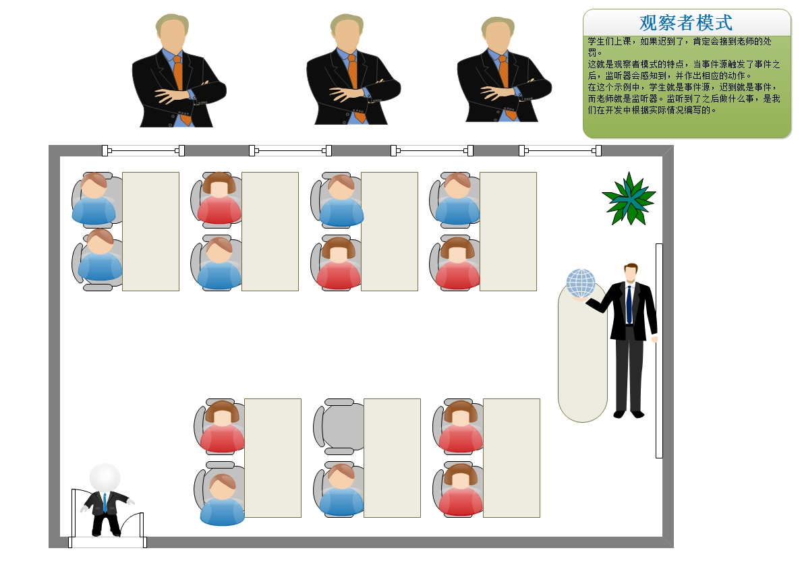
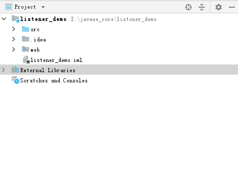
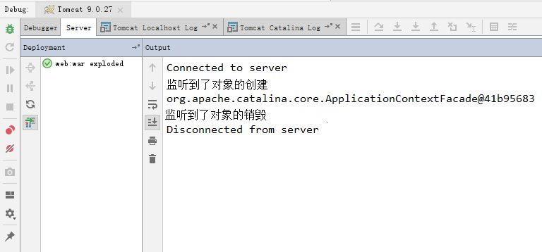
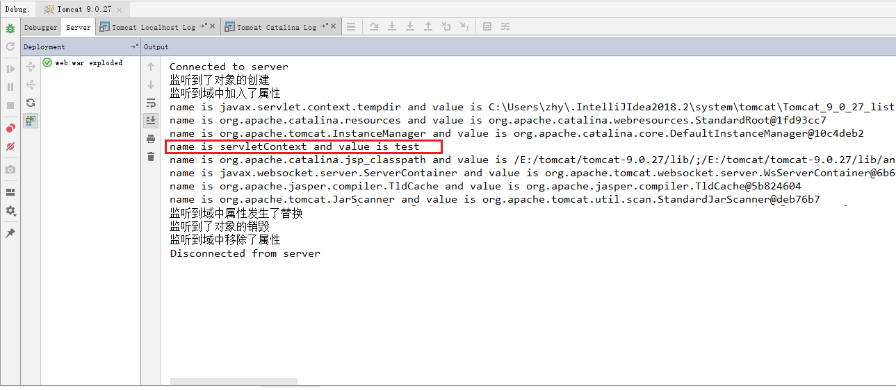

# 3 Servlet规范中的监听器-Listener

## 3.1 观察者设计模式

在介绍监听器之前，先跟同学们普及一个知识，观察者设计模式。因为所有的监听器都是观察者设计模式的体现。

那什么是观察者设计模式呢？

它是事件驱动的一种体现形式。就好比在做什么事情的时候被人盯着。当对应做到某件事时，触发事件。

观察者模式通常由以下三部分组成：

​            事件源：触发事件的对象。

​			事件：触发的动作，里面封装了事件源。

​			监听器：当事件源触发事件时，要做的事情。一般是一个接口，由使用者来实现。（此处的思想还涉及了一个涉及模式，我们在JDBC的第二天课程中就给同学们讲解，策略模式）

下图描述了观察者设计模式组成：



## 3.1 Servlet规范中的8个监听器简介

### 3.1.1 监听对象创建的

#### 1）ServletContextListener

```java
/**
 * 用于监听ServletContext对象创建和销毁的监听器
 * @since v 2.3
 */

public interface ServletContextListener extends EventListener {

    /**
     *	对象创建时执行此方法。该方法的参数是ServletContextEvent事件对象，事件是【创建对象】这个动作
     *  事件对象中封装着触发事件的来源，即事件源，就是ServletContext
     */
    public default void contextInitialized(ServletContextEvent sce) {
    }

    /**
     * 对象销毁执行此方法
     */
    public default void contextDestroyed(ServletContextEvent sce) {
    }
}
```

#### 2）HttpSessionListener

```java
/**
 * 用于监听HttpSession对象创建和销毁的监听器
 * @since v 2.3
 */
public interface HttpSessionListener extends EventListener {

    /**
     * 对象创建时执行此方法。
     */
    public default void sessionCreated(HttpSessionEvent se) {
    }

    /**
     *  对象销毁执行此方法
     */
    public default void sessionDestroyed(HttpSessionEvent se) {
    }
}
```

#### 3）ServletRequestListener

```java
/**
 * 用于监听ServletRequest对象创建和销毁的监听器
 * @since Servlet 2.4
 */
public interface ServletRequestListener extends EventListener {

   	/**
     *  对象创建时执行此方法。
     */
    public default void requestInitialized (ServletRequestEvent sre) {
    }
    
    /**
     * 对象销毁执行此方法
     */
    public default void requestDestroyed (ServletRequestEvent sre) {
    } 
}
```

### 3.1.2 监听域中属性发生变化的

#### 1）ServletContextAttributeListener

```java
/**
 * 用于监听ServletContext域（应用域）中属性发生变化的监听器
 * @since v 2.3
 */

public interface ServletContextAttributeListener extends EventListener {
    /**
     * 域中添加了属性触发此方法。参数是ServletContextAttributeEvent事件对象，事件是【添加属性】。
     * 事件对象中封装着事件源，即ServletContext。
     * 当ServletContext执行setAttribute方法时，此方法可以知道，并执行。
     */
    public default void attributeAdded(ServletContextAttributeEvent scae) {
    }

    /**
     * 域中删除了属性触发此方法
     */
    public default void attributeRemoved(ServletContextAttributeEvent scae) {
    }

    /**
     * 域中属性发生改变触发此方法
     */
    public default void attributeReplaced(ServletContextAttributeEvent scae) {
    }
}
```

#### 2）HttpSessionAttributeListener

```java
/**
 * 用于监听HttpSession域（会话域）中属性发生变化的监听器
 * @since v 2.3
 */
public interface HttpSessionAttributeListener extends EventListener {

    /**
     * 域中添加了属性触发此方法。
     */
    public default void attributeAdded(HttpSessionBindingEvent se) {
    }

    /**
     * 域中删除了属性触发此方法
     */
    public default void attributeRemoved(HttpSessionBindingEvent se) {
    }

    /**
     * 域中属性发生改变触发此方法
     */
    public default void attributeReplaced(HttpSessionBindingEvent se) {
    }
}
```

#### 3）ServletRequestAttributeListener

```java
/**
 * 用于监听ServletRequest域（请求域）中属性发生变化的监听器
 * @since Servlet 2.4
 */
public interface ServletRequestAttributeListener extends EventListener {
    /**
     * 域中添加了属性触发此方法。
     */
    public default void attributeAdded(ServletRequestAttributeEvent srae) {
    }

    /**
     * 域中删除了属性触发此方法
     */
    public default void attributeRemoved(ServletRequestAttributeEvent srae) {
    }

    /**
     * 域中属性发生改变触发此方法
     */
    public default void attributeReplaced(ServletRequestAttributeEvent srae) {
    }
}
```

### 3.1.3 和会话相关的两个感知型监听器

此处要跟同学们明确一下，和会话域相关的两个感知型监听器是无需配置的，直接编写代码即可。

#### 1）HttpSessionBinderListener

```java
/**
 * 用于感知对象和和会话域绑定的监听器
 * 当有数据加入会话域或从会话域中移除，此监听器的两个方法会执行。
 * 加入会话域即和会话域绑定
 * 从会话域移除即从会话域解绑
 */
public interface HttpSessionBindingListener extends EventListener {

    /**
     * 当数据加入会话域时，也就是绑定，此方法执行
     */
    public default void valueBound(HttpSessionBindingEvent event) {
    }

    /**
     * 当从会话域移除时，也就是解绑，此方法执行
     */
    public default void valueUnbound(HttpSessionBindingEvent event) {
    }
}

```

#### 2）HttpSessionActivationListener

```java
/**
 * 用于感知会话域中对象钝化和活化的监听器
 */
public interface HttpSessionActivationListener extends EventListener {

    /**
     * 当会话域中的数据钝化时，此方法执行
     */
    public default void sessionWillPassivate(HttpSessionEvent se) {
    }

    /**
     * 当会话域中的数据活化时（激活），此方法执行
     */
    public default void sessionDidActivate(HttpSessionEvent se) {
    }
}
```

## 3.2 监听器的使用

在实际开发中，我们可以根据具体情况来从这8个监听器中选择使用。感知型监听器由于无需配置，只需要根据实际需求编写代码，所以此处我们就不再演示了。我们在剩余6个中分别选择一个监听对象创建销毁和对象域中属性发生变化的监听器演示一下。

### 3.2.1 ServletContextListener的使用

**第一步：创建工程**



**第二步：编写监听器**

```java
/**
 * 用于监听ServletContext对象创建和销毁的监听器
 * @author 黑马程序员
 * @Company http://www.itheima.com
 */
public class ServletContextListenerDemo implements ServletContextListener {

    /**
     * 对象创建时，执行此方法
     * @param sce
     */
    @Override
    public void contextInitialized(ServletContextEvent sce) {
        System.out.println("监听到了对象的创建");
        //1.获取事件源对象
        ServletContext servletContext = sce.getServletContext();
        System.out.println(servletContext);
    }

    /**
     * 对象销毁时，执行此方法
     * @param sce
     */
    @Override
    public void contextDestroyed(ServletContextEvent sce) {
        System.out.println("监听到了对象的销毁");
    }
}
```

**第三步：在web.xml中配置监听器**

```xml
<!--配置监听器-->
<listener>
    <listener-class>com.itheima.web.listener.ServletContextListenerDemo</listener-class>
</listener>
```

**第四步：测试结果**



### 3.2.2 ServletContextAttributeListener的使用

**第一步：创建工程**

沿用上一个案例的工程

**第二步：编写监听器**

```java
/**
 * 监听域中属性发生变化的监听器
 * @author 黑马程序员
 * @Company http://www.itheima.com
 */
public class ServletContextAttributeListenerDemo implements ServletContextAttributeListener {

    /**
     * 域中添加了数据
     * @param scae
     */
    @Override
    public void attributeAdded(ServletContextAttributeEvent scae) {
        System.out.println("监听到域中加入了属性");
        /**
         * 由于除了我们往域中添加了数据外，应用在加载时还会自动往域中添加一些属性。
         * 我们可以获取域中所有名称的枚举，从而看到域中都有哪些属性
         */
        
        //1.获取事件源对象ServletContext
        ServletContext servletContext = scae.getServletContext();
        //2.获取域中所有名称的枚举
        Enumeration<String> names = servletContext.getAttributeNames();
        //3.遍历名称的枚举
        while(names.hasMoreElements()){
            //4.获取每个名称
            String name = names.nextElement();
            //5.获取值
            Object value = servletContext.getAttribute(name);
            //6.输出名称和值
            System.out.println("name is "+name+" and value is "+value);
        }
    }

    /**
     * 域中移除了数据
     * @param scae
     */
    @Override
    public void attributeRemoved(ServletContextAttributeEvent scae) {
        System.out.println("监听到域中移除了属性");
    }

    /**
     * 域中属性发生了替换
     * @param scae
     */
    @Override
    public void attributeReplaced(ServletContextAttributeEvent scae) {
        System.out.println("监听到域中属性发生了替换");
    }
}
```

同时，我们还需要借助第一个`ServletContextListenerDemo`监听器，往域中存入数据，替换域中的数据以及从域中移除数据，代码如下：

```java
/**
 * 用于监听ServletContext对象创建和销毁的监听器
 * @author 黑马程序员
 * @Company http://www.itheima.com
 */
public class ServletContextListenerDemo implements ServletContextListener {

    /**
     * 对象创建时，执行此方法
     * @param sce
     */
    @Override
    public void contextInitialized(ServletContextEvent sce) {
        System.out.println("监听到了对象的创建");
        //1.获取事件源对象
        ServletContext servletContext = sce.getServletContext();
        //2.往域中加入属性
        servletContext.setAttribute("servletContext","test");
    }

    /**
     * 对象销毁时，执行此方法
     * @param sce
     */
    @Override
    public void contextDestroyed(ServletContextEvent sce) {
        //1.取出事件源对象
        ServletContext servletContext = sce.getServletContext();
        //2.往域中加入属性，但是名称仍采用servletContext，此时就是替换
        servletContext.setAttribute("servletContext","demo");
        System.out.println("监听到了对象的销毁");
        //3.移除属性
        servletContext.removeAttribute("servletContext");
    }
}
```

**第三步：在web.xml中配置监听器**

```xml
<!--配置监听器-->
<listener>
    <listener-class>com.itheima.web.listener.ServletContextListenerDemo</listener-class>
</listener>

<!--配置监听器-->
<listener>
    <listener-class>com.itheima.web.listener.ServletContextAttributeListenerDemo</listener-class>
</listener>
```

**第四步：测试结果**


