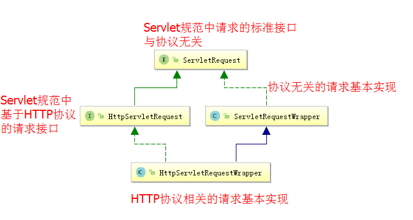
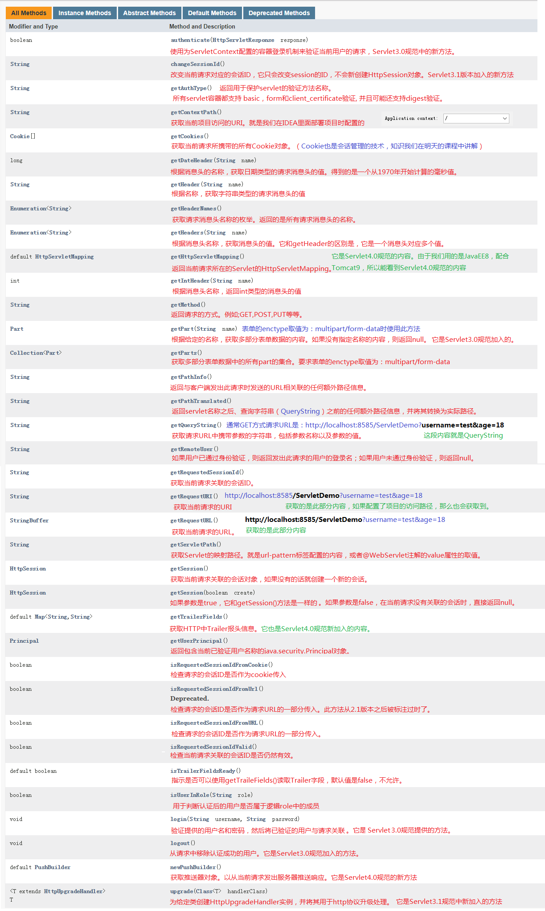

# Request-请求对象

## 1 请求对象概述

### 1.1 关于请求

请求，顾明思议，就是使用者希望从服务器端索取一些资源，向服务器发出询问。在B/S架构中，就是客户浏览器向服务器发出询问。在我们的JavaEE工程中，客户浏览器发出询问，要遵循HTTP协议所规定的。

请求对象，就是在JavaEE工程中，用于发送请求的对象。我们常用的对象就是ServletRequest和HttpServletRequest，它们的区别就是是否和HTTP协议有关。

### 1.2 常用请求对象



## 2 常用方法介绍



## 3 请求对象的使用示例

### 3.1 请求对象常用方法1-获取各种路径

```java
/**
 * 请求对象的各种信息获取
 * @author 黑马程序员
 * @Company http://www.itheima.com
 */
public class RequestDemo1 extends HttpServlet {

    public void doGet(HttpServletRequest request, HttpServletResponse response)
            throws ServletException, IOException {

        //本机地址：服务器地址
        String localAddr = request.getLocalAddr();
        //本机名称：服务器名称
        String localName = request.getLocalName();
        //本机端口：服务器端口
        int localPort = request.getLocalPort();
        //来访者ip
        String remoteAddr = request.getRemoteAddr();
        //来访者主机
        String remoteHost = request.getRemoteHost();
        //来访者端口
        int remotePort = request.getRemotePort();
        //统一资源标识符
        String URI = request.getRequestURI();
        //统一资源定位符
        String URL = request.getRequestURL().toString();
        //获取查询字符串
        String queryString = request.getQueryString();
        //获取Servlet映射路径
        String servletPath = request.getServletPath();

        //输出内容
		System.out.println("getLocalAddr() is :"+localAddr);
		System.out.println("getLocalName() is :"+localName);
		System.out.println("getLocalPort() is :"+localPort);
		System.out.println("getRemoteAddr() is :"+remoteAddr);
		System.out.println("getRemoteHost() is :"+remoteHost);
		System.out.println("getRemotePort() is :"+remotePort);
		System.out.println("getRequestURI() is :"+URI);
		System.out.println("getRequestURL() is :"+URL);
        System.out.println("getQueryString() is :"+queryString);
        System.out.println("getServletPath() is :"+servletPath);
    }

    public void doPost(HttpServletRequest request, HttpServletResponse response)
            throws ServletException, IOException {
        doGet(request, response);
    }
}
```

### 3.2 请求对象常用方法2-获取请求头信息

```java
/**
 * 获取请求消息头
 * @author 黑马程序员
 * @Company http://www.itheima.com
 */
public class RequestDemo2 extends HttpServlet {

    public void doGet(HttpServletRequest request, HttpServletResponse response)
            throws ServletException, IOException {
        //1.根据名称获取头的值	一个消息头一个值
        String value = request.getHeader("Accept-Encoding");
        System.out.println("getHeader():"+value);

        //2.根据名称获取头的值	一个头多个值
        Enumeration<String> values = request.getHeaders("Accept");
        while(values.hasMoreElements()){
            System.out.println("getHeaders():"+values.nextElement());
        }

        //3.获取请求消息头的名称的枚举
        Enumeration<String> names = request.getHeaderNames();
        while(names.hasMoreElements()){
            String name = names.nextElement();
            String value1 = request.getHeader(name);
            System.out.println(name+":"+value1);
        }
    }

    public void doPost(HttpServletRequest request, HttpServletResponse response)
            throws ServletException, IOException {
        doGet(request, response);
    }

}
```

### 3.3 请求对象常用方法3-获取请求参数（非常重要）

在本小节，我们会讲解HttpServletRequest对象获取请求参数的常用方法，以及把获取到的请求参数封装到实体类中的方式。首先，我们先来创建一个Servlet对象

```java
/**
 * 封装请求正文到javabean（数据模型）
 * @author 黑马程序员
 * @Company http://www.itheima.com
 */
public class RequestDemo3 extends HttpServlet {

    public void doGet(HttpServletRequest request, HttpServletResponse response)
            throws ServletException, IOException {
        /*
         * 把下面
         *		1）获取请求参数
         *		2）封装请求参数到实体类中
         * 中定义的test1到test8逐个添加到此处来运行即可。
         */
    }
 
    public void doPost(HttpServletRequest request, HttpServletResponse response)
            throws ServletException, IOException {
        doGet(request, response);
    }
}
```

接下来，我们在来准备一个表单页面：

```html
<html>
<head>
	<title>login to request demo 3</title>
</head>
<body>
<form action="/day10_1122_requestresponse/RequestDemo3" method="post">
	用户名：<input type="text" name="username" /><br/>
	密码：<input type="password" name="password" /><br/>
	性别：<input type="radio" name="gender" value="1" checked>男
	<input type="radio" name="gender" value="0">女
	<br/>
	<input type="submit" value="注册" />
</form>
</body>
</html>
```

现在，我们开始分析HttpServletRequest对象用于获取请求参数的方法：

#### 1）获取请求参数

**getParameter()方法的示例代码**

```java
/**
 * 获取请求正文，一个名称对应一个值。								没有使用确认密码
 * @param request
 * @param response
 * @throws ServletException
 * @throws IOException
 */
private void test1(HttpServletRequest request, HttpServletResponse response)
    throws ServletException, IOException {
    //1.获取请求正文
    String username = request.getParameter("username");
    String password = request.getParameter("password");
    String gender = request.getParameter("gender");
    System.out.println(username+","+password+","+gender);
}
```

**getParameterValues()方法的示例代码**

```java
/**
 * 获取请求正文，一个名称可能对应多个值									使用了确认密码
 * @param request
 * @param response
 * @throws ServletException
 * @throws IOException
*/
private void test2(HttpServletRequest request, HttpServletResponse response)
    throws ServletException, IOException {
    //1.获取请求正文
    String username = request.getParameter("username");
    String[] password = request.getParameterValues("password");//当表单中有多个名称是一样时，得到是一个字符串数组
    String gender = request.getParameter("gender");
    System.out.println(username+","+Arrays.toString(password)+","+gender);
}
```

```html
<html>
<head>
	<title>login to request demo 4</title>
</head>
<body>
<form action="/day10_1122_requestresponse/RequestDemo4" method="post" enctype="multipart/form-data">
	用户名：<input type="text" name="username" /><br/>
	密码：<input type="password" name="password" /><br/>
	确认密码：<input type="password" name="password" /><br/>
	性别：<input type="radio" name="gender" value="1" checked>男
	<input type="radio" name="gender" value="0">女
	<br/>
	<input type="submit" value="注册" />
</form>
</body>
</html>
```

**getParameterNames()方法的示例代码**

```java
/**
 * 获取请求正文，一个名称一个值。但是先要获取正文名称的枚举（key的枚举）				没有使用确认密码
 * @param request
 * @param response
 * @throws ServletException
 * @throws IOException
*/
private void test3(HttpServletRequest request, HttpServletResponse response)
    throws ServletException, IOException {
    //1.获取请求正文名称的枚举
    Enumeration<String> names = request.getParameterNames();
    //2.遍历正文名称的枚举
    while(names.hasMoreElements()){
        String name = names.nextElement();
        String value = request.getParameter(name);
        System.out.println(name+":"+value);
    }
}
```

**总结：**

​	以上三个方法可以获取表单提交过来的请求参数。

​	参数的名称是一个字符串，参数的值可能是一个字符串，也可能是一个字符串数组。

#### 2）封装请求参数到实体类中

我们通过上面的方法可以获取到请求参数，但是如果参数过多，在进行传递时，方法的形参定义将会变得非常难看。此时我们应该用一个对象来描述这些参数，它就是实体类。这种类的定义，从基础阶段我们就开始使用了。在基础阶段，我们做过一个学生管理系统，用到了一个Student的类，它就是用于描述一个学生的实体类。

我们现在要做的就是把表单中提交过来的数据填充到实体类中。

**第一种：最简单直接的封装方式**

```java
/**
 * 封装请求正文到User对象中									没有使用确认密码
 * @param request
 * @param response
 * @throws ServletException
 * @throws IOException
 */
private void test4(HttpServletRequest request, HttpServletResponse response)
    throws ServletException, IOException {
    //1.获取请求正文
    String username = request.getParameter("username");
    String password = request.getParameter("password");
    String gender = request.getParameter("gender");
    //2.创建一个User对象
    User user = new User();
    System.out.println("封装前："+user.toString());
    //3.把请求正文封装到user对象中
    user.setUsername(username);
    user.setPassword(password);
    user.setGender(gender);
    System.out.println("封装后："+user.toString());
}
```

**第二种：使用反射方式封装**

此种封装的使用要求是，表单`<input>`标签的name属性取值，必须和实体类中定义的属性名称一致。

```java
/**
 * 封装请求正文到javabean中										没有使用确认密码
 * 使用反射+内省实现数据模型的封装
 * 内省：是sun公司推出的一套简化反射操作的规范。把javabean中的元素都封装成一个属性描述器。
 * 	        属性描述器中会有字段信息，get和set方法（取值或存值）
 * @param request
 * @param response
 * @throws ServletException
 * @throws IOException
*/
private void test5(HttpServletRequest request, HttpServletResponse response)
    throws ServletException, IOException {
    //1.获取请求正文名称的枚举
    Enumeration<String> names = request.getParameterNames();
    User user = new User();
    System.out.println("封装前："+user.toString());
    //2.遍历正文名称的枚举
    while(names.hasMoreElements()){
        String name = names.nextElement();
        String value = request.getParameter(name);
        try{
            //1.拿到User对象中的属性描述器。是谁的属性描述器：是由构造函数的第一个参数决定的。第二个参数是指定javabean的字节码
            PropertyDescriptor pd = new PropertyDescriptor(name, User.class);//参数指的就是拿哪个类的哪个属性的描述器
            //2.设置javabean属性的值
            Method method = pd.getWriteMethod();
            //3.执行方法
            method.invoke(user, value);//第一个参数是指的给哪个对象，第二个参数指的是赋什么值
        }catch(Exception e){
            e.printStackTrace();
        }
    }
    System.out.println("封装后："+user.toString());
} 
```

**第三种：使用反射封装，同时请求参数的值是一个数组**

此种方式其实就是针对请求参数中包含name属性相同的参数，例如：密码和确认密码，还有爱好。

```java
/**
 * 获取请求正文的关系映射Map<String,String[]>				使用确认密码
 * @param request
 * @param response
 * @throws ServletException
 * @throws IOException
 */
private void test6(HttpServletRequest request, HttpServletResponse response)
    throws ServletException, IOException {
    //1.获取请求正文的映射关系
    Map<String,String[]> map = request.getParameterMap();
    //2.遍历集合
    for(Map.Entry<String,String[]> me : map.entrySet()){
        String name = me.getKey();
        String[] value = me.getValue();
        System.out.println(name+":"+Arrays.toString(value));
    }
} 
```

当我们把请求参数获取出来之后，就要考虑如何针对数组的反射了，具体代码如下：

```java
 /**
 * 封装请求正文到javabean。使用的是反射+内省						使用了确认密码
 * @param request
 * @param response
 * @throws ServletException
 * @throws IOException
 */
private void test7(HttpServletRequest request, HttpServletResponse response)
    throws ServletException, IOException {
    //1.获取请求正文的映射关系
    Map<String,String[]> map = request.getParameterMap();
    Users user = new Users();
    System.out.println("封装前："+user.toString());
    //2.遍历集合
    for(Map.Entry<String,String[]> me : map.entrySet()){
        String name = me.getKey();
        String[] value = me.getValue();
        try{
            //1.拿到User对象中的属性描述器。是谁的属性描述器：是由构造函数的第一个参数决定的。第二个参数是指定javabean的字节码
            PropertyDescriptor pd = new PropertyDescriptor(name, Users.class);//参数指的就是拿哪个类的哪个属性的描述器
            //2.设置javabean属性的值
            Method method = pd.getWriteMethod();
            //3.执行方法
            //判断参数到底是几个值
            if(value.length > 1){//最少有2个元素
                method.invoke(user, (Object)value);//第一个参数是指的给哪个对象，第二个参数指的是赋什么值
            }else{
                method.invoke(user, value);//第一个参数是指的给哪个对象，第二个参数指的是赋什么值
            }
        }catch(Exception e){
            e.printStackTrace();
        }
    }
    System.out.println("封装后："+user.toString());
}
```

当我们写完此种封装方式之后，同学们可以发现，我们绝大多数封装都可以使用这段代码来实现。并且，无论是谁来写这段通用的封装代码，其代码内容都是大同小异的。**那么，我们就可以得出一个很有趣的结论：一般遇到这种情况时，肯定有人帮我们写好了，我们只需要用就行了。**我们后面还会遇到类似这样的情况。

此时，帮我们写好这段封装代码的是apache软件基金会，我们前面学习的tomcat也是它提供的。它里面有一个开源工具包集合commons，里面有很多开源工具类，今天我们就来讲解第一个：<font color='red'><b>commons-beanutils</b></font>。

**第四种：使用apache的commons-beanutils实现封装**

实现代码：

```java
/**
 * 终极方法：使用beanutils实现请求正文封装到javabean中				使用了确认密码
 * 要想使用beanutils，需要先导包
 * @param request
 * @param response
 * @throws ServletException
 * @throws IOException
 */
private void test8(HttpServletRequest request, HttpServletResponse response)
    throws ServletException, IOException {
    Users user = new Users();
    System.out.println("封装前："+user.toString());
    try{
        BeanUtils.populate(user, request.getParameterMap());//就这一句话
    }catch(Exception e){
        e.printStackTrace();
    }
    System.out.println("封装后："+user.toString());
}
```

### 3.4 用流的形式读取请求信息

我们除了使用2.3.3小节中获取请求参数之外，还可以使用下面代码中的 方式来获取：

```java
/**
 * 使用流的方式读取请求正文
 * @author 黑马程序员
 * @Company http://www.itheima.com
 */
public class RequestDemo4 extends HttpServlet {

    public void doGet(HttpServletRequest request, HttpServletResponse response)
            throws ServletException, IOException {
        //1.获取请求正文的字节输入流
        ServletInputStream sis = request.getInputStream();
        //2.读取流中的数据
        int len = 0;
        byte[] by = new byte[1024];
        while((len = sis.read(by)) != -1){
            System.out.println(new String(by,0,len));
        }
    }

    public void doPost(HttpServletRequest request, HttpServletResponse response)
            throws ServletException, IOException {
        doGet(request, response);
    }

}
```

### 3.5请求正文中中文编码问题

关于请求中文乱码问题，我们需要分开讨论，第一是POST请求方式，第二是GET方式。

#### 1）POST方式请求

在POST方式请求中，我们的乱码问题可以用如下代码解决：

```java
/**
 * 请求正文的中文乱码问题
 * @author 黑马程序员
 * @Company http://www.itheima.com
 */
public class RequestDemo5 extends HttpServlet {

    public void doGet(HttpServletRequest request, HttpServletResponse response)
            throws ServletException, IOException {
        //1.获取请求正文
		/*POST方式：
		 * 问题：
		 * 	取的时候会不会有乱码
		 * 答案：
		 * 	获取请求正文，会有乱码问题。
		 * 	是在获取的时候就已经乱码了。
		 * 解决办法：
		 * 	 是request对象的编码出问题了
		 *   设置request对象的字符集
		 *   request.setCharacterEncoding("GBK");它只能解决POST的请求方式，GET方式解决不了
		 * 结论：
		 * 	 请求正文的字符集和响应正文的字符集没有关系。各是各的
		 */
		request.setCharacterEncoding("UTF-8");
		String username = request.getParameter("username");
        //输出到控制台
		System.out.println(username);
        //输出到浏览器：注意响应的乱码问题已经解决了
        response.setContentType("text/html;charset=UTF-8");
        PrintWriter out = response.getWriter();
        out.write(username);
    }

    public void doPost(HttpServletRequest request, HttpServletResponse response)
            throws ServletException, IOException {
        doGet(request, response);
    }
}
```

#### 2）GET方式请求

GET方式请求的正文是在地址栏中，在Tomcat8.5版本及以后，Tomcat服务器已经帮我们解决了，所以不会有乱码问题了。

而如果我们使用的不是Tomcat服务器，或者Tomcat的版本是8.5以前，那么GET方式仍然会有乱码问题，解决方式如下：（以下代码了解即可，因为我们现在使用的是Tomcat9.0.27版本）

```java
/**
 * 在Servlet的doGet方法中添加如下代码
 */
public void doGet(HttpServletRequest request, HttpServletResponse response)
            throws ServletException, IOException {
   

        /*
         * GET方式：正文在地址栏
         * username=%D5%C5%C8%FD
         * %D5%C5%C8%FD是已经被编过一次码了
         *
         * 解决办法：
         * 	 使用正确的码表对已经编过码的数据进行解码。
         * 		就是把取出的内容转成一个字节数组，但是要使用正确的码表。（ISO-8859-1）
         * 	 再使用正确的码表进行编码
         * 		把字节数组再转成一个字符串，需要使用正确的码表，是看浏览器当时用的是什么码表
         */
        String username = request.getParameter("username");
        byte[] by = username.getBytes("ISO-8859-1");
        username = new String(by,"GBK");

        //输出到浏览器：注意响应的乱码问题已经解决了
        response.setContentType("text/html;charset=UTF-8");
        PrintWriter out = response.getWriter();
        out.write(username);
}

public void doPost(HttpServletRequest request, HttpServletResponse response)
    throws ServletException, IOException {
    doGet(request, response);
}
```

### 3.6 请求转发（与重定向的区别）

在实际开发中，重定向和请求转发都是我们要用到的响应方式，那么他们有什么区别呢？我们通过下面的示例来看一下：

```java
/**
 * 重定向特点：
 * 	两次请求，浏览器行为，地址栏改变，请求域中的数据会丢失
 * 请求转发：
 * 	一次请求，服务器行为，地址栏不变，请求域中的数据不丢失
 *
 * 请求域的作用范围：
 * 	 当前请求（一次请求）,和当前请求的转发之中
 * @author 黑马程序员
 * @Company http://www.itheima.com
 */
public class RequestDemo6 extends HttpServlet {

    public void doGet(HttpServletRequest request, HttpServletResponse response)
            throws ServletException, IOException {
        //1.拿到请求调度对象
        RequestDispatcher rd = request.getRequestDispatcher("/RequestDemo7");//如果是给浏览器看的，/可写可不写。如果是给服务器看的，一般情况下，/都是必须的。
        //放入数据到请求域中
        request.setAttribute("CityCode", "bj-010");
        //2.实现真正的转发操作
        rd.forward(request, response);//实现真正的转发操作
    }

    public void doPost(HttpServletRequest request, HttpServletResponse response)
            throws ServletException, IOException {
        doGet(request, response);
    }

}
```

```java
/**
 * 转发的目的地
 * @author 黑马程序员
 * @Company http://www.itheima.com
 */
public class RequestDemo7 extends HttpServlet {

    public void doGet(HttpServletRequest request, HttpServletResponse response)
            throws ServletException, IOException {
        //获取请求域中的数据
        String value = (String)request.getAttribute("CityCode");
        response.getWriter().write("welcome to request demo 7    "+value);
    }

    public void doPost(HttpServletRequest request, HttpServletResponse response)
            throws ServletException, IOException {
        doGet(request, response);
    }

}
```

### 3.7 请求包含

在实际开发中，我们可能需要把两个Servlet的内容合并到一起来响应浏览器，而同学们都知道HTTP协议的特点是一请求，一响应的方式。所以绝对不可能出现有两个Servlet同时响应方式。那么我们就需要用到请求包含，把两个Servlet的响应内容合并输出。我们看具体使用示例：

```java
/**
 * 请求包含
 *
 * 它是把两个Servlet的响应内容合并输出。
 * 注意：
 * 	这种包含是动态包含。
 *
 * 动态包含的特点：
 * 		各编译各的，只是最后合并输出。
 * @author 黑马程序员
 * @Company http://www.itheima.com
 */
public class RequestDemo8 extends HttpServlet {

    public void doGet(HttpServletRequest request, HttpServletResponse response)
            throws ServletException, IOException {
        response.getWriter().write("I am request demo8 ");
        //1.拿到请求调度对象
        RequestDispatcher rd = request.getRequestDispatcher("/RequestDemo9");
        //2.实现包含的操作
        rd.include(request, response);
    }

    public void doPost(HttpServletRequest request, HttpServletResponse response)
            throws ServletException, IOException {
        doGet(request, response);
    }
}
```

```java
/**
 * 被包含者
 * @author 黑马程序员
 * @Company http://www.itheima.com
 */
public class RequestDemo9 extends HttpServlet {

    public void doGet(HttpServletRequest request, HttpServletResponse response)
            throws ServletException, IOException {
        response.getWriter().write("include request demo 9 ");
    }

    public void doPost(HttpServletRequest request, HttpServletResponse response)
            throws ServletException, IOException {
        doGet(request, response);
    }

}
```

### 3.8 细节问题

请求转发的注意事项：负责转发的Servlet，转发前后的响应正文丢失，由转发目的地来响应浏览器。

请求包含的注意事项：被包含者的响应消息头丢失。因为它被包含起来了。
