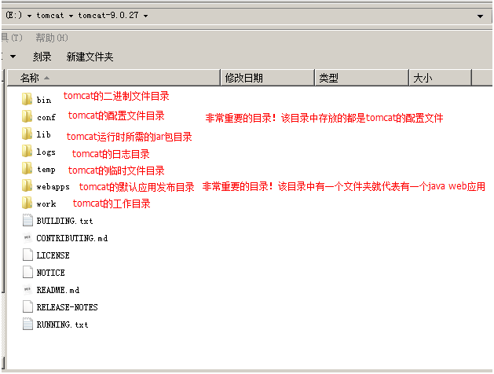
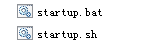
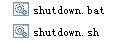
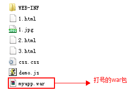
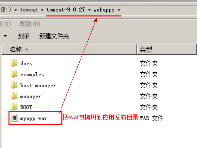
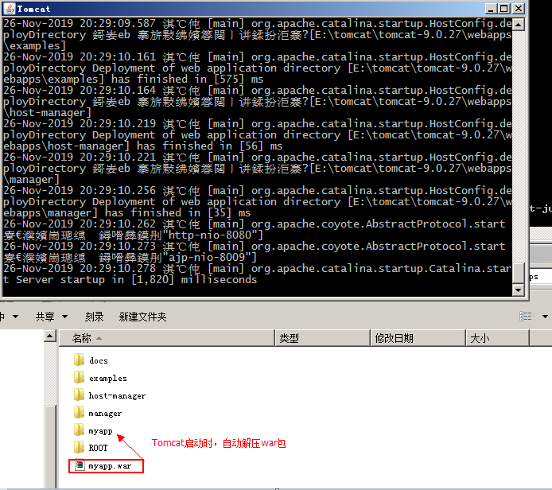
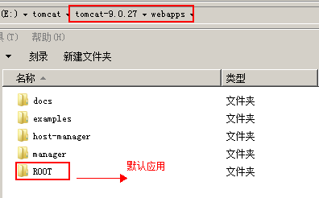
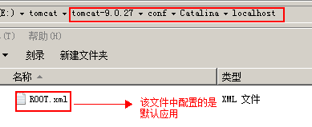

# Tomcat

## 1 Tomcat介绍

### 1.1 关于服务器

服务器的概念非常的广泛，它可以指代一台特殊的计算机（相比普通计算机运行更快、负载更高、价格更贵），也可以指代用于部署网站的应用。我们这里说的服务器，其实是web服务器，或者应用服务器。它本质就是一个软件，一个应用。作用就是发布我们的应用（工程），让用户可以通过浏览器访问我们的应用。

常见的应用服务器，请看下表：

| 服务器名称  | 说明                                                  |
| ----------- | ----------------------------------------------------- |
| weblogic    | 实现了javaEE规范，重量级服务器，又称为javaEE容器      |
| websphereAS | 实现了javaEE规范，重量级服务器。                      |
| JBOSSAS     | 实现了JavaEE规范，重量级服务器。免费的。              |
| Tomcat      | 实现了jsp/servlet规范，是一个轻量级服务器，开源免费。 |

### 1.2 Tomcat目录结构详解



## 2 Tomcat基本使用

### 2.1 启动和停止

Tomcat服务器的启动文件在二进制文件目录中：，这两个文件就是Tomcat的启动文件。

Tomcat服务器的停止文件也在二进制文件目录中：，这两个文件就是Tomcat的停止文件。

其中`.bat`文件是针对`windows`系统的运行程序，`.sh`文件是针对`linux`系统的运行程序。

### 2.2 启动问题

**第一个问题：启动一闪而过**

原因：没有配置环境变量。

解决办法：配置上JAVA_HOME环境变量

**第二个：Address already in use : JVM_Bind**


原因：端口被占用

解决办法：找到占用该端口的应用

​                    进程不重要：使用cmd命令：`netstat -a -o` 查看pid  在任务管理器中结束占用端口的进程。

​                    进程很重要：修改自己的端口号。修改的是Tomcat目录下`\conf\server.xml`中的配置。

​			

**第三个：启动产生很多异常，但能正常启动**

原因：Tomcat中部署着很多项目，每次启动这些项目都会启动。而这些项目中有启动报异常的。

解决办法：

​			能找到报异常的项目，就把它从发布目录中移除。

​			不能确定报异常的项目，就重新解压一个新的Tomcat。

**第四个：其它问题**

例如：启动产生异常，但是不能正常启动。此时就需要解压一个新的Tomcat启动，来确定是系统问题，还是Tomcat的问题。

所以，此时就需要具体问题，具体分析，然后再对症解决。

## 3 Tomcat发布JavaWeb应用

### 3.1 JavaWeb工程概述

`JavaWeb`应用是一个全新的应用种类。这类应用程序指供浏览器访问的程序，通常也简称为web应用。

一个web应用由多个静态web资源和动态web资源组成，例如：html、css、js文件，jsp文件、java程序、支持jar包、工程配置文件、图片、音视频等等。

Web应用开发好后，若想供外界访问，需要把web应用所在目录交给Web服务器管理（Tomcat就是Web服务器之一），这个过程称之为虚似目录的映射。

### 3.2 JavaWeb应用目录结构详解

```
myapp--------------应用名称
    1.html
    css/css.css
    js/demo.js
	WEB-INF--------如果有web.xml或者.class文件时，该目录必须存在，且严格区分大小写。
		   --------该目录下的资源，客户端是无法直接访问的。
           --------目录中内容如下：
        classes目录----------------web应用的class文件（加载顺序：我们的class，lib目录中的jar包，tomcat的lib目录中的jar包。优先级依次降低）
        lib目录--------------------web应用所需的jar包（tomcat的lib目录下jar为所有应用共享）
        web.xml-------------------web应用的主配置文件
```

### 3.3 JavaWeb应用的部署

> 此处介绍通过命令行以war包形式发布

+ **第一步：使用`jar -cvf war包名 打包资源`**
  
    如：`jar -cvf myapp.war .`

    

+ **第二步：把打好的war拷贝到tomcat的webapps目录中**
    
    

+ **第三步：启动服务时，tomcat会自动解压。**

    

## 4 Tomcat配置

### 4.1 Tomcat配置虚拟目录

虚拟目录的配置，支持两种方式。第一种是通过在主配置文件中添加标签实现。第二种是通过写一个独立配置文件实现。

+ 第一种方式：在`server.xml`的`<Host>`元素中加一个`<Context path="" docBase=""/>`元素。
  + `path`：访问资源URI。URI名称可以随便起，但是必须在前面加上一个`/`
  + `docBase`：资源所在的磁盘物理地址。
+ 第二种方式：是写一个独立的`xml`文件，该文件名可以随便起。在文件内写一个`<Context/>`元素。
  + 该文件要放在Tomcat目录中的`conf\Catalina\localhost\`目录下。
  + 需要注意的是，在使用了独立的配置文件之后，访问资源URI就变成了`/+文件的名称`。而`Context`的`path`属性就失效了。

### 4.2 Tomcat配置虚拟主机

在`<Engine>`元素中添加一个`Host`元素，其中：
​
+ `name`：指定主机的名称
+ ​`appBase`：当前主机的应用发布目录​
+ `unparkWARs`：启动时是否自动解压war包
+ `autoDeploy`：是否自动发布

配置示例如下：

```xml
<Host name="www.itcast.cn" appBase="D:\itcastapps" unpackWARs="true" autoDeploy="true"/>

<Host name="www.itheima.com" appBase="D:\itheimaapps" unpackWARs="true" autoDeploy="true"/>
```

### 4.3 Tomcat默认项配置

**配置默认端口**

Tomcat服务器主配置文件中配置着默认访问端口是8080，配置方式如下：

```xml
<Connector port="8080" protocol="HTTP/1.1" connectionTimeout="20000" redirectPort="8443" />		
```

**配置默认应用**

有两种方式配置默认应用。
+ 第一种：把要作为默认应用的应用，名称改为`ROOT`。放到`webapps`目录中。

    

+ 第二种：写一个独立的配置文件，文件名称为`ROOT.xml`。
​				注意：`ROOT`必须大写。

    当使用了独立的`ROOT.xml`文件时，`webapps`下`ROOT`应用就不是默认应用了。

    

**配置默认主页**

首先要明确的是，配置默认主页是针对应用说的。是应用的默认主页。
在应用的`web.xml`中配置：

例如：

```xml
<welcome-file-list>
    <welcome-file>index.html</welcome-file>
    <welcome-file>index.htm</welcome-file>
    <welcome-file>index.jsp</welcome-file>
</welcome-file-list>
```