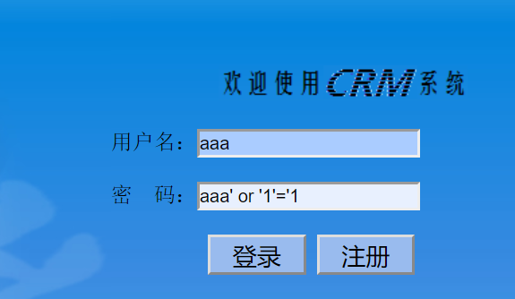
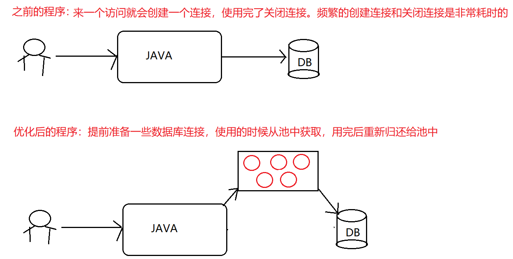

---
html:
    toc: true
---

# JDBC

### 一、JDBC快速入门

#### 1.jdbc的概念

- JDBC（Java DataBase Connectivity,java数据库连接）是一种用于执行SQL语句的Java API，可以为多种关系型数据库提供统一访问，它是由一组用Java语言编写的类和接口组成的。

#### 2.jdbc的本质

- 其实就是java官方提供的一套规范(接口)。用于帮助开发人员快速实现不同关系型数据库的连接！

#### 3.jdbc的快速入门程序

1. 导入jar包

2. 注册驱动

   ```java
   Class.forName("com.mysql.jdbc.Driver");
   ```

3. 获取连接

   ```java
   Connection con = DriverManager.getConnection("jdbc:mysql://localhost:3306/db2", "root", "root");
   ```

4. 获取执行者对象

   ```java
   Statement stat = con.createStatement();
   ```

5. 执行sql语句，并接收返回结果

   ```java
   String sql = "SELECT * FROM user";
   ResultSet rs = stat.executeQuery(sql);
   ```

6. 处理结果

   ```java
   while(rs.next()) {
       System.out.println(rs.getInt("id") + "\t" + rs.getString("name"));
   }
   ```

7. 释放资源

   ```java
   con.close();
   stat.close();
   rs.close();
   ```

### 二、JDBC各个功能类详解

#### 1.DriverManager

- DriverManager：驱动管理对象

  - 注册驱动(告诉程序该使用哪一个数据库驱动)

    - static void registerDriver(Driver driver)：注册与给定的驱动程序 DriverManager 
    - 写代码使用：Class.forName("com.mysql.jdbc.Driver");
    - 通过查看源码发现：在com.mysql.jdbc.Driver类中存在静态代码块

    ```java
    static {
    	try {
    		java.sql.DriverManager.registerDriver(new Driver());
    	} catch (SQLException E) {
    		throw new RuntimeException("Can't register driver!");
    	}
    }
    ```

    - 注意：mysql5之后的驱动jar包可以省略注册驱动的步骤。在jar包中，存在一个java.sql.Driver配置文件，文件中指定了com.mysql.jdbc.Driver

  - 获取数据库连接(获取到数据库的连接并返回连接对象)

    - static Connection getConnection(String url, String user, String password);
      - 返回值：Connection数据库连接对象
      - 参数
        - url：指定连接的路径。语法：jdbc:mysql://ip地址(域名):端口号/数据库名称
        - user：用户名
        - password：密码

#### 2.Connection

- Connection：数据库连接对象
  - 获取执行者对象
    - 获取普通执行者对象：Statement createStatement();
    - 获取预编译执行者对象：PreparedStatement prepareStatement(String sql);
  - 管理事务
    - 开启事务：setAutoCommit(boolean autoCommit);     参数为false，则开启事务。
    - 提交事务：commit();
    - 回滚事务：rollback();
  - 释放资源
    - 立即将数据库连接对象释放：void close();

#### 3.Statement

- Statement：执行sql语句的对象
  - 执行DML语句：int executeUpdate(String sql);
    - 返回值int：返回影响的行数。
    - 参数sql：可以执行insert、update、delete语句。
  - 执行DQL语句：ResultSet executeQuery(String sql);
    - 返回值ResultSet：封装查询的结果。
    - 参数sql：可以执行select语句。
  - 释放资源
    - 立即将执行者对象释放：void close();

#### 4.ResultSet

- ResultSet：结果集对象
  - 判断结果集中是否还有数据：boolean next();
    - 有数据返回true，并将索引向下移动一行
    - 没有数据返回false
  - 获取结果集中的数据：XXX getXxx("列名");
    - XXX代表数据类型(要获取某列数据，这一列的数据类型)
    - 例如：String getString("name");          int getInt("age");
  - 释放资源
    - 立即将结果集对象释放：void close();

### 三、JDBC案例student学生表的CRUD

#### 1.数据准备

- 数据库和数据表

```SQL
-- 创建db14数据库
CREATE DATABASE db14;

-- 使用db14数据库
USE db14;

-- 创建student表
CREATE TABLE student(
	sid INT PRIMARY KEY AUTO_INCREMENT,	-- 学生id
	NAME VARCHAR(20),					-- 学生姓名
	age INT,							-- 学生年龄
	birthday DATE						-- 学生生日
);

-- 添加数据
INSERT INTO student VALUES (NULL,'张三',23,'1999-09-23'),(NULL,'李四',24,'1998-08-10'),(NULL,'王五',25,'1996-06-06'),(NULL,'赵六',26,'1994-10-20');
```

- 实体类
  - Student类，成员变量对应表中的列
  - 注意：所有的基本数据类型需要使用包装类，以防null值无法赋值

```java
package com.itheima02.domain;

import java.util.Date;

public class Student {
    private Integer sid;
    private String name;
    private Integer age;
    private Date birthday;

    public Student() {
    }

    public Student(Integer sid, String name, Integer age, Date birthday) {
        this.sid = sid;
        this.name = name;
        this.age = age;
        this.birthday = birthday;
    }

    public Integer getSid() {
        return sid;
    }

    public void setSid(Integer sid) {
        this.sid = sid;
    }

    public String getName() {
        return name;
    }

    public void setName(String name) {
        this.name = name;
    }

    public Integer getAge() {
        return age;
    }

    public void setAge(Integer age) {
        this.age = age;
    }

    public Date getBirthday() {
        return birthday;
    }

    public void setBirthday(Date birthday) {
        this.birthday = birthday;
    }

    @Override
    public String toString() {
        return "Student{" +
                "sid=" + sid +
                ", name='" + name + '\'' +
                ", age=" + age +
                ", birthday=" + birthday +
                '}';
    }
}
```

#### 2.需求一：查询全部

- 持久层

```java
/*
     查询所有学生信息
*/
@Override
public ArrayList<Student> findAll() {
    ArrayList<Student> list = new ArrayList<>();
    Connection con = null;
    Statement stat = null;
    ResultSet rs = null;
    try{
        //1.注册驱动
        Class.forName("com.mysql.jdbc.Driver");

        //2.获取数据库连接
        con = DriverManager.getConnection("jdbc:mysql://192.168.59.129:3306/db14", "root", "itheima");

        //3.获取执行者对象
        stat = con.createStatement();

        //4.执行sql语句，并且接收返回的结果集
        String sql = "SELECT * FROM student";
        rs = stat.executeQuery(sql);

        //5.处理结果集
        while(rs.next()) {
            Integer sid = rs.getInt("sid");
            String name = rs.getString("name");
            Integer age = rs.getInt("age");
            Date birthday = rs.getDate("birthday");

            //封装Student对象
            Student stu = new Student(sid,name,age,birthday);

            //将student对象保存到集合中
            list.add(stu);
        }

    } catch(Exception e) {
        e.printStackTrace();
    } finally {
        //6.释放资源
        if(con != null) {
            try {
                con.close();
            } catch (SQLException e) {
                e.printStackTrace();
            }
        }

        if(stat != null) {
            try {
                stat.close();
            } catch (SQLException e) {
                e.printStackTrace();
            }
        }

        if(rs != null) {
            try {
                rs.close();
            } catch (SQLException e) {
                e.printStackTrace();
            }
        }
    }
    //将集合对象返回
    return list;
}
```

- 业务层

```java
/*
    查询所有学生信息
*/
@Override
public ArrayList<Student> findAll() {
    return dao.findAll();
}
```

- 控制层

```java
/*
    查询所有学生信息
*/
@Test
public void findAll() {
    ArrayList<Student> list = service.findAll();
    for(Student stu : list) {
        System.out.println(stu);
    }
}
```

#### 3.需求二：条件查询

- 持久层

```java
/*
    条件查询，根据id查询学生信息
*/
@Override
public Student findById(Integer id) {
    Student stu = new Student();
    Connection con = null;
    Statement stat = null;
    ResultSet rs = null;
    try{
        //1.注册驱动
        Class.forName("com.mysql.jdbc.Driver");

        //2.获取数据库连接
        con = DriverManager.getConnection("jdbc:mysql://192.168.59.129:3306/db14", "root", "itheima");

        //3.获取执行者对象
        stat = con.createStatement();

        //4.执行sql语句，并且接收返回的结果集
        String sql = "SELECT * FROM student WHERE sid='"+id+"'";
        rs = stat.executeQuery(sql);

        //5.处理结果集
        while(rs.next()) {
            Integer sid = rs.getInt("sid");
            String name = rs.getString("name");
            Integer age = rs.getInt("age");
            Date birthday = rs.getDate("birthday");

            //封装Student对象
            stu.setSid(sid);
            stu.setName(name);
            stu.setAge(age);
            stu.setBirthday(birthday);
        }

    } catch(Exception e) {
        e.printStackTrace();
    } finally {
        //6.释放资源
        if(con != null) {
            try {
                con.close();
            } catch (SQLException e) {
                e.printStackTrace();
            }
        }

        if(stat != null) {
            try {
                stat.close();
            } catch (SQLException e) {
                e.printStackTrace();
            }
        }

        if(rs != null) {
            try {
                rs.close();
            } catch (SQLException e) {
                e.printStackTrace();
            }
        }
    }
    //将对象返回
    return stu;
}
```

- 业务层

```java
/*
    条件查询，根据id查询学生信息
*/
@Override
public Student findById(Integer id) {
    return dao.findById(id);
}
```

- 控制层

```java
/*
    条件查询，根据id查询学生信息
*/
@Test
public void findById() {
    Student stu = service.findById(3);
    System.out.println(stu);
}
```

#### 4.需求三：新增数据

- 持久层

```java
/*
      添加学生信息
*/
@Override
public int insert(Student stu) {
    Connection con = null;
    Statement stat = null;
    int result = 0;
    try{
        //1.注册驱动
        Class.forName("com.mysql.jdbc.Driver");

        //2.获取数据库连接
        con = DriverManager.getConnection("jdbc:mysql://192.168.59.129:3306/db14", "root", "itheima");

        //3.获取执行者对象
        stat = con.createStatement();

        //4.执行sql语句，并且接收返回的结果集
        Date d = stu.getBirthday();
        SimpleDateFormat sdf = new SimpleDateFormat("yyyy-MM-dd");
        String birthday = sdf.format(d);
        String sql = "INSERT INTO student VALUES ('"+stu.getSid()+"','"+stu.getName()+"','"+stu.getAge()+"','"+birthday+"')";
        result = stat.executeUpdate(sql);

    } catch(Exception e) {
        e.printStackTrace();
    } finally {
        //6.释放资源
        if(con != null) {
            try {
                con.close();
            } catch (SQLException e) {
                e.printStackTrace();
            }
        }

        if(stat != null) {
            try {
                stat.close();
            } catch (SQLException e) {
                e.printStackTrace();
            }
        }
    }
    //将结果返回
    return result;
}
```

- 业务层

```java
/*
    新增学生信息
*/
@Override
public int insert(Student stu) {
    return dao.insert(stu);
}
```

- 控制层

```java
/*
  	新增学生信息
*/
@Test
public void insert() {
    Student stu = new Student(5,"周七",27,new Date());
    int result = service.insert(stu);
    if(result != 0) {
        System.out.println("新增成功");
    }else {
        System.out.println("新增失败");
    }
}
```

#### 5.需求四：修改数据

- 持久层

```java
/*
    修改学生信息
*/
@Override
public int update(Student stu) {
    Connection con = null;
    Statement stat = null;
    int result = 0;
    try{
        //1.注册驱动
        Class.forName("com.mysql.jdbc.Driver");

        //2.获取数据库连接
        con = DriverManager.getConnection("jdbc:mysql://192.168.59.129:3306/db14", "root", "itheima");

        //3.获取执行者对象
        stat = con.createStatement();

        //4.执行sql语句，并且接收返回的结果集
        Date d = stu.getBirthday();
        SimpleDateFormat sdf = new SimpleDateFormat("yyyy-MM-dd");
        String birthday = sdf.format(d);
        String sql = "UPDATE student SET sid='"+stu.getSid()+"',name='"+stu.getName()+"',age='"+stu.getAge()+"',birthday='"+birthday+"' WHERE sid='"+stu.getSid()+"'";
        result = stat.executeUpdate(sql);

    } catch(Exception e) {
        e.printStackTrace();
    } finally {
        //6.释放资源
        if(con != null) {
            try {
                con.close();
            } catch (SQLException e) {
                e.printStackTrace();
            }
        }

        if(stat != null) {
            try {
                stat.close();
            } catch (SQLException e) {
                e.printStackTrace();
            }
        }
    }
    //将结果返回
    return result;
}
```

- 业务层

```java
/*
    修改学生信息
*/
@Override
public int update(Student stu) {
    return dao.update(stu);
}
```

- 控制层

```java
/*
    修改学生信息
*/
@Test
public void update() {
    Student stu = service.findById(5);
    stu.setName("周七七");

    int result = service.update(stu);
    if(result != 0) {
        System.out.println("修改成功");
    }else {
        System.out.println("修改失败");
    }
}
```

#### 6.需求五：删除数据

- 持久层

```java
/*
    删除学生信息
*/
@Override
public int delete(Integer id) {
    Connection con = null;
    Statement stat = null;
    int result = 0;
    try{
        //1.注册驱动
        Class.forName("com.mysql.jdbc.Driver");

        //2.获取数据库连接
        con = DriverManager.getConnection("jdbc:mysql://192.168.59.129:3306/db14", "root", "itheima");

        //3.获取执行者对象
        stat = con.createStatement();

        //4.执行sql语句，并且接收返回的结果集
        String sql = "DELETE FROM student WHERE sid='"+id+"'";
        result = stat.executeUpdate(sql);

    } catch(Exception e) {
        e.printStackTrace();
    } finally {
        //6.释放资源
        if(con != null) {
            try {
                con.close();
            } catch (SQLException e) {
                e.printStackTrace();
            }
        }

        if(stat != null) {
            try {
                stat.close();
            } catch (SQLException e) {
                e.printStackTrace();
            }
        }
    }
    //将结果返回
    return result;
}
```

- 业务层

```java
/*
    删除学生信息
*/
@Override
public int delete(Integer id) {
    return dao.delete(id);
}
```

- 控制层

```java
/*
    删除学生信息
*/
@Test
public void delete() {
    int result = service.delete(5);

    if(result != 0) {
        System.out.println("删除成功");
    }else {
        System.out.println("删除失败");
    }
}
```

### 四、JDBC工具类

#### 1.工具类的抽取

- 配置文件(在src下创建config.properties)

```properties
driverClass=com.mysql.jdbc.Driver
url=jdbc:mysql://localhost:3306/db14
username=root
password=itheima
```

- 工具类

```java
/*
    JDBC工具类
 */
public class JDBCUtils {
    //1.私有构造方法
    private JDBCUtils(){};

    //2.声明配置信息变量
    private static String driverClass;
    private static String url;
    private static String username;
    private static String password;
    private static Connection con;

    //3.静态代码块中实现加载配置文件和注册驱动
    static{
        try{
            //通过类加载器返回配置文件的字节流
            InputStream is = JDBCUtils.class.getClassLoader().getResourceAsStream("config.properties");

            //创建Properties集合，加载流对象的信息
            Properties prop = new Properties();
            prop.load(is);

            //获取信息为变量赋值
            driverClass = prop.getProperty("driverClass");
            url = prop.getProperty("url");
            username = prop.getProperty("username");
            password = prop.getProperty("password");

            //注册驱动
            Class.forName(driverClass);

        } catch (Exception e) {
            e.printStackTrace();
        }
    }

    //4.获取数据库连接的方法
    public static Connection getConnection() {
        try {
            con = DriverManager.getConnection(url,username,password);
        } catch (SQLException e) {
            e.printStackTrace();
        }

        return con;
    }

    //5.释放资源的方法
    public static void close(Connection con, Statement stat, ResultSet rs) {
        if(con != null) {
            try {
                con.close();
            } catch (SQLException e) {
                e.printStackTrace();
            }
        }

        if(stat != null) {
            try {
                stat.close();
            } catch (SQLException e) {
                e.printStackTrace();
            }
        }

        if(rs != null) {
            try {
                rs.close();
            } catch (SQLException e) {
                e.printStackTrace();
            }
        }
    }

    public static void close(Connection con, Statement stat) {
        close(con,stat,null);
    }
}
```

#### 2.使用工具类优化student表的CRUD

- 查询全部

```java
/*
    查询所有学生信息
*/
@Override
public ArrayList<Student> findAll() {
    ArrayList<Student> list = new ArrayList<>();
    Connection con = null;
    Statement stat = null;
    ResultSet rs = null;
    try{

        con = JDBCUtils.getConnection();

        //3.获取执行者对象
        stat = con.createStatement();

        //4.执行sql语句，并且接收返回的结果集
        String sql = "SELECT * FROM student";
        rs = stat.executeQuery(sql);

        //5.处理结果集
        while(rs.next()) {
            Integer sid = rs.getInt("sid");
            String name = rs.getString("name");
            Integer age = rs.getInt("age");
            Date birthday = rs.getDate("birthday");

            //封装Student对象
            Student stu = new Student(sid,name,age,birthday);

            //将student对象保存到集合中
            list.add(stu);
        }

    } catch(Exception e) {
        e.printStackTrace();
    } finally {
        //6.释放资源
        JDBCUtils.close(con,stat,rs);
    }
    //将集合对象返回
    return list;
}
```

- 条件查询

```java
/*
    条件查询，根据id查询学生信息
*/
@Override
public Student findById(Integer id) {
    Student stu = new Student();
    Connection con = null;
    Statement stat = null;
    ResultSet rs = null;
    try{

        con = JDBCUtils.getConnection();

        //3.获取执行者对象
        stat = con.createStatement();

        //4.执行sql语句，并且接收返回的结果集
        String sql = "SELECT * FROM student WHERE sid='"+id+"'";
        rs = stat.executeQuery(sql);

        //5.处理结果集
        while(rs.next()) {
            Integer sid = rs.getInt("sid");
            String name = rs.getString("name");
            Integer age = rs.getInt("age");
            Date birthday = rs.getDate("birthday");

            //封装Student对象
            stu.setSid(sid);
            stu.setName(name);
            stu.setAge(age);
            stu.setBirthday(birthday);
        }

    } catch(Exception e) {
        e.printStackTrace();
    } finally {
        //6.释放资源
        JDBCUtils.close(con,stat,rs);
    }
    //将对象返回
    return stu;
}
```

- 新增数据

```java
/*
     添加学生信息
*/
@Override
public int insert(Student stu) {
    Connection con = null;
    Statement stat = null;
    int result = 0;
    try{
        con = JDBCUtils.getConnection();

        //3.获取执行者对象
        stat = con.createStatement();

        //4.执行sql语句，并且接收返回的结果集
        Date d = stu.getBirthday();
        SimpleDateFormat sdf = new SimpleDateFormat("yyyy-MM-dd");
        String birthday = sdf.format(d);
        String sql = "INSERT INTO student VALUES ('"+stu.getSid()+"','"+stu.getName()+"','"+stu.getAge()+"','"+birthday+"')";
        result = stat.executeUpdate(sql);

    } catch(Exception e) {
        e.printStackTrace();
    } finally {
        //6.释放资源
        JDBCUtils.close(con,stat);
    }
    //将结果返回
    return result;
}
```

- 修改数据

```java
/*
     修改学生信息
*/
@Override
public int update(Student stu) {
    Connection con = null;
    Statement stat = null;
    int result = 0;
    try{
        con = JDBCUtils.getConnection();

        //3.获取执行者对象
        stat = con.createStatement();

        //4.执行sql语句，并且接收返回的结果集
        Date d = stu.getBirthday();
        SimpleDateFormat sdf = new SimpleDateFormat("yyyy-MM-dd");
        String birthday = sdf.format(d);
        String sql = "UPDATE student SET sid='"+stu.getSid()+"',name='"+stu.getName()+"',age='"+stu.getAge()+"',birthday='"+birthday+"' WHERE sid='"+stu.getSid()+"'";
        result = stat.executeUpdate(sql);

    } catch(Exception e) {
        e.printStackTrace();
    } finally {
        //6.释放资源
        JDBCUtils.close(con,stat);
    }
    //将结果返回
    return result;
}
```

- 删除数据

```java
/*
   删除学生信息
*/
@Override
public int delete(Integer id) {
    Connection con = null;
    Statement stat = null;
    int result = 0;
    try{
        con = JDBCUtils.getConnection();

        //3.获取执行者对象
        stat = con.createStatement();

        //4.执行sql语句，并且接收返回的结果集
        String sql = "DELETE FROM student WHERE sid='"+id+"'";
        result = stat.executeUpdate(sql);

    } catch(Exception e) {
        e.printStackTrace();
    } finally {
        //6.释放资源
        JDBCUtils.close(con,stat);
    }
    //将结果返回
    return result;
}
```

#### 3.student表的CRUD整合页面

- 用户表的数据准备

```SQL
-- 创建用户表
CREATE TABLE USER(
	uid VARCHAR(50) PRIMARY KEY,	-- 用户id
	ucode VARCHAR(50),				-- 用户标识
	loginname VARCHAR(100),			-- 登录用户名
	PASSWORD VARCHAR(100),			-- 登录密码
	username VARCHAR(100),			-- 用户名
	gender VARCHAR(10),				-- 用户性别
	birthday DATE,					-- 出生日期
	dutydate DATE                   -- 入职日期
);

-- 添加一条测试数据
INSERT INTO `user` VALUES ('11111111', 'zhangsan001', 'zhangsan', '1234', '张三', '男', '2008-10-28', '2018-10-28');
```

- 将student表的dao层操作复制到项目中的dao层即可

```java
public class StudentDaoImpl implements StudentDao {

    /*
        查询所有学生信息
     */
    @Override
    public ArrayList<Student> findAll() {
        Connection con = null;
        Statement stat = null;
        ResultSet rs = null;
        ArrayList<Student> list = new ArrayList<>();
        try {
            //1.获取连接
            con = JDBCUtils.getConnection();

            //2.获取执行者对象
            stat = con.createStatement();

            //3.执行sql语句，并接收结果
            String sql = "SELECT * FROM student";
            rs = stat.executeQuery(sql);

            //4.处理结果，将每条记录封装成一个Student对象。将多个Student对象保存到集合中
            while(rs.next()) {
                Integer sid = rs.getInt("sid");
                String name = rs.getString("name");
                Integer age = rs.getInt("age");
                Date birthday = rs.getDate("birthday");

                Student stu = new Student(sid,name,age,birthday);

                list.add(stu);
            }

        } catch (SQLException e) {
            e.printStackTrace();
        } finally {
            //5.释放资源
            JDBCUtils.close(con,stat,rs);
        }

        return list;
    }

    /*
        条件查询，根据id查询学生信息
     */
    @Override
    public Student findById(Integer id) {
        Connection con = null;
        Statement stat = null;
        ResultSet rs = null;
        Student stu = new Student();
        try {
            //1.获取连接
            con = JDBCUtils.getConnection();

            //2.获取执行者对象
            stat = con.createStatement();

            //3.执行sql语句，并接收结果
            String sql = "SELECT * FROM student WHERE sid='"+id+"'";
            rs = stat.executeQuery(sql);

            //4.处理结果，将记录封装成一个Student对象。
            if(rs.next()) {
                Integer sid = rs.getInt("sid");
                String name = rs.getString("name");
                Integer age = rs.getInt("age");
                Date birthday = rs.getDate("birthday");

                stu.setSid(sid);
                stu.setName(name);
                stu.setAge(age);
                stu.setBirthday(birthday);
            }

        } catch (SQLException e) {
            e.printStackTrace();
        } finally {
            //5.释放资源
            JDBCUtils.close(con,stat,rs);
        }

        return stu;
    }

    /*
        新增学生信息
     */
    @Override
    public int insert(Student stu) {
        Connection con = null;
        Statement stat = null;
        int result = 0;
        try{
            //1.获取连接
            con = JDBCUtils.getConnection();

            //2.获取执行者对象
            stat = con.createStatement();

            //3.执行sql语句，并接收结果
            Date date = stu.getBirthday();
            SimpleDateFormat sdf = new SimpleDateFormat("yyyy-MM-dd");
            String birthday = sdf.format(date);
            String sql = "INSERT INTO student VALUES (null,'"+stu.getName()+"','"+stu.getAge()+"','"+birthday+"')";
            result = stat.executeUpdate(sql);

        } catch (SQLException e) {
            e.printStackTrace();
        } finally {
            //4.释放资源
            JDBCUtils.close(con,stat);
        }

        return result;
    }

    /*
        修改学生信息
     */
    @Override
    public int update(Student stu) {
        Connection con = null;
        Statement stat = null;
        int result = 0;
        try{
            //1.获取连接
            con = JDBCUtils.getConnection();

            //2.获取执行者对象
            stat = con.createStatement();

            //3.执行sql语句，并接收结果
            Date date = stu.getBirthday();
            SimpleDateFormat sdf = new SimpleDateFormat("yyyy-MM-dd");
            String birthday = sdf.format(date);
            String sql = "UPDATE student SET sid='"+stu.getSid()+"',name='"+stu.getName()+"',age='"+stu.getAge()+"',birthday='"+birthday+"' WHERE sid='"+stu.getSid()+"'";
            result = stat.executeUpdate(sql);

        } catch (SQLException e) {
            e.printStackTrace();
        } finally {
            //4.释放资源
            JDBCUtils.close(con,stat);
        }

        return result;
    }

    /*
        删除学生信息
     */
    @Override
    public int delete(Integer id) {
        Connection con = null;
        Statement stat = null;
        int result = 0;
        try{
            //1.获取连接
            con = JDBCUtils.getConnection();

            //2.获取执行者对象
            stat = con.createStatement();

            //3.执行sql语句，并接收结果
            String sql = "DELETE FROM student WHERE sid='"+id+"'";
            result = stat.executeUpdate(sql);

        } catch (SQLException e) {
            e.printStackTrace();
        }  finally {
            //4.释放资源
            JDBCUtils.close(con,stat);
        }

        return result;
    }
}
```

### 五、SQL注入攻击

#### 1.sql注入攻击的演示

- 在登录界面，输入一个错误的用户名或密码，也可以登录成功



#### 2.sql注入攻击的原理

- 按照正常道理来说，我们在密码处输入的所有内容，都应该认为是密码的组成
- 但是现在Statement对象在执行sql语句时，将一部分内容当做查询条件来执行了

#### 3.PreparedStatement的介绍

- 预编译sql语句的执行者对象。在执行sql语句之前，将sql语句进行提前编译。明确sql语句的格式后，就不会改变了。剩余的内容都会认为是参数！参数使用?作为占位符
- 为参数赋值的方法：setXxx(参数1,参数2);
  - 参数1：?的位置编号(编号从1开始)
  - 参数2：?的实际参数
- 执行sql语句的方法
  - 执行insert、update、delete语句：int executeUpdate();
  - 执行select语句：ResultSet executeQuery();

#### 4.PreparedStatement的使用

```java
/*
	 使用PreparedStatement的登录方法，解决注入攻击
*/
@Override
public User findByLoginNameAndPassword(String loginName, String password) {
    //定义必要信息
    Connection conn = null;
    PreparedStatement pstm = null;
    ResultSet rs = null;
    User user = null;
    try {
        //1.获取连接
        conn = JDBCUtils.getConnection();
        //2.创建操作SQL对象
        String sql = "SELECT * FROM user WHERE loginname=? AND password=?";
        pstm = conn.prepareStatement(sql);
        //3.设置参数
        pstm.setString(1,loginName);
        pstm.setString(2,password);
        System.out.println(sql);
        //4.执行sql语句，获取结果集
        rs = pstm.executeQuery();
        //5.获取结果集
        if (rs.next()) {
            //6.封装
            user = new User();
            user.setUid(rs.getString("uid"));
            user.setUcode(rs.getString("ucode"));
            user.setUsername(rs.getString("username"));
            user.setPassword(rs.getString("password"));
            user.setGender(rs.getString("gender"));
            user.setDutydate(rs.getDate("dutydate"));
            user.setBirthday(rs.getDate("birthday"));
            user.setLoginname(rs.getString("loginname"));
        }
        //7.返回
        return user;
    }catch (Exception e){
        throw new RuntimeException(e);
    }finally {
        JDBCUtils.close(conn,pstm,rs);
    }
}
```

#### 5.使用PreparedStatement优化student表的CRUD

```java
public class StudentDaoImpl implements StudentDao {

    @Override
    public ArrayList<Student> findAll() {
        //定义必要信息
        Connection conn = null;
        PreparedStatement pstm = null;
        ResultSet rs = null;
        ArrayList<Student> students = null;
        try {
            //1.获取连接
            conn = JDBCUtils.getConnection();
            //2.获取操作对象
            pstm = conn.prepareStatement("select * from student");
            //3.执行sql语句，获取结果集
            rs = pstm.executeQuery();
            //4.遍历结果集
            students = new ArrayList<Student>();
            while (rs.next()) {
                //5.封装
                Student student = new Student();
                student.setSid(rs.getInt("sid"));
                student.setName(rs.getString("name"));
                student.setAge(rs.getInt("age"));
                student.setBirthday(rs.getDate("birthday"));
                //加入到集合中
                students.add(student);
            }
            //6.返回
            return students;
        }catch (Exception e){
            throw new RuntimeException(e);
        }finally {
            JDBCUtils.close(conn,pstm,rs);
        }
    }

    @Override
    public Student findById(Integer sid) {
        //定义必要信息
        Connection conn = null;
        PreparedStatement pstm = null;
        ResultSet rs = null;
        Student student = null;
        try {
            //1.获取连接
            conn = JDBCUtils.getConnection();
            //2.获取操作对象
            pstm = conn.prepareStatement("select * from student where sid = ? ");
            pstm.setInt(1,sid);
            //3.执行sql语句，获取结果集
            rs = pstm.executeQuery();
            //4.遍历结果集
            if (rs.next()) {
                //5.封装
                student = new Student();
                student.setSid(rs.getInt("sid"));
                student.setName(rs.getString("name"));
                student.setAge(rs.getInt("age"));
                student.setBirthday(rs.getDate("birthday"));
            }
            //6.返回
            return student;
        }catch (Exception e){
            throw new RuntimeException(e);
        }finally {
            JDBCUtils.close(conn,pstm,rs);
        }
    }

    @Override
    public int insert(Student student) {
        //定义必要信息
        Connection conn = null;
        PreparedStatement pstm = null;
        int result = 0;
        try {
            //1.获取连接
            conn = JDBCUtils.getConnection();
            //2.获取操作对象
            pstm = conn.prepareStatement("insert into student(sid,name,age,birthday)values(null,?,?,?)");
            //3.设置参数
            //pstm.setInt(1,null);
            pstm.setString(1,student.getName());
            pstm.setInt(2,student.getAge());
            pstm.setDate(3,new Date(student.getBirthday().getTime()));
            //4.执行sql语句
            result = pstm.executeUpdate();
        }catch (Exception e){
            throw new RuntimeException(e);
        }finally {
            JDBCUtils.close(conn,pstm);
        }
        return result;
    }

    @Override
    public int update(Student student) {
        //定义必要信息
        Connection conn = null;
        PreparedStatement pstm = null;
        int result = 0;
        try {
            //1.获取连接
            conn = JDBCUtils.getConnection();
            //2.获取操作对象
            pstm = conn.prepareStatement("update student set name=?,age=?,birthday=? where sid=? ");
            //3.设置参数
            pstm.setString(1,student.getName());
            pstm.setInt(2,student.getAge());
            pstm.setDate(3,new Date(student.getBirthday().getTime()));
            pstm.setInt(4,student.getSid());
            //4.执行sql语句
            result = pstm.executeUpdate();
        }catch (Exception e){
            throw new RuntimeException(e);
        }finally {
            JDBCUtils.close(conn,pstm);
        }
        return result;
    }

    @Override
    public int delete(Integer sid) {
        //定义必要信息
        Connection conn = null;
        PreparedStatement pstm = null;
        int result = 0;
        try {
            //1.获取连接
            conn = JDBCUtils.getConnection();
            //2.获取操作对象
            pstm = conn.prepareStatement("delete from student where sid=? ");
            //3.设置参数
            pstm.setInt(1,sid);
            //4.执行sql语句
            result = pstm.executeUpdate();
        }catch (Exception e){
            throw new RuntimeException(e);
        }finally {
            JDBCUtils.close(conn,pstm);
        }
        return result;
    }
}
```

### 六、综合案例-课程表批量新增加事务管理

#### 1.service层

- 接口

```java
/*
	 批量添加
*/
void batchAdd(List<User> users);
```

- 实现类

```java
/*
      事务要控制在此处
*/
@Override
public void batchAdd(List<User> users) {
    //获取数据库连接
    Connection connection = JDBCUtils.getConnection();
    try {
        //开启事务
        connection.setAutoCommit(false);
        for (User user : users) {
            //1.创建ID,并把UUID中的-替换
            String uid = UUID.randomUUID().toString().replace("-", "").toUpperCase();
            //2.给user的uid赋值
            user.setUid(uid);
            //3.生成员工编号
            user.setUcode(uid);

            //模拟异常
            //int n = 1 / 0;

            //4.保存
            userDao.save(connection,user);
        }
        //提交事务
        connection.commit();
    }catch (Exception e){
        try {
            //回滚事务
            connection.rollback();
        }catch (Exception ex){
            ex.printStackTrace();
        }
        e.printStackTrace();
    }finally {
        JDBCUtils.close(connection,null,null);
    }
}
```

#### 2.dao层

- 接口

```java
/**
	支持事务的添加
*/
void save(Connection connection,User user);
```

- 实现类

```java
/*
       支持事务的添加
*/
@Override
public void save(Connection connection, User user) {
    //定义必要信息
    PreparedStatement pstm = null;
    try {
        //1.获取连接
        connection = JDBCUtils.getConnection();
        //2.获取操作对象
        pstm = connection.prepareStatement("insert into user(uid,ucode,loginname,password,username,gender,birthday,dutydate)values(?,?,?,?,?,?,?,?)");
        //3.设置参数
        pstm.setString(1,user.getUid());
        pstm.setString(2,user.getUcode());
        pstm.setString(3,user.getLoginname());
        pstm.setString(4,user.getPassword());
        pstm.setString(5,user.getUsername());
        pstm.setString(6,user.getGender());
        pstm.setDate(7,new Date(user.getBirthday().getTime()));
        pstm.setDate(8,new Date(user.getDutydate().getTime()));
        //4.执行sql语句，获取结果集
        pstm.executeUpdate();
    }catch (Exception e){
        throw new RuntimeException(e);
    }finally {
        JDBCUtils.close(null,pstm,null);
    }
}
```


### 七、数据库连接池

#### 1.数据库连接池的概念

- 数据库连接背景
  - 数据库连接是一种关键的、有限的、昂贵的资源，这一点在多用户的网页应用程序中体现得尤为突出。对数据库连接的管理能显著影响到整个应用程序的伸缩性和健壮性，影响到程序的性能指标。数据库连接池正是针对这个问题提出来的。
- 数据库连接池
  - 数据库连接池负责分配、管理和释放数据库连接，它允许应用程序重复使用一个现有的数据库连接，而不是再重新建立一个。这项技术能明显提高对数据库操作的性能。
- 数据库连接池原理



#### 2.自定义连接池

- java.sql.DataSource接口：数据源(数据库连接池)。java官方提供的数据库连接池规范(接口)
  - 获取数据库连接对象：Connection getConnection();
- 自定义连接池

```java
/*
	自定义连接池类
*/
public class MyDataSource implements DataSource{
    //定义集合容器，用于保存多个数据库连接对象
    private static List<Connection> pool = Collections.synchronizedList(new ArrayList<Connection>());

    //静态代码块，生成10个数据库连接保存到集合中
    static {
        for (int i = 0; i < 10; i++) {
            Connection con = JDBCUtils.getConnection();
            pool.add(con);
        }
    }

    //返回连接池的大小
    public int getSize() {
        return pool.size();
    }

    //从池中返回一个数据库连接
    @Override
    public Connection getConnection() {
        if(pool.size() > 0) {
            //从池中获取数据库连接
            return pool.remove(0);
        }else {
            throw new RuntimeException("连接数量已用尽");
        }
    }

    @Override
    public Connection getConnection(String username, String password) throws SQLException {
        return null;
    }

    @Override
    public <T> T unwrap(Class<T> iface) throws SQLException {
        return null;
    }

    @Override
    public boolean isWrapperFor(Class<?> iface) throws SQLException {
        return false;
    }

    @Override
    public PrintWriter getLogWriter() throws SQLException {
        return null;
    }

    @Override
    public void setLogWriter(PrintWriter out) throws SQLException {

    }

    @Override
    public void setLoginTimeout(int seconds) throws SQLException {

    }

    @Override
    public int getLoginTimeout() throws SQLException {
        return 0;
    }

    @Override
    public Logger getParentLogger() throws SQLFeatureNotSupportedException {
        return null;
    }
}
```

#### 3.自定义连接池测试

```java
public class MyDataSourceTest {
    public static void main(String[] args) throws Exception{
        //创建数据库连接池对象
        MyDataSource dataSource = new MyDataSource();

        System.out.println("使用之前连接池数量：" + dataSource.getSize());
        
        //获取数据库连接对象
        Connection con = dataSource.getConnection();
        System.out.println(con.getClass());// JDBC4Connection

        //查询学生表全部信息
        String sql = "SELECT * FROM student";
        PreparedStatement pst = con.prepareStatement(sql);
        ResultSet rs = pst.executeQuery();

        while(rs.next()) {
            System.out.println(rs.getInt("sid") + "\t" + rs.getString("name") + "\t" + rs.getInt("age") + "\t" + rs.getDate("birthday"));
        }
        
        //释放资源
        rs.close();
        pst.close();
		//目前的连接对象close方法，是直接关闭连接，而不是将连接归还池中
        con.close();

        System.out.println("使用之后连接池数量：" + dataSource.getSize());
    }
}
```

#### 4.归还连接

- 继承(无法解决)

  - 通过打印连接对象，发现DriverManager获取的连接实现类是JDBC4Connection。
  - 自定义一个类，继承JDBC4Connection这个类，重写close()方法。

  ```java
  /*
      自定义Connection类
   */
  public class MyConnection1 extends JDBC4Connection {
      //声明连接对象和连接池集合对象
      private Connection con;
      private List<Connection> pool;
  
      //通过构造方法给成员变量赋值
      public MyConnection1(String hostToConnectTo, int portToConnectTo, Properties info, String databaseToConnectTo, String url,Connection con,List<Connection> pool) throws SQLException {
          super(hostToConnectTo, portToConnectTo, info, databaseToConnectTo, url);
          this.con = con;
          this.pool = pool;
      }
  
      //重写close()方法，将连接归还给池中
      @Override
      public void close() throws SQLException {
          pool.add(con);
      }
  }
  ```

  - 但是这种方式行不通，通过查看JDBC工具类获取连接的方法我们发现：我们虽然自定义了一个子类，完成了归还连接的操作。但是DriverManager获取的还是JDBC4Connection这个对象，并不是我们的子类对象。而我们又不能整体去修改驱动包中类的功能！

  ```java
  //将之前的连接对象换成自定义的子类对象
  private static MyConnection1 con;
  
  //4.获取数据库连接的方法
  public static Connection getConnection() {
      try {
          //等效于：MyConnection1 con = new JDBC4Connection();  语法错误！
          con = DriverManager.getConnection(url,username,password);
      } catch (SQLException e) {
          e.printStackTrace();
      }
  
      return con;
  }
  ```

- 装饰器设计模式

  - 自定义连接类

  ```java
  /*
      自定义Connection类。通过装饰设计模式，实现和mysql驱动包中的Connection实现类相同的功能！
      实现步骤：
          1.定义一个类，实现Connection接口
          2.定义Connection连接对象和连接池容器对象的变量
          3.提供有参构造方法，接收连接对象和连接池对象，对变量赋值
          4.在close()方法中，完成连接的归还
          5.剩余方法，只需要调用mysql驱动包的连接对象完成即可
   */
  public class MyConnection2 implements Connection {
  
      //2.定义Connection连接对象和连接池容器对象的变量
      private Connection con;
      private List<Connection> pool;
  
      //3.提供有参构造方法，接收连接对象和连接池对象，对变量赋值
      public MyConnection2(Connection con,List<Connection> pool) {
          this.con = con;
          this.pool = pool;
      }
  
      //4.在close()方法中，完成连接的归还
      @Override
      public void close() throws SQLException {
          pool.add(con);
      }
  
  
      @Override
      public Statement createStatement() throws SQLException {
          return con.createStatement();
      }
  
      @Override
      public PreparedStatement prepareStatement(String sql) throws SQLException {
          return con.prepareStatement(sql);
      }
  
      @Override
      public CallableStatement prepareCall(String sql) throws SQLException {
          return con.prepareCall(sql);
      }
  
      @Override
      public String nativeSQL(String sql) throws SQLException {
          return con.nativeSQL(sql);
      }
  
      @Override
      public void setAutoCommit(boolean autoCommit) throws SQLException {
          con.setAutoCommit(autoCommit);
      }
  
      @Override
      public boolean getAutoCommit() throws SQLException {
          return con.getAutoCommit();
      }
  
      @Override
      public void commit() throws SQLException {
          con.commit();
      }
  
      @Override
      public void rollback() throws SQLException {
          con.rollback();
      }
  
      @Override
      public boolean isClosed() throws SQLException {
          return con.isClosed();
      }
  
      @Override
      public DatabaseMetaData getMetaData() throws SQLException {
          return con.getMetaData();
      }
  
      @Override
      public void setReadOnly(boolean readOnly) throws SQLException {
          con.setReadOnly(readOnly);
      }
  
      @Override
      public boolean isReadOnly() throws SQLException {
          return con.isReadOnly();
      }
  
      @Override
      public void setCatalog(String catalog) throws SQLException {
          con.setCatalog(catalog);
      }
  
      @Override
      public String getCatalog() throws SQLException {
          return con.getCatalog();
      }
  
      @Override
      public void setTransactionIsolation(int level) throws SQLException {
          con.setTransactionIsolation(level);
      }
  
      @Override
      public int getTransactionIsolation() throws SQLException {
          return con.getTransactionIsolation();
      }
  
      @Override
      public SQLWarning getWarnings() throws SQLException {
          return con.getWarnings();
      }
  
      @Override
      public void clearWarnings() throws SQLException {
          con.clearWarnings();
      }
  
      @Override
      public Statement createStatement(int resultSetType, int resultSetConcurrency) throws SQLException {
          return con.createStatement(resultSetType,resultSetConcurrency);
      }
  
      @Override
      public PreparedStatement prepareStatement(String sql, int resultSetType, int resultSetConcurrency) throws SQLException {
          return con.prepareStatement(sql,resultSetType,resultSetConcurrency);
      }
  
      @Override
      public CallableStatement prepareCall(String sql, int resultSetType, int resultSetConcurrency) throws SQLException {
          return con.prepareCall(sql,resultSetType,resultSetConcurrency);
      }
  
      @Override
      public Map<String, Class<?>> getTypeMap() throws SQLException {
          return con.getTypeMap();
      }
  
      @Override
      public void setTypeMap(Map<String, Class<?>> map) throws SQLException {
          con.setTypeMap(map);
      }
  
      @Override
      public void setHoldability(int holdability) throws SQLException {
          con.setHoldability(holdability);
      }
  
      @Override
      public int getHoldability() throws SQLException {
          return con.getHoldability();
      }
  
      @Override
      public Savepoint setSavepoint() throws SQLException {
          return con.setSavepoint();
      }
  
      @Override
      public Savepoint setSavepoint(String name) throws SQLException {
          return con.setSavepoint(name);
      }
  
      @Override
      public void rollback(Savepoint savepoint) throws SQLException {
          con.rollback(savepoint);
      }
  
      @Override
      public void releaseSavepoint(Savepoint savepoint) throws SQLException {
          con.releaseSavepoint(savepoint);
      }
  
      @Override
      public Statement createStatement(int resultSetType, int resultSetConcurrency, int resultSetHoldability) throws SQLException {
          return con.createStatement(resultSetType,resultSetConcurrency,resultSetHoldability);
      }
  
      @Override
      public PreparedStatement prepareStatement(String sql, int resultSetType, int resultSetConcurrency, int resultSetHoldability) throws SQLException {
          return con.prepareStatement(sql,resultSetType,resultSetConcurrency,resultSetHoldability);
      }
  
      @Override
      public CallableStatement prepareCall(String sql, int resultSetType, int resultSetConcurrency, int resultSetHoldability) throws SQLException {
          return con.prepareCall(sql,resultSetType,resultSetConcurrency,resultSetHoldability);
      }
  
      @Override
      public PreparedStatement prepareStatement(String sql, int autoGeneratedKeys) throws SQLException {
          return con.prepareStatement(sql,autoGeneratedKeys);
      }
  
      @Override
      public PreparedStatement prepareStatement(String sql, int[] columnIndexes) throws SQLException {
          return con.prepareStatement(sql,columnIndexes);
      }
  
      @Override
      public PreparedStatement prepareStatement(String sql, String[] columnNames) throws SQLException {
          return con.prepareStatement(sql,columnNames);
      }
  
      @Override
      public Clob createClob() throws SQLException {
          return con.createClob();
      }
  
      @Override
      public Blob createBlob() throws SQLException {
          return con.createBlob();
      }
  
      @Override
      public NClob createNClob() throws SQLException {
          return con.createNClob();
      }
  
      @Override
      public SQLXML createSQLXML() throws SQLException {
          return con.createSQLXML();
      }
  
      @Override
      public boolean isValid(int timeout) throws SQLException {
          return con.isValid(timeout);
      }
  
      @Override
      public void setClientInfo(String name, String value) throws SQLClientInfoException {
          con.setClientInfo(name,value);
      }
  
      @Override
      public void setClientInfo(Properties properties) throws SQLClientInfoException {
          con.setClientInfo(properties);
      }
  
      @Override
      public String getClientInfo(String name) throws SQLException {
          return con.getClientInfo(name);
      }
  
      @Override
      public Properties getClientInfo() throws SQLException {
          return con.getClientInfo();
      }
  
      @Override
      public Array createArrayOf(String typeName, Object[] elements) throws SQLException {
          return con.createArrayOf(typeName,elements);
      }
  
      @Override
      public Struct createStruct(String typeName, Object[] attributes) throws SQLException {
          return con.createStruct(typeName,attributes);
      }
  
      @Override
      public void setSchema(String schema) throws SQLException {
          con.setSchema(schema);
      }
  
      @Override
      public String getSchema() throws SQLException {
          return con.getSchema();
      }
  
      @Override
      public void abort(Executor executor) throws SQLException {
          con.abort(executor);
      }
  
      @Override
      public void setNetworkTimeout(Executor executor, int milliseconds) throws SQLException {
          con.setNetworkTimeout(executor,milliseconds);
      }
  
      @Override
      public int getNetworkTimeout() throws SQLException {
          return con.getNetworkTimeout();
      }
  
      @Override
      public <T> T unwrap(Class<T> iface) throws SQLException {
          return con.unwrap(iface);
      }
  
      @Override
      public boolean isWrapperFor(Class<?> iface) throws SQLException {
          return con.isWrapperFor(iface);
      }
  }
  ```

  - 自定义连接池类

  ```java
  public class MyDataSource implements DataSource{
      //定义集合容器，用于保存多个数据库连接对象
      private static List<Connection> pool = Collections.synchronizedList(new ArrayList<Connection>());
  
      //静态代码块，生成10个数据库连接保存到集合中
      static {
          for (int i = 0; i < 10; i++) {
              Connection con = JDBCUtils.getConnection();
              pool.add(con);
          }
      }
  
      //返回连接池的大小
      public int getSize() {
          return pool.size();
      }
  
      //从池中返回一个数据库连接
      @Override
      public Connection getConnection() {
          if(pool.size() > 0) {
              //从池中获取数据库连接
              Connection con = pool.remove(0);
              //通过自定义连接对象进行包装
              MyConnection2 mycon = new MyConnection2(con,pool);
              //返回包装后的连接对象
              return mycon;
          }else {
              throw new RuntimeException("连接数量已用尽");
          }
      }
  }
  ```

- 适配器设计模式

  - 通过之前MyConnection2连接类我们发现，有很多个需要实现的方法。这个时候我们就可以使用适配器设计模式了。提供一个适配器类，实现Connection接口，将所有功能进行实现(除了close方法)。自定义连接类只需要继承这个适配器类，重写需要改进的close()方法即可！
  - 适配器类

  ```java
  /*
      适配器抽象类。实现Connection接口。
      实现所有的方法，调用mysql驱动包中Connection连接对象的方法
   */
  public abstract class MyAdapter implements Connection {
  
      // 定义数据库连接对象的变量
      private Connection con;
  
      // 通过构造方法赋值
      public MyAdapter(Connection con) {
          this.con = con;
      }
  
      // 所有的方法，均调用mysql的连接对象实现
      @Override
      public Statement createStatement() throws SQLException {
          return con.createStatement();
      }
  
      @Override
      public PreparedStatement prepareStatement(String sql) throws SQLException {
          return con.prepareStatement(sql);
      }
  
      @Override
      public CallableStatement prepareCall(String sql) throws SQLException {
          return con.prepareCall(sql);
      }
  
      @Override
      public String nativeSQL(String sql) throws SQLException {
          return con.nativeSQL(sql);
      }
  
      @Override
      public void setAutoCommit(boolean autoCommit) throws SQLException {
          con.setAutoCommit(autoCommit);
      }
  
      @Override
      public boolean getAutoCommit() throws SQLException {
          return con.getAutoCommit();
      }
  
      @Override
      public void commit() throws SQLException {
          con.commit();
      }
  
      @Override
      public void rollback() throws SQLException {
          con.rollback();
      }
  
      @Override
      public boolean isClosed() throws SQLException {
          return con.isClosed();
      }
  
      @Override
      public DatabaseMetaData getMetaData() throws SQLException {
          return con.getMetaData();
      }
  
      @Override
      public void setReadOnly(boolean readOnly) throws SQLException {
          con.setReadOnly(readOnly);
      }
  
      @Override
      public boolean isReadOnly() throws SQLException {
          return con.isReadOnly();
      }
  
      @Override
      public void setCatalog(String catalog) throws SQLException {
          con.setCatalog(catalog);
      }
  
      @Override
      public String getCatalog() throws SQLException {
          return con.getCatalog();
      }
  
      @Override
      public void setTransactionIsolation(int level) throws SQLException {
          con.setTransactionIsolation(level);
      }
  
      @Override
      public int getTransactionIsolation() throws SQLException {
          return con.getTransactionIsolation();
      }
  
      @Override
      public SQLWarning getWarnings() throws SQLException {
          return con.getWarnings();
      }
  
      @Override
      public void clearWarnings() throws SQLException {
          con.clearWarnings();
      }
  
      @Override
      public Statement createStatement(int resultSetType, int resultSetConcurrency) throws SQLException {
          return con.createStatement(resultSetType,resultSetConcurrency);
      }
  
      @Override
      public PreparedStatement prepareStatement(String sql, int resultSetType, int resultSetConcurrency) throws SQLException {
          return con.prepareStatement(sql,resultSetType,resultSetConcurrency);
      }
  
      @Override
      public CallableStatement prepareCall(String sql, int resultSetType, int resultSetConcurrency) throws SQLException {
          return con.prepareCall(sql,resultSetType,resultSetConcurrency);
      }
  
      @Override
      public Map<String, Class<?>> getTypeMap() throws SQLException {
          return con.getTypeMap();
      }
  
      @Override
      public void setTypeMap(Map<String, Class<?>> map) throws SQLException {
          con.setTypeMap(map);
      }
  
      @Override
      public void setHoldability(int holdability) throws SQLException {
          con.setHoldability(holdability);
      }
  
      @Override
      public int getHoldability() throws SQLException {
          return con.getHoldability();
      }
  
      @Override
      public Savepoint setSavepoint() throws SQLException {
          return con.setSavepoint();
      }
  
      @Override
      public Savepoint setSavepoint(String name) throws SQLException {
          return con.setSavepoint(name);
      }
  
      @Override
      public void rollback(Savepoint savepoint) throws SQLException {
          con.rollback(savepoint);
      }
  
      @Override
      public void releaseSavepoint(Savepoint savepoint) throws SQLException {
          con.releaseSavepoint(savepoint);
      }
  
      @Override
      public Statement createStatement(int resultSetType, int resultSetConcurrency, int resultSetHoldability) throws SQLException {
          return con.createStatement(resultSetType,resultSetConcurrency,resultSetHoldability);
      }
  
      @Override
      public PreparedStatement prepareStatement(String sql, int resultSetType, int resultSetConcurrency, int resultSetHoldability) throws SQLException {
          return con.prepareStatement(sql,resultSetType,resultSetConcurrency,resultSetHoldability);
      }
  
      @Override
      public CallableStatement prepareCall(String sql, int resultSetType, int resultSetConcurrency, int resultSetHoldability) throws SQLException {
          return con.prepareCall(sql,resultSetType,resultSetConcurrency,resultSetHoldability);
      }
  
      @Override
      public PreparedStatement prepareStatement(String sql, int autoGeneratedKeys) throws SQLException {
          return con.prepareStatement(sql,autoGeneratedKeys);
      }
  
      @Override
      public PreparedStatement prepareStatement(String sql, int[] columnIndexes) throws SQLException {
          return con.prepareStatement(sql,columnIndexes);
      }
  
      @Override
      public PreparedStatement prepareStatement(String sql, String[] columnNames) throws SQLException {
          return con.prepareStatement(sql,columnNames);
      }
  
      @Override
      public Clob createClob() throws SQLException {
          return con.createClob();
      }
  
      @Override
      public Blob createBlob() throws SQLException {
          return con.createBlob();
      }
  
      @Override
      public NClob createNClob() throws SQLException {
          return con.createNClob();
      }
  
      @Override
      public SQLXML createSQLXML() throws SQLException {
          return con.createSQLXML();
      }
  
      @Override
      public boolean isValid(int timeout) throws SQLException {
          return con.isValid(timeout);
      }
  
      @Override
      public void setClientInfo(String name, String value) throws SQLClientInfoException {
          con.setClientInfo(name,value);
      }
  
      @Override
      public void setClientInfo(Properties properties) throws SQLClientInfoException {
          con.setClientInfo(properties);
      }
  
      @Override
      public String getClientInfo(String name) throws SQLException {
          return con.getClientInfo(name);
      }
  
      @Override
      public Properties getClientInfo() throws SQLException {
          return con.getClientInfo();
      }
  
      @Override
      public Array createArrayOf(String typeName, Object[] elements) throws SQLException {
          return con.createArrayOf(typeName,elements);
      }
  
      @Override
      public Struct createStruct(String typeName, Object[] attributes) throws SQLException {
          return con.createStruct(typeName,attributes);
      }
  
      @Override
      public void setSchema(String schema) throws SQLException {
          con.setSchema(schema);
      }
  
      @Override
      public String getSchema() throws SQLException {
          return con.getSchema();
      }
  
      @Override
      public void abort(Executor executor) throws SQLException {
          con.abort(executor);
      }
  
      @Override
      public void setNetworkTimeout(Executor executor, int milliseconds) throws SQLException {
          con.setNetworkTimeout(executor,milliseconds);
      }
  
      @Override
      public int getNetworkTimeout() throws SQLException {
          return con.getNetworkTimeout();
      }
  
      @Override
      public <T> T unwrap(Class<T> iface) throws SQLException {
          return con.unwrap(iface);
      }
  
      @Override
      public boolean isWrapperFor(Class<?> iface) throws SQLException {
          return con.isWrapperFor(iface);
      }
  }
  ```

  - 自定义连接类

  ```java
  /*
      自定义Connection连接类。通过适配器设计模式。完成close()方法的重写
          1.定义一个类，继承适配器父类
          2.定义Connection连接对象和连接池容器对象的变量
          3.提供有参构造方法，接收连接对象和连接池对象，对变量赋值
          4.在close()方法中，完成连接的归还
   */
  public class MyConnection3 extends MyAdapter {
      //2.定义Connection连接对象和连接池容器对象的变量
      private Connection con;
      private List<Connection> pool;
  
      //3.提供有参构造方法，接收连接对象和连接池对象，对变量赋值
      public MyConnection3(Connection con,List<Connection> pool) {
          super(con);    // 将接收的数据库连接对象给适配器父类传递
          this.con = con;
          this.pool = pool;
      }
  
      //4.在close()方法中，完成连接的归还
      @Override
      public void close() throws SQLException {
          pool.add(con);
      }
  }
  ```

  - 自定义连接池类

  ```java
  public class MyDataSource implements DataSource{
      //定义集合容器，用于保存多个数据库连接对象
      private static List<Connection> pool = Collections.synchronizedList(new ArrayList<Connection>());
  
      //静态代码块，生成10个数据库连接保存到集合中
      static {
          for (int i = 0; i < 10; i++) {
              Connection con = JDBCUtils.getConnection();
              pool.add(con);
          }
      }
  
      //返回连接池的大小
      public int getSize() {
          return pool.size();
      }
  
      //从池中返回一个数据库连接
      @Override
      public Connection getConnection() {
          if(pool.size() > 0) {
              //从池中获取数据库连接
              Connection con = pool.remove(0);
  
              //通过自定义连接对象进行包装
              //MyConnection2 mycon = new MyConnection2(con,pool);
              MyConnection3 mycon = new MyConnection3(con,pool);
  
              //返回包装后的连接对象
              return mycon;
          }else {
              throw new RuntimeException("连接数量已用尽");
          }
      }
  }
  
  ```

- 动态代理

  - 经过我们适配器模式的改进，自定义连接类中的方法已经很简洁了。剩余所有的方法已经抽取到了适配器类中。但是适配器这个类还是我们自己编写的，也比较麻烦！所以可以使用动态代理的方式来改进。
  - 自定义数据库连接池类

  ```java
  public class MyDataSource implements DataSource{
      //定义集合容器，用于保存多个数据库连接对象
      private static List<Connection> pool = Collections.synchronizedList(new ArrayList<Connection>());
  
      //静态代码块，生成10个数据库连接保存到集合中
      static {
          for (int i = 0; i < 10; i++) {
              Connection con = JDBCUtils.getConnection();
              pool.add(con);
          }
      }
  
      //返回连接池的大小
      public int getSize() {
          return pool.size();
      }
  
      //动态代理方式
      @Override
      public Connection getConnection() {
          if(pool.size() > 0) {
              //从池中获取数据库连接
              Connection con = pool.remove(0);
  
              Connection proxyCon = (Connection)Proxy.newProxyInstance(con.getClass().getClassLoader(), new Class[]{Connection.class}, new InvocationHandler() {
                  /*
                      执行Connection实现类所有方法都会经过invoke
                      如果是close方法，则将连接还回池中
                      如果不是，直接执行实现类的原有方法
                   */
                  @Override
                  public Object invoke(Object proxy, Method method, Object[] args) throws Throwable {
                      if(method.getName().equals("close")) {
                          pool.add(con);
                          return null;
                      }else {
                          return method.invoke(con,args);
                      }
                  }
              });
  
              return proxyCon;
          }else {
              throw new RuntimeException("连接数量已用尽");
          }
      }
  
  
      //从池中返回一个数据库连接
      /*@Override
      public Connection getConnection() {
          if(pool.size() > 0) {
              //从池中获取数据库连接
              Connection con = pool.remove(0);
  
              //通过自定义连接对象进行包装
              //MyConnection2 mycon = new MyConnection2(con,pool);
              MyConnection3 mycon = new MyConnection3(con,pool);
  
              //返回包装后的连接对象
              return mycon;
          }else {
              throw new RuntimeException("连接数量已用尽");
          }
      }*/
  }
  
  ```

#### 5.开源连接池的使用

- C3P0

  - 基本使用

  ```java
  /*
      使用C3P0连接池
      1.导入jar包
      2.导入配置文件到src目录下
      3.创建c3p0连接池对象
      4.获取数据库连接进行使用
   */
  public class C3P0Demo1 {
      public static void main(String[] args) throws Exception{
          //创建c3p0连接池对象
          DataSource dataSource = new ComboPooledDataSource();
  
          //获取数据库连接进行使用
          Connection con = dataSource.getConnection();
  
          //查询全部学生信息
          String sql = "SELECT * FROM student";
          PreparedStatement pst = con.prepareStatement(sql);
          ResultSet rs = pst.executeQuery();
  
          while(rs.next()) {
              System.out.println(rs.getInt("sid") + "\t" + rs.getString("name") + "\t" + rs.getInt("age") + "\t" + rs.getDate("birthday"));
          }
  
          //释放资源
          rs.close();
          pst.close();
          con.close();    // 将连接对象归还池中
      }
  }
  
  ```

  - 配置演示

  ```java
  public class C3P0Demo2 {
      public static void main(String[] args) throws Exception{
          //创建c3p0连接池对象
          DataSource dataSource = new ComboPooledDataSource();
  
          //获取数据库连接进行使用
          for(int i = 1; i <= 11; i++) {
              Connection con = dataSource.getConnection();
              System.out.println(i + ":" + con);
              if(i == 5) {
                  con.close();
              }
          }
      }
  }
  
  ```

- Druid

  - 基本使用

  ```java
  /*
      Druid连接池
      1.导入jar包
      2.编写配置文件，放在src目录下
      3.通过Properties集合加载配置文件
      4.通过Druid连接池工厂类获取数据库连接池对象
      5.获取数据库连接，进行使用
   */
  public class DruidDemo1 {
      public static void main(String[] args) throws Exception{
          //通过Properties集合加载配置文件
          InputStream is = DruidDemo1.class.getClassLoader().getResourceAsStream("druid.properties");
          Properties prop = new Properties();
          prop.load(is);
  
          //通过Druid连接池工厂类获取数据库连接池对象
          DataSource dataSource = DruidDataSourceFactory.createDataSource(prop);
  
          //获取数据库连接，进行使用
          Connection con = dataSource.getConnection();
  
          //查询全部学生信息
          String sql = "SELECT * FROM student";
          PreparedStatement pst = con.prepareStatement(sql);
          ResultSet rs = pst.executeQuery();
  
          while(rs.next()) {
              System.out.println(rs.getInt("sid") + "\t" + rs.getString("name") + "\t" + rs.getInt("age") + "\t" + rs.getDate("birthday"));
          }
  
          //释放资源
          rs.close();
          pst.close();
          con.close();    // 将连接对象归还池中
      }
  }
  
  ```

  - 抽取工具类

  ```java
  /*
      数据库连接池工具类
   */
  public class DataSourceUtils {
      //1.私有构造方法
      private DataSourceUtils(){}
  
      //2.定义DataSource数据源变量
      private static DataSource dataSource;
  
      //3.提供静态代码块，完成配置文件的加载和获取连接池对象
      static {
          try{
              //加载配置文件
              InputStream is = DruidDemo1.class.getClassLoader().getResourceAsStream("druid.properties");
              Properties prop = new Properties();
              prop.load(is);
  
              //获取数据库连接池对象
              dataSource = DruidDataSourceFactory.createDataSource(prop);
  
          } catch(Exception e) {
              e.printStackTrace();
          }
      }
  
      //4.提供获取数据库连接的方法
      public static Connection getConnection() {
          Connection con = null;
          try {
              con = dataSource.getConnection();
          } catch (SQLException e) {
              e.printStackTrace();
          }
          return con;
      }
  
      //5.提供获取数据库连接池的方法
      public static DataSource getDataSource() {
          return dataSource;
      }
  
      //6.提供释放资源的方法
      public static void close(Connection con, Statement stat, ResultSet rs) {
          if(con != null) {
              try {
                  con.close();
              } catch (SQLException e) {
                  e.printStackTrace();
              }
          }
  
          if(stat != null) {
              try {
                  stat.close();
              } catch (SQLException e) {
                  e.printStackTrace();
              }
          }
  
          if(rs != null) {
              try {
                  rs.close();
              } catch (SQLException e) {
                  e.printStackTrace();
              }
          }
      }
  
      public static void close(Connection con, Statement stat) {
          close(con,stat,null);
      }
  
  }
  
  ```

### 八、JDBC框架(JDBCTemplate)

#### 1.分析案例中的重复代码

- dao层的重复代码
  - 定义必要的信息、获取数据库的连接、释放资源都是重复的代码！
  - 而我们最终的核心功能仅仅只是执行一条sql语句而已啊！
  - 所以我们可以抽取出一个JDBC模板类，来封装一些方法(update、query)，专门帮我们执行增删改查的sql语句！
  - 将之前那些重复的操作，都抽取到模板类中的方法里。就能大大简化我们的使用步骤！

#### 2.自定义JDBC框架

##### 2.1数据库的源信息

- DataBaseMetaData(了解)：数据库的源信息
  - java.sql.DataBaseMetaData：封装了整个数据库的综合信息
  - 例如：
    - String getDatabaseProductName()：获取数据库产品的名称
    - int getDatabaseProductVersion()：获取数据库产品的版本号
- ParameterMetaData：参数的源信息
  - java.sql.ParameterMetaData：封装的是预编译执行者对象中每个参数的类型和属性
  - 这个对象可以通过预编译执行者对象中的getParameterMetaData()方法来获取
  - 核心功能：
    - int getParameterCount()：获取sql语句中参数的个数
- ResultSetMetaData：结果集的源信息
  - java.sql.ResultSetMetaData：封装的是结果集对象中列的类型和属性
  - 这个对象可以通过结果集对象中的getMetaData()方法来获取
  - 核心功能：
    - int getColumnCount()：获取列的总数
    - String getColumnName(int i)：获取列名

##### 2.2JDBCTemplate类增删改功能的编写

```java
public class JDBCTemplate {
    private DataSource dataSource;
    private Connection con;
    private PreparedStatement pst;
    private ResultSet rs;

    public JDBCTemplate(DataSource dataSource) {
        this.dataSource = dataSource;
    }

    //专用于执行增删改sql语句的方法
    public int update(String sql,Object...objs) {
        int result = 0;

        try{
            con = dataSource.getConnection();
            pst = con.prepareStatement(sql);

            //获取sql语句中的参数源信息
            ParameterMetaData pData = pst.getParameterMetaData();
            //获取sql语句中参数的个数
            int parameterCount = pData.getParameterCount();

            //判断参数个数是否一致
            if(parameterCount != objs.length) {
                throw new RuntimeException("参数个数不匹配");
            }

            //为sql语句中的?占位符赋值
            for (int i = 0; i < objs.length; i++) {
                pst.setObject(i+1,objs[i]);
            }

            //执行sql语句
            result = pst.executeUpdate();

        } catch(Exception e) {
            e.printStackTrace();
        } finally {
            //释放资源
            DataSourceUtils.close(con,pst);
        }

        //返回结果
        return result;
    }
}

```

##### 2.3JDBCTemplate类查询功能的编写

- 实体类

```java
/*
    学生实体类
 */
public class Student {
    private Integer sid;
    private String name;
    private Integer age;
    private Date birthday;

    public Student() {
    }

    public Student(Integer sid, String name, Integer age, Date birthday) {
        this.sid = sid;
        this.name = name;
        this.age = age;
        this.birthday = birthday;
    }

    public Integer getSid() {
        return sid;
    }

    public void setSid(Integer sid) {
        this.sid = sid;
    }

    public String getName() {
        return name;
    }

    public void setName(String name) {
        this.name = name;
    }

    public Integer getAge() {
        return age;
    }

    public void setAge(Integer age) {
        this.age = age;
    }

    public Date getBirthday() {
        return birthday;
    }

    public void setBirthday(Date birthday) {
        this.birthday = birthday;
    }

    @Override
    public String toString() {
        return "Student{" +
                "sid=" + sid +
                ", name='" + name + '\'' +
                ", age=" + age +
                ", birthday=" + birthday +
                '}';
    }
}

```

- ResultSetHandler接口

```java
/*
    用于处理结果集的接口
 */
public interface ResultSetHandler<T> {
    //处理结果集的抽象方法。
    <T> T handler(ResultSet rs);
}

```

- BeanHandler实现类

```java
/*
    实现类1：用于完成将查询出来的一条记录，封装到Student对象中
 */
public class BeanHandler<T> implements ResultSetHandler<T> {
    //1.声明对象类型变量
    private Class<T> beanClass;

    //2.有参构造对变量赋值
    public BeanHandler(Class<T> beanClass) {
        this.beanClass = beanClass;
    }

    /*
        将ResultSet结果集中的数据封装到beanClass类型对象中
     */
    @Override
    public T handler(ResultSet rs) {
        //3.声明对象
        T bean = null;
        try{
            //4.创建传递参数的对象
            bean = beanClass.newInstance();

            //5.判断是否有结果集
            if(rs.next()) {
                //6.得到所有的列名
                //6.1先得到结果集的源信息
                ResultSetMetaData rsmd = rs.getMetaData();
                //6.2还要得到有多少列
                int columnCount = rsmd.getColumnCount();
                //6.3遍历列数
                for(int i = 1; i <= columnCount; i++) {
                    //6.4得到每列的列名
                    String columnName = rsmd.getColumnName(i);
                    //6.5通过列名获取数据
                    Object columnValue = rs.getObject(columnName);

                    //6.6列名其实就是对象中成员变量的名称。于是就可以使用列名得到对象中属性的描述器(get和set方法)
                    PropertyDescriptor pd = new PropertyDescriptor(columnName.toLowerCase(),beanClass);
                    //6.7获取set方法
                    Method writeMethod = pd.getWriteMethod();
                    //6.8执行set方法，给成员变量赋值
                    writeMethod.invoke(bean,columnValue);
                }
            }

        } catch (Exception e) {
            e.printStackTrace();
        }

        //7.将对象返回
        return bean;
    }
}

```

- BeanListHandler实现类

```java
/*
    实现类2：用于将结果集封装到集合中
 */
public class BeanListHandler<T> implements ResultSetHandler<T> {

    //1.声明对象变量
    private Class<T> beanClass;

    //2.有参构造为变量赋值
    public BeanListHandler(Class<T> beanClass) {
        this.beanClass = beanClass;
    }

    @Override
    public List<T> handler(ResultSet rs) {
        //3.创建集合对象
        List<T> list = new ArrayList<>();

        try{
            //4.遍历结果集对象
            while(rs.next()) {
                //5.创建传递参数的对象
                T bean = beanClass.newInstance();
                //6.得到所有的列名
                //6.1先得到结果集的源信息
                ResultSetMetaData rsmd = rs.getMetaData();
                //6.2还要得到有多少列
                int columnCount = rsmd.getColumnCount();
                //6.3遍历列数
                for(int i = 1; i <= columnCount; i++) {
                    //6.4得到每列的列名
                    String columnName = rsmd.getColumnName(i);
                    //6.5通过列名获取数据
                    Object columnValue = rs.getObject(columnName);

                    //6.6列名其实就是对象中成员变量的名称。于是就可以使用列名得到对象中属性的描述器(get和set方法)
                    PropertyDescriptor pd = new PropertyDescriptor(columnName.toLowerCase(),beanClass);
                    //6.7获取set方法
                    Method writeMethod = pd.getWriteMethod();
                    //6.8执行set方法，给成员变量赋值
                    writeMethod.invoke(bean,columnValue);
                }
                //7.将对象保存到集合中
                list.add(bean);
            }
        } catch (Exception e) {
            e.printStackTrace();
        }
        //8.返回结果
        return list;
    }
}

```

- ScalarHandler实现类

```java
/*
    实现类3：用于返回一个聚合函数的查询结果
 */
public class ScalarHandler<T> implements ResultSetHandler<T> {
    @Override
    public Long handler(ResultSet rs) {
        //1.声明一个变量
        Long value = null;
        try{
            //2.判断是否有结果
            if(rs.next()) {
                //3.获取结果集的源信息
                ResultSetMetaData rsmd = rs.getMetaData();
                //4.获取第一列的列名
                String columnName = rsmd.getColumnName(1);
                //5.根据列名获取值
                value = rs.getLong(columnName);
            }
        } catch(Exception e) {
            e.printStackTrace();
        }
        //6.将结果返回
        return value;
    }
}

```

- JDBCTemplate类

```java
public class JDBCTemplate {
    private DataSource dataSource;
    private Connection con;
    private PreparedStatement pst;
    private ResultSet rs;

    public JDBCTemplate(DataSource dataSource) {
        this.dataSource = dataSource;
    }
    
    /*
    	专用于执行聚合函数sql语句的方法
    */
    public Long queryForScalar(String sql, ResultSetHandler<Long> rsh, Object...objs) {
        Long result = null;
        try{
            con = dataSource.getConnection();
            pst = con.prepareStatement(sql);

            //获取sql语句中的参数源信息
            ParameterMetaData pData = pst.getParameterMetaData();
            int parameterCount = pData.getParameterCount();

            //判断参数个数是否一致
            if(parameterCount != objs.length) {
                throw new RuntimeException("参数个数不匹配");
            }

            //为sql语句中的?占位符赋值
            for (int i = 0; i < objs.length; i++) {
                pst.setObject(i+1,objs[i]);
            }

            //执行sql语句
            rs = pst.executeQuery();

            //通过ScalarHandler方式对结果进行处理
            result = rsh.handler(rs);

        } catch(Exception e) {
            e.printStackTrace();
        } finally {
            //释放资源
            DataSourceUtils.close(con,pst,rs);
        }

        //将结果返回
        return result;
    }

    /*
    	专用于查询所有记录sql语句的方法
    */
    public <T> List<T> queryForList(String sql, ResultSetHandler<T> rsh, Object...objs) {
        List<T> list = new ArrayList<>();
        try{
            con = dataSource.getConnection();
            pst = con.prepareStatement(sql);

            //获取sql语句中的参数源信息
            ParameterMetaData pData = pst.getParameterMetaData();
            int parameterCount = pData.getParameterCount();

            //判断参数个数是否一致
            if(parameterCount != objs.length) {
                throw new RuntimeException("参数个数不匹配");
            }

            //为sql语句中的?占位符赋值
            for (int i = 0; i < objs.length; i++) {
                pst.setObject(i+1,objs[i]);
            }

            //执行sql语句
            rs = pst.executeQuery();

            //通过BeanListHandler方式对结果进行处理
            list = rsh.handler(rs);

        } catch(Exception e) {
            e.printStackTrace();
        } finally {
            //释放资源
            DataSourceUtils.close(con,pst,rs);
        }

        //将结果返回
        return list;
    }


    /*
    	专用于执行查询一条记录sql语句的方法
    */
    public <T> T queryForObject(String sql, ResultSetHandler<T> rsh, Object...objs) {
        T obj = null;
        try{
            con = dataSource.getConnection();
            pst = con.prepareStatement(sql);

            //获取sql语句中的参数源信息
            ParameterMetaData pData = pst.getParameterMetaData();
            int parameterCount = pData.getParameterCount();

            //判断参数个数是否一致
            if(parameterCount != objs.length) {
                throw new RuntimeException("参数个数不匹配");
            }

            //为sql语句中的?占位符赋值
            for (int i = 0; i < objs.length; i++) {
                pst.setObject(i+1,objs[i]);
            }

            //执行sql语句
            rs = pst.executeQuery();

            //通过BeanHandler方式对结果进行处理
            obj = rsh.handler(rs);

        } catch(Exception e) {
            e.printStackTrace();
        } finally {
            //释放资源
            DataSourceUtils.close(con,pst,rs);
        }

        //将结果返回
        return obj;
    }
}

```

##### 2.4测试自定义JDBC框架的使用

```java
public class JDBCTemplateTest {
    //创建JDBCTemplate对象
    JDBCTemplate template = new JDBCTemplate(DataSourceUtils.getDataSource());

    @Test
    public void selectScalar() {
        //查询student表的记录条数
        String sql = "SELECT COUNT(*) FROM student";
        Long count = template.queryForScalar(sql, new ScalarHandler<Long>());
        System.out.println(count);
    }

    @Test
    public void selectAll() {
        //查询所有学生信息
        String sql = "SELECT * FROM student";
        List<Student> list = template.queryForList(sql, new BeanListHandler<Student>(Student.class));
        for(Student stu : list) {
            System.out.println(stu);
        }
    }

    @Test
    public void selectOne() {
        //查询张三这条记录
        String sql = "SELECT * FROM student WHERE sid=?";
        //通过BeanHandler将结果封装成一个Student对象
        Student stu = template.queryForObject(sql, new BeanHandler<Student>(Student.class), 1);
        System.out.println(stu);
    }

    @Test
    public void insert() {
        //新增周七记录
        String sql = "INSERT INTO student VALUES (?,?,?,?)";
        Object[] params = {5,"周七",27,"2007-07-07"};
        int result = template.update(sql, params);
        System.out.println(result);
    }

    @Test
    public void delete() {
        //删除周七这条记录
        String sql = "DELETE FROM student WHERE sid=?";
        int result = template.update(sql, 5);
        System.out.println(result);
    }

    @Test
    public void update() {
        //修改张三的年龄为33
        String sql = "UPDATE student SET age=? WHERE name=?";
        Object[] params = {33,"张三"};
        int result = template.update(sql,params);
        System.out.println(result);
    }
}

```


