# MySQL

## MySQL基础

### 一、数据库的基本概念

#### 1.什么是数据库？

- 用于存储和管理数据的仓库
- 英文单词为：DataBase，简称DB

#### 2.数据库的好处？

- 可以持久化存储数据
- 方便存储和管理数据
- 使用了统一的方式操作数据库 -- SQL

#### 3.常见的数据库有哪些？

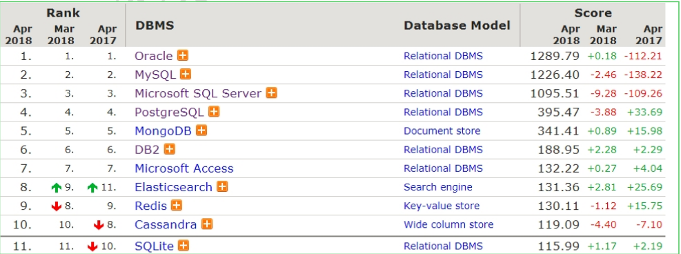


### 二、SQL语句

#### 1.数据库、数据表、数据的关系介绍

- 数据库
  - 用于存储和管理数据的仓库
  - 一个库中可以包含多个数据表
- 数据表
  - 数据库最重要的组成部分之一
  - 它由纵向的列和横向的行组成(类似excel表格)
  - 可以指定列名、数据类型、约束等
  - 一个表中可以存储多条数据
- 数据
  - 想要永久化存储的数据

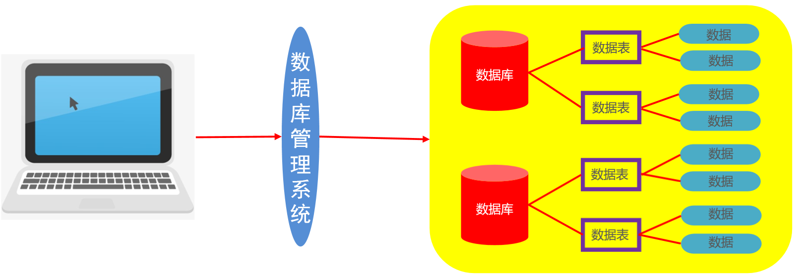

#### 2.SQL介绍

- 什么是SQL

  - Structured Query Language：结构化查询语言
  - 其实就是定义了操作所有关系型数据库的规则。每一种数据库操作的方式可能会存在一些不一样的地方，我们称为“方言”。

- SQL通用语法

  - SQL 语句可以单行或多行书写，以分号结尾。
  - 可使用空格和缩进来增强语句的可读性。
  - MySQL 数据库的 SQL 语句不区分大小写，关键字建议使用大写。
    > 关键词和参数都不区分大小写。
    > 默认字符`utf8_gengeral_ci`不区分大小写，改为`utf8_general_cs`或`utf8_bin`区分。
  - 数据库的注释：
    - 单行注释：-- 注释内容       #注释内容(mysql特有)
    - 多行注释：/* 注释内容 */

- SQL分类

  - DDL(Data Definition Language)数据定义语言
    - 用来定义数据库对象：数据库，表，列等。关键字：create, drop,alter 等
  - DML(Data Manipulation Language)数据操作语言
    - 用来对数据库中表的数据进行增删改。关键字：insert, delete, update 等
  - DQL(Data Query Language)数据查询语言
    - 用来查询数据库中表的记录(数据)。关键字：select, where 等
  - DCL(Data Control Language)数据控制语言(了解)
    - 用来定义数据库的访问权限和安全级别，及创建用户。关键字：GRANT， REVOKE 等

  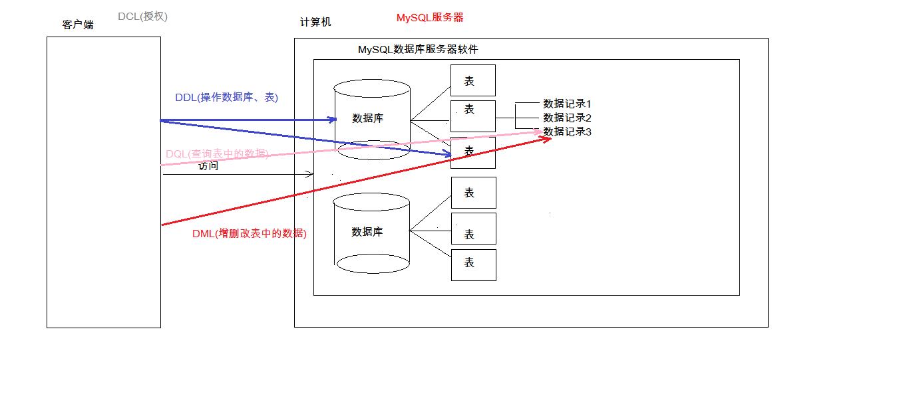

#### 3.DDL-操作数据库

- R(Retrieve)：查询

  - 查询所有数据库

  ```SQL
  -- 查询所有数据库
  SHOW DATABASES;
  ```

  - 查询某个数据库的创建语句

  ```SQL
  -- 标准语法
  SHOW CREATE DATABASE 数据库名称;
  
  -- 查看mysql数据库的创建格式
  SHOW CREATE DATABASE mysql;
  ```

- C(Create)：创建

  - 创建数据库

  ```SQL
  -- 标准语法
  CREATE DATABASE 数据库名称;
  
  -- 创建db1数据库
  CREATE DATABASE db1;
  
  -- 创建一个已存在的数据库会报错
  -- 错误代码：1007  Can't create database 'db1'; database exists
  CREATE DATABASE db1;
  ```

  - 创建数据库(判断，如果不存在则创建)

  ```SQL
  -- 标准语法
  CREATE DATABASE IF NOT EXISTS 数据库名称;
  
  -- 创建数据库db2(判断，如果不存在则创建)
  CREATE DATABASE IF NOT EXISTS db2;
  ```

  - 创建数据库、并指定字符集

  ```SQL
  -- 标准语法
  CREATE DATABASE 数据库名称 CHARACTER SET 字符集名称;
  
  -- 创建数据库db3、并指定字符集utf8
  CREATE DATABASE db3 CHARACTER SET utf8;
  
  -- 查看db3数据库的字符集
  SHOW CREATE DATABASE db3;
  ```

- U(Update)：修改

  - 修改数据库的字符集

  ```SQL
  -- 标准语法
  ALTER DATABASE 数据库名称 CHARACTER SET 字符集名称;
  
  -- 修改数据库db4的字符集为utf8
  ALTER DATABASE db4 CHARACTER SET utf8;
  
  -- 查看db4数据库的字符集
  SHOW CREATE DATABASE db4;
  ```

- D(Delete)：删除

  - 删除数据库

  ```SQL
  -- 标准语法
  DROP DATABASE 数据库名称;
  
  -- 删除db1数据库
  DROP DATABASE db1;
  
  -- 删除一个不存在的数据库会报错
  -- 错误代码：1008  Can't drop database 'db1'; database doesn't exist
  DROP DATABASE db1;
  ```

  - 删除数据库(判断，如果存在则删除)

  ```SQL
  -- 标准语法
  DROP DATABASE IF EXISTS 数据库名称;
  
  -- 删除数据库db2，如果存在
  DROP DATABASE IF EXISTS db2;
  ```

- 使用数据库

  - 查询当前正在使用的数据库名称

  ```SQL
  -- 查询当前正在使用的数据库
  SELECT DATABASE();
  ```

  - 使用数据库

  ```SQL
  -- 标准语法
  USE 数据库名称；
  
  -- 使用db4数据库
  USE db4;
  ```

#### 4.DDL-操作数据表

- R(Retrieve)：查询

  - 查询数据库中所有的数据表

  ```SQL
  -- 使用mysql数据库
  USE mysql;
  
  -- 查询库中所有的表
  SHOW TABLES;
  ```

  - 查询表结构

  ```SQL
  -- 标准语法
  DESC 表名;
  
  -- 查询user表结构
  DESC user;
  ```

  - 查询表字符集

  ```SQL
  -- 标准语法
  SHOW TABLE STATUS FROM 库名 LIKE '表名';
  
  -- 查看mysql数据库中user表字符集
  SHOW TABLE STATUS FROM mysql LIKE 'user';
  ```

- C(Create)：创建

  - 创建数据表

    - 标准语法

    ```SQL
    CREATE TABLE 表名(
        列名1 数据类型1,
        列名2 数据类型2,
        ....
        列名n 数据类型n
    );
    -- 注意：最后一列，不需要加逗号
    ```

    - 数据类型

    ```SQL
    1. int：整数类型
    	* age int
    2. double:小数类型
    	* score double(5,2)
    	* price double
    3. date:日期，只包含年月日     yyyy-MM-dd
    4. datetime:日期，包含年月日时分秒	 yyyy-MM-dd HH:mm:ss
    5. timestamp:时间戳类型	包含年月日时分秒	 yyyy-MM-dd HH:mm:ss	
    	* 如果将来不给这个字段赋值，或赋值为null，则默认使用当前的系统时间，来自动赋值
    6. varchar：字符串
    	* name varchar(20):姓名最大20个字符
    	* zhangsan 8个字符  张三 2个字符
    ```

    - 创建数据表

    ```SQL
    -- 使用db3数据库
    USE db3;
    
    -- 创建一个product商品表
    CREATE TABLE product(
    	id INT,				-- 商品编号
    	NAME VARCHAR(30),	-- 商品名称
    	price DOUBLE,		-- 商品价格
    	stock INT,			-- 商品库存
    	insert_time DATE    -- 上架时间
    );
    ```

    - 复制表

    ```SQL
    -- 标准语法
    CREATE TABLE 表名 LIKE 被复制的表名;
    
    -- 复制product表到product2表
    CREATE TABLE product2 LIKE product;
    ```

- U(Update)：修改

  - 修改表名

  ```SQL
  -- 标准语法
  ALTER TABLE 表名 RENAME TO 新的表名;
  
  -- 修改product2表名为product3
  ALTER TABLE product2 RENAME TO product3;
  ```

  - 修改表的字符集

  ```SQL
  -- 标准语法
  ALTER TABLE 表名 CHARACTER SET 字符集名称;
  
  -- 查看db3数据库中product3数据表字符集
  SHOW TABLE STATUS FROM db3 LIKE 'product3';
  -- 修改product3数据表字符集为gbk
  ALTER TABLE product3 CHARACTER SET gbk;
  -- 查看db3数据库中product3数据表字符集
  SHOW TABLE STATUS FROM db3 LIKE 'product3';
  ```

  - 添加一列

  ```SQL
  -- 标准语法
  ALTER TABLE 表名 ADD 列名 数据类型;
  
  -- 给product3表添加一列color
  ALTER TABLE product3 ADD color VARCHAR(10);
  ```

  - 修改列名称和数据类型

  ```SQL
  -- 修改数据类型 标准语法
  ALTER TABLE 表名 MODIFY 列名 新数据类型;
  
  -- 将color数据类型修改为int
  ALTER TABLE product3 MODIFY color INT;
  -- 查看product3表详细信息
  DESC product3;
  
  
  -- 修改列名和数据类型 标准语法
  ALTER TABLE 表名 CHANGE 列名 新列名 新数据类型;
  
  -- 将color修改为address,数据类型为varchar
  ALTER TABLE product3 CHANGE color address VARCHAR(30);
  -- 查看product3表详细信息
  DESC product3;
  ```

  - 删除列

  ```SQL
  -- 标准语法
  ALTER TABLE 表名 DROP 列名;
  
  -- 删除address列
  ALTER TABLE product3 DROP address;
  ```

- D(Delete)：删除

  - 删除数据表

  ```SQL
  -- 标准语法
  DROP TABLE 表名;
  
  -- 删除product3表
  DROP TABLE product3;
  
  -- 删除不存在的表，会报错
  -- 错误代码：1051  Unknown table 'product3'
  DROP TABLE product3;
  ```

  - 删除数据表(判断，如果存在则删除)

  ```SQL
  -- 标准语法
  DROP TABLE IF EXISTS 表名;
  
  -- 删除product3表，如果存在则删除
  DROP TABLE IF EXISTS product3;
  ```

#### 5.DML-INSERT语句

- 新增表数据语法

  - 新增格式1：给指定列添加数据

  ```SQL
  -- 标准语法
  INSERT INTO 表名(列名1,列名2,...) VALUES (值1,值2,...);
  
  -- 向product表添加一条数据
  INSERT INTO product(id,NAME,price,stock,insert_time) VALUES (1,'手机',1999,22,'2099-09-09');
  
  -- 向product表添加指定列数据
  INSERT INTO product (id,NAME,price) VALUES (2,'电脑',4999);
  
  -- 查看表中所有数据
  SELECT * FROM product;
  ```

  - 新增格式2：默认给全部列添加数据

  ```SQL
  -- 标准语法
  INSERT INTO 表名 VALUES (值1,值2,值3,...);
  
  -- 默认给全部列添加数据
  INSERT INTO product VALUES (3,'电视',2999,18,'2099-06-06');
  
  -- 查看表中所有数据
  SELECT * FROM product;
  ```

  - 新增格式3：批量添加数据

  ```SQL
  -- 默认添加所有列数据 标准语法
  INSERT INTO 表名 VALUES (值1,值2,值3,...),(值1,值2,值3,...),(值1,值2,值3,...);
  
  -- 批量添加数据
  INSERT INTO product VALUES (4,'冰箱',999,26,'2099-08-08'),(5,'洗衣机',1999,32,'2099-05-10');
  -- 查看表中所有数据
  SELECT * FROM product;
  
  
  -- 给指定列添加数据 标准语法
  INSERT INTO 表名(列名1,列名2,...) VALUES (值1,值2,...),(值1,值2,...),(值1,值2,...);
  
  -- 批量添加指定列数据
  INSERT INTO product (id,NAME,price) VALUES (6,'微波炉',499),(7,'电磁炉',899);
  -- 查看表中所有数据
  SELECT * FROM product;
  ```

- 注意事项

  - 列名和值的数量以及数据类型要对应
  - 除了数字类型，其他数据类型的数据都需要加引号(单引双引都可以，推荐单引)

#### 6.DML-UPDATE语句

- 修改表数据语法

```SQL
-- 标准语法
UPDATE 表名 SET 列名1 = 值1,列名2 = 值2,... [where 条件];

-- 修改电视的价格为1800、库存为36
UPDATE product SET price=1800,stock=36 WHERE NAME='电视';

-- 修改电磁炉的库存为10
UPDATE product SET stock=10 WHERE id=7;
```

- 注意事项
  - 修改语句中必须加条件
  - 如果不加条件，则将所有数据都修改

#### 7.DML-DELETE语句

- 删除表数据语法

```SQL
-- 标准语法
DELETE FROM 表名 [WHERE 条件];

-- 删除product表中的微波炉信息
DELETE FROM product WHERE NAME='微波炉';

```

- 注意事项
  - 删除语句中必须加条件
  - 如果不加条件，则将所有数据删除

#### 8.DQL-单表查询

- 数据准备(直接复制执行即可)

```SQL
-- 创建db1数据库
CREATE DATABASE db1;

-- 使用db1数据库
USE db1;

-- 创建数据表
CREATE TABLE product(
	id INT,				-- 商品编号
	NAME VARCHAR(20),	-- 商品名称
	price DOUBLE,		-- 商品价格
	brand VARCHAR(10),	-- 商品品牌
	stock INT,			-- 商品库存
	insert_time DATE    -- 添加时间
);

-- 添加数据
INSERT INTO product VALUES (1,'华为手机',3999,'华为',23,'2088-03-10'),
(2,'小米手机',2999,'小米',30,'2088-05-15'),
(3,'苹果手机',5999,'苹果',18,'2088-08-20'),
(4,'华为电脑',6999,'华为',14,'2088-06-16'),
(5,'小米电脑',4999,'小米',26,'2088-07-08'),
(6,'苹果电脑',8999,'苹果',15,'2088-10-25'),
(7,'联想电脑',7999,'联想',NULL,'2088-11-11');
```

- 查询语法

```SQL
select
	字段列表
from
	表名列表
where
	条件列表
group by
	分组字段
having
	分组之后的条件
order by
	排序
limit
	分页限定
```

- 查询全部

```SQL
-- 标准语法
SELECT * FROM 表名;

-- 查询product表所有数据
SELECT * FROM product;
```

- 查询部分

  - 多个字段查询

  ```SQL
  -- 标准语法
  SELECT 列名1,列名2,... FROM 表名;
  
  -- 查询名称、价格、品牌
  SELECT NAME,price,brand FROM product;
  ```

  - 去除重复查询
    - 注意：只有全部重复的才可以去除

  ```SQL
  -- 标准语法
  SELECT DISTINCT 列名1,列名2,... FROM 表名;
  
  -- 查询品牌
  SELECT brand FROM product;
  -- 查询品牌，去除重复
  SELECT DISTINCT brand FROM product;
  ```

  - 计算列的值(四则运算)

  ```SQL
  -- 标准语法
  SELECT 列名1 运算符(+ - * /) 列名2 FROM 表名;
  
  /*
  	计算列的值
  	标准语法：
  		SELECT 列名1 运算符(+ - * /) 列名2 FROM 表名;
  		
  	如果某一列为null，可以进行替换
  	ifnull(表达式1,表达式2)
  	表达式1：想替换的列
  	表达式2：想替换的值
  */
  -- 查询商品名称和库存，库存数量在原有基础上加10
  SELECT NAME,stock+10 FROM product;
  
  -- 查询商品名称和库存，库存数量在原有基础上加10。进行null值判断
  SELECT NAME,IFNULL(stock,0)+10 FROM product;
  ```

  - 起别名

  ```SQL
  -- 标准语法
  SELECT 列名1,列名2,... AS 别名 FROM 表名;
  
  -- 查询商品名称和库存，库存数量在原有基础上加10。进行null值判断。起别名为getSum
  SELECT NAME,IFNULL(stock,0)+10 AS getsum FROM product;
  SELECT NAME,IFNULL(stock,0)+10 getsum FROM product;
  ```

- 条件查询

  - 条件分类

  | 符号                | 功能                                   |
  | ------------------- | -------------------------------------- |
  | >                   | 大于                                   |
  | <                   | 小于                                   |
  | >=                  | 大于等于                               |
  | <=                  | 小于等于                               |
  | =                   | 等于                                   |
  | <> 或 !=            | 不等于                                 |
  | BETWEEN ... AND ... | 在某个范围之内(都包含)                 |
  | IN(...)             | 多选一                                 |
  | LIKE 占位符         | 模糊查询  _单个任意字符  %多个任意字符 |
  | IS NULL             | 是NULL                                 |
  | IS NOT NULL         | 不是NULL                               |
  | AND 或 &&           | 并且                                   |
  | OR 或 \|\|          | 或者                                   |
  | NOT 或 !            | 非，不是                               |

  - 条件查询语法

  ```SQL
  -- 标准语法
  SELECT 列名 FROM 表名 WHERE 条件;
  
  -- 查询库存大于20的商品信息
  SELECT * FROM product WHERE stock > 20;
  
  -- 查询品牌为华为的商品信息
  SELECT * FROM product WHERE brand='华为';
  
  -- 查询金额在4000 ~ 6000之间的商品信息
  SELECT * FROM product WHERE price >= 4000 AND price <= 6000;
  SELECT * FROM product WHERE price BETWEEN 4000 AND 6000;
  
  -- 查询库存为14、30、23的商品信息
  SELECT * FROM product WHERE stock=14 OR stock=30 OR stock=23;
  SELECT * FROM product WHERE stock IN(14,30,23);
  
  -- 查询库存为null的商品信息
  SELECT * FROM product WHERE stock IS NULL;
  -- 查询库存不为null的商品信息
  SELECT * FROM product WHERE stock IS NOT NULL;
  
  -- 查询名称以小米为开头的商品信息
  SELECT * FROM product WHERE NAME LIKE '小米%';
  
  -- 查询名称第二个字是为的商品信息
  SELECT * FROM product WHERE NAME LIKE '_为%';
  
  -- 查询名称为四个字符的商品信息
  SELECT * FROM product WHERE NAME LIKE '____';
  
  -- 查询名称中包含电脑的商品信息
  SELECT * FROM product WHERE NAME LIKE '%电脑%';
  ```

- 聚合函数

  - 将一列数据作为一个整体，进行纵向的计算
  - 聚合函数分类

  | 函数名      | 功能                           |
  | ----------- | ------------------------------ |
  | count(列名) | 统计数量(一般选用不为null的列) |
  | max(列名)   | 最大值                         |
  | min(列名)   | 最小值                         |
  | sum(列名)   | 求和                           |
  | avg(列名)   | 平均值                         |

  - 聚合函数语法

  ```SQL
  -- 标准语法
  SELECT 函数名(列名) FROM 表名 [WHERE 条件];
  
  -- 计算product表中总记录条数
  SELECT COUNT(*) FROM product;
  
  -- 获取最高价格
  SELECT MAX(price) FROM product;
  -- 获取最高价格的商品名称
  SELECT NAME,price FROM product WHERE price = (SELECT MAX(price) FROM product);
  
  -- 获取最低库存
  SELECT MIN(stock) FROM product;
  -- 获取最低库存的商品名称
  SELECT NAME,stock FROM product WHERE stock = (SELECT MIN(stock) FROM product);
  
  -- 获取总库存数量
  SELECT SUM(stock) FROM product;
  -- 获取品牌为苹果的总库存数量
  SELECT SUM(stock) FROM product WHERE brand='苹果';
  
  -- 获取品牌为小米的平均商品价格
  SELECT AVG(price) FROM product WHERE brand='小米';
  ```

- 排序查询

  - 排序分类
    - 注意：多个排序条件，当前边的条件值一样时，才会判断第二条件

  | 关键词                                   | 功能                                    |
  | ---------------------------------------- | --------------------------------------- |
  | ORDER BY 列名1 排序方式1,列名2 排序方式2 | 对指定列排序，ASC升序(默认的)  DESC降序 |

  - 排序语法

  ```SQL
  -- 标准语法
  SELECT 列名 FROM 表名 [WHERE 条件] ORDER BY 列名1 排序方式1,列名2 排序方式2;
  
  -- 按照库存升序排序
  SELECT * FROM product ORDER BY stock ASC;
  
  -- 查询名称中包含手机的商品信息。按照金额降序排序
  SELECT * FROM product WHERE NAME LIKE '%手机%' ORDER BY price DESC;
  
  -- 按照金额升序排序，如果金额相同，按照库存降序排列
  SELECT * FROM product ORDER BY price ASC,stock DESC;
  ```

- 分组查询

```SQL
-- 标准语法
SELECT 列名 FROM 表名 [WHERE 条件] GROUP BY 分组列名 [HAVING 分组后条件过滤] [ORDER BY 排序列名 排序方式];

-- 按照品牌分组，获取每组商品的总金额
SELECT brand,SUM(price) FROM product GROUP BY brand;

-- 对金额大于4000元的商品，按照品牌分组,获取每组商品的总金额
SELECT brand,SUM(price) FROM product WHERE price > 4000 GROUP BY brand;

-- 对金额大于4000元的商品，按照品牌分组，获取每组商品的总金额，只显示总金额大于7000元的
SELECT brand,SUM(price) AS getSum FROM product WHERE price > 4000 GROUP BY brand HAVING getSum > 7000;

-- 对金额大于4000元的商品，按照品牌分组，获取每组商品的总金额，只显示总金额大于7000元的、并按照总金额的降序排列
SELECT brand,SUM(price) AS getSum FROM product WHERE price > 4000 GROUP BY brand HAVING getSum > 7000 ORDER BY getSum DESC;
```

- 分页查询

```SQL
-- 标准语法
SELECT 列名 FROM 表名 [WHERE 条件] GROUP BY 分组列名 [HAVING 分组后条件过滤] [ORDER BY 排序列名 排序方式] LIMIT 开始索引,查询条数;
-- 公式：开始索引 = (当前页码-1) * 每页显示的条数

-- 每页显示2条数据
SELECT * FROM product LIMIT 0,2;  -- 第一页 开始索引=(1-1) * 2
SELECT * FROM product LIMIT 2,2;  -- 第二页 开始索引=(2-1) * 2
SELECT * FROM product LIMIT 4,2;  -- 第三页 开始索引=(3-1) * 2
SELECT * FROM product LIMIT 6,2;  -- 第四页 开始索引=(4-1) * 2
```

- 分页查询图解

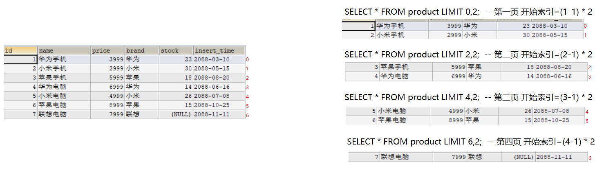

### 三、约束

#### 1.约束的概念和分类

- 约束的概念
  - 对表中的数据进行限定，保证数据的正确性、有效性、完整性！
- 约束的分类

| 约束                          | 说明           |
| ----------------------------- | -------------- |
| PRIMARY KEY                   | 主键约束       |
| PRIMARY KEY AUTO_INCREMENT    | 主键、自动增长 |
| UNIQUE                        | 唯一约束       |
| NOT NULL                      | 非空约束       |
| FOREIGN KEY                   | 外键约束       |
| FOREIGN KEY ON UPDATE CASCADE | 外键级联更新   |
| FOREIGN KEY ON DELETE CASCADE | 外键级联删除   |

#### 2.主键约束

- 主键约束特点
  - 主键约束包含：非空和唯一两个功能
  - 一张表只能有一个列作为主键
  - 主键一般用于表中数据的唯一标识
- 建表时添加主键约束

```SQL
-- 标准语法
CREATE TABLE 表名(
	列名 数据类型 PRIMARY KEY,
    列名 数据类型,
    ...
);

-- 创建student表
CREATE TABLE student(
	id INT PRIMARY KEY  -- 给id添加主键约束
);

-- 添加数据
INSERT INTO student VALUES (1),(2);
-- 主键默认唯一，添加重复数据，会报错
INSERT INTO student VALUES (2);
-- 主键默认非空，不能添加null的数据
INSERT INTO student VALUES (NULL);

-- 查询student表
SELECT * FROM student;
-- 查询student表详细
DESC student;
```

- 删除主键

```SQL
-- 标准语法
ALTER TABLE 表名 DROP PRIMARY KEY;

-- 删除主键
ALTER TABLE student DROP PRIMARY KEY;
```

- 建表后单独添加主键

```SQL
-- 标准语法
ALTER TABLE 表名 MODIFY 列名 数据类型 PRIMARY KEY;

-- 添加主键
ALTER TABLE student MODIFY id INT PRIMARY KEY;
```

#### 3.主键自动增长约束

- 建表时添加主键自增约束

```SQL
-- 标准语法
CREATE TABLE 表名(
	列名 数据类型 PRIMARY KEY AUTO_INCREMENT,
    列名 数据类型,
    ...
);

-- 创建student2表
CREATE TABLE student2(
	id INT PRIMARY KEY AUTO_INCREMENT    -- 给id添加主键自增约束
);

-- 添加数据
INSERT INTO student2 VALUES (1),(2);
-- 添加null值，会自动增长
INSERT INTO student2 VALUES (NULL),(NULL);

-- 查询student2表
SELECT * FROM student2;
-- student2表详细
DESC student2;
```

- 删除自动增长

```SQL
-- 标准语法
ALTER TABLE 表名 MODIFY 列名 数据类型;

-- 删除自动增长
ALTER TABLE student2 MODIFY id INT;
```

- 建表后单独添加自动增长

```SQL
-- 标准语法
ALTER TABLE 表名 MODIFY 列名 数据类型 AUTO_INCREMENT;

-- 添加自动增长
ALTER TABLE student2 MODIFY id INT AUTO_INCREMENT;
```

#### 4.唯一约束

- 建表时添加唯一约束

```SQL
-- 标准语法
CREATE TABLE 表名(
	列名 数据类型 UNIQUE,
    列名 数据类型,
    ...
);

-- 创建student3表
CREATE TABLE student3(
	id INT PRIMARY KEY AUTO_INCREMENT,
	tel VARCHAR(20) UNIQUE    -- 给tel列添加唯一约束
);

-- 添加数据
INSERT INTO student3 VALUES (NULL,'18888888888'),(NULL,'18666666666');
-- 添加重复数据，会报错
INSERT INTO student3 VALUES (NULL,'18666666666');

-- 查询student3数据表
SELECT * FROM student3;
-- student3表详细
DESC student3;
```

- 删除唯一约束

```SQL
-- 标准语法
ALTER TABLE 表名 DROP INDEX 列名;

-- 删除唯一约束
ALTER TABLE student3 DROP INDEX tel;
```

- 建表后单独添加唯一约束

```SQL
-- 标准语法
ALTER TABLE 表名 MODIFY 列名 数据类型 UNIQUE;

-- 添加唯一约束
ALTER TABLE student3 MODIFY tel VARCHAR(20) UNIQUE;
```

#### 5.非空约束

- 建表时添加非空约束

```SQL
-- 标准语法
CREATE TABLE 表名(
	列名 数据类型 NOT NULL,
    列名 数据类型,
    ...
);

-- 创建student4表
CREATE TABLE student4(
	id INT PRIMARY KEY AUTO_INCREMENT,
	NAME VARCHAR(20) NOT NULL    -- 给name添加非空约束
);

-- 添加数据
INSERT INTO student4 VALUES (NULL,'张三'),(NULL,'李四');
-- 添加null值，会报错
INSERT INTO student4 VALUES (NULL,NULL);
```

- 删除非空约束

```SQL
-- 标准语法
ALTER TABLE 表名 MODIFY 列名 数据类型;

-- 删除非空约束
ALTER TABLE student4 MODIFY NAME VARCHAR(20);
```

- 建表后单独添加非空约束

  ```SQL
  -- 标准语法
  ALTER TABLE 表名 MODIFY 列名 数据类型 NOT NULL;
  
  -- 添加非空约束
  ALTER TABLE student4 MODIFY NAME VARCHAR(20) NOT NULL;
  ```


#### 6.外键约束

- 外键约束概念

  - 让表和表之间产生关系，从而保证数据的准确性！

- 建表时添加外键约束

  - 外键约束格式

  ```SQL
  CONSTRAINT 外键名 FOREIGN KEY (本表外键列名) REFERENCES 主表名(主表主键列名)
  ```

  - 创建表添加外键约束

  ```SQL
  -- 创建user用户表
  CREATE TABLE USER(
  	id INT PRIMARY KEY AUTO_INCREMENT,    -- id
  	NAME VARCHAR(20) NOT NULL             -- 姓名
  );
  -- 添加用户数据
  INSERT INTO USER VALUES (NULL,'张三'),(NULL,'李四'),(NULL,'王五');
  
  -- 创建orderlist订单表
  CREATE TABLE orderlist(
  	id INT PRIMARY KEY AUTO_INCREMENT,    -- id
  	number VARCHAR(20) NOT NULL,          -- 订单编号
  	uid INT,                              -- 订单所属用户
  	CONSTRAINT ou_fk1 FOREIGN KEY (uid) REFERENCES USER(id)   -- 添加外键约束
  );
  -- 添加订单数据
  INSERT INTO orderlist VALUES (NULL,'hm001',1),(NULL,'hm002',1),
  (NULL,'hm003',2),(NULL,'hm004',2),
  (NULL,'hm005',3),(NULL,'hm006',3);
  
  -- 添加一个订单，但是没有所属用户。无法添加
  INSERT INTO orderlist VALUES (NULL,'hm007',8);
  -- 删除王五这个用户，但是订单表中王五还有很多个订单呢。无法删除
  DELETE FROM USER WHERE NAME='王五';
  ```

- 删除外键约束

```SQL
-- 标准语法
ALTER TABLE 表名 DROP FOREIGN KEY 外键名;

-- 删除外键
ALTER TABLE orderlist DROP FOREIGN KEY ou_fk1;
```

- 建表后添加外键约束

```SQL
-- 标准语法
ALTER TABLE 表名 ADD CONSTRAINT 外键名 FOREIGN KEY (本表外键列名) REFERENCES 主表名(主键列名);

-- 添加外键约束
ALTER TABLE orderlist ADD CONSTRAINT ou_fk1 FOREIGN KEY (uid) REFERENCES USER(id);
```

## MySQL进阶

### 一、级联

- 什么是级联更新和级联删除
  - 当我想把user用户表中的某个用户删掉，我希望该用户所有的订单也随之被删除
  - 当我想把user用户表中的某个用户id修改，我希望订单表中该用户所属的订单用户编号也随之修改
- 添加级联更新和级联删除

```SQL
-- 添加外键约束，同时添加级联更新  标准语法
ALTER TABLE 表名 ADD CONSTRAINT 外键名 FOREIGN KEY (本表外键列名) REFERENCES 主表名(主键列名) ON UPDATE CASCADE;

-- 添加外键约束，同时添加级联删除  标准语法
ALTER TABLE 表名 ADD CONSTRAINT 外键名 FOREIGN KEY (本表外键列名) REFERENCES 主表名(主键列名) ON DELETE CASCADE;

-- 添加外键约束，同时添加级联更新和级联删除  标准语法
ALTER TABLE 表名 ADD CONSTRAINT 外键名 FOREIGN KEY (本表外键列名) REFERENCES 主表名(主键列名) ON UPDATE CASCADE ON DELETE CASCADE;


-- 删除外键约束
ALTER TABLE orderlist DROP FOREIGN KEY ou_fk1;

-- 添加外键约束，同时添加级联更新和级联删除
ALTER TABLE orderlist ADD CONSTRAINT ou_fk1 FOREIGN KEY (uid) REFERENCES USER(id) ON UPDATE CASCADE ON DELETE CASCADE;

-- 将王五用户的id修改为5    订单表中的uid也随之被修改
UPDATE USER SET id=5 WHERE id=3;

-- 将王五用户删除     订单表中该用户所有订单也随之删除
DELETE FROM USER WHERE id=5;
```

### 二、多表设计

#### 1.一对一(了解)

- 分析
  - 人和身份证。一个人只有一个身份证，一个身份证只能对应一个人！
- 实现原则
  - 在任意一个表建立外键，去关联另外一个表的主键
- SQL演示

```SQL
-- 创建db5数据库
CREATE DATABASE db5;
-- 使用db5数据库
USE db5;

-- 创建person表
CREATE TABLE person(
	id INT PRIMARY KEY AUTO_INCREMENT,
	NAME VARCHAR(20)
);
-- 添加数据
INSERT INTO person VALUES (NULL,'张三'),(NULL,'李四');

-- 创建card表
CREATE TABLE card(
	id INT PRIMARY KEY AUTO_INCREMENT,
	number VARCHAR(50),
	pid INT UNIQUE,
	CONSTRAINT cp_fk1 FOREIGN KEY (pid) REFERENCES person(id) -- 添加外键
);
-- 添加数据
INSERT INTO card VALUES (NULL,'12345',1),(NULL,'56789',2);
```

- 图解

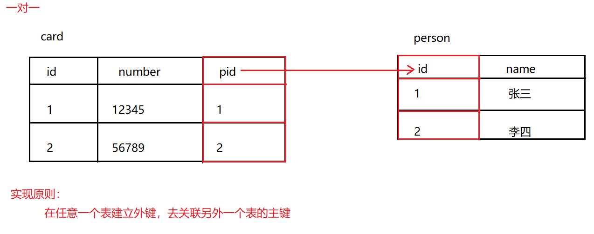

#### 2.一对多

- 分析
  - 用户和订单。一个用户可以有多个订单！
  - 商品分类和商品。一个分类下可以有多个商品！
- 实现原则
  - 在多的一方，建立外键约束，来关联一的一方主键
- SQL演示

```SQL
/*
	用户和订单
*/
-- 创建user表
CREATE TABLE USER(
	id INT PRIMARY KEY AUTO_INCREMENT,
	NAME VARCHAR(20)
);
-- 添加数据
INSERT INTO USER VALUES (NULL,'张三'),(NULL,'李四');

-- 创建orderlist表
CREATE TABLE orderlist(
	id INT PRIMARY KEY AUTO_INCREMENT,
	number VARCHAR(20),
	uid INT,
	CONSTRAINT ou_fk1 FOREIGN KEY (uid) REFERENCES USER(id)  -- 添加外键约束
);
-- 添加数据
INSERT INTO orderlist VALUES (NULL,'hm001',1),(NULL,'hm002',1),(NULL,'hm003',2),(NULL,'hm004',2);


/*
	商品分类和商品
*/
-- 创建category表
CREATE TABLE category(
	id INT PRIMARY KEY AUTO_INCREMENT,
	NAME VARCHAR(10)
);
-- 添加数据
INSERT INTO category VALUES (NULL,'手机数码'),(NULL,'电脑办公');

-- 创建product表
CREATE TABLE product(
	id INT PRIMARY KEY AUTO_INCREMENT,
	NAME VARCHAR(30),
	cid INT,
	CONSTRAINT pc_fk1 FOREIGN KEY (cid) REFERENCES category(id)  -- 添加外键约束
);
-- 添加数据
INSERT INTO product VALUES (NULL,'华为P30',1),(NULL,'小米note3',1),
(NULL,'联想电脑',2),(NULL,'苹果电脑',2);
```

- 图解

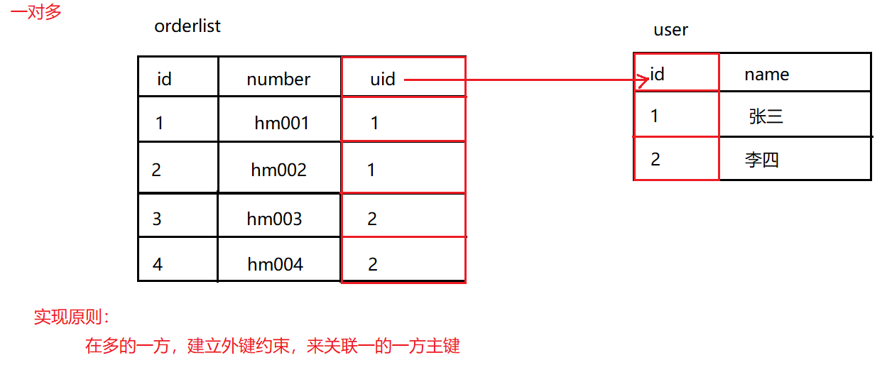

#### 3.多对多

- 分析
  - 学生和课程。一个学生可以选择多个课程，一个课程也可以被多个学生选择！
- 实现原则
  - 需要借助第三张表中间表，中间表至少包含两个列，这两个列作为中间表的外键，分别关联两张表的主键
- SQL演示

```SQL
-- 创建student表
CREATE TABLE student(
	id INT PRIMARY KEY AUTO_INCREMENT,
	NAME VARCHAR(20)
);
-- 添加数据
INSERT INTO student VALUES (NULL,'张三'),(NULL,'李四');

-- 创建course表
CREATE TABLE course(
	id INT PRIMARY KEY AUTO_INCREMENT,
	NAME VARCHAR(10)
);
-- 添加数据
INSERT INTO course VALUES (NULL,'语文'),(NULL,'数学');

-- 创建中间表
CREATE TABLE stu_course(
	id INT PRIMARY KEY AUTO_INCREMENT,
	sid INT, -- 用于和student表的id进行外键关联
	cid INT, -- 用于和course表的id进行外键关联
	CONSTRAINT sc_fk1 FOREIGN KEY (sid) REFERENCES student(id), -- 添加外键约束
	CONSTRAINT sc_fk2 FOREIGN KEY (cid) REFERENCES course(id)   -- 添加外键约束
);
-- 添加数据
INSERT INTO stu_course VALUES (NULL,1,1),(NULL,1,2),(NULL,2,1),(NULL,2,2);
```

- 图解

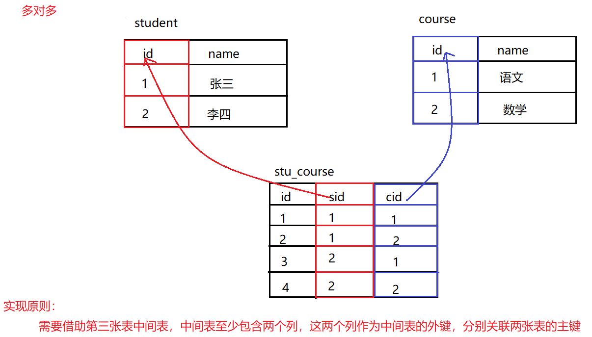

### 三、多表查询

#### 1.多表查询-数据准备

- SQL语句

```SQL
-- 创建db6数据库
CREATE DATABASE db6;
-- 使用db6数据库
USE db6;

-- 创建user表
CREATE TABLE USER(
	id INT PRIMARY KEY AUTO_INCREMENT,	-- 用户id
	NAME VARCHAR(20),			        -- 用户姓名
	age INT                             -- 用户年龄
);
-- 添加数据
INSERT INTO USER VALUES (1,'张三',23);
INSERT INTO USER VALUES (2,'李四',24);
INSERT INTO USER VALUES (3,'王五',25);
INSERT INTO USER VALUES (4,'赵六',26);


-- 订单表
CREATE TABLE orderlist(
	id INT PRIMARY KEY AUTO_INCREMENT,	-- 订单id
	number VARCHAR(30),					-- 订单编号
	uid INT,    -- 外键字段
	CONSTRAINT ou_fk1 FOREIGN KEY (uid) REFERENCES USER(id)
);
-- 添加数据
INSERT INTO orderlist VALUES (1,'hm001',1);
INSERT INTO orderlist VALUES (2,'hm002',1);
INSERT INTO orderlist VALUES (3,'hm003',2);
INSERT INTO orderlist VALUES (4,'hm004',2);
INSERT INTO orderlist VALUES (5,'hm005',3);
INSERT INTO orderlist VALUES (6,'hm006',3);
INSERT INTO orderlist VALUES (7,'hm007',NULL);


-- 商品分类表
CREATE TABLE category(
	id INT PRIMARY KEY AUTO_INCREMENT,  -- 商品分类id
	NAME VARCHAR(10)                    -- 商品分类名称
);
-- 添加数据
INSERT INTO category VALUES (1,'手机数码');
INSERT INTO category VALUES (2,'电脑办公');
INSERT INTO category VALUES (3,'烟酒茶糖');
INSERT INTO category VALUES (4,'鞋靴箱包');


-- 商品表
CREATE TABLE product(
	id INT PRIMARY KEY AUTO_INCREMENT,   -- 商品id
	NAME VARCHAR(30),                    -- 商品名称
	cid INT, -- 外键字段
	CONSTRAINT cp_fk1 FOREIGN KEY (cid) REFERENCES category(id)
);
-- 添加数据
INSERT INTO product VALUES (1,'华为手机',1);
INSERT INTO product VALUES (2,'小米手机',1);
INSERT INTO product VALUES (3,'联想电脑',2);
INSERT INTO product VALUES (4,'苹果电脑',2);
INSERT INTO product VALUES (5,'中华香烟',3);
INSERT INTO product VALUES (6,'玉溪香烟',3);
INSERT INTO product VALUES (7,'计生用品',NULL);


-- 中间表
CREATE TABLE us_pro(
	upid INT PRIMARY KEY AUTO_INCREMENT,  -- 中间表id
	uid INT, -- 外键字段。需要和用户表的主键产生关联
	pid INT, -- 外键字段。需要和商品表的主键产生关联
	CONSTRAINT up_fk1 FOREIGN KEY (uid) REFERENCES USER(id),
	CONSTRAINT up_fk2 FOREIGN KEY (pid) REFERENCES product(id)
);
-- 添加数据
INSERT INTO us_pro VALUES (NULL,1,1);
INSERT INTO us_pro VALUES (NULL,1,2);
INSERT INTO us_pro VALUES (NULL,1,3);
INSERT INTO us_pro VALUES (NULL,1,4);
INSERT INTO us_pro VALUES (NULL,1,5);
INSERT INTO us_pro VALUES (NULL,1,6);
INSERT INTO us_pro VALUES (NULL,1,7);
INSERT INTO us_pro VALUES (NULL,2,1);
INSERT INTO us_pro VALUES (NULL,2,2);
INSERT INTO us_pro VALUES (NULL,2,3);
INSERT INTO us_pro VALUES (NULL,2,4);
INSERT INTO us_pro VALUES (NULL,2,5);
INSERT INTO us_pro VALUES (NULL,2,6);
INSERT INTO us_pro VALUES (NULL,2,7);
INSERT INTO us_pro VALUES (NULL,3,1);
INSERT INTO us_pro VALUES (NULL,3,2);
INSERT INTO us_pro VALUES (NULL,3,3);
INSERT INTO us_pro VALUES (NULL,3,4);
INSERT INTO us_pro VALUES (NULL,3,5);
INSERT INTO us_pro VALUES (NULL,3,6);
INSERT INTO us_pro VALUES (NULL,3,7);
INSERT INTO us_pro VALUES (NULL,4,1);
INSERT INTO us_pro VALUES (NULL,4,2);
INSERT INTO us_pro VALUES (NULL,4,3);
INSERT INTO us_pro VALUES (NULL,4,4);
INSERT INTO us_pro VALUES (NULL,4,5);
INSERT INTO us_pro VALUES (NULL,4,6);
INSERT INTO us_pro VALUES (NULL,4,7);
```

- 架构器图解

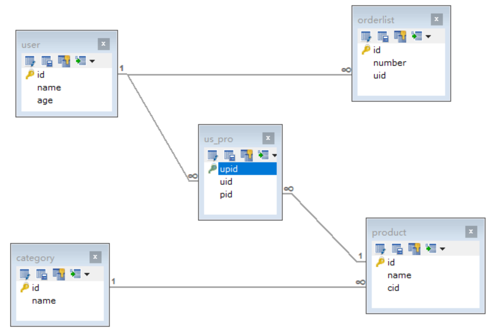

#### 2.多表查询-笛卡尔积查询(了解)

- 有两张表，获取这两个表的所有组合情况
- 要完成多表查询，需要消除这些没有用的数据
- 多表查询格式

```SQL
SELECT
	列名列表
FROM
	表名列表
WHERE
	条件...
```

- 笛卡尔积查询

```SQL
-- 标准语法
SELECT 列名 FROM 表名1,表名2,...;

-- 查询user表和orderlist表
SELECT * FROM USER,orderlist;
```

#### 3.多表查询-内连接查询

- 查询原理
  - 内连接查询的是两张表有交集的部分数据(有主外键关联的数据)
- 显式内连接

```SQL
-- 标准语法
SELECT 列名 FROM 表名1 [INNER] JOIN 表名2 ON 条件;

-- 查询用户信息和对应的订单信息
SELECT * FROM USER INNER JOIN orderlist ON user.id=orderlist.uid;
SELECT * FROM USER JOIN orderlist ON user.id=orderlist.uid;

-- 查询用户信息和对应的订单信息，起别名
SELECT * FROM USER u JOIN orderlist o ON u.id=o.uid;

-- 查询用户姓名，年龄。和订单编号
SELECT
	u.`name`,	-- 姓名
	u.`age`,	-- 年龄
	o.`number`	-- 订单编号
FROM
	USER u          -- 用户表
JOIN
	orderlist o     -- 订单表
ON 
	u.`id` = o.`uid`;
```

- 隐式内连接

```SQL
-- 标准语法
SELECT 列名 FROM 表名1,表名2 WHERE 条件;

-- 查询用户姓名，年龄。和订单编号
SELECT
	u.`name`,	-- 姓名
	u.`age`,	-- 年龄
	o.`number`	-- 订单编号
FROM
	USER u,		-- 用户表
	orderlist o     -- 订单表
WHERE
	u.`id`=o.`uid`;
```

#### 4.多表查询-外连接查询

- 左外连接

  - 查询原理
    - 查询左表的全部数据，和左右两张表有交集部分的数据
  - 基本演示

  ```SQL
  -- 标准语法
  SELECT 列名 FROM 表名1 LEFT [OUTER] JOIN 表名2 ON 条件;
  
  -- 查询所有用户信息，以及用户对应的订单信息
  SELECT
  	u.`name`,	-- 姓名
  	u.`age`,	-- 年龄
  	o.`number`	-- 订单编号
  FROM
  	USER u          -- 用户表
  LEFT OUTER JOIN
  	orderlist o     -- 订单表
  ON
  	u.`id`=o.`uid`;
  ```

- 右外连接

  - 查询原理
    - 查询右表的全部数据，和左右两张表有交集部分的数据
  - 基本演示

  ```SQL
  -- 基本语法
  SELECT 列名 FROM 表名1 RIGHT [OUTER] JOIN 表名2 ON 条件;
  
  -- 查询所有订单信息，以及订单所属的用户信息
  SELECT
  	u.`name`,	-- 姓名
  	u.`age`,	-- 年龄
  	o.`number`	-- 订单编号
  FROM
  	USER u          -- 用户表
  RIGHT OUTER JOIN
  	orderlist o     -- 订单表
  ON
  	u.`id`=o.`uid`;
  ```

#### 5.多表查询-子查询

- 子查询介绍

  - 查询语句中嵌套了查询语句。我们就将嵌套查询称为子查询！

- 子查询-结果是单行单列的

  - 可以作为条件，使用运算符进行判断！
  - 基本演示

  ```SQL
  -- 标准语法
  SELECT 列名 FROM 表名 WHERE 列名=(SELECT 聚合函数(列名) FROM 表名 [WHERE 条件]);
  
  -- 查询年龄最高的用户姓名
  SELECT MAX(age) FROM USER;              -- 查询出最高年龄
  SELECT NAME,age FROM USER WHERE age=26; -- 根据查询出来的最高年龄，查询姓名和年龄
  SELECT NAME,age FROM USER WHERE age = (SELECT MAX(age) FROM USER);
  ```

- 子查询-结果是多行单列的

  - 可以作为条件，使用运算符in或not in进行判断！
  - 基本演示

  ```SQL
  -- 标准语法
  SELECT 列名 FROM 表名 WHERE 列名 [NOT] IN (SELECT 列名 FROM 表名 [WHERE 条件]); 
  
  -- 查询张三和李四的订单信息
  SELECT id FROM USER WHERE NAME='张三' OR NAME='李四';   -- 查询张三和李四用户的id
  SELECT number,uid FROM orderlist WHERE uid=1 OR uid=2; -- 根据id查询订单
  SELECT number,uid FROM orderlist WHERE uid IN (SELECT id FROM USER WHERE NAME='张三' OR NAME='李四');
  ```

- 子查询-结果是多行多列的

  - 可以作为一张虚拟表参与查询！
  - 基本演示

  ```SQL
  -- 标准语法
  SELECT 列名 FROM 表名 [别名],(SELECT 列名 FROM 表名 [WHERE 条件]) [别名] [WHERE 条件];
  
  -- 查询订单表中id大于4的订单信息和所属用户信息
  SELECT * FROM USER u,(SELECT * FROM orderlist WHERE id>4) o WHERE u.id=o.uid;
  ```

#### 6.多表查询-自关联查询

- 自关联查询介绍
  - 同一张表中有数据关联。可以多次查询这同一个表！
- 自关联查询演示

```SQL
-- 创建员工表
CREATE TABLE employee(
	id INT PRIMARY KEY AUTO_INCREMENT,
	NAME VARCHAR(20),
	mgr INT,
	salary DOUBLE
);
-- 添加数据
INSERT INTO employee VALUES (1001,'孙悟空',1005,9000.00),
(1002,'猪八戒',1005,8000.00),
(1003,'沙和尚',1005,8500.00),
(1004,'小白龙',1005,7900.00),
(1005,'唐僧',NULL,15000.00),
(1006,'武松',1009,7600.00),
(1007,'李逵',1009,7400.00),
(1008,'林冲',1009,8100.00),
(1009,'宋江',NULL,16000.00);

-- 查询所有员工的姓名及其直接上级的姓名，没有上级的员工也需要查询
/*
分析：
	员工姓名 employee表        直接上级姓名 employee表
	条件：employee.mgr = employee.id
	查询左表的全部数据，和左右两张表交集部分数据，使用左外连接
*/
SELECT
	t1.name,	-- 员工姓名
	t1.mgr,		-- 上级编号
	t2.id,		-- 员工编号
	t2.name     -- 员工姓名
FROM
	employee t1  -- 员工表
LEFT OUTER JOIN
	employee t2  -- 员工表
ON
	t1.mgr = t2.id;
```

### 四、视图

#### 1.视图的概念

- 视图是一种虚拟存在的数据表
- 这个虚拟的表并不在数据库中实际存在
- 作用是将一些比较复杂的查询语句的结果，封装到一个虚拟表中。后期再有相同复杂查询时，直接查询这张虚拟表即可
- 说白了，视图就是将一条SELECT查询语句的结果封装到了一个虚拟表中，所以我们在创建视图的时候，工作重心就要放在这条SELECT查询语句上

#### 2.视图的好处

- 简单
  - 对于使用视图的用户不需要关心表的结构、关联条件和筛选条件。因为这张虚拟表中保存的就是已经过滤好条件的结果集
- 安全
  - 视图可以设置权限 , 致使访问视图的用户只能访问他们被允许查询的结果集
- 数据独立
  - 一旦视图的结构确定了，可以屏蔽表结构变化对用户的影响，源表增加列对视图没有影响；源表修改列名，则可以通过修改视图来解决，不会造成对访问者的影响

#### 3.视图数据准备

```SQL
-- 创建db7数据库
CREATE DATABASE db7;

-- 使用db7数据库
USE db7;

-- 创建country表
CREATE TABLE country(
	id INT PRIMARY KEY AUTO_INCREMENT,
	country_name VARCHAR(30)
);
-- 添加数据
INSERT INTO country VALUES (NULL,'中国'),(NULL,'美国'),(NULL,'俄罗斯');

-- 创建city表
CREATE TABLE city(
	id INT PRIMARY KEY AUTO_INCREMENT,
	city_name VARCHAR(30),
	cid INT, -- 外键列。关联country表的主键列id
	CONSTRAINT cc_fk1 FOREIGN KEY (cid) REFERENCES country(id)
);
-- 添加数据
INSERT INTO city VALUES (NULL,'北京',1),(NULL,'上海',1),(NULL,'纽约',2),(NULL,'莫斯科',3);
```

#### 4.视图的创建

- 创建视图语法

```SQL
-- 标准语法
CREATE VIEW 视图名称 [(列名列表)] AS 查询语句;
```

- 普通多表查询，查询城市和所属国家

```SQL
-- 普通多表查询，查询城市和所属国家
SELECT
	t1.*,
	t2.country_name
FROM
	city t1,
	country t2
WHERE
	t1.cid = t2.id;
	
-- 经常需要查询这样的数据，就可以创建一个视图
```

- 创建视图基本演示

```SQL
-- 创建一个视图。将查询出来的结果保存到这张虚拟表中
CREATE
VIEW
	city_country
AS
	SELECT t1.*,t2.country_name FROM city t1,country t2 WHERE t1.cid=t2.id;
```

- 创建视图并指定列名基本演示

```SQL
-- 创建一个视图，指定列名。将查询出来的结果保存到这张虚拟表中
CREATE
VIEW
	city_country2 (city_id,city_name,cid,country_name) 
AS
	SELECT t1.*,t2.country_name FROM city t1,country t2 WHERE t1.cid=t2.id;

```

#### 5.视图的查询

- 查询视图语法

```SQL
-- 标准语法
SELECT * FROM 视图名称;
```

- 查询视图基本演示

```SQL
-- 查询视图。查询这张虚拟表，就等效于查询城市和所属国家
SELECT * FROM city_country;

-- 查询指定列名的视图
SELECT * FROM city_country2;

-- 查询所有数据表，视图也会查询出来
SHOW TABLES;
```

- 查询视图创建语法

```SQL
-- 标准语法
SHOW CREATE VIEW 视图名称;
```

- 查询视图创建语句基本演示

```SQL
SHOW CREATE VIEW city_country;
```

#### 6.视图的修改

- 修改视图表中的数据

```SQL
-- 标准语法
UPDATE 视图名称 SET 列名=值 WHERE 条件;

-- 修改视图表中的城市名称北京为北京市
UPDATE city_country SET city_name='北京市' WHERE city_name='北京';

-- 查询视图
SELECT * FROM city_country;

-- 查询city表,北京也修改为了北京市
SELECT * FROM city;

-- 注意：视图表数据修改，会自动修改源表中的数据
```

- 修改视图表结构

```SQL
-- 标准语法
ALTER VIEW 视图名称 [(列名列表)] AS 查询语句;

-- 查询视图2
SELECT * FROM city_country2;

-- 修改视图2的列名city_id为id
ALTER
VIEW
	city_country2 (id,city_name,cid,country_name)
AS
	SELECT t1.*,t2.country_name FROM city t1,country t2 WHERE t1.cid=t2.id;
```

#### 7.视图的删除

- 删除视图

```SQL
-- 标准语法
DROP VIEW [IF EXISTS] 视图名称;

-- 删除视图
DROP VIEW city_country;

-- 删除视图2，如果存在则删除
DROP VIEW IF EXISTS city_country2;
```


### 五、备份与还原

#### 1.备份

- Linux系统，输入：`mysqldump -u root -p 数据库名称 > 文件保存路径`

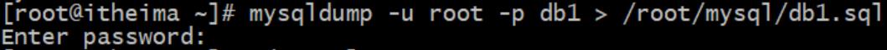

#### 2.恢复

- 删除旧数据：`drop database 数据库名称;`

- 重建同名的数据库：`create database 数据库名词;`

- 使用该数据库：`use 数据库名称`

- 导入文件执行：`source 备份文件路径;`

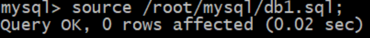


## MySQL高级

### 一、MySQL存储过程和函数

#### 1.存储过程和函数的概念

- 存储过程和函数是  事先经过编译并存储在数据库中的一段 SQL 语句的集合

#### 2.存储过程和函数的好处

- 存储过程和函数可以重复使用，减轻开发人员的工作量。类似于java中方法可以多次调用
- 减少网络流量，存储过程和函数位于服务器上，调用的时候只需要传递名称和参数即可
- 减少数据在数据库和应用服务器之间的传输，可以提高数据处理的效率
- 将一些业务逻辑在数据库层面来实现，可以减少代码层面的业务处理

#### 3.存储过程和函数的区别

- 函数必须有返回值
- 存储过程没有返回值

#### 4.创建存储过程

- 小知识

```SQL
/*
	该关键字用来声明sql语句的分隔符，告诉MySQL该段命令已经结束！
	sql语句默认的分隔符是分号，但是有的时候我们需要一条功能sql语句中包含分号，但是并不作为结束标识。
	这个时候就可以使用DELIMITER来指定分隔符了！
*/
-- 标准语法
DELIMITER 分隔符
```

- 数据准备

```SQL
-- 创建db8数据库
CREATE DATABASE db8;

-- 使用db8数据库
USE db8;

-- 创建学生表
CREATE TABLE student(
	id INT PRIMARY KEY AUTO_INCREMENT,	-- 学生id
	NAME VARCHAR(20),					-- 学生姓名
	age INT,							-- 学生年龄
	gender VARCHAR(5),					-- 学生性别
	score INT                           -- 学生成绩
);
-- 添加数据
INSERT INTO student VALUES (NULL,'张三',23,'男',95),(NULL,'李四',24,'男',98),
(NULL,'王五',25,'女',100),(NULL,'赵六',26,'女',90);

-- 按照性别进行分组，查询每组学生的总成绩。按照总成绩的升序排序
SELECT gender,SUM(score) getSum FROM student GROUP BY gender ORDER BY getSum ASC;
```

- 创建存储过程语法

```SQL
-- 修改分隔符为$
DELIMITER $

-- 标准语法
CREATE PROCEDURE 存储过程名称(参数...)
BEGIN
	sql语句;
END$

-- 修改分隔符为分号
DELIMITER ;
```

- 创建存储过程

```SQL
-- 修改分隔符为$
DELIMITER $

-- 创建存储过程，封装分组查询学生总成绩的sql语句
CREATE PROCEDURE stu_group()
BEGIN
	SELECT gender,SUM(score) getSum FROM student GROUP BY gender ORDER BY getSum ASC;
END$

-- 修改分隔符为分号
DELIMITER ;
```

#### 5.调用存储过程

- 调用存储过程语法

```SQL
-- 标准语法
CALL 存储过程名称(实际参数);

-- 调用stu_group存储过程
CALL stu_group();
```

#### 6.查看存储过程

- 查看存储过程语法

```SQL
-- 查询数据库中所有的存储过程 标准语法
SELECT * FROM mysql.proc WHERE db='数据库名称';
```

#### 7.删除存储过程

- 删除存储过程语法

```SQL
-- 标准语法
DROP PROCEDURE [IF EXISTS] 存储过程名称;

-- 删除stu_group存储过程
DROP PROCEDURE stu_group;
```

#### 8.存储过程语法

##### 8.1存储过程语法介绍

- 存储过程是可以进行编程的。意味着可以使用变量、表达式、条件控制语句、循环语句等，来完成比较复杂的功能！

##### 8.2变量的使用

- 定义变量

```SQL
-- 标准语法
DECLARE 变量名 数据类型 [DEFAULT 默认值];
-- 注意： DECLARE定义的是局部变量，只能用在BEGIN END范围之内

-- 定义一个int类型变量、并赋默认值为10
DELIMITER $

CREATE PROCEDURE pro_test1()
BEGIN
	DECLARE num INT DEFAULT 10;   -- 定义变量
	SELECT num;                   -- 查询变量
END$

DELIMITER ;

-- 调用pro_test1存储过程
CALL pro_test1();
```

- 变量的赋值1

```SQL
-- 标准语法
SET 变量名 = 变量值;

-- 定义字符串类型变量，并赋值
DELIMITER $

CREATE PROCEDURE pro_test2()
BEGIN
	DECLARE NAME VARCHAR(10);   -- 定义变量
	SET NAME = '存储过程';       -- 为变量赋值
	SELECT NAME;                -- 查询变量
END$

DELIMITER ;

-- 调用pro_test2存储过程
CALL pro_test2();
```

- 变量的赋值2

```SQL
-- 标准语法
SELECT 列名 INTO 变量名 FROM 表名 [WHERE 条件];

-- 定义两个int变量，用于存储男女同学的总分数
DELIMITER $

CREATE PROCEDURE pro_test3()
BEGIN
	DECLARE men,women INT;  -- 定义变量
	SELECT SUM(score) INTO men FROM student WHERE gender='男';    -- 计算男同学总分数赋值给men
	SELECT SUM(score) INTO women FROM student WHERE gender='女';  -- 计算女同学总分数赋值给women
	SELECT men,women;           -- 查询变量
END$

DELIMITER ;

-- 调用pro_test3存储过程
CALL pro_test3();
```

##### 8.3if语句的使用

- 标准语法

```SQL
-- 标准语法
IF 判断条件1 THEN 执行的sql语句1;
[ELSEIF 判断条件2 THEN 执行的sql语句2;]
...
[ELSE 执行的sql语句n;]
END IF;
```

- 案例演示

```SQL
/*
	定义一个int变量，用于存储班级总成绩
	定义一个varchar变量，用于存储分数描述
	根据总成绩判断：
		380分及以上    学习优秀
		320 ~ 380     学习不错
		320以下       学习一般
*/
DELIMITER $

CREATE PROCEDURE pro_test4()
BEGIN
	-- 定义总分数变量
	DECLARE total INT;
	-- 定义分数描述变量
	DECLARE description VARCHAR(10);
	-- 为总分数变量赋值
	SELECT SUM(score) INTO total FROM student;
	-- 判断总分数
	IF total >= 380 THEN 
		SET description = '学习优秀';
	ELSEIF total >= 320 AND total < 380 THEN 
		SET description = '学习不错';
	ELSE 
		SET description = '学习一般';
	END IF;
	
	-- 查询总成绩和描述信息
	SELECT total,description;
END$

DELIMITER ;

-- 调用pro_test4存储过程
CALL pro_test4();
```

##### 8.4参数的传递

- 参数传递的语法

```SQL
DELIMITER $

-- 标准语法
CREATE PROCEDURE 存储过程名称([IN|OUT|INOUT] 参数名 数据类型)
BEGIN
	执行的sql语句;
END$
/*
	IN:代表输入参数，需要由调用者传递实际数据。默认的
	OUT:代表输出参数，该参数可以作为返回值
	INOUT:代表既可以作为输入参数，也可以作为输出参数
*/
DELIMITER ;
```

- 输入参数

  - 标准语法

  ```SQL
  DELIMITER $
  
  -- 标准语法
  CREATE PROCEDURE 存储过程名称(IN 参数名 数据类型)
  BEGIN
  	执行的sql语句;
  END$
  
  DELIMITER ;
  ```

  - 案例演示

  ```SQL
  /*
  	输入总成绩变量，代表学生总成绩
  	定义一个varchar变量，用于存储分数描述
  	根据总成绩判断：
  		380分及以上  学习优秀
  		320 ~ 380    学习不错
  		320以下      学习一般
  */
  DELIMITER $
  
  CREATE PROCEDURE pro_test5(IN total INT)
  BEGIN
  	-- 定义分数描述变量
  	DECLARE description VARCHAR(10);
  	-- 判断总分数
  	IF total >= 380 THEN 
  		SET description = '学习优秀';
  	ELSEIF total >= 320 AND total < 380 THEN 
  		SET description = '学习不错';
  	ELSE 
  		SET description = '学习一般';
  	END IF;
  	
  	-- 查询总成绩和描述信息
  	SELECT total,description;
  END$
  
  DELIMITER ;
  
  -- 调用pro_test5存储过程
  CALL pro_test5(390);
  CALL pro_test5((SELECT SUM(score) FROM student));
  ```

- 输出参数

  - 标准语法

  ```SQL
  DELIMITER $
  
  -- 标准语法
  CREATE PROCEDURE 存储过程名称(OUT 参数名 数据类型)
  BEGIN
  	执行的sql语句;
  END$
  
  DELIMITER ;
  ```

  - 案例演示

  ```SQL
  /*
  	输入总成绩变量，代表学生总成绩
  	输出分数描述变量，代表学生总成绩的描述
  	根据总成绩判断：
  		380分及以上  学习优秀
  		320 ~ 380    学习不错
  		320以下      学习一般
  */
  DELIMITER $
  
  CREATE PROCEDURE pro_test6(IN total INT,OUT description VARCHAR(10))
  BEGIN
  	-- 判断总分数
  	IF total >= 380 THEN 
  		SET description = '学习优秀';
  	ELSEIF total >= 320 AND total < 380 THEN 
  		SET description = '学习不错';
  	ELSE 
  		SET description = '学习一般';
  	END IF;
  END$
  
  DELIMITER ;
  
  -- 调用pro_test6存储过程
  CALL pro_test6(310,@description);
  
  -- 查询总成绩描述
  SELECT @description;
  ```

  - 小知识

  ```SQL
  @变量名:  这种变量要在变量名称前面加上“@”符号，叫做用户会话变量，代表整个会话过程他都是有作用的，这个类似于全局变量一样。
  
  @@变量名: 这种在变量前加上 "@@" 符号, 叫做系统变量 
  ```

##### 8.5case语句的使用

- 标准语法1

```SQL
-- 标准语法
CASE 表达式
WHEN 值1 THEN 执行sql语句1;
[WHEN 值2 THEN 执行sql语句2;]
...
[ELSE 执行sql语句n;]
END CASE;
```

- 标准语法2

```SQL
-- 标准语法
CASE
WHEN 判断条件1 THEN 执行sql语句1;
[WHEN 判断条件2 THEN 执行sql语句2;]
...
[ELSE 执行sql语句n;]
END CASE;
```

- 案例演示

```SQL
/*
	输入总成绩变量，代表学生总成绩
	定义一个varchar变量，用于存储分数描述
	根据总成绩判断：
		380分及以上  学习优秀
		320 ~ 380    学习不错
		320以下      学习一般
*/
DELIMITER $

CREATE PROCEDURE pro_test7(IN total INT)
BEGIN
	-- 定义变量
	DECLARE description VARCHAR(10);
	-- 使用case判断
	CASE
	WHEN total >= 380 THEN
		SET description = '学习优秀';
	WHEN total >= 320 AND total < 380 THEN
		SET description = '学习不错';
	ELSE 
		SET description = '学习一般';
	END CASE;
	
	-- 查询分数描述信息
	SELECT description;
END$

DELIMITER ;

-- 调用pro_test7存储过程
CALL pro_test7(390);
CALL pro_test7((SELECT SUM(score) FROM student));
```

##### 8.6while循环

- 标准语法

```SQL
-- 标准语法
初始化语句;
WHILE 条件判断语句 DO
	循环体语句;
	条件控制语句;
END WHILE;
```

- 案例演示

```SQL
/*
	计算1~100之间的偶数和
*/
DELIMITER $

CREATE PROCEDURE pro_test8()
BEGIN
	-- 定义求和变量
	DECLARE result INT DEFAULT 0;
	-- 定义初始化变量
	DECLARE num INT DEFAULT 1;
	-- while循环
	WHILE num <= 100 DO
		-- 偶数判断
		IF num%2=0 THEN
			SET result = result + num; -- 累加
		END IF;
		
		-- 让num+1
		SET num = num + 1;         
	END WHILE;
	
	-- 查询求和结果
	SELECT result;
END$

DELIMITER ;

-- 调用pro_test8存储过程
CALL pro_test8();
```

##### 8.7repeat循环

- 标准语法

```SQL
-- 标准语法
初始化语句;
REPEAT
	循环体语句;
	条件控制语句;
	UNTIL 条件判断语句
END REPEAT;

-- 注意：repeat循环是条件满足则停止。while循环是条件满足则执行
```

- 案例演示

```SQL
/*
	计算1~10之间的和
*/
DELIMITER $

CREATE PROCEDURE pro_test9()
BEGIN
	-- 定义求和变量
	DECLARE result INT DEFAULT 0;
	-- 定义初始化变量
	DECLARE num INT DEFAULT 1;
	-- repeat循环
	REPEAT
		-- 累加
		SET result = result + num;
		-- 让num+1
		SET num = num + 1;
		
		-- 停止循环
		UNTIL num>10
	END REPEAT;
	
	-- 查询求和结果
	SELECT result;
END$

DELIMITER ;

-- 调用pro_test9存储过程
CALL pro_test9();
```

##### 8.8loop循环

- 标准语法

```SQL
-- 标准语法
初始化语句;
[循环名称:] LOOP
	条件判断语句
		[LEAVE 循环名称;]
	循环体语句;
	条件控制语句;
END LOOP 循环名称;

-- 注意：loop可以实现简单的循环，但是退出循环需要使用其他的语句来定义。我们可以使用leave语句完成！
--      如果不加退出循环的语句，那么就变成了死循环。
```

- 案例演示

```SQL
/*
	计算1~10之间的和
*/
DELIMITER $

CREATE PROCEDURE pro_test10()
BEGIN
	-- 定义求和变量
	DECLARE result INT DEFAULT 0;
	-- 定义初始化变量
	DECLARE num INT DEFAULT 1;
	-- loop循环
	l:LOOP
		-- 条件成立，停止循环
		IF num > 10 THEN
			LEAVE l;
		END IF;
	
		-- 累加
		SET result = result + num;
		-- 让num+1
		SET num = num + 1;
	END LOOP l;
	
	-- 查询求和结果
	SELECT result;
END$

DELIMITER ;

-- 调用pro_test10存储过程
CALL pro_test10();
```

##### 8.9游标

- 游标的概念

  - 游标可以遍历返回的多行结果，每次拿到一整行数据
  - 在存储过程和函数中可以使用游标对结果集进行循环的处理
  - 简单来说游标就类似于集合的迭代器遍历
  - MySQL中的游标只能用在存储过程和函数中

- 游标的语法

  - 创建游标

  ```SQL
  -- 标准语法
  DECLARE 游标名称 CURSOR FOR 查询sql语句;
  ```

  - 打开游标

  ```SQL
  -- 标准语法
  OPEN 游标名称;
  ```

  - 使用游标获取数据

  ```SQL
  -- 标准语法
  FETCH 游标名称 INTO 变量名1,变量名2,...;
  ```

  - 关闭游标

  ```SQL
  -- 标准语法
  CLOSE 游标名称;
  ```

- 游标的基本使用

```SQL
-- 创建stu_score表
CREATE TABLE stu_score(
	id INT PRIMARY KEY AUTO_INCREMENT,
	score INT
);

/*
	将student表中所有的成绩保存到stu_score表中
*/
DELIMITER $

CREATE PROCEDURE pro_test11()
BEGIN
	-- 定义成绩变量
	DECLARE s_score INT;
	-- 创建游标,查询所有学生成绩数据
	DECLARE stu_result CURSOR FOR SELECT score FROM student;
	
	-- 开启游标
	OPEN stu_result;
	
	-- 使用游标，遍历结果,拿到第1行数据
	FETCH stu_result INTO s_score;
	-- 将数据保存到stu_score表中
	INSERT INTO stu_score VALUES (NULL,s_score);
	
	-- 使用游标，遍历结果,拿到第2行数据
	FETCH stu_result INTO s_score;
	-- 将数据保存到stu_score表中
	INSERT INTO stu_score VALUES (NULL,s_score);
	
	-- 使用游标，遍历结果,拿到第3行数据
	FETCH stu_result INTO s_score;
	-- 将数据保存到stu_score表中
	INSERT INTO stu_score VALUES (NULL,s_score);
	
	-- 使用游标，遍历结果,拿到第4行数据
	FETCH stu_result INTO s_score;
	-- 将数据保存到stu_score表中
	INSERT INTO stu_score VALUES (NULL,s_score);
	
	-- 关闭游标
	CLOSE stu_result;
END$

DELIMITER ;

-- 调用pro_test11存储过程
CALL pro_test11();

-- 查询stu_score表
SELECT * FROM stu_score;


-- ===========================================================
/*
	出现的问题：
		student表中一共有4条数据，我们在游标遍历了4次，没有问题！
		但是在游标中多遍历几次呢？就会出现问题
*/
DELIMITER $

CREATE PROCEDURE pro_test11()
BEGIN
	-- 定义成绩变量
	DECLARE s_score INT;
	-- 创建游标,查询所有学生成绩数据
	DECLARE stu_result CURSOR FOR SELECT score FROM student;
	
	-- 开启游标
	OPEN stu_result;
	
	-- 使用游标，遍历结果,拿到第1行数据
	FETCH stu_result INTO s_score;
	-- 将数据保存到stu_score表中
	INSERT INTO stu_score VALUES (NULL,s_score);
	
	-- 使用游标，遍历结果,拿到第2行数据
	FETCH stu_result INTO s_score;
	-- 将数据保存到stu_score表中
	INSERT INTO stu_score VALUES (NULL,s_score);
	
	-- 使用游标，遍历结果,拿到第3行数据
	FETCH stu_result INTO s_score;
	-- 将数据保存到stu_score表中
	INSERT INTO stu_score VALUES (NULL,s_score);
	
	-- 使用游标，遍历结果,拿到第4行数据
	FETCH stu_result INTO s_score;
	-- 将数据保存到stu_score表中
	INSERT INTO stu_score VALUES (NULL,s_score);
	
	-- 使用游标，遍历结果,拿到第5行数据
	FETCH stu_result INTO s_score;
	-- 将数据保存到stu_score表中
	INSERT INTO stu_score VALUES (NULL,s_score);
	
	-- 关闭游标
	CLOSE stu_result;
END$

DELIMITER ;

-- 调用pro_test11存储过程
CALL pro_test11();

-- 查询stu_score表,虽然数据正确，但是在执行存储过程时会报错
SELECT * FROM stu_score;
```

- 游标的优化使用(配合循环使用)

```SQL
/*
	当游标结束后，会触发游标结束事件。我们可以通过这一特性来完成循环操作
	加标记思想：
		1.定义一个变量，默认值为0(意味着有数据)
		2.当游标结束后，将变量值改为1(意味着没有数据了)
*/
-- 1.定义一个变量，默认值为0(意味着有数据)
DECLARE flag INT DEFAULT 0;
-- 2.当游标结束后，将变量值改为1(意味着没有数据了)
DECLARE EXIT HANDLER FOR NOT FOUND SET flag = 1;
```

```SQL
/*
	将student表中所有的成绩保存到stu_score表中
*/
DELIMITER $

CREATE PROCEDURE pro_test12()
BEGIN
	-- 定义成绩变量
	DECLARE s_score INT;
	-- 定义标记变量
	DECLARE flag INT DEFAULT 0;
	-- 创建游标，查询所有学生成绩数据
	DECLARE stu_result CURSOR FOR SELECT score FROM student;
	-- 游标结束后，将标记变量改为1
	DECLARE EXIT HANDLER FOR NOT FOUND SET flag = 1;
	
	-- 开启游标
	OPEN stu_result;
	
	-- 循环使用游标
	REPEAT
		-- 使用游标，遍历结果,拿到数据
		FETCH stu_result INTO s_score;
		-- 将数据保存到stu_score表中
		INSERT INTO stu_score VALUES (NULL,s_score);
	UNTIL flag=1
	END REPEAT;
	
	-- 关闭游标
	CLOSE stu_result;
END$

DELIMITER ;

-- 调用pro_test12存储过程
CALL pro_test12();

-- 查询stu_score表
SELECT * FROM stu_score;
```

#### 9.存储过程的总结

- 存储过程是 事先经过编译并存储在数据库中的一段 SQL 语句的集合。可以在数据库层面做一些业务处理
- 说白了存储过程其实就是将sql语句封装为方法，然后可以调用方法执行sql语句而已
- 存储过程的好处
  - 安全
  - 高效
  - 复用性强

#### 10.存储函数

- 存储函数和存储过程是非常相似的。存储函数可以做的事情，存储过程也可以做到！

- 存储函数有返回值，存储过程没有返回值(参数的out其实也相当于是返回数据了)

- 标准语法

  - 创建存储函数

  ```SQL
  DELIMITER $
  
  -- 标准语法
  CREATE FUNCTION 函数名称([参数 数据类型])
  RETURNS 返回值类型
  BEGIN
  	执行的sql语句;
  	RETURN 结果;
  END$
  
  DELIMITER ;
  ```

  - 调用存储函数

  ```SQL
  -- 标准语法
  SELECT 函数名称(实际参数);
  ```

  - 删除存储函数

  ```SQL
  -- 标准语法
  DROP FUNCTION 函数名称;
  ```

- 案例演示

```SQL
/*
	定义存储函数，获取学生表中成绩大于95分的学生数量
*/
DELIMITER $

CREATE FUNCTION fun_test1()
RETURNS INT
BEGIN
	-- 定义统计变量
	DECLARE result INT;
	-- 查询成绩大于95分的学生数量，给统计变量赋值
	SELECT COUNT(*) INTO result FROM student WHERE score > 95;
	-- 返回统计结果
	RETURN result;
END$

DELIMITER ;

-- 调用fun_test1存储函数
SELECT fun_test1();
```

### 二、MySQL触发器

#### 1.触发器的概念

- 触发器是与表有关的数据库对象，可以在 insert/update/delete 之前或之后，触发并执行触发器中定义的SQL语句。触发器的这种特性可以协助应用在数据库端确保数据的完整性 、日志记录 、数据校验等操作 。
- 使用别名 NEW 和 OLD 来引用触发器中发生变化的记录内容，这与其他的数据库是相似的。现在触发器还只支持行级触发，不支持语句级触发。

| 触发器类型      | OLD的含义                      | NEW的含义                      |
| --------------- | ------------------------------ | ------------------------------ |
| INSERT 型触发器 | 无 (因为插入前状态无数据)      | NEW 表示将要或者已经新增的数据 |
| UPDATE 型触发器 | OLD 表示修改之前的数据         | NEW 表示将要或已经修改后的数据 |
| DELETE 型触发器 | OLD 表示将要或者已经删除的数据 | 无 (因为删除后状态无数据)      |

#### 2.创建触发器

- 标准语法

```SQL
DELIMITER $

CREATE TRIGGER 触发器名称
BEFORE|AFTER INSERT|UPDATE|DELETE
ON 表名
[FOR EACH ROW]  -- 行级触发器
BEGIN
	触发器要执行的功能;
END$

DELIMITER ;
```

- 触发器演示。通过触发器记录账户表的数据变更日志。包含：增加、修改、删除

  - 创建账户表

  ```SQL
  -- 创建db9数据库
  CREATE DATABASE db9;
  
  -- 使用db9数据库
  USE db9;
  
  -- 创建账户表account
  CREATE TABLE account(
  	id INT PRIMARY KEY AUTO_INCREMENT,	-- 账户id
  	NAME VARCHAR(20),					-- 姓名
  	money DOUBLE						-- 余额
  );
  -- 添加数据
  INSERT INTO account VALUES (NULL,'张三',1000),(NULL,'李四',2000);
  ```

  - 创建日志表

  ```SQL
  -- 创建日志表account_log
  CREATE TABLE account_log(
  	id INT PRIMARY KEY AUTO_INCREMENT,	-- 日志id
  	operation VARCHAR(20),				-- 操作类型 (insert update delete)
  	operation_time DATETIME,			-- 操作时间
  	operation_id INT,					-- 操作表的id
  	operation_params VARCHAR(200)       -- 操作参数
  );
  ```

  - 创建INSERT触发器

  ```SQL
  -- 创建INSERT触发器
  DELIMITER $
  
  CREATE TRIGGER account_insert
  AFTER INSERT
  ON account
  FOR EACH ROW
  BEGIN
  	INSERT INTO account_log VALUES (NULL,'INSERT',NOW(),new.id,CONCAT('插入后{id=',new.id,',name=',new.name,',money=',new.money,'}'));
  END$
  
  DELIMITER ;
  
  -- 向account表添加记录
  INSERT INTO account VALUES (NULL,'王五',3000);
  
  -- 查询account表
  SELECT * FROM account;
  
  -- 查询日志表
  SELECT * FROM account_log;
  ```

  - 创建UPDATE触发器

  ```SQL
  -- 创建UPDATE触发器
  DELIMITER $
  
  CREATE TRIGGER account_update
  AFTER UPDATE
  ON account
  FOR EACH ROW
  BEGIN
  	INSERT INTO account_log VALUES (NULL,'UPDATE',NOW(),new.id,CONCAT('修改前{id=',old.id,',name=',old.name,',money=',old.money,'}','修改后{id=',new.id,',name=',new.name,',money=',new.money,'}'));
  END$
  
  DELIMITER ;
  
  -- 修改account表
  UPDATE account SET money=3500 WHERE id=3;
  
  -- 查询account表
  SELECT * FROM account;
  
  -- 查询日志表
  SELECT * FROM account_log;
  ```

  - 创建DELETE触发器

  ```SQL
  -- 创建DELETE触发器
  DELIMITER $
  
  CREATE TRIGGER account_delete
  AFTER DELETE
  ON account
  FOR EACH ROW
  BEGIN
  	INSERT INTO account_log VALUES (NULL,'DELETE',NOW(),old.id,CONCAT('删除前{id=',old.id,',name=',old.name,',money=',old.money,'}'));
  END$
  
  DELIMITER ;
  
  -- 删除account表数据
  DELETE FROM account WHERE id=3;
  
  -- 查询account表
  SELECT * FROM account;
  
  -- 查询日志表
  SELECT * FROM account_log;
  ```

#### 3.查看触发器

```SQL
-- 标准语法
SHOW TRIGGERS;

-- 查看触发器
SHOW TRIGGERS;
```

#### 4.删除触发器

```SQL
-- 标准语法
DROP TRIGGER 触发器名称;

-- 删除DELETE触发器
DROP TRIGGER account_delete;
```

#### 5.触发器的总结

- 触发器是与表有关的数据库对象
- 可以在 insert/update/delete 之前或之后，触发并执行触发器中定义的SQL语句
- 触发器的这种特性可以协助应用在数据库端确保数据的完整性 、日志记录 、数据校验等操作 
- 使用别名 NEW 和 OLD 来引用触发器中发生变化的记录内容

### 三、MySQL事务

#### 1.事务的概念

- 一条或多条 SQL 语句组成一个执行单元，其特点是这个单元要么同时成功要么同时失败，单元中的每条 SQL 语句都相互依赖，形成一个整体，如果某条 SQL 语句执行失败或者出现错误，那么整个单元就会回滚，撤回到事务最初的状态，如果单元中所有的 SQL 语句都执行成功，则事务就顺利执行。

#### 2.事务的数据准备

```SQL
-- 创建db10数据库
CREATE DATABASE db10;

-- 使用db10数据库
USE db10;

-- 创建账户表
CREATE TABLE account(
	id INT PRIMARY KEY AUTO_INCREMENT,	-- 账户id
	NAME VARCHAR(20),			-- 账户名称
	money DOUBLE				-- 账户余额
);
-- 添加数据
INSERT INTO account VALUES (NULL,'张三',1000),(NULL,'李四',1000);
```

#### 3.未管理事务演示

```SQL
-- 张三给李四转账500元
-- 1.张三账户-500
UPDATE account SET money=money-500 WHERE NAME='张三';
-- 2.李四账户+500
出错了...
UPDATE account SET money=money+500 WHERE NAME='李四';

-- 该场景下，这两条sql语句要么同时成功，要么同时失败。就需要被事务所管理！
```

#### 4.管理事务演示

- 操作事务的三个步骤
  1. 开启事务：记录回滚点，并通知服务器，将要执行一组操作，要么同时成功、要么同时失败
  2. 执行sql语句：执行具体的一条或多条sql语句
  3. 结束事务(提交|回滚)
     - 提交：没出现问题，数据进行更新
     - 回滚：出现问题，数据恢复到开启事务时的状态
- 开启事务

```SQL
-- 标准语法
START TRANSACTION;
```

- 回滚事务

```SQL
-- 标准语法
ROLLBACK;
```

- 提交事务

```SQL
-- 标准语法
COMMIT;
```

- 管理事务演示

```SQL
-- 开启事务
START TRANSACTION;

-- 张三给李四转账500元
-- 1.张三账户-500
UPDATE account SET money=money-500 WHERE NAME='张三';
-- 2.李四账户+500
-- 出错了...
UPDATE account SET money=money+500 WHERE NAME='李四';

-- 回滚事务(出现问题)
ROLLBACK;

-- 提交事务(没出现问题)
COMMIT;
```

#### 5.事务的提交方式

- 提交方式

  - 自动提交(MySQL默认为自动提交)
  - 手动提交

- 修改提交方式

  - 查看提交方式

  ```SQL
  -- 标准语法
  SELECT @@AUTOCOMMIT;  -- 1代表自动提交    0代表手动提交
  ```

  - 修改提交方式

  ```SQL
  -- 标准语法
  SET @@AUTOCOMMIT=数字;
  
  -- 修改为手动提交
  SET @@AUTOCOMMIT=0;
  
  -- 查看提交方式
  SELECT @@AUTOCOMMIT;
  ```

#### 6.事务的四大特征(ACID)

- 原子性(atomicity)
  - 原子性是指事务包含的所有操作要么全部成功，要么全部失败回滚，因此事务的操作如果成功就必须要完全应用到数据库，如果操作失败则不能对数据库有任何影响
- 一致性(consistency)
  - 一致性是指事务必须使数据库从一个一致性状态变换到另一个一致性状态，也就是说一个事务执行之前和执行之后都必须处于一致性状态
  - 拿转账来说，假设张三和李四两者的钱加起来一共是2000，那么不管A和B之间如何转账，转几次账，事务结束后两个用户的钱相加起来应该还得是2000，这就是事务的一致性
- 隔离性(isolcation)
  - 隔离性是当多个用户并发访问数据库时，比如操作同一张表时，数据库为每一个用户开启的事务，不能被其他事务的操作所干扰，多个并发事务之间要相互隔离
- 持久性(durability)
  - 持久性是指一个事务一旦被提交了，那么对数据库中的数据的改变就是永久性的，即便是在数据库系统遇到故障的情况下也不会丢失提交事务的操作

#### 7.事务的隔离级别

- 隔离级别的概念
  - 多个客户端操作时 ,各个客户端的事务之间应该是隔离的，相互独立的 , 不受影响的。
  - 而如果多个事务操作同一批数据时，则需要设置不同的隔离级别 , 否则就会产生问题 。
  - 我们先来了解一下四种隔离级别的名称 , 再来看看可能出现的问题
- 四种隔离级别

| 1     | 读未提交     | read uncommitted    |
| ----- | ------------ | ------------------- |
| **2** | **读已提交** | **read committed**  |
| **3** | **可重复读** | **repeatable read** |
| **4** | **串行化**   | **serializable**    |

- 可能引发的问题

| 问题           | 现象                                                         |
| -------------- | ------------------------------------------------------------ |
| **脏读**       | **是指在一个事务处理过程中读取了另一个未提交的事务中的数据 , 导致两次查询结果不一致** |
| **不可重复读** | **是指在一个事务处理过程中读取了另一个事务中修改并已提交的数据, 导致两次查询结果不一致** |
| **幻读**       | **select 某记录是否存在，不存在，准备插入此记录，但执行 insert 时发现此记录已存在，无法插入。或不存在执行delete删除，却发现删除成功** |

- 查询数据库隔离级别

```SQL
-- 标准语法
SELECT @@TX_ISOLATION;
```

- 修改数据库隔离级别

```SQL
-- 标准语法
SET GLOBAL TRANSACTION ISOLATION LEVEL 级别字符串;

-- 修改数据库隔离级别为read uncommitted
SET GLOBAL TRANSACTION ISOLATION LEVEL read uncommitted;

-- 查看隔离级别
SELECT @@TX_ISOLATION;   -- 修改后需要断开连接重新开
```

#### 8.事务隔离级别演示

- 脏读的问题

  - 窗口1

  ```SQL
  -- 查询账户表
  select * from account;
  
  -- 设置隔离级别为read uncommitted
  set global transaction isolation level read uncommitted;
  
  -- 开启事务
  start transaction;
  
  -- 转账
  update account set money = money - 500 where id = 1;
  update account set money = money + 500 where id = 2;
  
  -- 窗口2查询转账结果 ,出现脏读(查询到其他事务未提交的数据)
  
  -- 窗口2查看转账结果后，执行回滚
  rollback;
  ```

  - 窗口2

  ```SQL
  -- 查询隔离级别
  select @@tx_isolation;
  
  -- 开启事务
  start transaction;
  
  -- 查询账户表
  select * from account;
  ```

- 解决脏读的问题和演示不可重复读的问题

  - 窗口1

  ```SQL
  -- 设置隔离级别为read committed
  set global transaction isolation level read committed;
  
  -- 开启事务
  start transaction;
  
  -- 转账
  update account set money = money - 500 where id = 1;
  update account set money = money + 500 where id = 2;
  
  -- 窗口2查看转账结果，并没有发生变化(脏读问题被解决了)
  
  -- 执行提交事务。
  commit;
  
  -- 窗口2查看转账结果，数据发生了变化(出现了不可重复读的问题，读取到其他事务已提交的数据)
  ```

  - 窗口2

  ```SQL
  -- 查询隔离级别
  select @@tx_isolation;
  
  -- 开启事务
  start transaction;
  
  -- 查询账户表
  select * from account;
  ```

- 解决不可重复读的问题

  - 窗口1

  ```SQL
  -- 设置隔离级别为repeatable read
  set global transaction isolation level repeatable read;
  
  -- 开启事务
  start transaction;
  
  -- 转账
  update account set money = money - 500 where id = 1;
  update account set money = money + 500 where id = 2;
  
  -- 窗口2查看转账结果，并没有发生变化
  
  -- 执行提交事务
  commit;
  
  -- 这个时候窗口2只要还在上次事务中，看到的结果都是相同的。只有窗口2结束事务，才能看到变化(不可重复读的问题被解决)
  ```

  - 窗口2

  ```SQL
  -- 查询隔离级别
  select @@tx_isolation;
  
  -- 开启事务
  start transaction;
  
  -- 查询账户表
  select * from account;
  
  -- 提交事务
  commit;
  
  -- 查询账户表
  select * from account;
  ```

- 幻读的问题和解决

  - 窗口1

  ```SQL
  -- 设置隔离级别为repeatable read
  set global transaction isolation level repeatable read;
  
  -- 开启事务
  start transaction;
  
  -- 添加一条记录
  INSERT INTO account VALUES (3,'王五',1500);
  
  -- 查询账户表，本窗口可以查看到id为3的结果
  SELECT * FROM account;
  
  -- 提交事务
  COMMIT;
  ```

  - 窗口2

  ```SQL
  -- 查询隔离级别
  select @@tx_isolation;
  
  -- 开启事务
  start transaction;
  
  -- 查询账户表，查询不到新添加的id为3的记录
  select * from account;
  
  -- 添加id为3的一条数据，发现添加失败。出现了幻读
  INSERT INTO account VALUES (3,'测试',200);
  
  -- 提交事务
  COMMIT;
  
  -- 查询账户表，查询到了新添加的id为3的记录
  select * from account;
  ```

  - 解决幻读的问题

  ```SQL
  /*
  	窗口1
  */
  -- 设置隔离级别为serializable
  set global transaction isolation level serializable;
  
  -- 开启事务
  start transaction;
  
  -- 添加一条记录
  INSERT INTO account VALUES (4,'赵六',1600);
  
  -- 查询账户表，本窗口可以查看到id为4的结果
  SELECT * FROM account;
  
  -- 提交事务
  COMMIT;
  
  
  
  /*
  	窗口2
  */
  -- 查询隔离级别
  select @@tx_isolation;
  
  -- 开启事务
  start transaction;
  
  -- 查询账户表，发现查询语句无法执行，数据表被锁住！只有窗口1提交事务后，才可以继续操作
  select * from account;
  
  -- 添加id为4的一条数据，发现已经存在了，就不会再添加了！幻读的问题被解决
  INSERT INTO account VALUES (4,'测试',200);
  
  -- 提交事务
  COMMIT;
  ```

#### 9.隔离级别总结

|      | 隔离级别             | 名称     | 出现脏读 | 出现不可重复读 | 出现幻读 | 数据库默认隔离级别  |
| ---- | -------------------- | -------- | -------- | -------------- | -------- | ------------------- |
| 1    | **read uncommitted** | 读未提交 | 是       | 是             | 是       |                     |
| 2    | **read committed**   | 读已提交 | 否       | 是             | 是       | Oracle / SQL Server |
| 3    | **repeatable read**  | 可重复读 | 否       | 否             | 是       | MySQL               |
| 4    | **serializable **    | 串行化   | 否       | 否             | 否       |                     |

> 注意：隔离级别从小到大安全性越来越高，但是效率越来越低 , 所以不建议使用READ UNCOMMITTED 和 SERIALIZABLE 隔离级别.

#### 10.事务的总结

- 一条或多条 SQL 语句组成一个执行单元，其特点是这个单元要么同时成功要么同时失败。例如转账操作
- 开启事务：start transaction;
- 回滚事务：rollback;
- 提交事务：commit;
- 事务四大特征
  - 原子性
  - 持久性
  - 隔离性
  - 一致性
- 事务的隔离级别
  - read uncommitted(读未提交)
  - read committed (读已提交)
  - repeatable read (可重复读)
  - serializable (串行化)

### 四、MySQL存储引擎

#### 1.MySQL体系结构

- 体系结构的概念

  - 任何一套系统当中，每个部件都能起到一定的作用！

- MySQL的体系结构

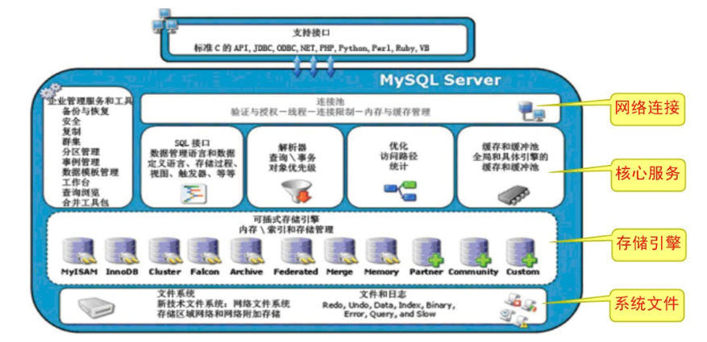

- 体系结构详解
  - 客户端连接
    - 支持接口：支持的客户端连接，例如C、Java、PHP等语言来连接MySQL数据库
  - 第一层：网络连接层
    - 连接池：管理、缓冲用户的连接，线程处理等需要缓存的需求。
    - 例如：当客户端发送一个请求连接，会从连接池中获取一个连接进行使用。
  - 第二层：核心服务层
    - 管理服务和工具：系统的管理和控制工具，例如备份恢复、复制、集群等。 
    - SQL接口：接受SQL命令，并且返回查询结果。
    - 查询解析器：验证和解析SQL命令，例如过滤条件、语法结构等。 
    - 查询优化器：在执行查询之前，使用默认的一套优化机制进行优化sql语句
    - 缓存：如果缓存当中有想查询的数据，则直接将缓存中的数据返回。没有的话再重新查询！
  - 第三层：存储引擎层
    - 插件式存储引擎：管理和操作数据的一种机制，包括(存储数据、如何更新、查询数据等)
  - 第四层：系统文件层
    - 文件系统：配置文件、数据文件、日志文件、错误文件、二进制文件等等的保存

#### 2.MySQL存储引擎

- 引擎的概念

  - 生活中，引擎就是整个机器运行的核心，不同的引擎具备不同的功能。

- MySQL存储引擎的概念
  - MySQL数据库使用不同的机制存取表文件 , 机制的差别在于不同的存储方式、索引技巧、锁定水平以及广泛的不同的功能和能力，在MySQL中 , 将这些不同的技术及配套的功能称为**存储引擎**
  - 在关系型数据库中数据的存储是以表的形式存进行储的，所以存储引擎也可以称为**表类型**（即存储和操作此表的类型）。
  - Oracle , SqlServer等数据库只有一种存储引擎 , 而MySQL针对不同的需求, 配置MySQL的不同的存储引擎 , 就会让数据库采取了不同的处理数据的方式和扩展功能。
  - 通过选择不同的引擎 ,能够获取最佳的方案 ,  也能够获得额外的速度或者功能，提高程序的整体效果。所以了解引擎的特性 , 才能贴合我们的需求 , 更好的发挥数据库的性能。
- MySQL支持的存储引擎
  - MySQL5.7支持的引擎包括：InnoDB、MyISAM、MEMORY、Archive、Federate、CSV、BLACKHOLE等
  - 其中较为常用的有三种：InnoDB、MyISAM、MEMORY

#### 3.常用引擎的特性对比

- 常用的存储引擎
  - MyISAM存储引擎
    - 访问快,不支持事务和外键。表结构保存在.frm文件中，表数据保存在.MYD文件中，索引保存在.MYI文件中。
  - InnoDB存储引擎(MySQL5.5版本后默认的存储引擎)
    - 支持事务 ,占用磁盘空间大 ,支持并发控制。表结构保存在.frm文件中，如果是共享表空间，数据和索引保存在 innodb_data_home_dir 和 innodb_data_file_path定义的表空间中，可以是多个文件。如果是多表空间存储，每个表的数据和索引单独保存在 .ibd 中。
  - MEMORY存储引擎
    - 内存存储 , 速度快 ,不安全 ,适合小量快速访问的数据。表结构保存在.frm中。
- 特性对比

| 特性         | MyISAM                       | InnoDB        | MEMORY             |
| ------------ | ---------------------------- | ------------- | ------------------ |
| 存储限制     | 有(平台对文件系统大小的限制) | 64TB          | 有(平台的内存限制) |
| **事务安全** | **不支持**                   | **支持**      | **不支持**         |
| **锁机制**   | **表锁**                     | **表锁/行锁** | **表锁**           |
| B+Tree索引   | 支持                         | 支持          | 支持               |
| 哈希索引     | 不支持                       | 不支持        | 支持               |
| 全文索引     | 支持                         | 支持          | 不支持             |
| **集群索引** | **不支持**                   | **支持**      | **不支持**         |
| 数据索引     | 不支持                       | 支持          | 支持               |
| 数据缓存     | 不支持                       | 支持          | N/A                |
| 索引缓存     | 支持                         | 支持          | N/A                |
| 数据可压缩   | 支持                         | 不支持        | 不支持             |
| 空间使用     | 低                           | 高            | N/A                |
| 内存使用     | 低                           | 高            | 中等               |
| 批量插入速度 | 高                           | 低            | 高                 |
| **外键**     | **不支持**                   | **支持**      | **不支持**         |

#### 4.引擎的操作

- 查询数据库支持的引擎

```SQL
-- 标准语法
SHOW ENGINES;

-- 查询数据库支持的存储引擎
SHOW ENGINES;
```

```SQL
-- 表含义:
  - support : 指服务器是否支持该存储引擎
  - transactions : 指存储引擎是否支持事务
  - XA : 指存储引擎是否支持分布式事务处理
  - Savepoints : 指存储引擎是否支持保存点
```

- 查询某个数据库中所有数据表的引擎

```SQL
-- 标准语法
SHOW TABLE STATUS FROM 数据库名称;

-- 查看db9数据库所有表的存储引擎
SHOW TABLE STATUS FROM db9;
```

- 查询某个数据库中某个数据表的引擎

```SQL
-- 标准语法
SHOW TABLE STATUS FROM 数据库名称 WHERE NAME = '数据表名称';

-- 查看db9数据库中stu_score表的存储引擎
SHOW TABLE STATUS FROM db9 WHERE NAME = 'stu_score';
```

- 创建数据表，指定存储引擎

```SQL
-- 标准语法
CREATE TABLE 表名(
	列名,数据类型,
    ...
)ENGINE = 引擎名称;

-- 创建db11数据库
CREATE DATABASE db11;

-- 使用db11数据库
USE db11;

-- 创建engine_test表，指定存储引擎为MyISAM
CREATE TABLE engine_test(
	id INT PRIMARY KEY AUTO_INCREMENT,
	NAME VARCHAR(10)
)ENGINE = MYISAM;

-- 查询engine_test表的引擎
SHOW TABLE STATUS FROM db11 WHERE NAME = 'engine_test';
```

- 修改表的存储引擎

```SQL
-- 标准语法
ALTER TABLE 表名 ENGINE = 引擎名称;

-- 修改engine_test表的引擎为InnoDB
ALTER TABLE engine_test ENGINE = INNODB;

-- 查询engine_test表的引擎
SHOW TABLE STATUS FROM db11 WHERE NAME = 'engine_test';
```

#### 5.总结：引擎的选择

- MyISAM ：由于MyISAM不支持事务、不支持外键、支持全文检索和表级锁定，读写相互阻塞，读取速度快，节约资源，所以如果应用是以**查询操作**和**插入操作**为主，只有很少的**更新和删除**操作，并且对事务的完整性、并发性要求不是很高，那么选择这个存储引擎是非常合适的。
- InnoDB : 是MySQL的默认存储引擎， 由于InnoDB支持事务、支持外键、行级锁定 ，支持所有辅助索引(5.5.5后不支持全文检索)，高缓存，所以用于对事务的完整性有比较高的要求，在并发条件下要求数据的一致性，读写频繁的操作，那么InnoDB存储引擎是比较合适的选择，比如BBS、计费系统、充值转账等
- MEMORY：将所有数据保存在RAM中，在需要快速定位记录和其他类似数据环境下，可以提供更快的访问。MEMORY的缺陷就是对表的大小有限制，太大的表无法缓存在内存中，其次是要确保表的数据可以恢复，数据库异常终止后表中的数据是可以恢复的。MEMORY表通常用于更新不太频繁的小表，用以快速得到访问结果。
- 总结：针对不同的需求场景，来选择最适合的存储引擎即可！如果不确定、则使用数据库默认的存储引擎！

### 五、MySQL索引

#### 1.索引的概念

- 我们之前学习过集合，其中的ArrayList集合的特点之一就是有索引。那么有索引会带来哪些好处呢？
- 没错，查询数据快！我们可以通过索引来快速查找到想要的数据。那么对于我们的MySQL数据库中的索引功能也是类似的！
- MySQL数据库中的索引：是帮助MySQL高效获取数据的一种数据结构！所以，索引的本质就是数据结构。
- 在表数据之外，数据库系统还维护着满足特定查找算法的数据结构，这些数据结构以某种方式指向数据， 这样就可以在这些数据结构上实现高级查找算法，这种数据结构就是索引。
- 一张数据表，用于保存数据。   一个索引配置文件，用于保存索引，每个索引都去指向了某一个数据(表格演示)
- 举例，无索引和有索引的查找原理

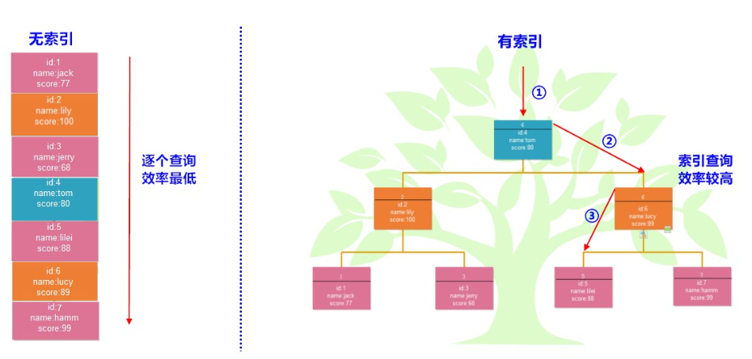

#### 2.索引的分类

- 功能分类 
  - 普通索引： 最基本的索引，它没有任何限制。
  - 唯一索引：索引列的值必须唯一，但允许有空值。如果是组合索引，则列值组合必须唯一。
  - 主键索引：一种特殊的唯一索引，不允许有空值。一般在建表时同时创建主键索引。
  - 组合索引：顾名思义，就是将单列索引进行组合。
  - 外键索引：只有InnoDB引擎支持外键索引，用来保证数据的一致性、完整性和实现级联操作。
  - 全文索引：快速匹配全部文档的方式。InnoDB引擎5.6版本后才支持全文索引。MEMORY引擎不支持。
- 结构分类
  - B+Tree索引 ：MySQL使用最频繁的一个索引数据结构，是InnoDB和MyISAM存储引擎默认的索引类型。
  - Hash索引 : MySQL中Memory存储引擎默认支持的索引类型。

#### 3.索引的操作

- 数据准备

```SQL
-- 创建db12数据库
CREATE DATABASE db12;

-- 使用db12数据库
USE db12;

-- 创建student表
CREATE TABLE student(
	id INT PRIMARY KEY AUTO_INCREMENT,
	NAME VARCHAR(10),
	age INT,
	score INT
);
-- 添加数据
INSERT INTO student VALUES (NULL,'张三',23,98),(NULL,'李四',24,95),
(NULL,'王五',25,96),(NULL,'赵六',26,94),(NULL,'周七',27,99);
```

- 创建索引
  - 注意：如果一个表中有一列是主键，那么就会默认为其创建主键索引！(主键列不需要单独创建索引)

```SQL
-- 标准语法
CREATE [UNIQUE|FULLTEXT] INDEX 索引名称
[USING 索引类型]  -- 默认是B+TREE
ON 表名(列名...);

-- 为student表中姓名列创建一个普通索引
CREATE INDEX idx_name ON student(NAME);

-- 为student表中年龄列创建一个唯一索引
CREATE UNIQUE INDEX idx_age ON student(age);
```

- 查看索引

```SQL
-- 标准语法
SHOW INDEX FROM 表名;

-- 查看student表中的索引
SHOW INDEX FROM student;
```

- alter语句添加索引

```SQL
-- 普通索引
ALTER TABLE 表名 ADD INDEX 索引名称(列名);

-- 组合索引
ALTER TABLE 表名 ADD INDEX 索引名称(列名1,列名2,...);

-- 主键索引
ALTER TABLE 表名 ADD PRIMARY KEY(主键列名); 

-- 外键索引(添加外键约束，就是外键索引)
ALTER TABLE 表名 ADD CONSTRAINT 外键名 FOREIGN KEY (本表外键列名) REFERENCES 主表名(主键列名);

-- 唯一索引
ALTER TABLE 表名 ADD UNIQUE 索引名称(列名);

-- 全文索引(mysql只支持文本类型)
ALTER TABLE 表名 ADD FULLTEXT 索引名称(列名);


-- 为student表中name列添加全文索引
ALTER TABLE student ADD FULLTEXT idx_fulltext_name(name);

-- 查看student表中的索引
SHOW INDEX FROM student;
```

- 删除索引

```SQL
-- 标准语法
DROP INDEX 索引名称 ON 表名;

-- 删除student表中的idx_score索引
DROP INDEX idx_score ON student;

-- 查看student表中的索引
SHOW INDEX FROM student;
```

#### 4.索引效率的测试

```SQL
-- 创建product商品表
CREATE TABLE product(
	id INT PRIMARY KEY AUTO_INCREMENT,  -- 商品id
	NAME VARCHAR(10),		    -- 商品名称
	price INT                           -- 商品价格
);

-- 定义存储函数，生成长度为10的随机字符串并返回
DELIMITER $

CREATE FUNCTION rand_string() 
RETURNS VARCHAR(255)
BEGIN
	DECLARE big_str VARCHAR(100) DEFAULT 'abcdefghijklmnopqrstuvwxyzABCDEFGHIGKLMNOPQRSTUVWXYZ';
	DECLARE small_str VARCHAR(255) DEFAULT '';
	DECLARE i INT DEFAULT 1;
	
	WHILE i <= 10 DO
		SET small_str =CONCAT(small_str,SUBSTRING(big_str,FLOOR(1+RAND()*52),1));
		SET i=i+1;
	END WHILE;
	
	RETURN small_str;
END$

DELIMITER ;


-- 定义存储过程，添加100万条数据到product表中
DELIMITER $

CREATE PROCEDURE pro_test()
BEGIN
	DECLARE num INT DEFAULT 1;
	
	WHILE num <= 1000000 DO
		INSERT INTO product VALUES (NULL,rand_string(),num);
		SET num = num + 1;
	END WHILE;
END$

DELIMITER ;

-- 调用存储过程
CALL pro_test();


-- 查询总记录条数
SELECT COUNT(*) FROM product;


-- 查询product表的索引
SHOW INDEX FROM product;

-- 查询name为OkIKDLVwtG的数据   (0.049)
SELECT * FROM product WHERE NAME='OkIKDLVwtG';

-- 通过id列查询OkIKDLVwtG的数据  (1毫秒)
SELECT * FROM product WHERE id=999998;

-- 为name列添加索引
ALTER TABLE product ADD INDEX idx_name(NAME);

-- 查询name为OkIKDLVwtG的数据   (0.001)
SELECT * FROM product WHERE NAME='OkIKDLVwtG';


/*
	范围查询
*/
-- 查询价格为800~1000之间的所有数据 (0.052)
SELECT * FROM product WHERE price BETWEEN 800 AND 1000;

/*
	排序查询
*/
-- 查询价格为800~1000之间的所有数据,降序排列  (0.083)
SELECT * FROM product WHERE price BETWEEN 800 AND 1000 ORDER BY price DESC;

-- 为price列添加索引
ALTER TABLE product ADD INDEX idx_price(price);

-- 查询价格为800~1000之间的所有数据 (0.011)
SELECT * FROM product WHERE price BETWEEN 800 AND 1000;

-- 查询价格为800~1000之间的所有数据,降序排列  (0.001)
SELECT * FROM product WHERE price BETWEEN 800 AND 1000 ORDER BY price DESC;
```

#### 5.索引的实现原则

- 索引是在MySQL的存储引擎中实现的，所以每种存储引擎的索引不一定完全相同，也不是所有的引擎支持所有的索引类型。这里我们主要介绍InnoDB引擎的实现的**B+Tree索引**。
- B+Tree是一种树型数据结构，是B-Tree的变种。通常使用在数据库和操作系统中的文件系统，特点是能够保持数据稳定有序。我们逐步的来了解一下。

##### 5.1磁盘存储

- 系统从磁盘读取数据到内存时是以磁盘块（block）为基本单位的
- 位于同一个磁盘块中的数据会被一次性读取出来，而不是需要什么取什么。
- InnoDB存储引擎中有页（Page）的概念，页是其磁盘管理的最小单位。InnoDB存储引擎中默认每个页的大小为16KB。
- InnoDB引擎将若干个地址连接磁盘块，以此来达到页的大小16KB，在查询数据时如果一个页中的每条数据都能有助于定位数据记录的位置，这将会减少磁盘I/O次数，提高查询效率。

##### 5.2BTree

- BTree结构的数据可以让系统高效的找到数据所在的磁盘块。为了描述BTree，首先定义一条记录为一个二元组[key, data] ，key为记录的键值，对应表中的主键值，data为一行记录中除主键外的数据。对于不同的记录，key值互不相同。BTree中的每个节点根据实际情况可以包含大量的关键字信息和分支，如下图所示为一个3阶的BTree： 

  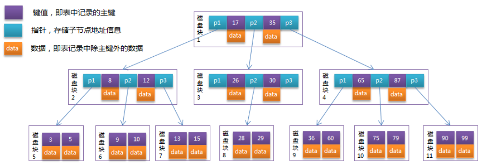

- 根据图中结构显示，每个节点占用一个盘块的磁盘空间，一个节点上有两个升序排序的关键字和三个指向子树根节点的指针，指针存储的是子节点所在磁盘块的地址。两个关键词划分成的三个范围域对应三个指针指向的子树的数据的范围域。以根节点为例，关键字为17和35，P1指针指向的子树的数据范围为小于17，P2指针指向的子树的数据范围为17~35，P3指针指向的子树的数据范围为大于35。

查找顺序：

```SQL
模拟查找15的过程 : 

1.根节点找到磁盘块1，读入内存。【磁盘I/O操作第1次】
	比较关键字15在区间（<17），找到磁盘块1的指针P1。
2.P1指针找到磁盘块2，读入内存。【磁盘I/O操作第2次】
	比较关键字15在区间（>12），找到磁盘块2的指针P3。
3.P3指针找到磁盘块7，读入内存。【磁盘I/O操作第3次】
	在磁盘块7中找到关键字15。
	
-- 分析上面过程，发现需要3次磁盘I/O操作，和3次内存查找操作。
-- 由于内存中的关键字是一个有序表结构，可以利用二分法查找提高效率。而3次磁盘I/O操作是影响整个BTree查找效率的决定因素。BTree使用较少的节点个数，使每次磁盘I/O取到内存的数据都发挥了作用，从而提高了查询效率。
```

##### 5.3B+Tree

- B+Tree是在BTree基础上的一种优化，使其更适合实现外存储索引结构，InnoDB存储引擎就是用B+Tree实现其索引结构。
- 从上一节中的BTree结构图中可以看到每个节点中不仅包含数据的key值，还有data值。而每一个页的存储空间是有限的，如果data数据较大时将会导致每个节点（即一个页）能存储的key的数量很小，当存储的数据量很大时同样会导致B-Tree的深度较大，增大查询时的磁盘I/O次数，进而影响查询效率。在B+Tree中，所有数据记录节点都是按照键值大小顺序存放在同一层的叶子节点上，而非叶子节点上只存储key值信息，这样可以大大加大每个节点存储的key值数量，降低B+Tree的高度。
- B+Tree相对于BTree区别：
  - 非叶子节点只存储键值信息。
  - 所有叶子节点之间都有一个连接指针。
  - 数据记录都存放在叶子节点中。
- 将上一节中的BTree优化，由于B+Tree的非叶子节点只存储键值信息，假设每个磁盘块能存储4个键值及指针信息，则变成B+Tree后其结构如下图所示：

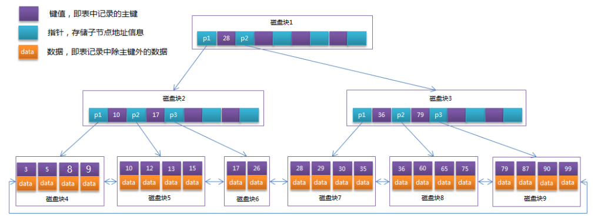

通常在B+Tree上有两个头指针，一个指向根节点，另一个指向关键字最小的叶子节点，而且所有叶子节点（即数据节点）之间是一种链式环结构。因此可以对B+Tree进行两种查找运算：

- 【有范围】对于主键的范围查找和分页查找
- 【有顺序】从根节点开始，进行随机查找

实际情况中每个节点可能不能填充满，因此在数据库中，B+Tree的高度一般都在2~4层。MySQL的InnoDB存储引擎在设计时是将根节点常驻内存的，也就是说查找某一键值的行记录时最多只需要1~3次磁盘I/O操作。

#### 6.总结：索引的设计原则

索引的设计可以遵循一些已有的原则，创建索引的时候请尽量考虑符合这些原则，便于提升索引的使用效率，更高效的使用索引。

- 创建索引时的原则
  - 对查询频次较高，且数据量比较大的表建立索引。
  - 使用唯一索引，区分度越高，使用索引的效率越高。
  - 索引字段的选择，最佳候选列应当从where子句的条件中提取，如果where子句中的组合比较多，那么应当挑选最常用、过滤效果最好的列的组合。
  - 使用短索引，索引创建之后也是使用硬盘来存储的，因此提升索引访问的I/O效率，也可以提升总体的访问效率。假如构成索引的字段总长度比较短，那么在给定大小的存储块内可以存储更多的索引值，相应的可以有效的提升MySQL访问索引的I/O效率。
  - 索引可以有效的提升查询数据的效率，但索引数量不是多多益善，索引越多，维护索引的代价自然也就水涨船高。对于插入、更新、删除等DML操作比较频繁的表来说，索引过多，会引入相当高的维护代价，降低DML操作的效率，增加相应操作的时间消耗。另外索引过多的话，MySQL也会犯选择困难病，虽然最终仍然会找到一个可用的索引，但无疑提高了选择的代价。
- 联合索引的特点

在mysql建立联合索引时会遵循最左前缀匹配的原则，即最左优先，在检索数据时从联合索引的最左边开始匹配，
对列name列、address和列phone列建一个联合索引

```SQL
ALTER TABLE user ADD INDEX index_three(name,address,phone);
```

联合索引index_three实际建立了(name)、(name,address)、(name,address,phone)三个索引。所以下面的三个SQL语句都可以命中索引。

```SQL
SELECT * FROM user WHERE address = '北京' AND phone = '12345' AND name = '张三';
SELECT * FROM user WHERE name = '张三' AND address = '北京';
SELECT * FROM user WHERE name = '张三';
```

上面三个查询语句执行时会依照最左前缀匹配原则，检索时分别会使用索引

```
(name,address,phone)
(name,address)
(name)
```

进行数据匹配。

索引的字段可以是任意顺序的，如：

```SQL
-- 优化器会帮助我们调整顺序，下面的SQL语句都可以命中索引
SELECT * FROM user WHERE address = '北京' AND phone = '12345' AND name = '张三';
```

Mysql的优化器会帮助我们调整where条件中的顺序，以匹配我们建立的索引。

联合索引中最左边的列不包含在条件查询中，所以根据上面的原则，下面的SQL语句就不会命中索引。

```SQL
-- 联合索引中最左边的列不包含在条件查询中，下面的SQL语句就不会命中索引
SELECT * FROM user WHERE address = '北京' AND phone = '12345';
```

### 六、MySQL锁

#### 1.锁的概念

- 之前我们学习过多线程，多线程当中如果想保证数据的准确性是如何实现的呢？没错，通过同步实现。同步就相当于是加锁。加了锁以后有什么好处呢？当一个线程真正在操作数据的时候，其他线程只能等待。当一个线程执行完毕后，释放锁。其他线程才能进行操作！

- 那么我们的MySQL数据库中的锁的功能也是类似的。在我们学习事务的时候，讲解过事务的隔离性，可能会出现脏读、不可重复读、幻读的问题，当时我们的解决方式是通过修改事务的隔离级别来控制，但是数据库的隔离级别呢我们并不推荐修改。所以，锁的作用也可以解决掉之前的问题！

- 锁机制 : 数据库为了保证数据的一致性，而使用各种共享的资源在被并发访问时变得有序所设计的一种规则。

- 举例，在电商网站购买商品时，商品表中只存有1个商品，而此时又有两个人同时购买，那么谁能买到就是一个关键的问题。

  这里会用到事务进行一系列的操作：

  1. 先从商品表中取出物品的数据
  2. 然后插入订单
  3. 付款后，再插入付款表信息
  4. 更新商品表中商品的数量

  以上过程中，使用锁可以对商品数量数据信息进行保护，实现隔离，即只允许第一位用户完成整套购买流程，而其他用户只能等待，这样就解决了并发中的矛盾问题。

- 在数据库中，数据是一种供许多用户共享访问的资源，如何保证数据并发访问的一致性、有效性，是所有数据库必须解决的一个问题，MySQL由于自身架构的特点，在不同的存储引擎中，都设计了面对特定场景的锁定机制，所以引擎的差别，导致锁机制也是有很大差别的。

#### 2.锁的分类

- 按操作分类：
  - 共享锁：也叫读锁。针对同一份数据，多个事务读取操作可以同时加锁而不互相影响 ，但是不能修改数据记录。
  - 排他锁：也叫写锁。当前的操作没有完成前,会阻断其他操作的读取和写入
- 按粒度分类：
  - 表级锁：操作时，会锁定整个表。开销小，加锁快；不会出现死锁；锁定力度大，发生锁冲突概率高，并发度最低。偏向于MyISAM存储引擎！
  - 行级锁：操作时，会锁定当前操作行。开销大，加锁慢；会出现死锁；锁定粒度小，发生锁冲突的概率低，并发度高。偏向于InnoDB存储引擎！
  - 页级锁：锁的粒度、发生冲突的概率和加锁的开销介于表锁和行锁之间，会出现死锁，并发性能一般。
- 按使用方式分类：
  - 悲观锁：每次查询数据时都认为别人会修改，很悲观，所以查询时加锁。
  - 乐观锁：每次查询数据时都认为别人不会修改，很乐观，但是更新时会判断一下在此期间别人有没有去更新这个数据
- 不同存储引擎支持的锁

| 存储引擎 | 表级锁 | 行级锁 | 页级锁 |
| -------- | ------ | ------ | ------ |
| MyISAM   | 支持   | 不支持 | 不支持 |
| InnoDB   | 支持   | 支持   | 不支持 |
| MEMORY   | 支持   | 不支持 | 不支持 |
| BDB      | 支持   | 不支持 | 支持   |

#### 3.演示InnoDB锁

- 数据准备

```SQL
-- 创建db13数据库
CREATE DATABASE db13;

-- 使用db13数据库
USE db13;

-- 创建student表
CREATE TABLE student(
	id INT PRIMARY KEY AUTO_INCREMENT,
	NAME VARCHAR(10),
	age INT,
	score INT
);
-- 添加数据
INSERT INTO student VALUES (NULL,'张三',23,99),(NULL,'李四',24,95),
(NULL,'王五',25,98),(NULL,'赵六',26,97);
```

- 共享锁

```SQL
-- 标准语法
SELECT语句 LOCK IN SHARE MODE;
```

```SQL
-- 窗口1
/*
	共享锁：数据可以被多个事务查询，但是不能修改
*/
-- 开启事务
START TRANSACTION;

-- 查询id为1的数据记录。加入共享锁
SELECT * FROM student WHERE id=1 LOCK IN SHARE MODE;

-- 查询分数为99分的数据记录。加入共享锁
SELECT * FROM student WHERE score=99 LOCK IN SHARE MODE;

-- 提交事务
COMMIT;
```

```SQL
-- 窗口2
-- 开启事务
START TRANSACTION;

-- 查询id为1的数据记录(普通查询，可以查询)
SELECT * FROM student WHERE id=1;

-- 查询id为1的数据记录，并加入共享锁(可以查询。共享锁和共享锁兼容)
SELECT * FROM student WHERE id=1 LOCK IN SHARE MODE;

-- 修改id为1的姓名为张三三(不能修改，会出现锁的情况。只有窗口1提交事务后，才能修改成功)
UPDATE student SET NAME='张三三' WHERE id = 1;

-- 修改id为2的姓名为李四四(修改成功，InnoDB引擎默认是行锁)
UPDATE student SET NAME='李四四' WHERE id = 2;

-- 修改id为3的姓名为王五五(注意：InnoDB引擎如果不采用带索引的列。则会提升为表锁)
UPDATE student SET NAME='王五五' WHERE id = 3;

-- 提交事务
COMMIT;
```

- 排他锁

```SQL
-- 标准语法
SELECT语句 FOR UPDATE;
```

```SQL
-- 窗口1
/*
	排他锁：加锁的数据，不能被其他事务加锁查询或修改
*/
-- 开启事务
START TRANSACTION;

-- 查询id为1的数据记录，并加入排他锁
SELECT * FROM student WHERE id=1 FOR UPDATE;

-- 提交事务
COMMIT;
```

```SQL
-- 窗口2
-- 开启事务
START TRANSACTION;

-- 查询id为1的数据记录(普通查询没问题)
SELECT * FROM student WHERE id=1;

-- 查询id为1的数据记录，并加入共享锁(不能查询。因为排他锁不能和其他锁共存)
SELECT * FROM student WHERE id=1 LOCK IN SHARE MODE;

-- 查询id为1的数据记录，并加入排他锁(不能查询。因为排他锁不能和其他锁共存)
SELECT * FROM student WHERE id=1 FOR UPDATE;

-- 修改id为1的姓名为张三(不能修改，会出现锁的情况。只有窗口1提交事务后，才能修改成功)
UPDATE student SET NAME='张三' WHERE id=1;

-- 提交事务
COMMIT;
```

- 注意：锁的兼容性
  - 共享锁和共享锁     兼容
  - 共享锁和排他锁     冲突
  - 排他锁和排他锁     冲突
  - 排他锁和共享锁     冲突

#### 4.演示MyISAM锁

- 数据准备

```SQL
-- 创建product表
CREATE TABLE product(
	id INT PRIMARY KEY AUTO_INCREMENT,
	NAME VARCHAR(20),
	price INT
)ENGINE = MYISAM;  -- 指定存储引擎为MyISAM

-- 添加数据
INSERT INTO product VALUES (NULL,'华为手机',4999),(NULL,'小米手机',2999),
(NULL,'苹果',8999),(NULL,'中兴',1999);
```

- 读锁

```SQL
-- 标准语法
-- 加锁
LOCK TABLE 表名 READ;

-- 解锁(将当前会话所有的表进行解锁)
UNLOCK TABLES;
```

```SQL
-- 窗口1
/*
	读锁：所有连接只能读取数据，不能修改
*/
-- 为product表加入读锁
LOCK TABLE product READ;

-- 查询product表(查询成功)
SELECT * FROM product;

-- 修改华为手机的价格为5999(修改失败)
UPDATE product SET price=5999 WHERE id=1;

-- 解锁
UNLOCK TABLES;
```

```SQL
-- 窗口2
-- 查询product表(查询成功)
SELECT * FROM product;

-- 修改华为手机的价格为5999(不能修改，窗口1解锁后才能修改成功)
UPDATE product SET price=5999 WHERE id=1;
```

- 写锁

```SQL
-- 标准语法
-- 加锁
LOCK TABLE 表名 WRITE;

-- 解锁(将当前会话所有的表进行解锁)
UNLOCK TABLES;
```

```SQL
-- 窗口1
/*
	写锁：其他连接不能查询和修改数据
*/
-- 为product表添加写锁
LOCK TABLE product WRITE;

-- 查询product表(查询成功)
SELECT * FROM product;

-- 修改小米手机的金额为3999(修改成功)
UPDATE product SET price=3999 WHERE id=2;

-- 解锁
UNLOCK TABLES;
```

```SQL
-- 窗口2
-- 查询product表(不能查询。只有窗口1解锁后才能查询成功)
SELECT * FROM product;

-- 修改小米手机的金额为2999(不能修改。只有窗口1解锁后才能修改成功)
UPDATE product SET price=2999 WHERE id=2;
```

#### 5.演示悲观锁和乐观锁

- 悲观锁的概念

  - 就是很悲观，它对于数据被外界修改的操作持保守态度，认为数据随时会修改。
  - 整个数据处理中需要将数据加锁。悲观锁一般都是依靠关系型数据库提供的锁机制。
  - 我们之前所学的行锁，表锁不论是读写锁都是悲观锁。

- 乐观锁的概念

  - 就是很乐观，每次自己操作数据的时候认为没有人会来修改它，所以不去加锁。
  - 但是在更新的时候会去判断在此期间数据有没有被修改。
  - 需要用户自己去实现，不会发生并发抢占资源，只有在提交操作的时候检查是否违反数据完整性。

- 悲观锁和乐观锁使用前提

  - 对于读的操作远多于写的操作的时候，这时候一个更新操作加锁会阻塞所有的读取操作，降低了吞吐量。最后还要释放锁，锁是需要一些开销的，这时候可以选择乐观锁。
  - 如果是读写比例差距不是非常大或者系统没有响应不及时，吞吐量瓶颈的问题，那就不要去使用乐观锁，它增加了复杂度，也带来了业务额外的风险。这时候可以选择悲观锁。

- 乐观锁的实现方式

  - 版本号

    - 给数据表中添加一个version列，每次更新后都将这个列的值加1。
    - 读取数据时，将版本号读取出来，在执行更新的时候，比较版本号。
    - 如果相同则执行更新，如果不相同，说明此条数据已经发生了变化。
    - 用户自行根据这个通知来决定怎么处理，比如重新开始一遍，或者放弃本次更新。

    ```SQL
    -- 创建city表
    CREATE TABLE city(
    	id INT PRIMARY KEY AUTO_INCREMENT,  -- 城市id
    	NAME VARCHAR(20),                   -- 城市名称
    	VERSION INT                         -- 版本号
    );
    
    -- 添加数据
    INSERT INTO city VALUES (NULL,'北京',1),(NULL,'上海',1),(NULL,'广州',1),(NULL,'深圳',1);
    
    -- 修改北京为北京市
    -- 1.查询北京的version
    SELECT VERSION FROM city WHERE NAME='北京';
    -- 2.修改北京为北京市，版本号+1。并对比版本号
    UPDATE city SET NAME='北京市',VERSION=VERSION+1 WHERE NAME='北京' AND VERSION=1;
    ```

  - 时间戳

    - 和版本号方式基本一样，给数据表中添加一个列，名称无所谓，数据类型需要是timestamp
    - 每次更新后都将最新时间插入到此列。
    - 读取数据时，将时间读取出来，在执行更新的时候，比较时间。
    - 如果相同则执行更新，如果不相同，说明此条数据已经发生了变化。

#### 6.锁的总结

- 表锁和行锁

  - 行锁：锁的粒度更细，加行锁的性能损耗较大。并发处理能力较高。InnoDB引擎默认支持！
  - 表锁：锁的粒度较粗，加表锁的性能损耗较小。并发处理能力较低。InnoDB、MyISAM引擎支持！

- InnoDB锁优化建议

  - 尽量通过带索引的列来完成数据查询，从而避免InnoDB无法加行锁而升级为表锁。

  - 合理设计索引，索引要尽可能准确，尽可能的缩小锁定范围，避免造成不必要的锁定。
  - 尽可能减少基于范围的数据检索过滤条件。
  - 尽量控制事务的大小，减少锁定的资源量和锁定时间长度。
  - 在同一个事务中，尽可能做到一次锁定所需要的所有资源，减少死锁产生概率。
  - 对于非常容易产生死锁的业务部分，可以尝试使用升级锁定颗粒度，通过表级锁定来减少死锁的产生。

### 七、集群

#### 1.集群的概念

- 如今随着互联网的发展，数据的量级也是成指数的增长，从GB到TB到PB。对数据的各种操作也是愈加的困难，传统的关系型数据库已经无法满足快速查询与插入数据的需求。一台数据库服务器已经无法满足海量数据的存储需求，所以由多台数据库构成的数据库集群成了必然的方式。不过，为了保证数据的一致性，查询效率等，同时又要解决多台服务器间的通信、负载均衡等问题。
- MyCat是一款数据库集群软件，是阿里曾经开源的知名产品——Cobar，简单的说，MyCAT就是：一个新颖的数据库中间件产品支持MySQL集群，提供高可用性数据分片集群。你可以像使用mysql一样使用mycat。对于开发人员来说根本感觉不到mycat的存在。MyCat不单单是支持MySQL，像常用的关系型数据库Oracle、SqlServer都支持。

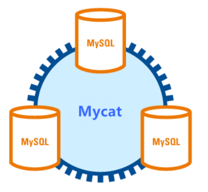

#### 2.集群的原理

- 我们来说个例子，大海捞针和一个水瓶里捞针，毋庸置疑水瓶里一定能更快找到针，因为它需要检索的范围更小。数据库集群也是如此原理，我们可以将一个数据量为300G的数据库数据平均拆分成3部分，每个数据库中只存储100G数据，此时用户搜索，先经过我们中间代理层，中间代理层同时发出3个请求执行查询，比如第1台返回100条数据，耗时3秒，第2台返回200条数据，耗时3秒，第3台返回500条数据，耗时3秒，此时中间件只需要在800条记录中进行筛选，即可检索出用户要的结果，此时耗时其实一共只有3秒，因为每台机器做运算的时候，都是同时执行。如果我们此时直接在300G的数据库查询，耗时10秒，那使用中间件进行集群的效率就非常明显

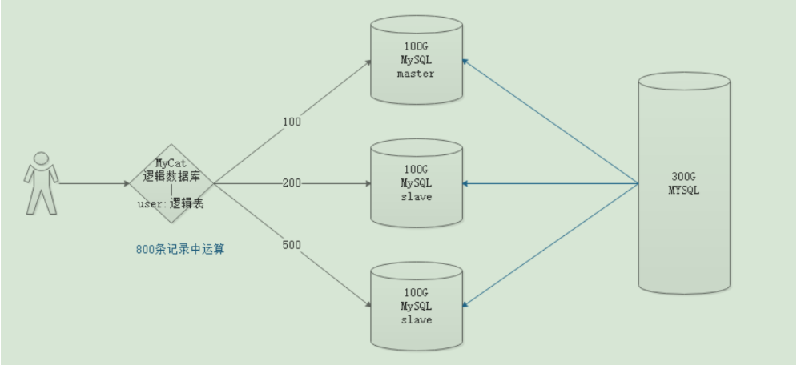

- MyCat的实现流程和这个流程大致相似。MyCat自身不存储数据，但用户每次链接数据库的时候，直接连接MyCat即可.所以我们MyCat自身其实就是个逻辑数据库，它自身还有表结构，表结构叫逻辑表。

#### 3.Mycat环境搭建

- 配置模型

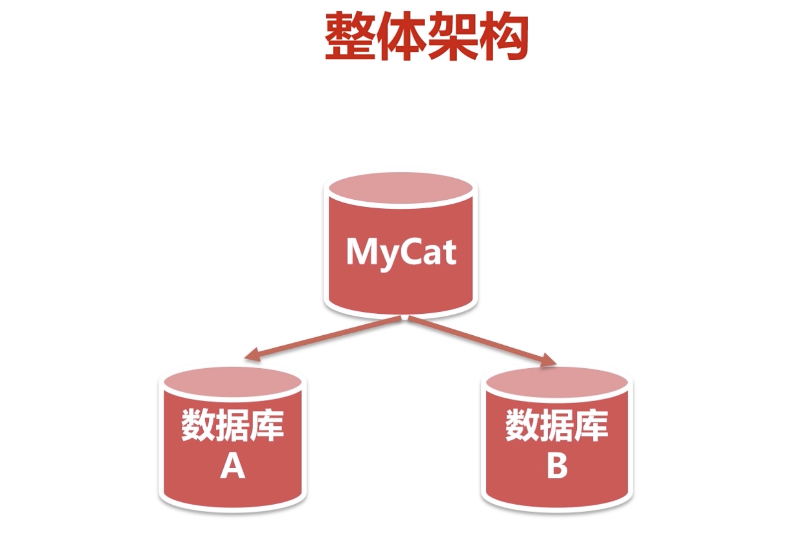

- 克隆虚拟机

- 修改配置网卡

  - 在第二个虚拟机中，生成全新mac地址

  - 重启网络

  ```linux
  // 重启网络
  service network restart
  //查看ip地址
  ip addr
  ```

- 修改mysql配置文件,更改uuid

  - 在第二个服务器上，修改mysql的uuid

  ```
  // 编辑配置文件
  vi /var/lib/mysql/auto.cnf
  // 将server-uuid更改
  ```

- 启动MySQL并查看

  ```
  //将两台服务器的防火墙关闭
  systemctl stop firewalld

  //启动两台服务器的mysql
  service mysqld restart

  //启动两台服务器的mycat
  cd /root/mycat/bin
  ./mycat restart

  //查看监听端口
  netstat -ant|grep 3306
  netstat -ant|grep 8066

  ```

#### 4.主从复制

- 主从复制的概念

  - 为了使用Mycat进行读写分离，我们先要配置MySQL数据库的主从复制。
  - 从服务器自动同步主服务器的数据，从而达到数据一致。
  - 进而，我们可以写操作时，只操作主服务器，而读操作，就可以操作从服务器了。
  - 原理：主服务器在处理数据时，生成binlog日志，通过对日志的备份，实现从服务器的数据同步。

  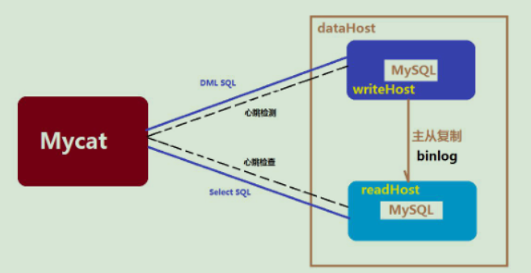

- 主服务器的配置

  - 在第一个服务器上，编辑mysql配置文件

  ```
  // 编辑mysql配置文件
  vi /etc/my.cnf
  
  //在[mysqld]下面加上：
  log-bin=mysql-bin # 开启复制操作
  server-id=1 # master is 1
  innodb_flush_log_at_trx_commit=1
  sync_binlog=1
  ```

  - 登录mysql，创建用户并授权

  ```
  // 登录mysql
  mysql -u root -p
  
  // 去除密码权限
  SET GLOBAL validate_password_policy=0;
  SET GLOBAL validate_password_length=1;
  
  // 创建用户
  CREATE USER 'hm'@'%' IDENTIFIED BY 'itheima';
  
  // 授权
  GRANT ALL ON *.* TO 'hm'@'%';
  ```

  - 重启mysql服务，登录mysql服务

  ```
  // 重启mysql
  service mysqld restart
  
  // 登录mysql
  mysql -u root -p
  ```

  - 查看主服务器的配置

  ```
  // 查看主服务器配置
  show master status;
  ```

  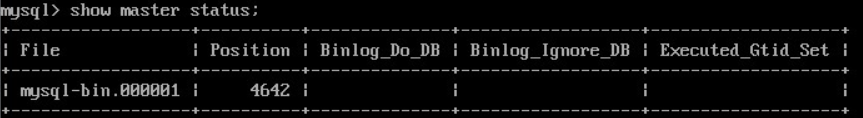

- 从服务器的配置

  - 在第二个服务器上，编辑mysql配置文件

  ```
  // 编辑mysql配置文件
  vi /etc/my.cnf
  
  // 在[mysqld]下面加上：
  server-id=2
  ```

  - 登录mysql

  ```
  // 登录mysql
  mysql -u root -p
  
  // 执行
  use mysql;
  drop table slave_master_info;
  drop table slave_relay_log_info;
  drop table slave_worker_info;
  drop table innodb_index_stats;
  drop table innodb_table_stats;
  source /usr/share/mysql/mysql_system_tables.sql;
  ```

  - 重启mysql，重新登录，配置从节点

  ```
  // 重启mysql
  service mysqld restart
  
  // 重新登录mysql
  mysql -u root -p
  
  // 执行
  change master to master_host='主服务器ip地址',master_port=3306,master_user='hm',master_password='itheima',master_log_file='mysql-bin.000001',master_log_pos=4642;
  ```

  - 重启mysql，重新登录，开启从节点

  ```
  // 重启mysql
  service mysqld restart
  
  // 重新登录mysql
  mysql -u root -p
  
  // 开启从节点
  start slave;
  
  // 查询结果
  show slave status\G;
  //Slave_IO_Running和Slave_SQL_Running都为yes才表示同步成功。
  ```

  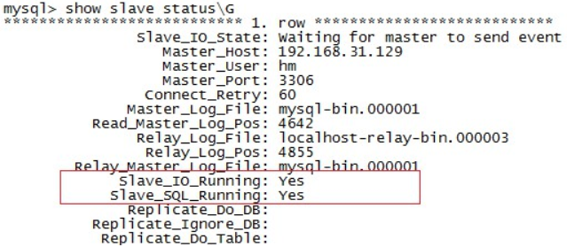

- 测试

  - 连接主服务器

  ```SQL
  -- 主服务器创建db1数据库,从服务器会自动同步
  CREATE DATABASE db1;
  ```

  - 连接从服务器

  ```SQL
  -- 从服务器创建db2数据库,主服务器不会自动同步
  CREATE DATABASE db2;
  ```

- 启动失败的解决方案

```
启动失败：Slave_IO_Running为 NO 
方法一:重置slave
slave stop;
reset slave;
start slave ;
方法二:重设同步日志文件及读取位置
slave stop;
change master to master_log_file=’mysql-bin.000001’, master_log_pos=1;
start slave ;
```

#### 5.读写分离

- 读写分离的概念
  - 写操作只写入主服务器，读操作读取从服务器。

- 在主服务器上修改server.xml
  - user标签主要用于定义登录mycat的用户和权限。如上面定义用户名mycat和密码123456，该用户可以访问的schema的HEIMADB逻辑库。

```xml
<user name="root" defaultAccount="true">
		<property name="password">123456</property>
		<property name="schemas">HEIMADB</property>
		
		<!-- 表级 DML 权限设置 -->
		<!-- 		
		<privileges check="false">
			<schema name="TESTDB" dml="0110" >
				<table name="tb01" dml="0000"></table>
				<table name="tb02" dml="1111"></table>
			</schema>
		</privileges>		
		 -->
</user>
```

- 在主服务器上修改schema.xml

```xml
<?xml version="1.0"?>
<!DOCTYPE mycat:schema SYSTEM "schema.dtd">
<mycat:schema xmlns:mycat="http://io.mycat/">

	<schema name="HEIMADB" checkSQLschema="false" sqlMaxLimit="100" dataNode="dn1"></schema>
	
	<dataNode name="dn1" dataHost="localhost1" database="db1" />
	
	<dataHost name="localhost1" maxCon="1000" minCon="10" balance="1"
			  writeType="0" dbType="mysql" dbDriver="native" switchType="1"  slaveThreshold="100">
		<heartbeat>select user()</heartbeat>
		<!-- 主服务器进行写操作 -->
		<writeHost host="hostM1" url="localhost:3306" user="root"
				   password="itheima">
		<!-- 从服务器负责读操作 -->
		<readHost host="hostS1" url="192.168.203.135:3306" user="root" password="itheima" />
		</writeHost>
	</dataHost>
	
</mycat:schema>
```

- 配置详解

  - schema标签逻辑库的概念和mysql数据库中Datebase的概念相同，我们在查询这两个逻辑库中的表的时候，需要切换到该逻辑库下才可以查到所需要的表。
  - dataNode属性：该属性用于绑定逻辑库到某个具体的database上。
  - dataNode标签： dataNode标签定义了mycat中的数据节点，也就是数据分片。一个dataNode标签就是一个独立的数据分片。
  - name属性：定义数据节点的名字，这个名字需要是唯一的，我们需要在table标签上应用这个名字，来建立表与分片对应的关系。
  - dataHost属性：该属性用于定义该分片属于那个数据库实例，属性值是引用datahost标签定义的name属性。
  - database属性：该属性用于定义该分片属于那个具体数据库实例上的具体库，因为这里使用两个纬度来定义分片，就是：实例+具体的库。因为每个库上建立的表和表结构是一样的。所以这样做就可以轻松的对表进行水平拆分。
  - dataHost标签：该标签在mycat逻辑库中也是作为最底层的标签存在，直接定义了具体的数据库实例、读写分离配置和心跳语句。

  - balance属性： 负载均衡类型
    ​    balance=0: 不开启读写分离，所有读操作都发送到当前可用的writeHost上。
    ​    balance=1: 全部的readHost与Stand by writeHost都参与select语句的负载均衡
    ​     balance=2: 所有的读操作都随机在writeHost，readHost上分发。
    ​     balance=3: 所有的读请求都随机分配到writeHost对应的readHost上执行，writeHost不负担读压力。
  - switchType属性： 
    ​    -1：表示不自动切换。
    ​    1  ：默认值，表示自动切换
    ​    2：表示基于MySQL主从同步状态决定是否切换，心跳语句： show slave status.
    ​    3:表示基于mysql galary cluster的切换机制，适合mycat1.4之上的版本，心跳语句show status like "%esrep%";
  - writeHost标签，readHost标签：这两个标签指定后端数据库的相关配置给mycat，用于实例化后端连接池。唯一不同的是，writeHost指定写实例、readHost指定读实例，组合这些读写实例来满足系统的要求。
    - host属性：用于标识不同的实例，对于writehost，一般使用*M1；对于readhost一般使用*S1.
    - url属性：后端实例连接地址，如果使用native的dbDriver，则一般为address:port这种形式，用JDBC或其他的dbDriver，则需要特殊指定。当使用JDBC时则可以这么写：jdbc:mysql://localhost:3306/。
    - user属性：后端存储实例的用户名。
    - password属性：后端存储实例的密码

- 测试

  - 重启主服务器的mycat

  ```
  // 重启mycat
  cd /root/mycat/bin
  
  ./mycat restart
  
  // 查看端口监听
  netstat -ant|grep 8066
  ```

  - sqlyog连接mycat

  ```SQL
  -- 创建学生表
  CREATE TABLE student(
  	id INT PRIMARY KEY AUTO_INCREMENT,
  	NAME VARCHAR(10)
  );
  -- 查询学生表
  SELECT * FROM student;
  
  -- 添加两条记录
  INSERT INTO student VALUES (NULL,'张三'),(NULL,'李四');
  
  -- 停止主从复制后，添加的数据只会保存到主服务器上。
  INSERT INTO student VALUES (NULL,'王五');
  ```

  - sqlyog连接主服务器

  ```SQL
  -- 主服务器：查询学生表，可以看到数据
  SELECT * FROM student;
  ```

  - sqlyog连接从服务器

  ```SQL
  -- 从服务器：查询学生表，可以看到数据(因为有主从复制)
  SELECT * FROM student;
  
  -- 从服务器：删除一条记录。(主服务器并没有删除，mycat中间件查询的结果是从服务器的数据)
  DELETE FROM student WHERE id=2;
  ```

#### 6.分库分表

- 分库分表的概念

  - 将庞大的数据进行拆分
  - 水平拆分：根据表的数据逻辑关系，将同一表中的数据按照某种条件，拆分到多台数据库服务器上，也叫做横向拆分。例如：一张1000万的大表，按照一模一样的结构，拆分成4个250万的小表，分别保存到4个数据库中。
  - 垂直拆分：根据业务的维度，将不同的表切分到不同的数据库之上，也叫做纵向拆分。例如：所有的订单都保存到订单库中，所有的用户都保存到用户库中，同类型的表保存在同一库，不同的表分散在不同的库中。

- Mycat水平拆分

  - 修改主服务器的server.xml

    - 0：本地文件方式

      在mycat/conf/sequence_conf.properties文件中：
      GLOBAL.MINDI=10000最小值
      GLOBAL.MAXID=20000最大值，建议修改到9999999999

    - 1：数据库方式

      分库分表中保证全局主键自增唯一，但是需要执行mycat函数，配置sequence_db_conf.properties

    - 2：时间戳方式

      mycat实现的时间戳，建议varchar类型，要注意id的长度

  ```xml
  <!-- 修改主键的方式 -->
  <property name="sequnceHandlerType">0</property>
  ```

  - 修改主服务器的sequence_conf.properties

  ```properties
  #default global sequence
  GLOBAL.HISIDS=      # 可以自定义关键字
  GLOBAL.MINID=10001  # 最小值
  GLOBAL.MAXID=20000  # 最大值
  GLOBAL.CURID=10000
  ```

  - 修改主服务器的schema.xml
    - table标签定义了逻辑表，所有需要拆分的表都需要在这个标签中定义。 
    - rule属性：拆分规则。mod-long是拆分规则之一，主键根据服务器数量取模，在rule.xml中指定。如果是3个数据库，那么数据取模后，平均分配到三个库中。
    - name属性：定义逻辑表的表名，这个名字就如同在数据库中执行create table命令指定的名字一样，同一个schema标签中定义的表名必须是唯一的。
    - dataNode属性： 定义这个逻辑表所属的dataNode，该属性的值需要和dataNode标签中name属性的值相互对应。

  ```xml
  <?xml version="1.0"?>
  <!DOCTYPE mycat:schema SYSTEM "schema.dtd">
  <mycat:schema xmlns:mycat="http://io.mycat/">
  
  	<schema name="HEIMADB" checkSQLschema="false" sqlMaxLimit="100">
  		<table name="product" primaryKey="id" dataNode="dn1,dn2,dn3" rule="mod-long"/>
  	</schema>
  	
  	<dataNode name="dn1" dataHost="localhost1" database="db1" />
  	<dataNode name="dn2" dataHost="localhost1" database="db2" />
  	<dataNode name="dn3" dataHost="localhost1" database="db3" />
  	
  	<dataHost name="localhost1" maxCon="1000" minCon="10" balance="1"
  			  writeType="0" dbType="mysql" dbDriver="native" switchType="1"  slaveThreshold="100">
  		<heartbeat>select user()</heartbeat>
  		<!-- write -->
  		<writeHost host="hostM1" url="localhost:3306" user="root"
  				   password="itheima">
  		<!-- read -->
  		<readHost host="hostS1" url="192.168.203.135:3306" user="root" password="itheima" />
  		</writeHost>
  	</dataHost>
  	
  </mycat:schema>
  ```

  - 修改主服务器的rule.xml

  ```xml
  <function name="mod-long" class="io.mycat.route.function.PartitionByMod">
  		<!-- 数据库的数量 -->
  		<property name="count">3</property>
  </function>
  ```

  - 测试

    - mycat操作

    ```SQL
    -- 创建product表
    CREATE TABLE product(
    	id INT PRIMARY KEY AUTO_INCREMENT,
    	NAME VARCHAR(20),
    	price INT
    );
    
    -- 添加6条数据
    INSERT INTO product(id,NAME,price) VALUES (NEXT VALUE FOR MYCATSEQ_GLOBAL,'苹果手机',6999);
    INSERT INTO product(id,NAME,price) VALUES (NEXT VALUE FOR MYCATSEQ_GLOBAL,'华为手机',5999); 
    INSERT INTO product(id,NAME,price) VALUES (NEXT VALUE FOR MYCATSEQ_GLOBAL,'三星手机',4999); 
    INSERT INTO product(id,NAME,price) VALUES (NEXT VALUE FOR MYCATSEQ_GLOBAL,'小米手机',3999); 
    INSERT INTO product(id,NAME,price) VALUES (NEXT VALUE FOR MYCATSEQ_GLOBAL,'中兴手机',2999); 
    INSERT INTO product(id,NAME,price) VALUES (NEXT VALUE FOR MYCATSEQ_GLOBAL,'OOPO手机',1999); 
    
    -- 查询product表
    SELECT * FROM product; 
    ```

    - 主服务器操作

    ```SQL
    -- 在不同数据库中查询product表
    SELECT * FROM product;
    ```

    - 从服务器操作

    ```SQL
    -- 在不同数据库中查询product表
    SELECT * FROM product;
    ```

- Mycat垂直拆分

  - 修改主服务器的schema

  ```xml
  <?xml version="1.0"?>
  <!DOCTYPE mycat:schema SYSTEM "schema.dtd">
  <mycat:schema xmlns:mycat="http://io.mycat/">
  
  	<schema name="HEIMADB" checkSQLschema="false" sqlMaxLimit="100">
  		<table name="product" primaryKey="id" dataNode="dn1,dn2,dn3" rule="mod-long"/>
  		
  		<!-- 动物类数据表 -->
  		<table name="dog" primaryKey="id" autoIncrement="true" dataNode="dn4" />
  		<table name="cat" primaryKey="id" autoIncrement="true" dataNode="dn4" />
      
         <!-- 水果类数据表 -->
  		<table name="apple" primaryKey="id" autoIncrement="true" dataNode="dn5" />
  		<table name="banana" primaryKey="id" autoIncrement="true" dataNode="dn5" />
  	</schema>
  	
  	<dataNode name="dn1" dataHost="localhost1" database="db1" />
  	<dataNode name="dn2" dataHost="localhost1" database="db2" />
  	<dataNode name="dn3" dataHost="localhost1" database="db3" />
  	
  	<dataNode name="dn4" dataHost="localhost1" database="db4" />
  	<dataNode name="dn5" dataHost="localhost1" database="db5" />
  	
  	<dataHost name="localhost1" maxCon="1000" minCon="10" balance="1"
  			  writeType="0" dbType="mysql" dbDriver="native" switchType="1"  slaveThreshold="100">
  		<heartbeat>select user()</heartbeat>
  		<!-- write -->
  		<writeHost host="hostM1" url="localhost:3306" user="root"
  				   password="itheima">
  		<!-- read -->
  		<readHost host="hostS1" url="192.168.203.135:3306" user="root" password="itheima" />
  		</writeHost>
  	</dataHost>
  	
  </mycat:schema>
  ```

  - 测试

    - 连接mycat

    ```SQL
    -- 创建dog表
    CREATE TABLE dog(
    	id INT PRIMARY KEY AUTO_INCREMENT,
    	NAME VARCHAR(10)
    );
    -- 添加数据
    INSERT INTO dog(id,NAME) VALUES (NEXT VALUE FOR MYCATSEQ_GLOBAL,'哈士奇');
    -- 查询dog表
    SELECT * FROM dog;
    
    
    -- 创建cat表
    CREATE TABLE cat(
    	id INT PRIMARY KEY AUTO_INCREMENT,
    	NAME VARCHAR(10)
    );
    -- 添加数据
    INSERT INTO cat(id,NAME) VALUES (NEXT VALUE FOR MYCATSEQ_GLOBAL,'波斯猫');
    -- 查询cat表
    SELECT * FROM cat;
    
    
    
    -- 创建apple表
    CREATE TABLE apple(
    	id INT PRIMARY KEY AUTO_INCREMENT,
    	NAME VARCHAR(10)
    );
    -- 添加数据
    INSERT INTO apple(id,NAME) VALUES (NEXT VALUE FOR MYCATSEQ_GLOBAL,'红富士');
    -- 查询apple表
    SELECT * FROM apple;
    
    
    -- 创建banana表
    CREATE TABLE banana(
    	id INT PRIMARY KEY AUTO_INCREMENT,
    	NAME VARCHAR(10)
    );
    -- 添加数据
    INSERT INTO banana(id,NAME) VALUES (NEXT VALUE FOR MYCATSEQ_GLOBAL,'香蕉');
    -- 查询banana表
    SELECT * FROM banana;
    ```

    - 连接主服务器

    ```SQL
    -- 查询dog表
    SELECT * FROM dog;
    -- 查询cat表
    SELECT * FROM cat;
    
    
    -- 查询apple表
    SELECT * FROM apple;
    -- 查询banana表
    SELECT * FROM banana;
    ```

    - 连接从服务器

    ```SQL
    -- 查询dog表
    SELECT * FROM dog;
    -- 查询cat表
    SELECT * FROM cat;
    
    
    -- 查询apple表
    SELECT * FROM apple;
    -- 查询banana表
    SELECT * FROM banana;
    ```
