# Servlet

## 1 Servlet概述

Servlet是SUN公司提供的一套规范，名称就叫Servlet规范，它也是JavaEE规范之一。我们可以像学习Java基础一样，通过API来学习Servlet。这里需要注意的是，在我们之前JDK的API中是没有Servlet规范的相关内容，需要使用JavaEE的API。目前在Oracle官网中的最新版本是[JavaEE8](https://www.oracle.com/technetwork/java/javaee/documentation/ee8-release-notes-3894362.html)，该网址中介绍了JavaEE8的一些新特性。当然，我们可以通过访问[官方API](https://javaee.github.io/javaee-spec/javadocs/)，学习和查阅里面的内容。

通过阅读API，我们得到如下信息：

第一：Servlet是一个运行在web服务端的java小程序

第二：它可以用于接收和响应客户端的请求

第三：要想实现Servlet功能，可以实现Servlet接口，继承GenericServlet或者HttpServlet

第四：每次请求都会执行service方法

第五：Servlet还支持配置


## 2 Servlet入门

### 2.1 Servlet编码步骤

+ 第一步：前期准备-创建JavaWeb工程
+ 第二步：编写一个普通类继承GenericServlet并重写service方法
+ 第三步：在web.xml配置Servlet
+ 第四步：在Tomcat中部署项目
+ 第五步：在浏览器访问Servlet

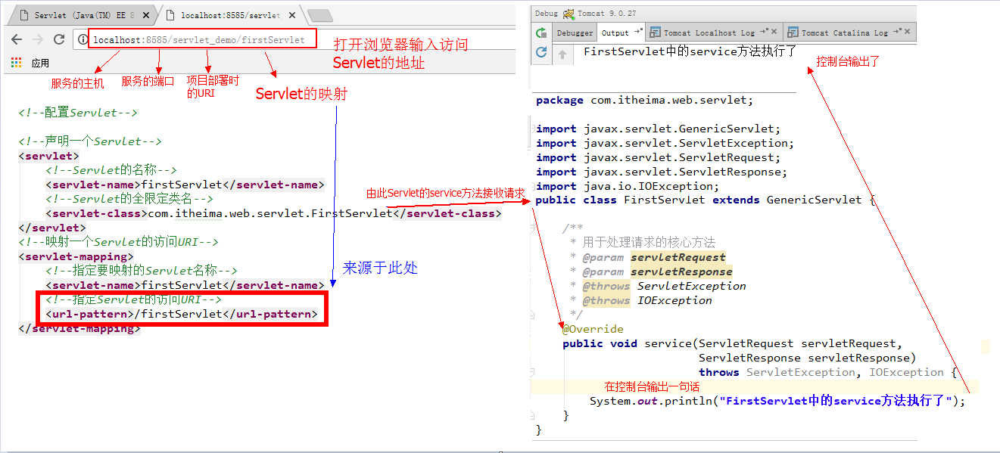

### 2.2 Servlet执行过程分析

我们通过浏览器发送请求，请求首先到达Tomcat服务器，由服务器解析请求URL，然后在部署的应用列表中找到我们的应用。接下来，在我们的应用中找应用里的web.xml配置文件，在web.xml中找到FirstServlet的配置，找到后执行service方法，最后由FirstServlet响应客户浏览器。整个过程如下图所示：

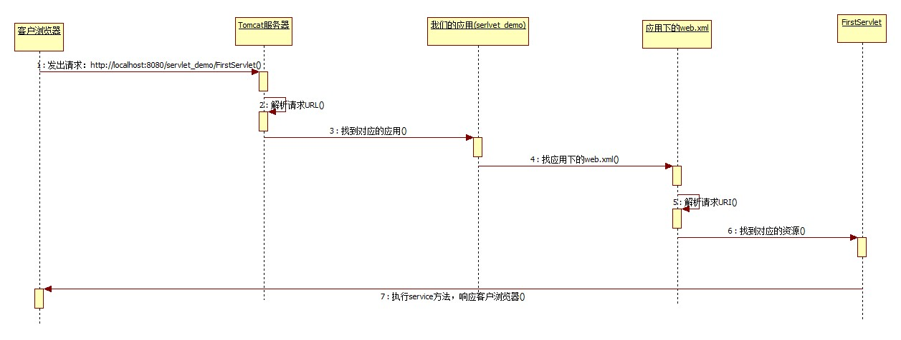

### 2.3 Servlet类视图

在Servlet的API介绍中，它提出了我们除了继承`GenericServlet`外还可以继承`HttpServlet`，通过查阅servlet的类视图，我们看到GenericServlet还有一个子类HttpServlet。同时，在service方法中还有参数`ServletRequest`和`ServletResponse`，它们的关系如下图所示：

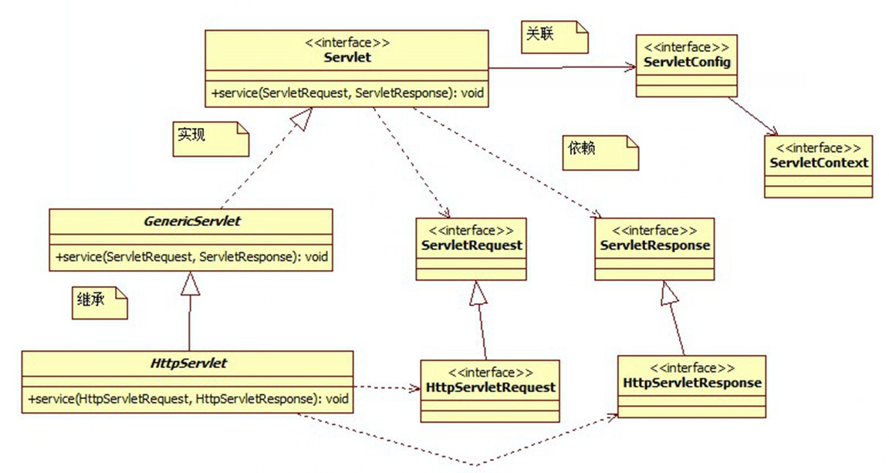

### 2.4 Servlet编写方式

我们在实现Servlet功能时，可以选择以下三种方式：

+ 第一种：**实现Servlet接口**，接口中的方法必须`全部实现`。
  
  使用此种方式，表示接口中的所有方法在需求方面都有重写的必要。此种方式支持最大程度的自定义。

+ 第二种：**继承GenericServlet**，`service方法`必须重写，其他方可根据需求，选择性重写。
  
  使用此种方式，表示只在接收和响应客户端请求这方面有重写的需求，而其他方法可根据实际需求选择性重写，使我们的开发Servlet变得简单。但是，此种方式是和HTTP协议无关的。

+ 第三种：**继承HttpServlet**，它是javax.servlet.http包下的一个抽象类，是GenericServlet的子类，只需要重写`doGet和doPost方法`。
  
  使用此种方式，表示我们的请求和响应需要和HTTP协议相关。也就是说，我们是通过HTTP协议来访问的。那么每次请求和响应都符合HTTP协议的规范。请求的方式就是HTTP协议所支持的方式（目前我们只考虑GET和POST，而实际HTTP协议支持7种请求方式，GET POST PUT DELETE TRACE OPTIONS HEAD )。

## 3 Servlet使用细节

### 3.1 Servlet的生命周期

对象的生命周期，就是对象从生到死的过程，即：出生——活着——死亡。用更偏向于开发的官方说法就是对象创建到销毁的过程。

+ 出生：请求第一次到达Servlet时，对象就创建出来，并且初始化成功。只出生一次，就放到内存中。
+ 活着：服务器提供服务的整个过程中，该对象一直存在，每次只是执行service方法。
+ 死亡：当服务停止时，或者服务器宕机时，对象消亡。

通过分析Servlet的生命周期我们发现，它的实例化和初始化只会在请求第一次到达Servlet时执行，而销毁只会在Tomcat服务器停止时执行，由此我们得出一个结论，**Servlet对象只会创建一次，销毁一次**。所以，Servlet对象只有一个实例。如果一个对象实例在应用中是唯一的存在，那么我们就说它是单实例的，即运用了**单例模式**。

### 3.2 Servlet的线程安全

由于Servlet运用了单例模式，即整个应用中只有一个实例对象，所以我们需要分析这个唯一的实例中的类成员是否线程安全。接下来，我们来看下面的的示例：

```java
/*
    Servlet线程安全
 */
public class ServletDemo04 extends HttpServlet{
    private String username = null;

    @Override
    protected void doGet(HttpServletRequest req, HttpServletResponse resp) throws ServletException, IOException {
        username = req.getParameter("username");
        try {
            Thread.sleep(3000);
        } catch (InterruptedException e) {
            e.printStackTrace();
        }
        PrintWriter pw = resp.getWriter();

        pw.print("welcome:" + username);
        pw.close();
    }

    @Override
    protected void doPost(HttpServletRequest req, HttpServletResponse resp) throws ServletException, IOException {
        doGet(req,resp);
    }
}
```

启动两个浏览器，输入不同的参数，访问之后发现输出的结果都是一样，所以出现线程安全问题。


通过上面的测试我们发现，在Servlet中定义了类成员之后，多个浏览器都会共享类成员的数据。其实每一个浏览器端发送请求，就代表是一个线程，那么多个浏览器就是多个线程，所以测试的结果说明了多个线程会共享Servlet类成员中的数据，其中任何一个线程修改了数据，都会影响其他线程。因此，我们可以认为Servlet它不是线程安全的。

分析产生这个问题的根本原因，其实就是因为Servlet是单例，单例对象的类成员只会随类实例化时初始化一次，之后的操作都是改变，而不会重新初始化。

解决这个问题也非常简单，就是在Servlet中定义类成员要慎重。如果类成员是共用的，并且只会在初始化时赋值，其余时间都是获取的话，那么是没问题。如果类成员并非共用，或者每次使用都有可能对其赋值，那么就要考虑线程安全问题了，把它定义到doGet或者doPost方法里面去就可以了。

### 3.3 Servlet的注意事项

#### 1）映射Servlet的细节

Servlet支持三种映射方式，以达到灵活配置的目的。

首先编写一个ServletDemo5类：

+ **第一种：指名道姓的方式**
  
  此种方式，只有和映射配置一模一样时，Servlet才会接收和响应来自客户端的请求。
  
  例如：映射为：`/servletDemo5`，访问URL：http://localhost:8585/servlet_demo/servletDemo5
  
  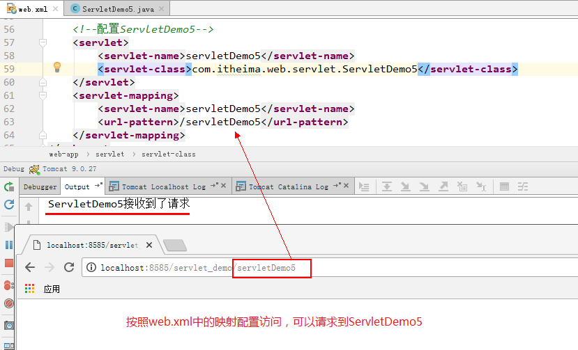

+ **第二种：/开头+通配符的方式**
  
  此种方式，只要符合目录结构即可，不用考虑结尾是什么。
  
  例如：映射为：`/servlet/*`，访问URL：http://localhost:8585/servlet/itheima 和 http://localhost:8585/servlet/itcast.do
  这两个URL都可以。因为用的`*`，表示/servlet/后面的内容是什么都可以。
  
  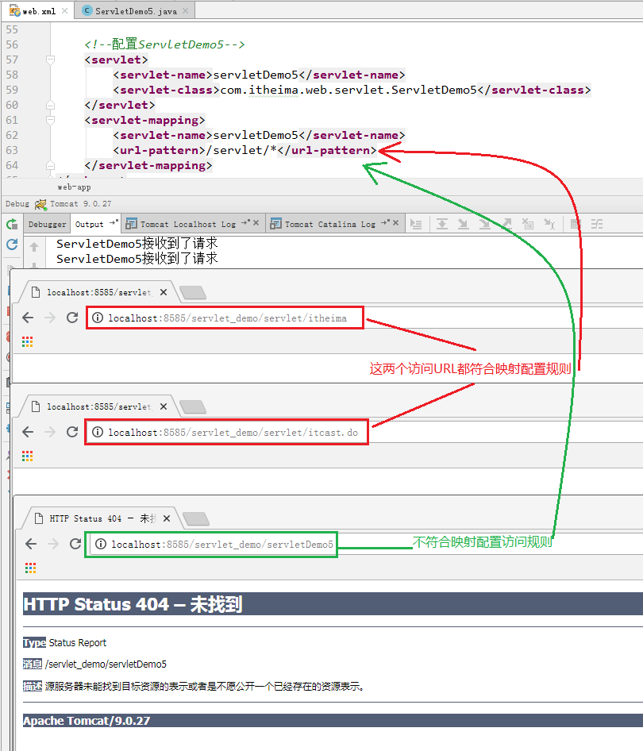

+ **第三种：通配符+固定格式结尾**
  
  此种方式，只要符合固定结尾格式即可，其前面的访问URI无须关心（注意协议，主机和端口必须正确）
  
  例如：映射为：`*.do`，访问URL：http://localhost:8585/servlet/itcast.do 和 http://localhost:8585/itheima.do	这两个URL都可以方法。因为都是以`.do`作为结尾，而前面用`*`号通配符配置的映射，所有无须关心。
  
  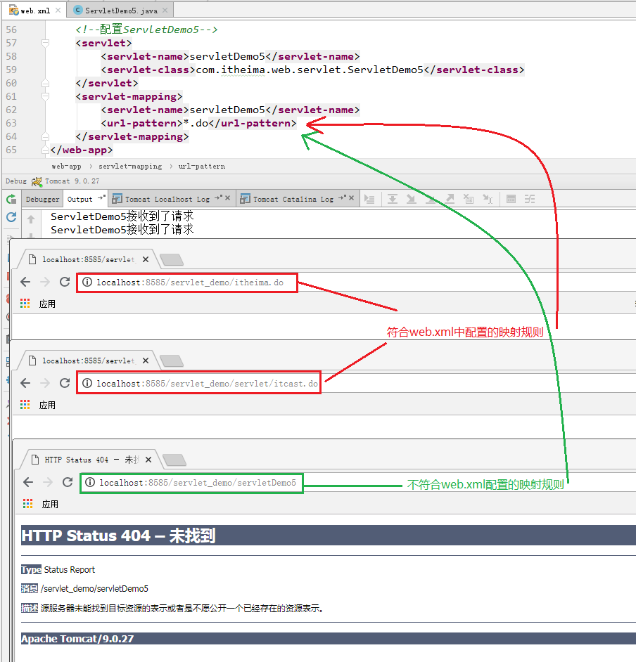

**三种映射方式的优先级为：第一种>第二种>第三种。**

#### 2）多路径映射Servlet

上一小节我们讲解了Servlet的多种映射方式，这一小节我们来介绍一下，一个Servlet的多种路径配置的支持。

它其实就是给一个Servlet配置多个访问映射，从而可以根据不同请求URL实现不同的功能。

首先，创建一个Servlet：

```java
/**
 * 演示Servlet的多路径映射
 * @author 黑马程序员
 * @Company http://www.itheima.com
 */
public class ServletDemo7 extends HttpServlet {

    /**
     * 根据不同的请求URL，做不同的处理规则
     * @param req
     * @param resp
     * @throws ServletException
     * @throws IOException
     */
    @Override
    protected void doGet(HttpServletRequest req, HttpServletResponse resp) throws ServletException, IOException {
        //1.获取当前请求的URI
        String uri = req.getRequestURI();
        uri = uri.substring(uri.lastIndexOf("/"),uri.length());
        //2.判断是1号请求还是2号请求
        if("/servletDemo7".equals(uri)){
            System.out.println("ServletDemo7执行1号请求的业务逻辑：商品单价7折显示");
        }else if("/demo7".equals(uri)){
            System.out.println("ServletDemo7执行2号请求的业务逻辑：商品单价8折显示");
        }else {
            System.out.println("ServletDemo7执行基本业务逻辑：商品单价原价显示");
        }
    }

    /**
     * 调用doGet方法
     * @param req
     * @param resp
     * @throws ServletException
     * @throws IOException
     */
    @Override
    protected void doPost(HttpServletRequest req, HttpServletResponse resp) throws ServletException, IOException {
        doGet(req,resp);
    }
}
```

接下来，在web.xml配置Servlet：

```xml
<!--配置ServletDemo7-->
<servlet>
    <servlet-name>servletDemo7</servlet-name>
    <servlet-class>com.itheima.web.servlet.ServletDemo7</servlet-class>
</servlet>
<!--映射路径1-->
<servlet-mapping>
    <servlet-name>servletDemo7</servlet-name>
    <url-pattern>/demo7</url-pattern>
</servlet-mapping>
<!--映射路径2-->
<servlet-mapping>
    <servlet-name>servletDemo7</servlet-name>
    <url-pattern>/servletDemo7</url-pattern>
</servlet-mapping>
<!--映射路径3-->
<servlet-mapping>
    <servlet-name>servletDemo7</servlet-name>
    <url-pattern>/servlet/*</url-pattern>
</servlet-mapping>
```

最后，启动服务测试运行结果：

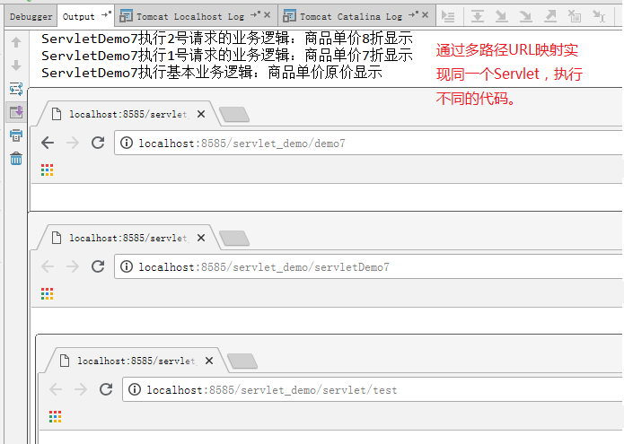

#### 3）启动时创建Servlet

我们前面讲解了Servlet的生命周期，Servlet的创建默认情况下是请求第一次到达Servlet时创建的。但是我们都知道，Servlet是单例的，也就是说在应用中只有唯一的一个实例，所以在Tomcat启动加载应用的时候就创建也是一个很好的选择。那么两者有什么区别呢？

- 第一种：**应用加载时创建Servlet**，它的优势是在服务器启动时，就把需要的对象都创建完成了，从而在使用的时候减少了创建对象的时间，提高了首次执行的效率。它的弊端也同样明显，因为在应用加载时就创建了Servlet对象，因此，导致内存中充斥着大量用不上的Servlet对象，造成了内存的浪费。
- 第二种：**请求第一次访问是创建Servlet**，它的优势就是减少了对服务器内存的浪费，因为那些一直没有被访问过的Servlet对象都没有创建，因此也提高了服务器的启动时间。而它的弊端就是，如果有一些要在应用加载时就做的初始化操作，它都没法完成，从而要考虑其他技术实现。

在web.xml中是支持对Servlet的创建时机进行配置的，配置的方式如下：我们就以ServletDemo3为例。

```xml
<!--配置ServletDemo3-->
<servlet>
    <servlet-name>servletDemo3</servlet-name>
    <servlet-class>com.itheima.web.servlet.ServletDemo3</servlet-class>
    <!--配置Servlet的创建顺序，配置项的取值：
        1. 非负整数（包括0）表示应用加载时创建，数值越小，表明创建的优先级越高；
        2. 负数表示第一次访问时创建
    -->
    <load-on-startup>1</load-on-startup>
</servlet>
<servlet-mapping>
    <servlet-name>servletDemo3</servlet-name>
    <url-pattern>/servletDemo3</url-pattern>
</servlet-mapping>
```

#### 4）默认Servlet

默认Servlet是由服务器提供的一个Servlet，它配置在Tomcat的conf目录下的web.xml中。如下图所示：

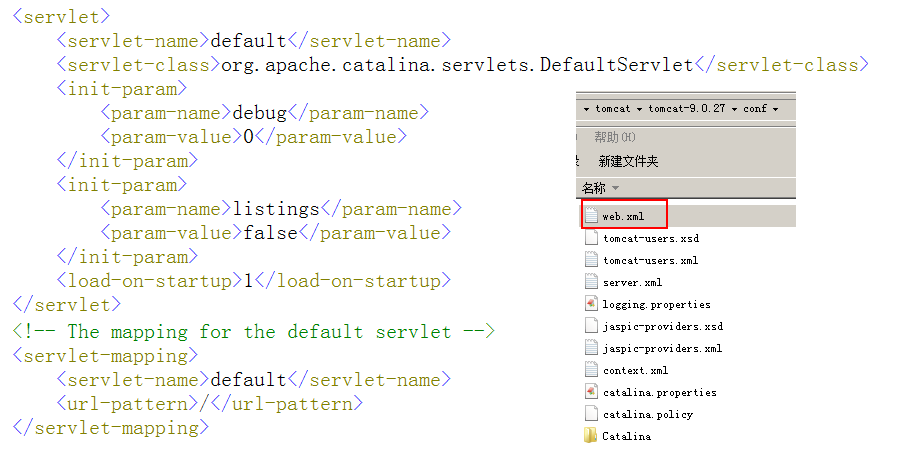

它的映射路径是`<url-pattern>/<url-pattern>`，我们在发送请求时，首先会在我们应用中的web.xml中查找映射配置，找到就执行。但是当找不到对应的Servlet路径时，就去找默认的Servlet，由默认Servlet处理。所以，一切都是Servlet。


## 4 ServletConfig

### 4.1 ServletConfig概述

#### 4.1.1 基本概念

它是Servlet的配置参数对象，在Servlet规范中，允许为每个Servlet都提供一些初始化配置。所以，每个Servlet都一个自己的ServletConfig。它的作用是在Servlet初始化期间，把一些配置信息传递给Servlet。

#### 4.1.2 生命周期

由于它是在初始化阶段读取了web.xml中为Servlet准备的初始化配置，并把配置信息传递给Servlet，所以生命周期与Servlet相同。这里需要注意的是，如果Servlet配置了`<load-on-startup>1</load-on-startup>`，那么ServletConfig也会在应用加载时创建。

### 4.2 ServletConfig的使用

#### 4.2.1 ServletConfig配置

我们接下来准备一个Servlet：

```java
/**
 * 演示Servlet的初始化参数对象
 * @author 黑马程序员
 * @Company http://www.itheima.com
 */
public class ServletDemo8 extends HttpServlet {

    //定义Servlet配置对象ServletConfig
    private ServletConfig servletConfig;

    /**
     * 在初始化时为ServletConfig赋值
     * @param config
     * @throws ServletException
     */
    @Override
    public void init(ServletConfig config) throws ServletException {
        this.servletConfig = config;
    }

    /**
     * @param req
     * @param resp
     * @throws ServletException
     * @throws IOException
     */
    @Override
    protected void doGet(HttpServletRequest req, HttpServletResponse resp) throws ServletException, IOException {
        //输出ServletConfig
        System.out.println(servletConfig);
    }

    /**
     * 调用doGet方法
     * @param req
     * @param resp
     * @throws ServletException
     * @throws IOException
     */
    @Override
    protected void doPost(HttpServletRequest req, HttpServletResponse resp) throws ServletException, IOException {
        doGet(req,resp);
    }
}
```

我们已经准备好了Servlet，同时也获取到了它的ServletConfig对象，接下来需要使用`<servlet>`标签中的`<init-param>`标签来配置初始化参数。

```xml
<!--配置ServletDemo8-->
<servlet>
    <servlet-name>servletDemo8</servlet-name>
    <servlet-class>com.itheima.web.servlet.ServletDemo8</servlet-class>
    <!--配置初始化参数-->
    <init-param>
        <!--用于获取初始化参数的key-->
        <param-name>encoding</param-name>
        <!--初始化参数的值-->
        <param-value>UTF-8</param-value>
    </init-param>
    <!--每个初始化参数都需要用到init-param标签-->
    <init-param>
        <param-name>servletInfo</param-name>
        <param-value>This is Demo8</param-value>
    </init-param>
</servlet>
<servlet-mapping>
    <servlet-name>servletDemo8</servlet-name>
    <url-pattern>/servletDemo8</url-pattern>
</servlet-mapping>
```

Servlet的初始化参数都是配置在Servlet的声明部分的。并且每个Servlet都支持有多个初始化参数，并且初始化参数都是以键值对的形式存在的。

#### 4.2.2 ServletConfig常用方法

```java
/**
 * 演示Servlet的初始化参数对象
 * @author 黑马程序员
 * @Company http://www.itheima.com
 */
public class ServletDemo8 extends HttpServlet {

    //定义Servlet配置对象ServletConfig
    private ServletConfig servletConfig;

    /**
     * 在初始化时为ServletConfig赋值
     * @param config
     * @throws ServletException
     */
    @Override
    public void init(ServletConfig config) throws ServletException {
        this.servletConfig = config;
    }

    /**
     * doGet方法输出一句话
     * @param req
     * @param resp
     * @throws ServletException
     * @throws IOException
     */
    @Override
    protected void doGet(HttpServletRequest req, HttpServletResponse resp) throws ServletException, IOException {
        //1.输出ServletConfig
        System.out.println(servletConfig);
        //2.获取Servlet的名称
        String servletName= servletConfig.getServletName();
        System.out.println(servletName);
        //3.获取字符集编码
        String encoding = servletConfig.getInitParameter("encoding");
        System.out.println(encoding);
        //4.获取所有初始化参数名称的枚举
        Enumeration<String> names = servletConfig.getInitParameterNames();
        //遍历names
        while(names.hasMoreElements()){
            //取出每个name
            String name = names.nextElement();
            //根据key获取value
            String value = servletConfig.getInitParameter(name);
            System.out.println("name:"+name+",value:"+value);
        }
        //5.获取ServletContext对象
        ServletContext servletContext = servletConfig.getServletContext();
        System.out.println(servletContext);
    }

    /**
     * 调用doGet方法
     * @param req
     * @param resp
     * @throws ServletException
     * @throws IOException
     */
    @Override
    protected void doPost(HttpServletRequest req, HttpServletResponse resp) throws ServletException, IOException {
        doGet(req,resp);
    }
}
```

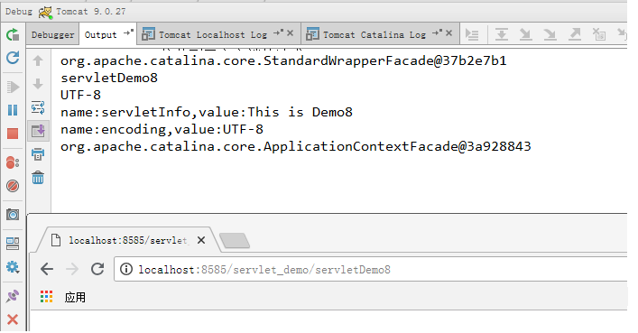

## 5 ServletContext

### 5.1 ServletContext概述

#### 5.1.1 基本介绍

```
ServletContext是应用上下文对象。每一个应用中只有一个 ServletContext对象（单例）。
作用：可以获得应用的全局初始化参数和达到 Servlet 之间的数据共享。
生命周期：应用一加载则创建，应用被停止则销毁。
```

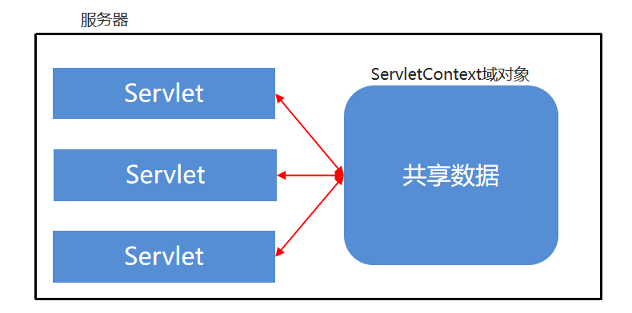

#### 5.1.2 域对象概念

域对象的概念，它指的是对象有作用域，即有作用范围。

域对象的作用，域对象可以实现数据共享。不同作用范围的域对象，共享数据的能力不一样。

在Servlet规范中，一共有4个域对象。今天我们讲解的ServletContext就是其中一个。它也是我们接触的第一个域对象。它是web应用中最大的作用域，叫application域。每个应用只有一个application域。它可以实现整个应用间的数据共享功能。

### 5.2 ServletContext的使用

#### 5.2.1 ServletContext配置

ServletContext既然被称之为应用上下文对象，所以它的配置是针对整个应用的配置，而非某个特定Servlet的配置。它的配置被称为应用的初始化参数配置。

配置的方式，需要在`<web-app>`标签中使用`<context-param>`来配置初始化参数。具体代码如下：

```xml
<!--配置应用初始化参数-->
<context-param>
    <!--用于获取初始化参数的key-->
    <param-name>servletContextInfo</param-name>
    <!--初始化参数的值-->
    <param-value>This is application scope</param-value>
</context-param>
<!--每个应用初始化参数都需要用到context-param标签-->
<context-param>
    <param-name>globalEncoding</param-name>
    <param-value>UTF-8</param-value>
</context-param>
```

#### 5.2.2 ServletContext常用方法

```java
public class ServletContextDemo extends HttpServlet {
    @Override
    protected void doGet(HttpServletRequest req, HttpServletResponse resp) throws ServletException, IOException {
        //获取ServletContext对象
        ServletContext context = getServletContext();

        //获取全局配置的globalEncoding
        String value = context.getInitParameter("globalEncoding");
        System.out.println(value);

        //获取应用的访问虚拟目录
        String contextPath = context.getContextPath();
        System.out.println(contextPath);

        //根据虚拟目录获取应用部署的磁盘绝对路径
        //获取b.txt文件的绝对路径
        String b = context.getRealPath("/b.txt");
        System.out.println(b);

        //获取c.txt文件的绝对路径
        String c = context.getRealPath("/WEB-INF/c.txt");
        System.out.println(c);

        //获取a.txt文件的绝对路径
        String a = context.getRealPath("/WEB-INF/classes/a.txt");
        System.out.println(a);


        //向域对象中存储数据
        context.setAttribute("username","zhangsan");

        //移除域对象中username的数据
        //context.removeAttribute("username");
    }

    @Override
    protected void doPost(HttpServletRequest req, HttpServletResponse resp) throws ServletException, IOException {
        doGet(req,resp);
    }
}
```

## 6 ServletRequest

### 6.1 请求对象概述

请求，顾明思议，就是使用者希望从服务器端索取一些资源，向服务器发出询问。在B/S架构中，就是客户浏览器向服务器发出询问。在我们的JavaEE工程中，客户浏览器发出询问，要遵循HTTP协议所规定的。

请求对象，就是在JavaEE工程中，用于发送请求的对象。我们常用的对象就是`ServletRequest` 和 `HttpServletRequest`，它们的区别就是是否和HTTP协议有关。

常用请求对象


常用方法


### 6.2 请求对象的使用示例

在本小节，我们会讲解HttpServletRequest对象获取请求参数的常用方法，以及把获取到的请求参数封装到实体类中的方式。

#### 1）准备

首先，我们先来创建一个Servlet对象：

```java
/**
 * 封装请求正文到javabean（数据模型）
 * @author 黑马程序员
 * @Company http://www.itheima.com
 */
public class RequestDemo3 extends HttpServlet {

    public void doGet(HttpServletRequest request, HttpServletResponse response)
            throws ServletException, IOException {
        /*
         * 把下面
         *		1）获取请求参数
         *		2）封装请求参数到实体类中
         * 中定义的test1到test8逐个添加到此处来运行即可。
         */
    }
 
    public void doPost(HttpServletRequest request, HttpServletResponse response)
            throws ServletException, IOException {
        doGet(request, response);
    }
}
```

接下来，我们在来准备一个表单页面：

```html
<html>
<head>
	<title>login to request demo 3</title>
</head>
<body>
<form action="/day10_1122_requestresponse/RequestDemo3" method="post">
	用户名：<input type="text" name="username" /><br/>
	密码：<input type="password" name="password" /><br/>
	性别：<input type="radio" name="gender" value="1" checked>男
	<input type="radio" name="gender" value="0">女
	<br/>
	<input type="submit" value="注册" />
</form>
</body>
</html>
```

现在，我们开始分析HttpServletRequest对象用于获取请求参数的方法：

#### 2）获取请求参数

**getParameter()方法的示例代码**

```java
/**
 * 获取请求正文，一个名称对应一个值。								没有使用确认密码
 * @param request
 * @param response
 * @throws ServletException
 * @throws IOException
 */
private void test1(HttpServletRequest request, HttpServletResponse response)
    throws ServletException, IOException {
    //1.获取请求正文
    String username = request.getParameter("username");
    String password = request.getParameter("password");
    String gender = request.getParameter("gender");
    System.out.println(username+","+password+","+gender);
}
```

**getParameterValues()方法的示例代码**

```java
/**
 * 获取请求正文，一个名称可能对应多个值									使用了确认密码
 * @param request
 * @param response
 * @throws ServletException
 * @throws IOException
*/
private void test2(HttpServletRequest request, HttpServletResponse response)
    throws ServletException, IOException {
    //1.获取请求正文
    String username = request.getParameter("username");
    String[] password = request.getParameterValues("password");//当表单中有多个名称是一样时，得到是一个字符串数组
    String gender = request.getParameter("gender");
    System.out.println(username+","+Arrays.toString(password)+","+gender);
}
```

**getParameterNames()方法的示例代码**

```java
/**
 * 获取请求正文，一个名称一个值。但是先要获取正文名称的枚举（key的枚举）				没有使用确认密码
 * @param request
 * @param response
 * @throws ServletException
 * @throws IOException
*/
private void test3(HttpServletRequest request, HttpServletResponse response)
    throws ServletException, IOException {
    //1.获取请求正文名称的枚举
    Enumeration<String> names = request.getParameterNames();
    //2.遍历正文名称的枚举
    while(names.hasMoreElements()){
        String name = names.nextElement();
        String value = request.getParameter(name);
        System.out.println(name+":"+value);
    }
}
```

**总结：**

​	以上三个方法可以获取表单提交过来的请求参数。

​	参数的名称是一个字符串，参数的值可能是一个字符串，也可能是一个字符串数组。

**补充：用流的形式读取请求信息**

我们除了使用前面的方法获取请求参数之外，还可以使用下面代码中的 方式来获取：

```java
/**
 * 使用流的方式读取请求正文
 * @author 黑马程序员
 * @Company http://www.itheima.com
 */
public class RequestDemo4 extends HttpServlet {

    public void doGet(HttpServletRequest request, HttpServletResponse response)
            throws ServletException, IOException {
        //1.获取请求正文的字节输入流
        ServletInputStream sis = request.getInputStream();
        //2.读取流中的数据
        int len = 0;
        byte[] by = new byte[1024];
        while((len = sis.read(by)) != -1){
            System.out.println(new String(by,0,len));
        }
    }

    public void doPost(HttpServletRequest request, HttpServletResponse response)
            throws ServletException, IOException {
        doGet(request, response);
    }

}
```


#### 3）封装请求参数到实体类中

我们通过上面的方法可以获取到请求参数，但是如果参数过多，在进行传递时，方法的形参定义将会变得非常难看。此时我们应该用一个对象来描述这些参数，它就是实体类。

我们现在要做的就是把表单中提交过来的数据填充到实体类中。

**第一种：最简单直接的封装方式**

```java
/**
 * 封装请求正文到User对象中									没有使用确认密码
 * @param request
 * @param response
 * @throws ServletException
 * @throws IOException
 */
private void test4(HttpServletRequest request, HttpServletResponse response)
    throws ServletException, IOException {
    //1.获取请求正文
    String username = request.getParameter("username");
    String password = request.getParameter("password");
    String gender = request.getParameter("gender");
    //2.创建一个User对象
    User user = new User();
    System.out.println("封装前："+user.toString());
    //3.把请求正文封装到user对象中
    user.setUsername(username);
    user.setPassword(password);
    user.setGender(gender);
    System.out.println("封装后："+user.toString());
}
```

**第二种：使用反射方式封装**

此种封装的使用要求是，表单`<input>`标签的name属性取值，必须和实体类中定义的属性名称一致。

```java
/**
 * 封装请求正文到javabean中										没有使用确认密码
 * 使用反射+内省实现数据模型的封装
 * 内省：是sun公司推出的一套简化反射操作的规范。把javabean中的元素都封装成一个属性描述器。
 * 	        属性描述器中会有字段信息，get和set方法（取值或存值）
 * @param request
 * @param response
 * @throws ServletException
 * @throws IOException
*/
private void test5(HttpServletRequest request, HttpServletResponse response)
    throws ServletException, IOException {
    //1.获取请求正文名称的枚举
    Enumeration<String> names = request.getParameterNames();
    User user = new User();
    System.out.println("封装前："+user.toString());
    //2.遍历正文名称的枚举
    while(names.hasMoreElements()){
        String name = names.nextElement();
        String value = request.getParameter(name);
        try{
            //1.拿到User对象中的属性描述器。是谁的属性描述器：是由构造函数的第一个参数决定的。第二个参数是指定javabean的字节码
            PropertyDescriptor pd = new PropertyDescriptor(name, User.class);//参数指的就是拿哪个类的哪个属性的描述器
            //2.设置javabean属性的值
            Method method = pd.getWriteMethod();
            //3.执行方法
            method.invoke(user, value);//第一个参数是指的给哪个对象，第二个参数指的是赋什么值
        }catch(Exception e){
            e.printStackTrace();
        }
    }
    System.out.println("封装后："+user.toString());
} 
```

**第三种：使用反射封装，同时请求参数的值是一个数组**

此种方式其实就是针对请求参数中包含name属性相同的参数，例如：密码和确认密码，还有爱好。

```java
/**
 * 获取请求正文的关系映射Map<String,String[]>				使用确认密码
 * @param request
 * @param response
 * @throws ServletException
 * @throws IOException
 */
private void test6(HttpServletRequest request, HttpServletResponse response)
    throws ServletException, IOException {
    //1.获取请求正文的映射关系
    Map<String,String[]> map = request.getParameterMap();
    //2.遍历集合
    for(Map.Entry<String,String[]> me : map.entrySet()){
        String name = me.getKey();
        String[] value = me.getValue();
        System.out.println(name+":"+Arrays.toString(value));
    }
} 
```

当我们把请求参数获取出来之后，就要考虑如何针对数组的反射了，具体代码如下：

```java
 /**
 * 封装请求正文到javabean。使用的是反射+内省						使用了确认密码
 * @param request
 * @param response
 * @throws ServletException
 * @throws IOException
 */
private void test7(HttpServletRequest request, HttpServletResponse response)
    throws ServletException, IOException {
    //1.获取请求正文的映射关系
    Map<String,String[]> map = request.getParameterMap();
    Users user = new Users();
    System.out.println("封装前："+user.toString());
    //2.遍历集合
    for(Map.Entry<String,String[]> me : map.entrySet()){
        String name = me.getKey();
        String[] value = me.getValue();
        try{
            //1.拿到User对象中的属性描述器。是谁的属性描述器：是由构造函数的第一个参数决定的。第二个参数是指定javabean的字节码
            PropertyDescriptor pd = new PropertyDescriptor(name, Users.class);//参数指的就是拿哪个类的哪个属性的描述器
            //2.设置javabean属性的值
            Method method = pd.getWriteMethod();
            //3.执行方法
            //判断参数到底是几个值
            if(value.length > 1){//最少有2个元素
                method.invoke(user, (Object)value);//第一个参数是指的给哪个对象，第二个参数指的是赋什么值
            }else{
                method.invoke(user, value);//第一个参数是指的给哪个对象，第二个参数指的是赋什么值
            }
        }catch(Exception e){
            e.printStackTrace();
        }
    }
    System.out.println("封装后："+user.toString());
}
```

**第四种：使用apache的commons-beanutils实现封装**

实现代码：

```java
/**
 * 终极方法：使用beanutils实现请求正文封装到javabean中				使用了确认密码
 * 要想使用beanutils，需要先导包
 * @param request
 * @param response
 * @throws ServletException
 * @throws IOException
 */
private void test8(HttpServletRequest request, HttpServletResponse response)
    throws ServletException, IOException {
    Users user = new Users();
    System.out.println("封装前："+user.toString());
    try{
        BeanUtils.populate(user, request.getParameterMap());//就这一句话
    }catch(Exception e){
        e.printStackTrace();
    }
    System.out.println("封装后："+user.toString());
}
```

### 6.3 请求转发（与重定向的区别）

在实际开发中，重定向和请求转发都是我们要用到的响应方式，那么他们有什么区别呢？我们通过下面的示例来看一下：

```java
/**
 * 重定向特点：
 * 	两次请求，浏览器行为，地址栏改变，请求域中的数据会丢失
 * 请求转发：
 * 	一次请求，服务器行为，地址栏不变，请求域中的数据不丢失
 *
 * 请求域的作用范围：
 * 	 当前请求（一次请求）,和当前请求的转发之中
 * @author 黑马程序员
 * @Company http://www.itheima.com
 */
public class RequestDemo6 extends HttpServlet {

    public void doGet(HttpServletRequest request, HttpServletResponse response)
            throws ServletException, IOException {
        //1.拿到请求调度对象
        RequestDispatcher rd = request.getRequestDispatcher("/RequestDemo7");//如果是给浏览器看的，/可写可不写。如果是给服务器看的，一般情况下，/都是必须的。
        //放入数据到请求域中
        request.setAttribute("CityCode", "bj-010");
        //2.实现真正的转发操作
        rd.forward(request, response);//实现真正的转发操作
    }

    public void doPost(HttpServletRequest request, HttpServletResponse response)
            throws ServletException, IOException {
        doGet(request, response);
    }

}
```

```java
/**
 * 转发的目的地
 * @author 黑马程序员
 * @Company http://www.itheima.com
 */
public class RequestDemo7 extends HttpServlet {

    public void doGet(HttpServletRequest request, HttpServletResponse response)
            throws ServletException, IOException {
        //获取请求域中的数据
        String value = (String)request.getAttribute("CityCode");
        response.getWriter().write("welcome to request demo 7    "+value);
    }

    public void doPost(HttpServletRequest request, HttpServletResponse response)
            throws ServletException, IOException {
        doGet(request, response);
    }

}
```

### 6.4 请求包含

在实际开发中，我们可能需要把两个Servlet的内容合并到一起来响应浏览器，而同学们都知道HTTP协议的特点是一请求，一响应的方式。所以绝对不可能出现有两个Servlet同时响应方式。那么我们就需要用到请求包含，把两个Servlet的响应内容合并输出。我们看具体使用示例：

```java
/**
 * 请求包含
 *
 * 它是把两个Servlet的响应内容合并输出。
 * 注意：
 * 	这种包含是动态包含。
 *
 * 动态包含的特点：
 * 		各编译各的，只是最后合并输出。
 * @author 黑马程序员
 * @Company http://www.itheima.com
 */
public class RequestDemo8 extends HttpServlet {

    public void doGet(HttpServletRequest request, HttpServletResponse response)
            throws ServletException, IOException {
        response.getWriter().write("I am request demo8 ");
        //1.拿到请求调度对象
        RequestDispatcher rd = request.getRequestDispatcher("/RequestDemo9");
        //2.实现包含的操作
        rd.include(request, response);
    }

    public void doPost(HttpServletRequest request, HttpServletResponse response)
            throws ServletException, IOException {
        doGet(request, response);
    }
}
```

```java
/**
 * 被包含者
 * @author 黑马程序员
 * @Company http://www.itheima.com
 */
public class RequestDemo9 extends HttpServlet {

    public void doGet(HttpServletRequest request, HttpServletResponse response)
            throws ServletException, IOException {
        response.getWriter().write("include request demo 9 ");
    }

    public void doPost(HttpServletRequest request, HttpServletResponse response)
            throws ServletException, IOException {
        doGet(request, response);
    }

}
```

请求转发的注意事项：负责转发的Servlet，转发前后的响应正文丢失，由转发目的地来响应浏览器。

请求包含的注意事项：被包含者的响应消息头丢失。因为它被包含起来了。


### 6.5 请求正文中中文编码问题

关于请求中文乱码问题，我们需要分开讨论，第一是POST请求方式，第二是GET方式。

#### 1）POST方式请求

在POST方式请求中，我们的乱码问题可以用如下代码解决：

```java
/**
 * 请求正文的中文乱码问题
 * @author 黑马程序员
 * @Company http://www.itheima.com
 */
public class RequestDemo5 extends HttpServlet {

    public void doGet(HttpServletRequest request, HttpServletResponse response)
            throws ServletException, IOException {
        //1.获取请求正文
		/*POST方式：
		 * 问题：
		 * 	取的时候会不会有乱码
		 * 答案：
		 * 	获取请求正文，会有乱码问题。
		 * 	是在获取的时候就已经乱码了。
		 * 解决办法：
		 * 	 是request对象的编码出问题了
		 *   设置request对象的字符集
		 *   request.setCharacterEncoding("GBK");它只能解决POST的请求方式，GET方式解决不了
		 * 结论：
		 * 	 请求正文的字符集和响应正文的字符集没有关系。各是各的
		 */
		request.setCharacterEncoding("UTF-8");
		String username = request.getParameter("username");
        //输出到控制台
		System.out.println(username);
        //输出到浏览器：注意响应的乱码问题已经解决了
        response.setContentType("text/html;charset=UTF-8");
        PrintWriter out = response.getWriter();
        out.write(username);
    }

    public void doPost(HttpServletRequest request, HttpServletResponse response)
            throws ServletException, IOException {
        doGet(request, response);
    }
}
```

#### 2）GET方式请求

GET方式请求的正文是在地址栏中，在Tomcat8.5版本及以后，Tomcat服务器已经帮我们解决了，所以不会有乱码问题了。

而如果我们使用的不是Tomcat服务器，或者Tomcat的版本是8.5以前，那么GET方式仍然会有乱码问题，解决方式如下：

```java
/**
 * 在Servlet的doGet方法中添加如下代码
 */
public void doGet(HttpServletRequest request, HttpServletResponse response)
            throws ServletException, IOException {
   

        /*
         * GET方式：正文在地址栏
         * username=%D5%C5%C8%FD
         * %D5%C5%C8%FD是已经被编过一次码了
         *
         * 解决办法：
         * 	 使用正确的码表对已经编过码的数据进行解码。
         * 		就是把取出的内容转成一个字节数组，但是要使用正确的码表。（ISO-8859-1）
         * 	 再使用正确的码表进行编码
         * 		把字节数组再转成一个字符串，需要使用正确的码表，是看浏览器当时用的是什么码表
         */
        String username = request.getParameter("username");
        byte[] by = username.getBytes("ISO-8859-1");
        username = new String(by,"GBK");

        //输出到浏览器：注意响应的乱码问题已经解决了
        response.setContentType("text/html;charset=UTF-8");
        PrintWriter out = response.getWriter();
        out.write(username);
}

public void doPost(HttpServletRequest request, HttpServletResponse response)
    throws ServletException, IOException {
    doGet(request, response);
}
```

## 7 ServletResponse

### 7.1 响应对象概述

#### 7.1.1 关于响应

响应，它表示了服务器端收到请求，同时也已经处理完成，把处理的结果告知用户。简单来说，指的就是服务器把请求的处理结果告知客户端。在B/S架构中，响应就是把结果带回浏览器。

响应对象，顾名思义就是用于在JavaWeb工程中实现上述功能的对象。

#### 7.1.2 常用响应对象

响应对象也是是Servlet规范中定义的，它包括了协议无关的和协议相关的。

协议无关的对象标准是：`ServletResponse`接口

协议相关的对象标准是：`HttpServletResponse`接口

类结构图如下：


现在我们想要实现响应功能，要不要定义一个类，然后实现HttpServletResponse接口呢？

此问题的答案是否定的，我们无需这么做。我们只需要在自己写的Servlet中直接使用即可，因为这个对象的实现类是由Tomcat提供的，无须我们自定义。同时它还会帮我们把对象创建出来并传入doGet和doPost方法中。

#### 7.1.3 常用方法介绍 

在HttpServletResponse接口中提供了很多方法，接下来我们通过API文档，来了解一下这些方法。


常用状态码：

| 状态码 |                            说明                            |
| :----: | :--------------------------------------------------------: |
|  200   |                          执行成功                          |
|  302   | 它和307一样，都是用于重定向的状态码。只是307目前已不再使用 |
|  304   |                 请求资源未改变，使用缓存。                 |
|  400   |            请求错误。最常见的就是请求参数有问题            |
|  404   |                       请求资源未找到                       |
|  405   |                      请求方式不被支持                      |
|  500   |                     服务器运行内部错误                     |

状态码首位含义：

| 状态码 |    说明    |
| :----: | :--------: |
|  1xx   |    消息    |
|  2xx   |    成功    |
|  3xx   |   重定向   |
|  4xx   | 客户端错误 |
|  5xx   | 服务器错误 |

### 7.2 响应对象的使用示例

#### 7.2.1 响应-字节流输出中文问题

```java
/**
 * @author 黑马程序员
 * @Company http://www.itheima.com
 */
public class ResponseDemo1 extends HttpServlet {

    /**
     * 演示字节流输出的乱码问题
     */
    public void doGet(HttpServletRequest request, HttpServletResponse response)
            throws ServletException, IOException {
        /**
         * 问题：
         * 	  String str = "字节流中文乱码问题";
         * 	     使用字节流输出，会不会产生中文乱码？
         * 答案：
         * 	  会产生乱码
         * 原因：
         * 	String str = "字节流中文乱码问题"; 在保存时用的是IDEA创建文件使用的字符集UTF-8。
         * 	到浏览器上显示，chrome浏览器和ie浏览器默认的字符集是GB2312(其实就是GBK)，存和取用的不是同一个码表，就会产生乱码。
         *
         * 引申：
         *   如果产生了乱码，就是存和取用的不是同一个码表
         * 解决办法：
         *   把存和取的码表统一。
         */
        String str = "字节流输出中文的乱码问题";//UTF-8的字符集，此时浏览器显示也需要使用UTF-8的字符集。
        //1.拿到字节流输出对象
        ServletOutputStream sos = response.getOutputStream();
        /**
         * 解决办法：
         * 	第一种解决办法：
         *      修改浏览器的编码，使用右键——编码——改成UTF-8。(不推荐使用，我们的应用尽量不要求用户取做什么事情)
         *      ie和火狐浏览器可以直接右键设置字符集。而chrome需要安装插件，很麻烦。
         * 	第二种解决办法： (不建议使用，因为不好记)
         *  	向页面上输出一个meta标签，内容如下： <meta http-equiv="content-type" content="text/html;charset=UTF-8">
         *      其实它就是指挥了浏览器，使用哪个编码进行显示。
         *  第三种解决办法：
         * 		设置响应消息头，告知浏览器响应正文的MIME类型和字符集
         * 		response.setHeader("Content-Type","text/html;charset=UTF-8");
         * 	第四种解决办法：我们推荐使用的办法
         * 	    它的本质就是设置了一个响应消息头
         *  	response.setContentType("text/html;charset=UTF-8");
         */
        //第二种解决办法：sos.write("<meta http-equiv='content-type' content='text/html;charset=UTF-8'>".getBytes());
        //第三种解决办法：response.setHeader("Content-Type","text/html;charset=UTF-8");
        //第四种解决办法：
        response.setContentType("text/html;charset=UTF-8");
        //2.把str转换成字节数组之后输出到浏览器
        sos.write(str.getBytes("UTF-8")); 
    }

    public void doPost(HttpServletRequest request, HttpServletResponse response)
            throws ServletException, IOException {
        doGet(request, response);
    }
}
```

#### 7.2.2 响应-字符流输出中文问题

```java
/**
 * @author 黑马程序员
 * @Company http://www.itheima.com
 */
public class ResponseDemo2 extends HttpServlet {

    /**
     * 字符流输出中文乱码
     * @param request
     * @param response
     * @throws ServletException
     * @throws IOException
     */
    public void doGet(HttpServletRequest request, HttpServletResponse response)
            throws ServletException, IOException {
        String str = "字符流输出中文乱码";
        //response.setCharacterEncoding("UTF-8");

        //设置响应正文的MIME类型和字符集
        response.setContentType("text/html;charset=UTF-8");
        //1.获取字符输出流
        PrintWriter out = response.getWriter();
        //2.使用字符流输出中文
        /**
         * 问题：
         * 	out.write(str); 直接输出，会不会产生乱码
         * 答案：
         * 	会产生乱码
         * 原因：
         * 	存用的什么码表：UTF-8
         *  在浏览器取之前，字符流PrintWriter已经获取过一次了，PrintWriter它在取的时候出现了乱码。
         * 	浏览器取默认用的是GBK。（本地系统字符集）
         *
         *  UTF-8(存)————>PrintWriter ISO-8859-1(取)					乱
         *  PrintWirter ISO-8859-1(存)————>浏览器 GBK(取)				乱
         *
         * 解决办法：
         * 	改变PrintWriter的字符集，PrintWriter是从response对象中获取的，其实设置response的字符集。
         *  注意：设置response的字符集，需要在拿流之前。
         *  response.setCharacterEncoding("UTF-8");
         *
         * response.setContentType("text/html;charset=UTF-8");
         * 此方法，其实是做了两件事：
         * 		1.设置响应对象的字符集（包括响应对象取出的字符输出流）
         * 		2.告知浏览器响应正文的MIME类型和字符集
         */

        out.write(str);
    }

    public void doPost(HttpServletRequest request, HttpServletResponse response)
            throws ServletException, IOException {
        doGet(request, response);
    }
}
```

#### 7.2.3 响应-生成验证码

```java
/**
 * @author 黑马程序员
 * @Company http://www.itheima.com
 *
 */
public class ResponseDemo3 extends HttpServlet {

    /**
     * 输出图片
     * @param request
     * @param response
     * @throws ServletException
     * @throws IOException
     */
    public void doGet(HttpServletRequest request, HttpServletResponse response)
            throws ServletException, IOException {
        int width = 200;
        int height = 35;
        /**
         * 实现步骤:
         * 	1.创建图像内存对象
         *  2.拿到画笔
         *  3.设置颜色，画矩形边框
         *  4.设置颜色，填充矩形
         *  5.设置颜色，画干扰线
         *  6.设置颜色，画验证码
         *  7.把内存图像输出到浏览器上
         */
        //创建内存图像
        BufferedImage image = new BufferedImage(width,height,BufferedImage.TYPE_INT_RGB);//参数：宽度，高度 （指的都是像素），使用的格式（RGB）
        Graphics g = image.getGraphics();//画笔就一根

        //设置颜色
        g.setColor(Color.BLUE);
        //画边框
        g.drawRect(0, 0, width, height);

        //设置颜色
        g.setColor(Color.GRAY);
        //填充矩形
        g.fillRect(1, 1, width-2, height-2);

        //设置颜色
        g.setColor(Color.WHITE);
        //拿随机数对象
        Random r = new Random();
        //画干扰线 10条
        for(int i=0;i<10;i++){
            g.drawLine(r.nextInt(width), r.nextInt(height),r.nextInt(width), r.nextInt(height));
        }

        //设置颜色
        g.setColor(Color.RED);
        //改变字体大小
        Font font = new Font("宋体", Font.BOLD,30);//参数：1字体名称。2.字体样式 3.字体大小
        g.setFont(font);//设置字体
        //画验证码	4个
        int x = 35;//第一个数的横坐标是35像素
        for(int i=0;i<4;i++){
            //r.nextInt(10)+""这种写法效率是十分低的
            g.drawString(String.valueOf(r.nextInt(10)), x, 25);
            x+=35;
        }

        //输出到浏览器上
        //参数： 1.内存对象。2.输出的图片格式。3.使用的输出流
        ImageIO.write(image, "jpg", response.getOutputStream());
    }

    public void doPost(HttpServletRequest request, HttpServletResponse response)
            throws ServletException, IOException {
        doGet(request, response);
    }

}
```

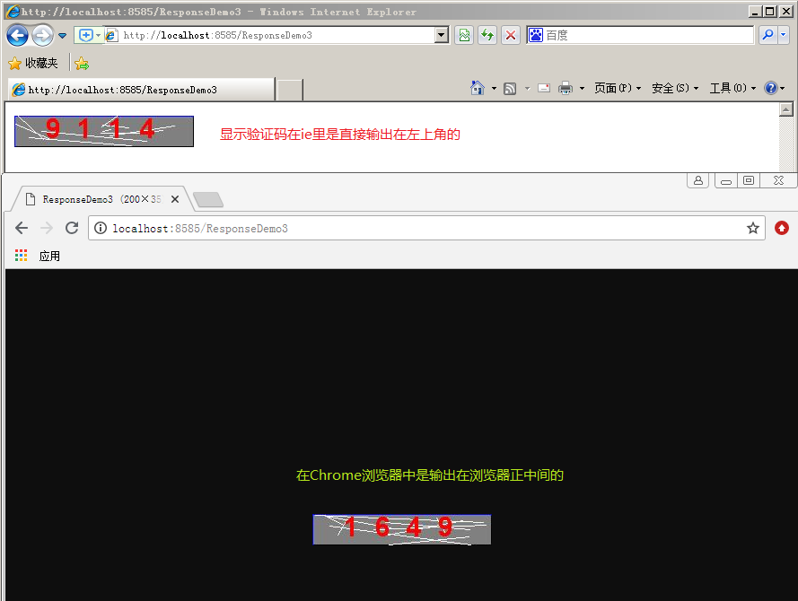

### 7.3 控制缓存

```java
/**
 * 设置缓存时间
 * 	使用缓存的一般都是静态资源
 *  动态资源一般不能缓存。
 *  我们现在目前只掌握了Servlet，所以用Servlet做演示
 * @author 黑马程序员
 * @Company http://www.itheima.com
 *
 */
public class ResponseDemo4 extends HttpServlet {

    public void doGet(HttpServletRequest request, HttpServletResponse response)
            throws ServletException, IOException {
        String str = "设置缓存时间";
        /*
         * 设置缓存时间，其实就是设置响应消息头：Expires 但是值是一个毫秒数。
         * 使用的是
         * 	response.setDateHeader();
         *
         * 缓存1小时，是在当前时间的毫秒数上加上1小时之后的毫秒值
         */
        response.setDateHeader("Expires",System.currentTimeMillis()+1*60*60*1000);
        response.setContentType("text/html;charset=UTF-8");
        response.getOutputStream().write(str.getBytes());
    }

    public void doPost(HttpServletRequest request, HttpServletResponse response)
            throws ServletException, IOException {
        doGet(request, response);
    }

}
```

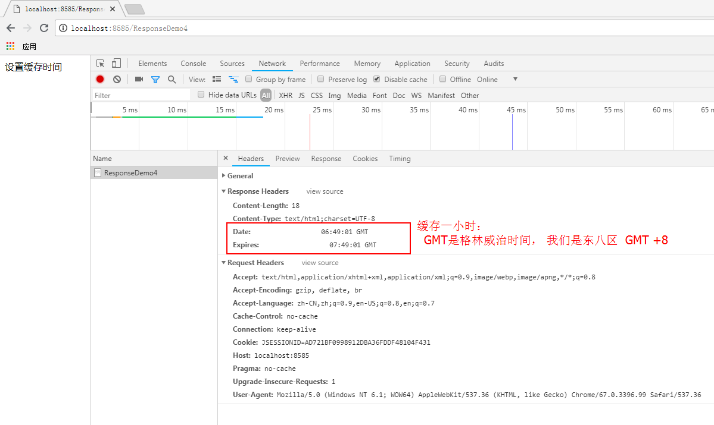


### 7.4 定时刷新

```java
/**
 * 设置响应消息头：
 * 通过定时刷新演示添加消息头
 * @author 黑马程序员
 * @Company http://www.itheima.com
 *
 */
public class ResponseDemo5 extends HttpServlet {

    public void doGet(HttpServletRequest request, HttpServletResponse response)
            throws ServletException, IOException {
        String str = "用户名和密码不匹配，2秒后转向登录页面...";
        response.setContentType("text/html;charset=UTF-8");
        PrintWriter out = response.getWriter();
        out.write(str);
        //定时刷新，其实就是设置一个响应消息头
        response.setHeader("Refresh", "2;URL=/login.html");//Refresh设置的时间单位是秒，如果刷新到其他地址，需要在时间后面拼接上地址
    }

    public void doPost(HttpServletRequest request, HttpServletResponse response)
            throws ServletException, IOException {
        doGet(request, response);
    }

}
```

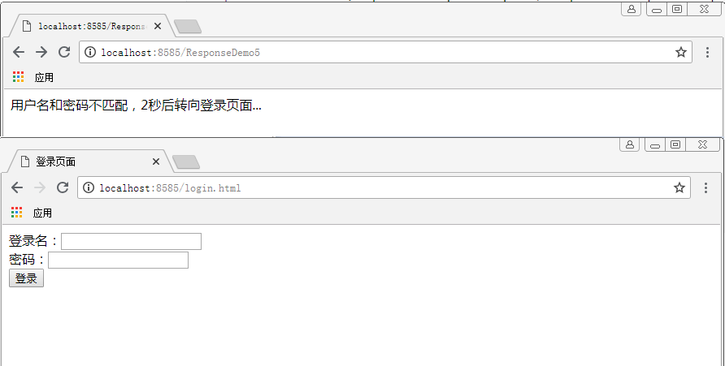

### 7.5 请求重定向

```java
/**
 * 设置响应状态码，实现重定向
 * 重定向的特点：
 * 	 两次请求，地址栏改变，浏览器行为，xxxx
 * @author 黑马程序员
 * @Company http://www.itheima.com
 *
 */
public class ResponseDemo6 extends HttpServlet {

    public void doGet(HttpServletRequest request, HttpServletResponse response)
            throws ServletException, IOException {
        //1.设置响应状态码
//		response.setStatus(302);
        //2.定向到哪里去: 其实就是设置响应消息头，Location
//		response.setHeader("Location", "ResponseDemo7");

        //使用重定向方法
        response.sendRedirect("ResponseDemo7");//此行做了什么事，请看上面
    }

    public void doPost(HttpServletRequest request, HttpServletResponse response)
            throws ServletException, IOException {
        doGet(request, response);
    }

}
```

```java
/**
 * 重定向的目的地
 * @author 黑马程序员
 * @Company http://www.itheima.com
 */
public class ResponseDemo7 extends HttpServlet {

    public void doGet(HttpServletRequest request, HttpServletResponse response)
            throws ServletException, IOException {
        response.getWriter().write("welcome to ResponseDemo7");
    }

    public void doPost(HttpServletRequest request, HttpServletResponse response)
            throws ServletException, IOException {
        doGet(request, response);
    }

}
```

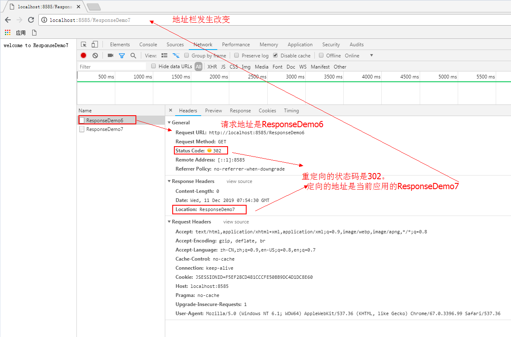

### 7.6 响应和消息头组合应用-文件下载

首先，在工程的web目录下新建一个目录uploads，并且拷贝一张图片到目录中，如下图所示：

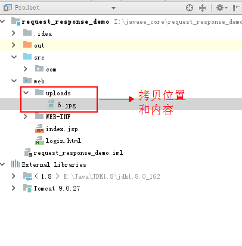

文件下载的Servlet代码如下：

```java
/**
 * 文件下载
 * @author 黑马程序员
 * @Company http://www.itheima.com
 *
 */
public class ResponseDemo8 extends HttpServlet {

    public void doGet(HttpServletRequest request, HttpServletResponse response)
            throws ServletException, IOException {
        /*
         * 文件下载的思路：
         * 		1.获取文件路径
         * 		2.把文件读到字节输入流中
         * 		3.告知浏览器，以下载的方式打开（告知浏览器下载文件的MIME类型）
         * 		4.使用响应对象的字节输出流输出到浏览器上
         */
        //1.获取文件路径（绝对路径）
        ServletContext context = this.getServletContext();
        String filePath = context.getRealPath("/uploads/6.jpg");//通过文件的虚拟路径，获取文件的绝对路径
        //2.通过文件路径构建一个字节输入流
        InputStream in  = new FileInputStream(filePath);
        //3.设置响应消息头
        response.setHeader("Content-Type", "application/octet-stream");//注意下载的时候，设置响应正文的MIME类型，用application/octet-stream
        response.setHeader("Content-Disposition", "attachment;filename=1.jpg");//告知浏览器以下载的方式打开
        //4.使用响应对象的字节输出流输出
        OutputStream out = response.getOutputStream();
        int len = 0;
        byte[] by = new byte[1024];
        while((len = in.read(by)) != -1){
            out.write(by, 0, len);
        }
        in.close();
    }

    public void doPost(HttpServletRequest request, HttpServletResponse response)
            throws ServletException, IOException {
        doGet(request, response);
    }

}
```


### 7.7 响应对象注意事项

+ 第一： response得到的字符流和字节流互斥，只能选其一

+ 第二：response获取的流不用关闭，由服务器关闭即可

```java
/**
 * 使用Response对象获取流时候的注意事项：
 * 	1.我们使用response获取的流，可以不用关闭。服务器会给我们关闭。
 * 	2.在response对象中，字节流和字符流互斥，输出的时候，只能选择一个
 * @author zhy
 *
 */
public class ResponseDemo9 extends HttpServlet {

    public void doGet(HttpServletRequest request, HttpServletResponse response)
            throws ServletException, IOException {
        String str = "test";
        response.getOutputStream().write(str.getBytes());
        //response.getWriter().write(str);
//		response.getOutputStream().write("haha".getBytes());

    }

    public void doPost(HttpServletRequest request, HttpServletResponse response)
            throws ServletException, IOException {
        doGet(request, response);
    }

}
```

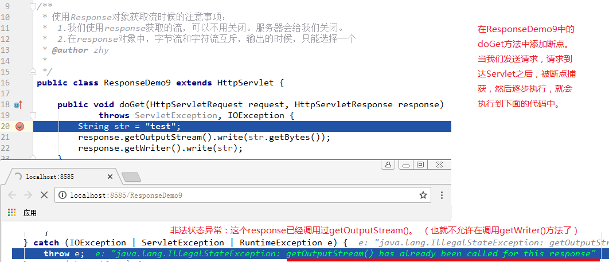


## 8 会话技术-Cookie&Session

### 8.1 会话管理概述

+ 什么是会话
  
  这里的会话，指的是web开发中的一次通话过程，当打开浏览器，访问网站地址后，会话开始，当关闭浏览器（或者到了过期时间），会话结束。
  > 例如，你在给家人打电话，这时突然有送快递的配送员敲门，你放下电话去开门，收完快递回来后，通话还在保持中，继续说话就行了。

+ 会话管理作用
  
  会话是为我们共享数据用的，并且是在不同请求间实现数据共享。也就是说，如果我们需要在多次请求间实现数据共享，就可以考虑使用会话管理技术了。
  > 什么时候会用到会话管理呢？最常见的就是购物车，当我们登录成功后，把商品加入到购物车之中，此时我们无论再浏览什么商品，当点击购物车时，那些加入的商品都仍在购物车中。

  > 在我们的实际开发中，还有很多地方都离不开会话管理技术。比如，我们在论坛发帖，没有登录的游客身份是不允许发帖的。所以当我们登录成功后，无论我们进入哪个版块发帖，只要权限允许的情况下，服务器都会认识我们，从而让我们发帖，因为登录成功的信息一直保留在服务器端的会话中。

+ 会话管理分类
  
  在JavaEE的项目中，会话管理分为两类。分别是：客户端会话管理技术和服务端会话管理技术。

    + **客户端会话管理技术**
    
        它是把要共享的数据保存到了客户端（也就是浏览器端）。每次请求时，把会话信息带到服务器，从而实现多次请求的数据共享。

    + **服务端会话管理技术**
        
        它本质仍是采用客户端会话管理技术，只不过保存到客户端的是一个特殊的标识，并且把要共享的数据保存到了服务端的内存对象中。每次请求时，把这个标识带到服务器端，然后使用这个标识，找到对应的内存空间，从而实现数据共享。

### 8.2 客户端会话管理技术

#### 8.2.1 Cookie概述

**什么是Cookie**

它是客户端浏览器的缓存文件，里面记录了客户浏览器访问网站的一些内容。同时，也是HTTP协议请求和响应消息头的一部分（在HTTP协议课程中，我们备注了它很重要）。

**作用**

它可以保存客户浏览器访问网站的相关内容（需要客户端不禁用Cookie）。从而在每次访问需要同一个内容时，先从本地缓存获取，使资源共享，提高效率。

**Cookie的属性**

| 属性名称 | 属性作用                 | 是否重要 |
| -------- | ------------------------ | -------- |
| name     | cookie的名称             | 必要属性 |
| value    | cookie的值（不能是中文） | 必要属性 |
| path     | cookie的路径             | 重要     |
| domain   | cookie的域名             | 重要     |
| maxAge   | cookie的生存时间。       | 重要     |
| version  | cookie的版本号。         | 不重要   |
| comment  | cookie的说明。           | 不重要   |

**细节**

Cookie有大小，个数限制。每个网站最多只能存20个cookie，且大小不能超过4kb。同时，所有网站的cookie总数不超过300个。

当删除Cookie时，设置maxAge值为0。当不设置maxAge时，使用的是浏览器的内存，当关闭浏览器之后，cookie将丢失。设置了此值，就会保存成缓存文件（值必须是大于0的,以秒为单位）。

#### 8.2.2 Cookie的常用方法

**创建Cookie**

```java
/**
 * 通过指定的名称和值构造一个Cookie
 *
 * Cookie的名称必须遵循RFC 2109规范。这就意味着，它只能包含ASCII字母数字字符，
 * 不能包含逗号、分号或空格或以$字符开头。
 * 创建后无法更改cookie的名称。
 *
 * 该值可以是服务器选择发送的任何内容。
 * 它的价值可能只有服务器才感兴趣。
 * 创建之后，可以使用setValue方法更改cookie的值。
 */
public Cookie(String name, String value) {
	validation.validate(name);
	this.name = name;
	this.value = value;
}
```

**向浏览器添加Cookie**

```java
/**
 * 添加Cookie到响应中。此方法可以多次调用，用以添加多个Cookie。
 */
public void addCookie(Cookie cookie);
```

**从服务器端获取Cookie**

```java
/**
 * 这是HttpServletRequest中的方法。
 * 它返回一个Cookie的数组，包含客户端随此请求发送的所有Cookie对象。
 * 如果没有符合规则的cookie，则此方法返回null。
 */
 public Cookie[] getCookies();
```

### 8.3 Cookie案例

#### 1）需求说明

创建一个Cookie，设置Cookie的path，通过不同的路径访问，从而查看请求携带Cookie的情况。

#### 2）案例目的

通过此案例的讲解，同学们可以清晰的描述出，客户浏览器何时带cookie到服务器端，何时不带。

#### 3）案例步骤

**第一步：创建JavaWeb工程**

沿用第一个案例中的工程即可。

**第二步：编写Servlet**

```JAVA
/**
 * Cookie的路径问题
 * 前期准备：
 * 	1.在demo1中写一个cookie到客户端
 *  2.在demo2和demo3中分别去获取cookie
 *  	demo1的Servlet映射是   /servlet/PathQuestionDemo1
 *  	demo2的Servlet映射是   /servlet/PathQuestionDemo2
 *  	demo3的Servlet映射是   /PathQuestionDemo3
 *
 * @author 黑马程序员
 * @Company http://www.itheima.com
 *
 */
public class PathQuestionDemo1 extends HttpServlet {

	public void doGet(HttpServletRequest request, HttpServletResponse response)
			throws ServletException, IOException {
		//1.创建一个Cookie
		Cookie cookie = new Cookie("pathquestion","CookiePathQuestion");
		//2.设置cookie的最大存活时间
		cookie.setMaxAge(Integer.MAX_VALUE);
		//3.把cookie发送到客户端
		response.addCookie(cookie);//setHeader("Set-Cookie","cookie的值")
	}

	public void doPost(HttpServletRequest request, HttpServletResponse response)
			throws ServletException, IOException {
		doGet(request, response);
	}
}

```

```java
/**
 * 获取Cookie，名称是pathquestion
 * @author 黑马程序员
 * @Company http://www.itheima.com
 */
public class PathQuestionDemo2 extends HttpServlet {

	public void doGet(HttpServletRequest request, HttpServletResponse response)
			throws ServletException, IOException {
		//1.获取所有的cookie
		Cookie[] cs = request.getCookies();
		//2.遍历cookie的数组
		for(int i=0;cs!=null && i<cs.length;i++){
			if("pathquestion".equals(cs[i].getName())){
				//找到了我们想要的cookie，输出cookie的值
				response.getWriter().write(cs[i].getValue());
				return;
			}
		}
	}

	public void doPost(HttpServletRequest request, HttpServletResponse response)
			throws ServletException, IOException {
		doGet(request, response);
	}
}
```

```java
/**
 * 获取Cookie，名称是pathquestion
 * @author 黑马程序员
 * @Company http://www.itheima.com
 */
public class PathQuestionDemo3 extends HttpServlet {

	public void doGet(HttpServletRequest request, HttpServletResponse response)
			throws ServletException, IOException {
		//1.获取所有的cookie
		Cookie[] cs = request.getCookies();
		//2.遍历cookie的数组
		for(int i=0;cs!=null && i<cs.length;i++){
			if("pathquestion".equals(cs[i].getName())){
				//找到了我们想要的cookie，输出cookie的值
				response.getWriter().write(cs[i].getValue());
				return;
			}
		}
	}

	public void doPost(HttpServletRequest request, HttpServletResponse response)
			throws ServletException, IOException {
		doGet(request, response);
	}
}
```

**第三步：配置Servlet**

```xml
<!--配置Cookie路径问题案例的Servlet-->
<servlet>
    <servlet-name>PathQuestionDemo1</servlet-name>
    <servlet-class>com.itheima.web.servlet.pathquestion.PathQuestionDemo1</servlet-class>
</servlet>
<servlet-mapping>
    <servlet-name>PathQuestionDemo1</servlet-name>
    <url-pattern>/servlet/PathQuestionDemo1</url-pattern>
</servlet-mapping>

<servlet>
    <servlet-name>PathQuestionDemo2</servlet-name>
    <servlet-class>com.itheima.web.servlet.pathquestion.PathQuestionDemo2</servlet-class>
</servlet>
<servlet-mapping>
    <servlet-name>PathQuestionDemo2</servlet-name>
    <url-pattern>/servlet/PathQuestionDemo2</url-pattern>
</servlet-mapping>

<servlet>
    <servlet-name>PathQuestionDemo3</servlet-name>
    <servlet-class>com.itheima.web.servlet.pathquestion.PathQuestionDemo3</servlet-class>
</servlet>
<servlet-mapping>
    <servlet-name>PathQuestionDemo3</servlet-name>
    <url-pattern>/PathQuestionDemo3</url-pattern>
</servlet-mapping>
```

**第四步：部署工程**

沿用第一个案例中的工程部署即可。

#### 4）测试结果

通过分别运行PathQuestionDemo1，2和3这3个Servlet，我们发现由demo1写Cookie，在demo2中可以取到，但是到了demo3中就无法获取了，如下图所示：


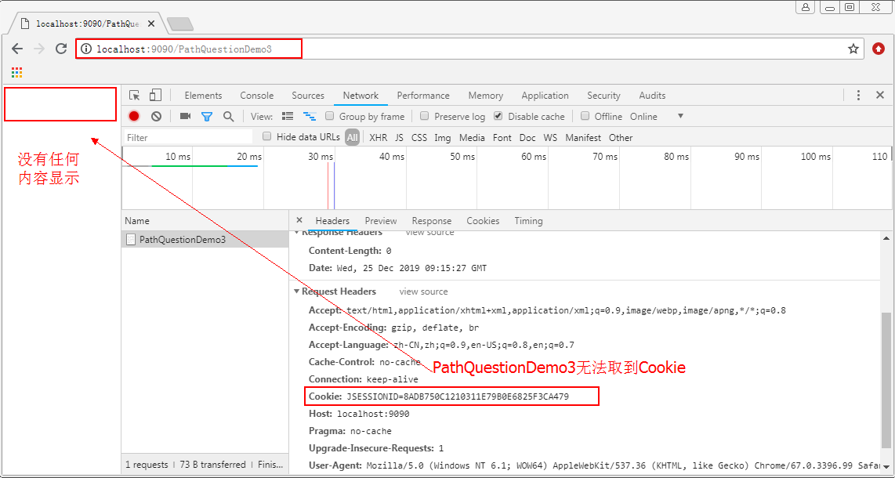


#### 5）路径问题的分析及总结

**问题：** demo2和demo3谁能取到cookie？

**答案：** demo2能取到，demo3取不到

**分析：**
+ 首先，我们要知道如何确定一个cookie？
  
  那就是使用cookie的三个属性组合：`domain+path+name`
  + 这里面，同一个应用的domain是一样的，在我们的案例中都是localhost。
  + 并且，我们取的都是同一个cookie，所以name也是一样的，都是pathquestion。
  + 那么，不一样的只能是path了。但是我们没有设置过cookie的path属性，这就表明path是有默认值的。
+ 接下来，我们打开这个cookie来看一看。
  
  在ie浏览器访问一次PathQuestionDemo1这个Servlet，Cookie中的内容：
  
  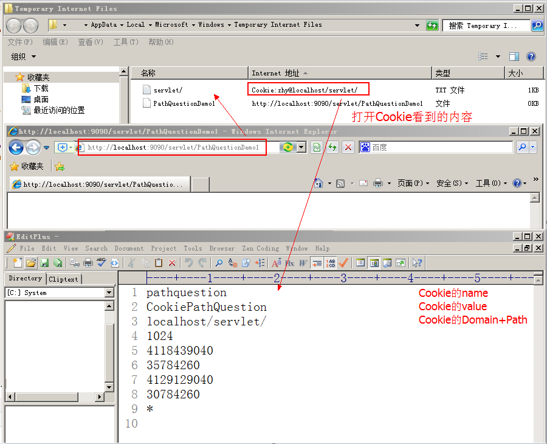
  
  我们是通过demo1写的cookie，demo1的访问路径是： http://localhost:9090/servlet/PathQuestionDemo1
+ 通过比较两个路径：请求资源地址和cookie的path，可以看出：
  
  cookie的path默认值是：请求资源URI且不包含资源的部分（在我们的案例中，就是没有PathQuestionDemo1）。

**客户端什么时候带cookie到服务器，什么时候不带？**

就是看请求资源URI和cookie的path比较：`请求资源URI.startWith(cookie的path)` 如果返回的是true就带，如果返回的是false就不带。

简单的说就是看谁的地址更精细，比如Cookie的path：`/国家/省份/城市`

+ 请求资源URI：`/国家/省份`，不带
+ 请求资源URI：`/国家/省份/城市/区县`，带

在我们的案例中：
| 访问URL                                                      | URI部分                    | Cookie的Path | 是否携带Cookie | 能否取到Cookie |
| ------------------------------------------------------------ | -------------------------- | ------------ | -------------- | -------------- |
| PathQuestionDemo2 | /servlet/PathQuestionDemo2 | /servlet/    | 带             | 能取到         |
| PathQuestionDemo3 | /PathQuestionDemo3         | /servlet/    | 不带           | 不能取到       |

### 8.4 服务端会话管理技术

#### 8.4.1 HttpSession概述

**HttpSession对象介绍**

它是Servlet规范中提供的一个接口。该接口的实现由Servlet规范的实现提供商提供。我们使用的是Tomcat服务器，它对Servlet规范进行了实现，所以HttpSession接口的实现由Tomcat提供。该对象用于提供一种通过多个页面请求或访问网站来标识用户并存储有关该用户的信息的方法。简单说它就是一个服务端会话对象，用于存储用户的会话数据。

同时，它也是Servlet规范中四大域对象之一的会话域对象。并且它也是用于实现数据共享的。但它与我们之前讲解的应用域和请求域是有区别的。

| 域对象         | 作用范围     | 使用场景                                                     |
| -------------- | ------------ | ------------------------------------------------------------ |
| ServletContext | 整个应用范围 | 当前项目中需要数据共享时，可以使用此域对象。                 |
| ServletRequest | 当前请求范围 | 在请求或者当前请求转发时需要数据共享可以使用此域对象。       |
| HttpSession    | 会话返回     | 在当前会话范围中实现数据共享。它可以在多次请求中实现数据共享。 |

**HttpSession的获取**

获取`HttpSession`是通过`HttpServletRequest`接口中的两个方法获取的，如下图所示：

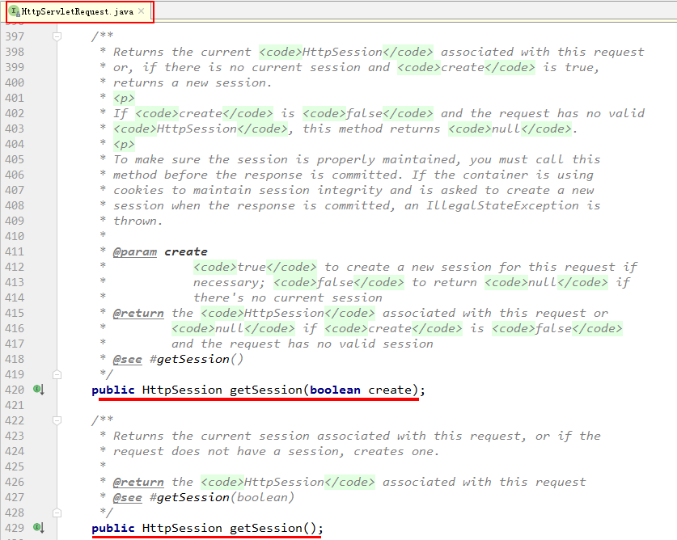

这两个方法的区别：


**HttpSession的常用方法**

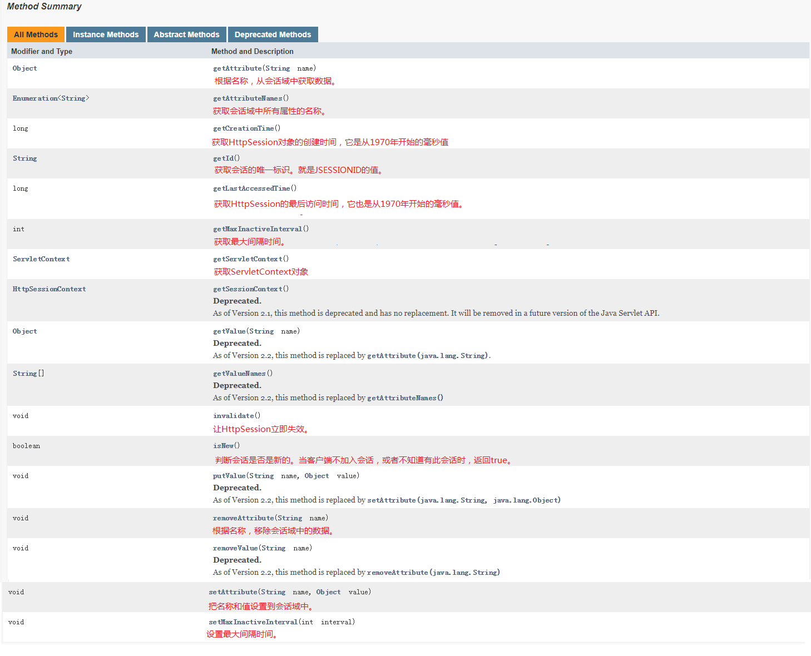

#### 8.4.2 HttpSession的钝化和活化

**什么是持久态**

把长时间不用，但还不到过期时间的HttpSession进行序列化，写到磁盘上。

我们把HttpSession持久态也叫做钝化。（与钝化相反的，我们叫活化。）

**什么时候使用持久化**

第一种情况：当访问量很大时，服务器会根据getLastAccessTime来进行排序，对长时间不用，但是还没到过期时间的HttpSession进行持久化。

第二种情况：当服务器进行重启的时候，为了保持客户HttpSession中的数据，也要对HttpSession进行持久化

**注意**

HttpSession的持久化由服务器来负责管理，我们不用关心。

只有实现了序列化接口的类才能被序列化，否则不行。

### 8.5 HttpSession案例

#### 1）需求说明

在请求HttpSessionDemo1这个Servlet时，携带用户名信息，并且把信息保存到会话域中，然后从HttpSessionDemo2这个Servlet中获取登录信息。

#### 2）案例目的

通过本案例的讲解，同学们可以清楚的认识到会话域的作用，即多次请求间的数据共享。因为是两次请求，请求域肯定不一样了，所以不能用请求域实现。

最终掌握HttpSession对象的获取和使用。

#### 3）原理分析

HttpSession，它虽然是服务端会话管理技术的对象，但它本质仍是一个Cookie。是一个由服务器自动创建的特殊的Cookie，Cookie的名称就是JSESSIONID，Cookie的值是服务器分配的一个唯一的标识。

当我们使用HttpSession时，浏览器在没有禁用Cookie的情况下，都会把这个Cookie带到服务器端，然后根据唯一标识去查找对应的HttpSession对象，找到了，我们就可以直接使用了。下图就是我们入门案例中，HttpSession分配的唯一标识，同学们可以看到两次请求的JSESSIONID的值是一样的：


## 9 页面技术-JSP

### 9.1 JSP基础

#### 9.1.1 JSP简介

JSP全称是Java Server Page，它和Servlet一样，也是sun公司推出的一套开发动态web资源的技术，称为JSP/Servlet规范。JSP的本质其实就是一个Servlet。

JSP和HTML以及Servlet的适用场景:

| 类别    | 适用场景                                                     |
| ------- | ------------------------------------------------------------ |
| HTML    | 只能开发静态资源，不能包含java代码，无法添加动态数据。       |
| Servlet | 写java代码，可以输出页面内容，但是很不方便，开发效率极低。   |
| JSP     | 它包括了HTML的展示技术，同时具备Servlet输出动态资源的能力。但是不适合作为控制器来用。 |

#### 9.1.2 JSP说明

写在之前： 明确JSP就是一个Servlet。是一个特殊的Servlet。

**执行过程分析**

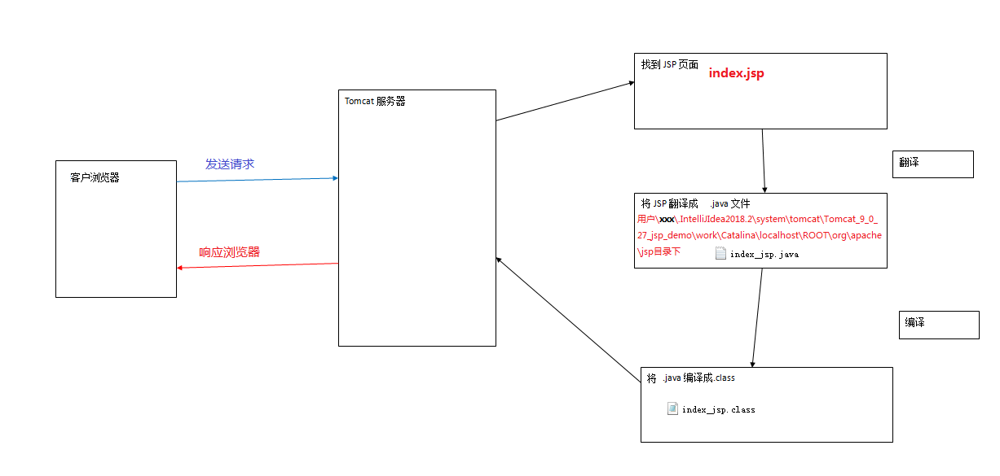

**JSP的.java文件内容分析**

当我们打开index.jsp翻译的java文件，然后我们在Tomcat的源码中找到`HttpJspBase`类的声明，如下图：


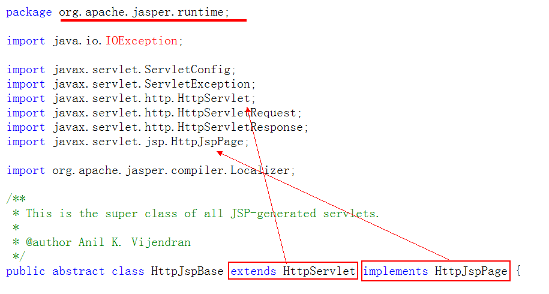

这张图一出场，就表明我们写的JSP它本质就是一个HttpServlet了。


同时，我们在index_jsp.java文件中找到了输出页面的代码，并且在浏览器端查看源文件，看到的内容是一样的。这也就是说明，我们的浏览器上的内容，在通过jsp展示时，本质都是用`out.write()`输出出来的。

讲到这里，我们应该清楚的认识到，JSP它是一个特殊的Servlet，主要是用于展示动态数据。它展示的方式是用流把数据输出出来，而我们在使用JSP时，涉及HTML的部分，都与HTML的用法一致，这部分称为jsp中的模板元素，在开发过程中，先写好这些模板元素，因为它们决定了页面的外观。


### 9.2 JSP语法

#### 1）Java代码块

在jsp中，可以使用java脚本代码。形式为：`<% java代码 %>`

> 但是，在实际开发中，极少使用此种形式编写java代码。
> 
> 同时需要注意的是：这里面的内容由tomcat负责翻译，翻译之后是service方法的成员变量。

**示例：**

```jsp
<!--Java代码块-->
<% out.println("这是Java代码块");%>
<hr/>
```

#### 2）JSP表达式

在jsp中，可以使用特定表达式语法，形式为：`<%=表达式%>`

> 在实际开发中，这种表达式语法用的也很少使用。
> 
> jsp在翻译完后是out.print(表达式内容)
> 
> 所以：<%out.print("当前时间);%>和<%="当前时间"%>是一样的。

**示例：**

```jsp
<!--JSP表达式-->
<%="这是JSP表达式"%><br/>
就相当于<br/>
<%out.println("这是没有JSP表达式输出的");%>
```

#### 3）JSP声明

在JSP中也可以声明一些变量，方法，静态方法，形式为：`<%! 声明的内容 %>`

> 需要注意的是： 写在里面的内容将会被tomcat翻译成全局的属性或者类方法。

**示例：**

```jsp
<!--JSP声明-->
<%! String str = "声明语法格式";%>
<%=str%>
```

#### 4）JSP注释

在使用JSP时，它有自己的注释，形式为：`<%--注释--%>`

> 在Jsp中可以使用html的注释，但是只能注释html元素，不能注释java程序片段和表达式。
> 
> 同时，被html注释部分会参与翻译，并且会在浏览器上显示。
> 
> jsp的注释不仅可以注释java程序片段，也可以注释html元素，并且被jsp注释的部分不会参与翻译成.java文件，也不会在浏览器上显示。

**示例：**

```jsp
<%--JSP注释--%>
<!--HTML注释-->
```


### 9.3 JSP指令

#### 1）page指令

+ **language:** 告知引擎，脚本使用的是java，默认是java，不写也行。

+ **extends:** 告知引擎，JSP对应的Servlet的父类是哪个，不需要写，也不需要改。

+ **import:** 告知引擎，导入哪些包（类）。
  > 注意：引擎会自动导入：java.lang.\*, javax.servlet.\*, javax.servlet.http.\*, javax.servlet.jsp.\***
  
  导入的形式： `<%@page import="java.util.Date,java.util.UUID"%>`

  或者：`<%@page import="java.util.Date"%> <%@page import="java.util.UUID"%>`  

+ **session**：告知引擎是否产生HttpSession对象，即是否在代码中调用request.getSession()。默认是true。

+ **buffer**：JspWriter用于输出JSP内容到页面上。告知引擎，设定他的缓存大小。默认8kb。

+ **errorPage**：告知引擎，当前页面出现异常后，应该转发到哪个页面上（路径写法：`/`代表当前应用）
  
  > 小贴士：当在errorpage上使用了isErrorPage=true之后，ie8有时候不能正常显示
  
  配置全局错误页面：`web.xml`
    ```xml
    <error-page>    
        <exception-type>java.lang.Exception</exception-type>    			
        <location>/error.jsp</location>
    </error-page>
    <error-page>
        <error-code>404</error-code>
        <location>/404.html</location>
    </error-page>                                 
    ```
    当使用了全局错误页面，就无须再写errorPage来实现转到错误页面，而是由服务器负责跳转到错误页面。

+ **isErrorPage**：告知引擎，是否抓住异常。如果该属性为true，页面中就可以使用exception对象，打印异常的详细信息。默认值是false。

+ **contentType**：告知引擎，响应正文的MIME类型。
  
  `contentType="text/html;charset=UTF-8"` 相当于 `response.setContentType("text/html;charset=UTF-8");`

+ **pageEncoding**：告知引擎，翻译jsp时（从磁盘上读取jsp文件）所用的码表。
  
  `pageEncoding="UTF-8"`相当于告知引擎用UTF-8读取JSP

+ **isELIgnored**：告知引擎，是否忽略EL表达式，默认值是false，不忽略。

#### 2）include指令

语法格式：`<%@include file="" %>`该指令是包含外部页面。 

属性：file，以`/`开头，就代表当前应用。

**使用示例**

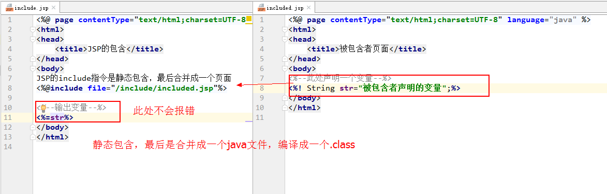

**静态包含的特点**

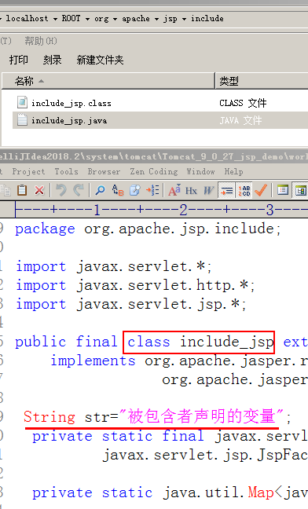

#### 3）taglib指令

语法格式：`<%taglib uri="" prefix=""%>`

作用：该指令用于引入外部标签库。html标签和jsp标签不用引入。

属性：
+ uri：外部标签的URI地址。
+ prefix：使用标签时的前缀。

### 9.4 JSP细节

#### 1）九大隐式对象

什么是隐式对象呢？它指的是在jsp中，可以不声明就直接使用的对象。它只存在于jsp中，因为java类中的变量必须要先声明再使用。其实jsp中的隐式对象也并非是未声明，只是它是在翻译成.java文件时声明的。所以我们在jsp中可以直接使用。

| 隐式对象名称 | 类型                                   | 备注                          |
| ------------ | -------------------------------------- | ----------------------------- |
| request      | javax.servlet.http.HttpServletRequest  |                               |
| response     | javax.servlet.http.HttpServletResponse |                               |
| session      | javax.servlet.http.HttpSession         | Page指令可以控制开关          |
| application  | javax.servlet.ServletContext           |                               |
| page         | Java.lang.Object                       | 当前jsp对应的servlet引用实例  |
| config       | javax.servlet.ServletConfig            |                               |
| exception    | java.lang.Throwable                    | page指令有开关                |
| out          | javax.servlet.jsp.JspWriter            | 字符输出流，相当于printwriter |
| pageContext  | javax.servlet.jsp.PageContext          | 很重要                        |

#### 2）PageContext对象

**简介**

它是JSP独有的对象，Servlet中没有这个对象。本身也是一个域（作用范围）对象，但是它可以操作其他3个域对象中的属性。而且还可以获取其他8个隐式对象。

**生命周期**

它是一个局部变量，所以它的生命周期随着JSP的创建而诞生，随着JSP的结束而消失。每个JSP页面都有一个独立的PageContext。

**常用方法**


在上图中，同学们发现没有页面域操作的方法，其实是定义在了PageContext的父类JspContext中，如下图所示：


#### 3）四大域对象

| 域对象名称     | 范围     | 级别                     | 备注                                     |
| -------------- | -------- | ------------------------ | ---------------------------------------- |
| PageContext    | 页面范围 | 最小，只能在当前页面用   | 因范围太小，开发中用的很少               |
| ServletRequest | 请求范围 | 一次请求或当期请求转发用 | 当请求转发之后，再次转发时请求域丢失     |
| HttpSession    | 会话范围 | 多次请求数据共享时使用   | 多次请求共享数据，但不同的客户端不能共享 |
| ServletContext | 应用范围 | 最大，整个应用都可以使用 | 尽量少用，如果对数据有修改需要做同步处理 |

#### 4) JSP最佳实战-MVC模型

**Servlet：** 擅长处理业务逻辑，不擅长输出显示界面。在web开发中多用于控制程序逻辑（流程）。所以我们称之为：控制器。

**JSP：** 擅长显示界面，不擅长处理程序逻辑。在web开发中多用于展示动态界面。所以我们称之为：视图。

例如:                                                                       

+ M：model，通常用于封装数据，封装的是数据模型。
+ V：view，通常用于展示数据。动态展示用jsp页面，静态数据展示用html。
+ C：controller，通常用于处理请求和响应。一般指的是Servlet。


### 9.5 EL表达式

**基本概念**

EL表达式，全称是Expression Language。意为表达式语言。它是Servlet规范中的一部分，是JSP2.0规范加入的内容。其作用是用于在JSP页面中获取数据，从而让我们的JSP脱离java代码块和JSP表达式。

**基本语法**

EL表达式的语法格式非常简单，写为：`${表达式内容}`

例如：假定，我们在请求域中存入了一个名称为message的数据（`request.setAttribute("message","EL");`），此时在jsp中获取的方式，如下表显示：

| Java代码块                                                   | JSP表达式                              | EL表达式                              |
| :----------------------------------------------------------- | :------------------------------------- | :------------------------------------ |
| `<%<br/> <br/> String message = (String)request.getAttribute("message");<br/> out.write(message);<br/>%>` | `<%=request.getAttribute("message")%>` | <font color='red'>`${message}`</font> |

通过上面我们可以看出，都可以从请求域中获取数据，但是EL表达式写起来是最简单的方式。这也是以后我们在实际开发中，当使用JSP作为视图时，绝大多数都会采用的方式。

### 9.6 EL表达式用法

#### 1）获取四大域中的数据

它只能从四大域中获取数据，调用的就是`findAttribute(name,value);`方法，根据名称由小到大逐个域中查找，找到就返回，找不到就什么都不显示。

它可以获取对象，可以是对象中关联其他对象，可以是一个List集合，也可以是一个Map集合。具体代码如下（Java类User和Address已事先定义）：

```jsp
<%@ page language="java" import="java.util.*" pageEncoding="UTF-8"%>
<%@ page import="com.itheima.domain.User" %>
<!DOCTYPE HTML PUBLIC "-//W3C//DTD HTML 4.01 Transitional//EN">
<html>
	<head>
		<title>EL入门</title>
	</head>
	<body>
		 <br/>-----------获取对象数据---------------------<br/>
		 <% //1.把用户信息存入域中
		 	User user = new User();
		 	pageContext.setAttribute("u",user);
		  %>
		  ${u}===============输出的是内存地址<%--就相当于调用此行代码<%=pageContext.findAttribute("u")%> --%><br/>
		  ${u.name}<%--就相当于调用此行代码<% User user = (User) pageContext.findAttribute("u");out.print(user.getName());%> --%><br/>
		  ${u.age}
		 <br/>-----------获取关联对象数据------------------<br/>
		 ${u.address}==========输出的address对象的地址<br/>
		 ${u.address.province}${u.address.city}<br/>
		 ${u["address"]['province']}
		 <br/>-----------获取数组数据---------------------<br/>
		 <% String[] strs = new String[]{"He","llo","Expression","Language"}; 
		 	pageContext.setAttribute("strs", strs);
		 %>
		 ${strs[0]}==========取的数组中下标为0的元素<br/>
		 ${strs[3]}
		 ${strs[5]}===========如果超过了数组的下标，则什么都不显示<br/>
		 ${strs["2"]}=========会自动为我们转换成下标<br/>
		 ${strs['1']}
		 <br/>-----------获取List集合数据-----------------<br/>
		 <% List<String> list = new ArrayList<String>();
		 	list.add("AAA");
		 	list.add("BBB");
		 	list.add("CCC");
		 	list.add("DDD");
		 	pageContext.setAttribute("list", list);
		  %>
		 ${list}<br/>
		 ${list[0] }<br/>
		 ${list[3] }<br/>	 
		 <br/>-----------获取Map集合数据------------------<br/>
		 <% Map<String,User> map = new HashMap<String,User>();
		 	map.put("aaa",new User());
		 	pageContext.setAttribute("map", map);
		  %>
		  ${map}<br/>
		  ${map.aaa}<%--获取map的value，是通过get(Key) --%><br/>
		  ${map.aaa.name}${map.aaa.age}<br/>
		  ${map["aaa"].name }
	</body>
</html>
```

运行结果如图：

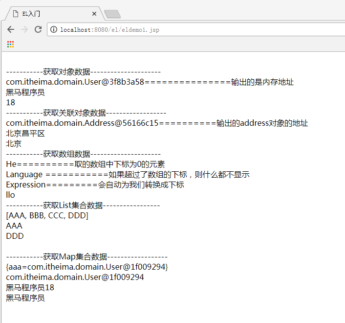

#### 2）EL表达式的注意事项

在使用EL表达式时，它帮我们做了一些处理，使我们在使用时可以避免一些错误。它没有空指针异常，没有数组下标越界，没有字符串拼接。

```jsp
<%@ page contentType="text/html;charset=UTF-8" language="java" %>
<html>
  <head>
    <title>EL表达式的注意事项</title>
  </head>
  <body>
    <%--EL表达式的三个没有--%>
    第一个：没有空指针异常<br/>
    <% String str = null;
       request.setAttribute("testNull",str);
    %>
    ${testNull}
    <hr/>
    第二个：没有数组下标越界<br/>
    <% String[] strs = new String[]{"a","b","c"};
       request.setAttribute("strs",strs);
    %>
    取第一个元素：${strs[0]}
    取第六个元素：${strs[5]}
    <hr/>
    第三个：没有字符串拼接<br/>
    <%--${strs[0]+strs[1]}--%>
    ${strs[0]}+${strs[1]}
  </body>
</html>
```

运行结果图：

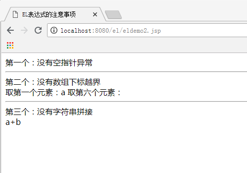


#### 3）EL表达式的运算符

EL表达式中运算符如下图所示，它们都是一目了然的：


但是有两个特殊的运算符`empty` 和 `?`，使用方式的代码如下：

```jsp
<%@ page language="java" import="java.util.*" pageEncoding="UTF-8"%>
<%@ page import="com.itheima.domain.User" %>
<!DOCTYPE HTML PUBLIC "-//W3C//DTD HTML 4.01 Transitional//EN">
<html>
	<head>
		<title>EL两个特殊的运算符</title>
	</head>
	<body>
		<%--empty运算符：
			它会判断：对象是否为null，字符串是否为空字符串，集合中元素是否是0个
		--%>
		<% String str = null;
		  String str1 = "";
		  List<String> slist = new ArrayList<String>();
		  pageContext.setAttribute("str", str);
		  pageContext.setAttribute("str1", str1);
		  pageContext.setAttribute("slist", slist);
		%>
		${empty str}============当对象为null返回true<br/>
		${empty str1 }==========当字符串为空字符串是返回true(注意：它不会调用trim()方法)<br>
		${empty slist}==========当集合中的元素是0个时，是true
		<hr/>
		<%--三元运算符 
			 条件?真:假
		--%>
		<% request.setAttribute("gender", "female"); %>
		<input type="radio" name="gender" value="male" ${gender eq "male"?"checked":""} >男
		<input type="radio" name="gender" value="female" ${gender eq "female"?"checked":""}>女
	</body>
</html>
```

运行结果图：

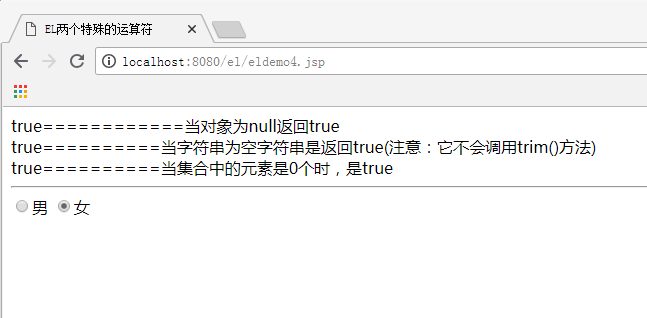

#### 4) EL表达式的11个隐式对象

EL表达式除了能在四大域中获取数据，同时它可以访问其他JSP隐式对象，并且访问对象有返回值的方法。

EL表达式也为我们提供隐式对象，可以让我们不声明直接来使用，十一个对象见下表，需要注意的是，它和JSP的隐式对象不是一回事：

| EL中的隐式对象   | 类型                          | 对应JSP隐式对象 | 备注                                    |
| ---------------- | ----------------------------- | --------------- | --------------------------------------- |
| PageContext      | Javax.serlvet.jsp.PageContext | PageContext     | 完全一样                                |
| ApplicationScope | Java.util.Map                 | 没有            | 应用层范围                              |
| SessionScope     | Java.util.Map                 | 没有            | 会话范围                                |
| RequestScope     | Java.util.Map                 | 没有            | 请求范围                                |
| PageScope        | Java.util.Map                 | 没有            | 页面层范围                              |
| Header           | Java.util.Map                 | 没有            | 请求消息头key，值是value（一个）        |
| HeaderValues     | Java.util.Map                 | 没有            | 请求消息头key，值是数组（一个头多个值） |
| Param            | Java.util.Map                 | 没有            | 请求参数key，值是value（一个）          |
| ParamValues      | Java.util.Map                 | 没有            | 请求参数key，值是数组（一个名称多个值） |
| InitParam        | Java.util.Map                 | 没有            | 全局参数，key是参数名称，value是参数值  |
| Cookie           | Java.util.Map                 | 没有            | Key是cookie的名称，value是cookie对象    |

### 9.7 JSTL

#### 1）简介

JSTL的全称是：JSP Standard Tag Libary。它是JSP中标准的标签库。它是由Apache实现的。

它由以下5个部分组成：

| 组成      | 作用         | 说明                           |
| --------- | ------------ | ------------------------------ |
| Core      | 核心标签库。 | 通用逻辑处理                   |
| Fmt       | 国际化有关。 | 需要不同地域显示不同语言时使用 |
| Functions | EL函数       | EL表达式可以使用的方法         |
| SQL       | 操作数据库。 | 不用                           |
| XML       | 操作XML。    | 不用                           |


要想使用JSTL标签库，在javaweb工程中需要导入jstl的jar包。


#### 2）核心标签库

在我们实际开发中，用到的jstl标签库主要以核心标签库为准，偶尔会用到国际化标签库的标签。下表中把我们经常可能用到的标签列在此处。

| 标签名称                             | 功能分类 | 分类       | 作用             |
| ------------------------------------ | -------- | ---------- | ---------------- |
| `<c:if>`                             | 流程控制 | 核心标签库 | 用于判断         |
| `<c:choose> ,<c:when>,<c:otherwise>` | 流程控制 | 核心标签库 | 用于多个条件判断 |
| `<c:foreache>`                       | 迭代操作 | 核心标签库 | 用于循环遍历     |

#### 3）JSTL使用

```jsp
<%@ page language="java" import="java.util.*" pageEncoding="UTF-8"%>
<%--导入jstl标签库 --%>
<%@ taglib uri="http://java.sun.com/jsp/jstl/core" prefix="c" %>
<!DOCTYPE HTML PUBLIC "-//W3C//DTD HTML 4.01 Transitional//EN">
<html>
  <head>
    <title>JSTL的常用标签</title>
  </head>
  <body>
    <%-- c:if  c:choose   c:when c:otherwise --%>
    <% pageContext.setAttribute("score","F"); %>
    <c:if test="${pageScope.score eq 'A' }">
    	优秀
    </c:if>
    <c:if	test="${pageScope.score eq 'C' }">
    	一般
    </c:if>
    <hr/>
    <c:choose>
    	<c:when test="${pageScope.score eq 'A' }">
    		AAA
    	</c:when>
    	<c:when test="${pageScope.score eq 'B' }">BBB
    	</c:when>
    	<c:when test="${pageScope.score eq 'C' }">CCC
    	</c:when>
    	<c:when test="${pageScope.score eq 'D' }">DDD
    	</c:when>
    	<c:otherwise>其他</c:otherwise>
    </c:choose>
    
    <%-- c:forEach 它是用来遍历集合的
    	 属性：
    	 	items：要遍历的集合，它可以是EL表达式取出来的
    	 	var：把当前遍历的元素放入指定的page域中。 var的取值就是key,当前遍历的元素就是value
    	 		注意：它不能支持EL表达式，只能是字符串常量
    	 	begin:开始遍历的索引
    	 	end:结束遍历的索引
    	 	step：步长。i+=step
    	 	varStatus：它是一个计数器对象。里面有两个属性，一个是用于记录索引。一个是用于计数。
    	 			   索引是从0开始。计数是从1开始
    --%>
    <hr/>
    <% List<String> list = new ArrayList<String>();
       list.add("AAA");
       list.add("BBB");
       list.add("CCC");
       list.add("DDD");
       list.add("EEE");
       list.add("FFF");
       list.add("GGG");
       list.add("HHH");
       list.add("III");
       list.add("JJJ");
       list.add("KKK");
       list.add("LLL");
       pageContext.setAttribute("list",list);
     %>
	<c:forEach items="${list}" var="s" begin="1" end="7" step="2">
    	${s}<br/>
    </c:forEach>
    <hr/>
    <c:forEach begin="1" end="9" var="num">
    	<a href="#">${num}</a>
    </c:forEach>
    <hr/>
    <table>
    	<tr>
    		<td>索引</td>
    		<td>序号</td>
    		<td>信息</td>
    	</tr>
    <c:forEach items="${list}" var="s" varStatus="vs">
    	<tr>
    		<td>${vs.index}</td>
    		<td>${vs.count}</td>
    		<td>${s}</td>
    	</tr>
    </c:forEach>
    </table>
  </body>
</html>
```


## 10 Servlet规范中的监听器-Listener

### 10.1 观察者设计模式

在介绍监听器之前，先跟同学们普及一个知识，观察者设计模式。因为所有的监听器都是观察者设计模式的体现。

观察者设计模式是事件驱动的一种体现形式。就好比在做什么事情的时候被人盯着。当对应做到某件事时，触发事件。

观察者模式通常由以下三部分组成：
+ 事件源：触发事件的对象。
+ 事件：触发的动作，里面封装了事件源。
+ 监听器：当事件源触发事件时，要做的事情。一般是一个接口，由使用者来实现。（此处的思想还涉及了策略模式）


### 10.2 监听对象创建的3个Listener

#### 1）ServletContextListener

```java
/**
 * 用于监听ServletContext对象创建和销毁的监听器
 * @since v 2.3
 */

public interface ServletContextListener extends EventListener {

    /**
     *	对象创建时执行此方法。该方法的参数是ServletContextEvent事件对象，事件是【创建对象】这个动作
     *  事件对象中封装着触发事件的来源，即事件源，就是ServletContext
     */
    public default void contextInitialized(ServletContextEvent sce) {
    }

    /**
     * 对象销毁执行此方法
     */
    public default void contextDestroyed(ServletContextEvent sce) {
    }
}
```

#### 2）HttpSessionListener

```java
/**
 * 用于监听HttpSession对象创建和销毁的监听器
 * @since v 2.3
 */
public interface HttpSessionListener extends EventListener {

    /**
     * 对象创建时执行此方法。
     */
    public default void sessionCreated(HttpSessionEvent se) {
    }

    /**
     *  对象销毁执行此方法
     */
    public default void sessionDestroyed(HttpSessionEvent se) {
    }
}
```

#### 3）ServletRequestListener

```java
/**
 * 用于监听ServletRequest对象创建和销毁的监听器
 * @since Servlet 2.4
 */
public interface ServletRequestListener extends EventListener {

   	/**
     *  对象创建时执行此方法。
     */
    public default void requestInitialized (ServletRequestEvent sre) {
    }
    
    /**
     * 对象销毁执行此方法
     */
    public default void requestDestroyed (ServletRequestEvent sre) {
    } 
}
```

### 10.3 监听域中属性发生变化的3个Listener

#### 1）ServletContextAttributeListener

```java
/**
 * 用于监听ServletContext域（应用域）中属性发生变化的监听器
 * @since v 2.3
 */

public interface ServletContextAttributeListener extends EventListener {
    /**
     * 域中添加了属性触发此方法。参数是ServletContextAttributeEvent事件对象，事件是【添加属性】。
     * 事件对象中封装着事件源，即ServletContext。
     * 当ServletContext执行setAttribute方法时，此方法可以知道，并执行。
     */
    public default void attributeAdded(ServletContextAttributeEvent scae) {
    }

    /**
     * 域中删除了属性触发此方法
     */
    public default void attributeRemoved(ServletContextAttributeEvent scae) {
    }

    /**
     * 域中属性发生改变触发此方法
     */
    public default void attributeReplaced(ServletContextAttributeEvent scae) {
    }
}
```

#### 2）HttpSessionAttributeListener

```java
/**
 * 用于监听HttpSession域（会话域）中属性发生变化的监听器
 * @since v 2.3
 */
public interface HttpSessionAttributeListener extends EventListener {

    /**
     * 域中添加了属性触发此方法。
     */
    public default void attributeAdded(HttpSessionBindingEvent se) {
    }

    /**
     * 域中删除了属性触发此方法
     */
    public default void attributeRemoved(HttpSessionBindingEvent se) {
    }

    /**
     * 域中属性发生改变触发此方法
     */
    public default void attributeReplaced(HttpSessionBindingEvent se) {
    }
}
```

#### 3）ServletRequestAttributeListener

```java
/**
 * 用于监听ServletRequest域（请求域）中属性发生变化的监听器
 * @since Servlet 2.4
 */
public interface ServletRequestAttributeListener extends EventListener {
    /**
     * 域中添加了属性触发此方法。
     */
    public default void attributeAdded(ServletRequestAttributeEvent srae) {
    }

    /**
     * 域中删除了属性触发此方法
     */
    public default void attributeRemoved(ServletRequestAttributeEvent srae) {
    }

    /**
     * 域中属性发生改变触发此方法
     */
    public default void attributeReplaced(ServletRequestAttributeEvent srae) {
    }
}
```

### 10.4 和会话相关的2个感知型Listener

> 和会话域相关的两个感知型监听器是无需配置的，直接编写代码即可。

#### 1）HttpSessionBinderListener

```java
/**
 * 用于感知对象和和会话域绑定的监听器
 * 当有数据加入会话域或从会话域中移除，此监听器的两个方法会执行。
 * 加入会话域即和会话域绑定
 * 从会话域移除即从会话域解绑
 */
public interface HttpSessionBindingListener extends EventListener {

    /**
     * 当数据加入会话域时，也就是绑定，此方法执行
     */
    public default void valueBound(HttpSessionBindingEvent event) {
    }

    /**
     * 当从会话域移除时，也就是解绑，此方法执行
     */
    public default void valueUnbound(HttpSessionBindingEvent event) {
    }
}

```

#### 2）HttpSessionActivationListener

```java
/**
 * 用于感知会话域中对象钝化和活化的监听器
 */
public interface HttpSessionActivationListener extends EventListener {

    /**
     * 当会话域中的数据钝化时，此方法执行
     */
    public default void sessionWillPassivate(HttpSessionEvent se) {
    }

    /**
     * 当会话域中的数据活化时（激活），此方法执行
     */
    public default void sessionDidActivate(HttpSessionEvent se) {
    }
}
```

### 10.5 监听器的使用

#### 10.5.1 ServletContextListener的使用

**编写监听器**

```java
/**
 * 用于监听ServletContext对象创建和销毁的监听器
 * @author 黑马程序员
 * @Company http://www.itheima.com
 */
public class ServletContextListenerDemo implements ServletContextListener {

    /**
     * 对象创建时，执行此方法
     * @param sce
     */
    @Override
    public void contextInitialized(ServletContextEvent sce) {
        System.out.println("监听到了对象的创建");
        //1.获取事件源对象
        ServletContext servletContext = sce.getServletContext();
        System.out.println(servletContext);
    }

    /**
     * 对象销毁时，执行此方法
     * @param sce
     */
    @Override
    public void contextDestroyed(ServletContextEvent sce) {
        System.out.println("监听到了对象的销毁");
    }
}
```

**在web.xml中配置监听器**

```xml
<!--配置监听器-->
<listener>
    <listener-class>com.itheima.web.listener.ServletContextListenerDemo</listener-class>
</listener>
```

**测试结果**


#### 10.5.2 ServletContextAttributeListener的使用

**编写监听器**

```java
/**
 * 监听域中属性发生变化的监听器
 * @author 黑马程序员
 * @Company http://www.itheima.com
 */
public class ServletContextAttributeListenerDemo implements ServletContextAttributeListener {

    /**
     * 域中添加了数据
     * @param scae
     */
    @Override
    public void attributeAdded(ServletContextAttributeEvent scae) {
        System.out.println("监听到域中加入了属性");
        /**
         * 由于除了我们往域中添加了数据外，应用在加载时还会自动往域中添加一些属性。
         * 我们可以获取域中所有名称的枚举，从而看到域中都有哪些属性
         */
        
        //1.获取事件源对象ServletContext
        ServletContext servletContext = scae.getServletContext();
        //2.获取域中所有名称的枚举
        Enumeration<String> names = servletContext.getAttributeNames();
        //3.遍历名称的枚举
        while(names.hasMoreElements()){
            //4.获取每个名称
            String name = names.nextElement();
            //5.获取值
            Object value = servletContext.getAttribute(name);
            //6.输出名称和值
            System.out.println("name is "+name+" and value is "+value);
        }
    }

    /**
     * 域中移除了数据
     * @param scae
     */
    @Override
    public void attributeRemoved(ServletContextAttributeEvent scae) {
        System.out.println("监听到域中移除了属性");
    }

    /**
     * 域中属性发生了替换
     * @param scae
     */
    @Override
    public void attributeReplaced(ServletContextAttributeEvent scae) {
        System.out.println("监听到域中属性发生了替换");
    }
}
```

同时，我们还需要借助第一个`ServletContextListenerDemo`监听器，往域中存入数据，替换域中的数据以及从域中移除数据，代码如下：

```java
/**
 * 用于监听ServletContext对象创建和销毁的监听器
 * @author 黑马程序员
 * @Company http://www.itheima.com
 */
public class ServletContextListenerDemo implements ServletContextListener {

    /**
     * 对象创建时，执行此方法
     * @param sce
     */
    @Override
    public void contextInitialized(ServletContextEvent sce) {
        System.out.println("监听到了对象的创建");
        //1.获取事件源对象
        ServletContext servletContext = sce.getServletContext();
        //2.往域中加入属性
        servletContext.setAttribute("servletContext","test");
    }

    /**
     * 对象销毁时，执行此方法
     * @param sce
     */
    @Override
    public void contextDestroyed(ServletContextEvent sce) {
        //1.取出事件源对象
        ServletContext servletContext = sce.getServletContext();
        //2.往域中加入属性，但是名称仍采用servletContext，此时就是替换
        servletContext.setAttribute("servletContext","demo");
        System.out.println("监听到了对象的销毁");
        //3.移除属性
        servletContext.removeAttribute("servletContext");
    }
}
```

**在web.xml中配置监听器**

```xml
<!--配置监听器-->
<listener>
    <listener-class>com.itheima.web.listener.ServletContextListenerDemo</listener-class>
</listener>

<!--配置监听器-->
<listener>
    <listener-class>com.itheima.web.listener.ServletContextAttributeListenerDemo</listener-class>
</listener>
```

**测试结果**


## 11 Servlet规范中的过滤器-Filter

### 11.1 过滤器入门

#### 11.1.1 过滤器简介

过滤器——Filter，它是JavaWeb三大组件之一。另外两个是Servlet和Listener。

它是在2000年发布的Servlet2.3规范中加入的一个接口。是Servlet规范中非常实用的技术。

它可以对web应用中的所有资源进行拦截，并且在拦截之后进行一些特殊的操作。

常见应用场景：URL级别的权限控制；过滤敏感词汇；中文乱码问题等等。

#### 11.1.2 过滤器的入门案例

**编写和配置接收请求用的Servlet**

```java
/**
 * 用于接收和处理请求的Servlet
 * @author 黑马程序员
 * @Company http://www.itheima.com
 */
public class ServletDemo1 extends HttpServlet {

    /**
     * 处理请求的方法
     * @param req
     * @param resp
     * @throws ServletException
     * @throws IOException
     */
    @Override
    protected void doGet(HttpServletRequest req, HttpServletResponse resp) throws ServletException, IOException {
        System.out.println("ServletDemo1接收到了请求");
        req.getRequestDispatcher("/WEB-INF/pages/success.jsp").forward(req,resp);
    }

    @Override
    protected void doPost(HttpServletRequest req, HttpServletResponse resp) throws ServletException, IOException {
       doGet(req,resp);
    }
}
```

```xml
<?xml version="1.0" encoding="UTF-8"?>
<web-app xmlns="http://xmlns.jcp.org/xml/ns/javaee"
         xmlns:xsi="http://www.w3.org/2001/XMLSchema-instance"
         xsi:schemaLocation="http://xmlns.jcp.org/xml/ns/javaee
                      http://xmlns.jcp.org/xml/ns/javaee/web-app_3_1.xsd"
         version="3.1"
         metadata-complete="true">
    
    <!--配置Servlet-->
    <servlet>
        <servlet-name>ServletDemo1</servlet-name>
        <servlet-class>com.itheima.web.servlet.ServletDemo1</servlet-class>
    </servlet>
    <servlet-mapping>
        <servlet-name>ServletDemo1</servlet-name>
        <url-pattern>/ServletDemo1</url-pattern>
    </servlet-mapping>
</web-app>

```

**编写index.jsp**

```jsp
<%-- Created by IntelliJ IDEA. --%>
<%@ page contentType="text/html;charset=UTF-8" language="java" %>
<html>
  <head>
    <title>主页面</title>
  </head>
  <body>
    <a href="${pageContext.request.contextPath}/ServletDemo1">访问ServletDemo1</a>
  </body>
</html>
```

**编写success.jsp**

```jsp
<%@ page contentType="text/html;charset=UTF-8" language="java" %>
<html>
<head>
    <title>成功页面</title>
</head>
<body>
<%System.out.println("success.jsp执行了");%>
执行成功！
</body>
</html>

```


**编写过滤器**

```java
/**
 * Filter的入门案例
 * @author 黑马程序员
 * @Company http://www.itheima.com
 */
public class FilterDemo1 implements Filter {

    /**
     * 过滤器的核心方法
     * @param request
     * @param response
     * @param chain
     * @throws IOException
     * @throws ServletException
     */
    @Override
    public void doFilter(ServletRequest request, ServletResponse response, FilterChain chain) throws IOException, ServletException {
        /**
         * 如果不写此段代码，控制台会输出两次：FilterDemo1拦截到了请求。
         */
        HttpServletRequest req = (HttpServletRequest) request;
        String requestURI = req.getRequestURI();
        if (requestURI.contains("favicon.ico")) {
            return;
        }
        System.out.println("FilterDemo1拦截到了请求");
    }
}
```

**配置过滤器**

```xml
<!--配置过滤器-->
<filter>
    <filter-name>FilterDemo1</filter-name>
    <filter-class>com.itheima.web.filter.FilterDemo1</filter-class>
</filter>
<filter-mapping>
    <filter-name>FilterDemo1</filter-name>
    <url-pattern>/*</url-pattern>
</filter-mapping>
```

**测试结果**

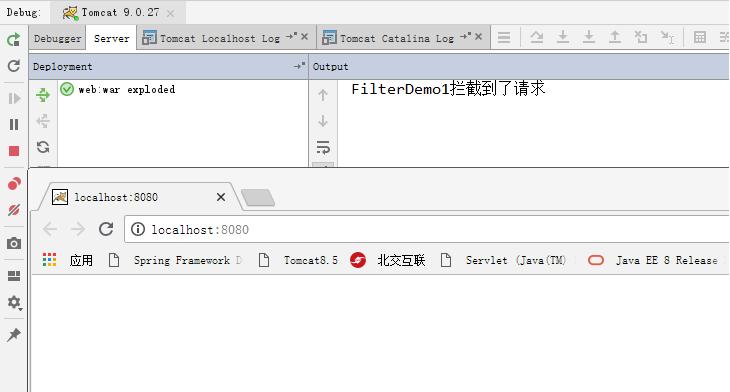

#### 11.1.3 案例的问题分析及解决

当我们启动服务，在地址栏输入访问地址后，发现浏览器任何内容都没有，控制台却输出了【FilterDemo1拦截到了请求】，也就是说在访问任何资源的时候，都先经过了过滤器。

这是因为：我们在配置过滤器的拦截规则时，使用了`/*`,表明访问当前应用下任何资源，此过滤器都会起作用。除了这种全部过滤的规则之外，它还支持特定类型的过滤配置。我们可以稍作调整，就可以不用加上面那段过滤图标的代码了。修改的方式如下：


现在的问题是，我们拦截下来了，点击链接发送请求，运行结果是：


需要对过滤器执行放行操作，才能让他继续执行，那么如何放行的？

我们需要使用`FilterChain`中的`doFilter`方法放行。

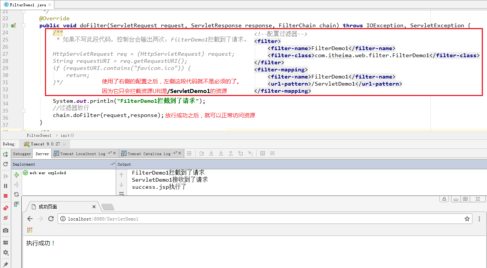


#### 11.1.4 过滤器生命周期

**Filter的实例对象在内存中也只有一份。所以也是单例的。**

+ **出生：** 当应用加载的时候执行实例化和初始化方法。
+ **活着：** 只要应用一直提供服务，对象就一直存在。
+ **死亡：** 当应用卸载时，或者服务器宕机时，对象消亡。


**过滤器doFilter方法的细节**

在`FilterDemo1`的`doFilter`方法添加一行代码，如下：

```java
/**
     * 过滤器的核心方法
     * @param request
     * @param response
     * @param chain
     * @throws IOException
     * @throws ServletException
     */
    @Override
    public void doFilter(ServletRequest request, ServletResponse response, FilterChain chain) throws IOException, ServletException {
        /**
         * 如果不写此段代码，控制台会输出两次：FilterDemo1拦截到了请求。

        HttpServletRequest req = (HttpServletRequest) request;
        String requestURI = req.getRequestURI();
        if (requestURI.contains("favicon.ico")) {
            return;
        }*/
        System.out.println("FilterDemo1拦截到了请求");
        //过滤器放行
        chain.doFilter(request,response);
        System.out.println("FilterDemo1放行之后，又回到了doFilter方法");
    }
```

测试运行结果，我们发现过滤器放行之后执行完目标资源，仍会回到过滤器中：


#### 11.1.5 过滤器API介绍

**Filter**

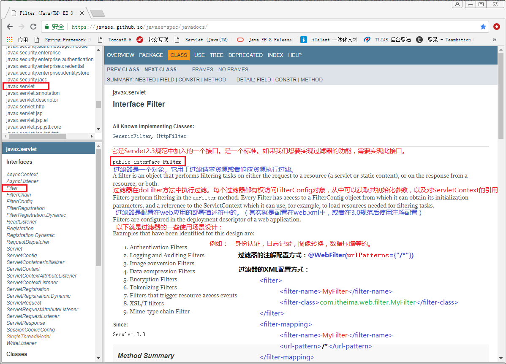


**FilterConfig**

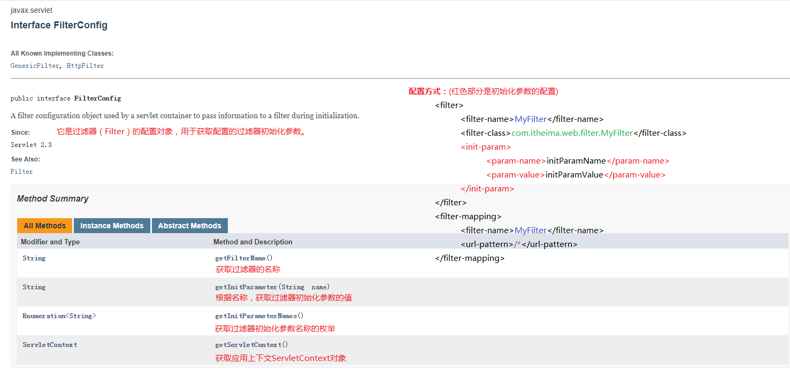

**FilterChain**

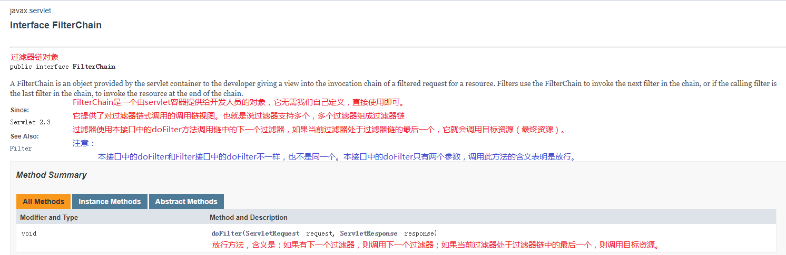


#### 11.1.6 过滤器初始化参数配置

**创建过滤器FilterDemo2**

```java
/**
 * Filter的初始化参数配置
 * @author 黑马程序员
 * @Company http://www.itheima.com
 */
public class FilterDemo2 implements Filter {

    private FilterConfig filterConfig;

    /**
     * 初始化方法
     * @param filterConfig
     * @throws ServletException
     */
    @Override
    public void init(FilterConfig filterConfig) throws ServletException {
        System.out.println("FilterDemo2的初始化方法执行了");
        //给过滤器配置对象赋值
        this.filterConfig = filterConfig;
    }

    /**
     * 过滤器的核心方法
     * @param request
     * @param response
     * @param chain
     * @throws IOException
     * @throws ServletException
     */
    @Override
    public void doFilter(ServletRequest request, ServletResponse response, FilterChain chain) throws IOException, ServletException {

        System.out.println("FilterDemo2拦截到了请求");
        //过滤器放行
        chain.doFilter(request,response);
    }
    
    /**
     * 销毁方法
     */
    @Override
    public void destroy() {
        System.out.println("FilterDemo2的销毁方法执行了");
    }
}
```

**配置FilterDemo2**

```xml
<filter>
    <filter-name>FilterDemo2</filter-name>
    <filter-class>com.itheima.web.filter.FilterDemo2</filter-class>
    <!--配置过滤器的初始化参数-->
    <init-param>
        <param-name>filterInitParamName</param-name>
        <param-value>filterInitParamValue</param-value>
    </init-param>
</filter>
<filter-mapping>
    <filter-name>FilterDemo2</filter-name>
    <url-pattern>/ServletDemo1</url-pattern>
</filter-mapping>
```

**在FilterDemo2的doFilter方法中添加下面的代码**

```java
//根据名称获取过滤器的初始化参数
String paramValue = filterConfig.getInitParameter("filterInitParamName");
System.out.println(paramValue);

//获取过滤器初始化参数名称的枚举
Enumeration<String> initNames = filterConfig.getInitParameterNames();
while(initNames.hasMoreElements()){
    String initName = initNames.nextElement();
    String initValue = filterConfig.getInitParameter(initName);
    System.out.println(initName+","+initValue);
}

//获取ServletContext对象
ServletContext servletContext = filterConfig.getServletContext();
System.out.println(servletContext);

//获取过滤器名称
String filterName = filterConfig.getFilterName();
System.out.println(filterName);
```

**测试运行结果**


我们通过这个测试，看到了过滤器的初始化参数配置和获取的使用。但是同学们也肯定发现了，在我们的工程中两个过滤器都起作用了，这就是我们在API中说的链式调用，那么当有多个过滤器，它的执行顺序是什么样的呢？


### 11.2 过滤器细节

#### 11.2.1 多个过滤器的执行顺序

**修改FilterDemo1和FilterDemo2两个过滤器的代码，删掉多余的代码**

```java
/**
 * Filter的入门案例
 * @author 黑马程序员
 * @Company http://www.itheima.com
 */
public class FilterDemo1 implements Filter {
    /**
     * 过滤器的核心方法
     * @param request
     * @param response
     * @param chain
     * @throws IOException
     * @throws ServletException
     */
    @Override
    public void doFilter(ServletRequest request, ServletResponse response, FilterChain chain) throws IOException, ServletException {
        
        System.out.println("FilterDemo1拦截到了请求");
        //过滤器放行
        chain.doFilter(request,response);
    }

    /**
     * 初始化方法
     * @param filterConfig
     * @throws ServletException
     */
    @Override
    public void init(FilterConfig filterConfig) throws ServletException {
        System.out.println("FilterDemo1的初始化方法执行了");
    }

    /**
     * 销毁方法
     */
    @Override
    public void destroy() {
        System.out.println("FilterDemo1的销毁方法执行了");
    }
}
```

```java
/**
 * Filter的初始化参数配置
 * @author 黑马程序员
 * @Company http://www.itheima.com
 */
public class FilterDemo2 implements Filter {

    /**
     * 初始化方法
     * @param filterConfig
     * @throws ServletException
     */
    @Override
    public void init(FilterConfig filterConfig) throws ServletException {
        System.out.println("FilterDemo2的初始化方法执行了");

    }

    /**
     * 过滤器的核心方法
     * @param request
     * @param response
     * @param chain
     * @throws IOException
     * @throws ServletException
     */
    @Override
    public void doFilter(ServletRequest request, ServletResponse response, FilterChain chain) throws IOException, ServletException {

        System.out.println("FilterDemo2拦截到了请求");
        //过滤器放行
        chain.doFilter(request,response);
    }

    /**
     * 销毁方法
     */
    @Override
    public void destroy() {
        System.out.println("FilterDemo2的销毁方法执行了");
    }
}
```

**修改两个过滤器的配置，删掉多余的配置**

```xml
<!--配置过滤器-->
<filter>
    <filter-name>FilterDemo1</filter-name>
    <filter-class>com.itheima.web.filter.FilterDemo1</filter-class>
</filter>
<filter-mapping>
    <filter-name>FilterDemo1</filter-name>
    <url-pattern>/ServletDemo1</url-pattern>
</filter-mapping>


<filter>
    <filter-name>FilterDemo2</filter-name>
    <filter-class>com.itheima.web.filter.FilterDemo2</filter-class>
</filter>
<filter-mapping>
    <filter-name>FilterDemo2</filter-name>
    <url-pattern>/ServletDemo1</url-pattern>
</filter-mapping>
```

**测试运行结果**

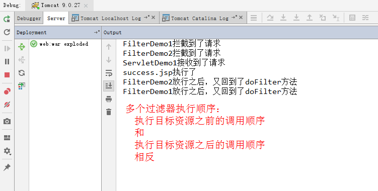

此处我们看到了多个过滤器的执行顺序，它正好和我们在web.xml中的配置顺序一致，如下图：


在过滤器的配置中，有过滤器的声明和过滤器的映射两部分，到底是声明决定顺序，还是映射决定顺序呢？

答案是：`<filter-mapping>`的配置前后顺序决定过滤器的调用顺序，也就是由映射配置顺序决定。

#### 11.2.2 过滤器的五种拦截行为

我们的过滤器目前拦截的是请求，但是在实际开发中，我们还有请求转发和请求包含，以及由服务器触发调用的全局错误页面。默认情况下过滤器是不参与过滤的，要想使用，需要我们配置。配置的方式如下：

```xml
<!--配置过滤器-->
<filter>
    <filter-name>FilterDemo1</filter-name>
    <filter-class>com.itheima.web.filter.FilterDemo1</filter-class>
    <!--配置开启异步支持，当dispatcher配置ASYNC时，需要配置此行-->
    <async-supported>true</async-supported>
</filter>
<filter-mapping>
    <filter-name>FilterDemo1</filter-name>
    <url-pattern>/ServletDemo1</url-pattern>
    <!--过滤请求：默认值。-->
    <dispatcher>REQUEST</dispatcher>
    <!--过滤全局错误页面：当由服务器调用全局错误页面时，过滤器工作-->
    <dispatcher>ERROR</dispatcher>
    <!--过滤请求转发：当请求转发时，过滤器工作。-->
    <dispatcher>FORWARD</dispatcher>
    <!--过滤请求包含：当请求包含时，过滤器工作。它只能过滤动态包含，jsp的include指令是静态包含-->
    <dispatcher>INCLUDE</dispatcher>
    <!--过滤异步类型，它要求我们在filter标签中配置开启异步支持-->
    <dispatcher>ASYNC</dispatcher>
</filter-mapping>
```

#### 11.2.3 过滤器与Servlet的区别

| 方法/类型                                          | Servlet                                                      | Filter                                                       | 备注                                                         |
| -------------------------------------------------- | ------------------------------------------------------------ | ------------------------------------------------------------ | ------------------------------------------------------------ |
| 初始化                                        方法 | `void   init(ServletConfig);   `                             | `void init(FilterConfig);   `                                | 几乎一样，都是在web.xml中配置参数，用该对象的方法可以获取到。 |
| 提供服务方法                                       | `void   service(request,response);                                               ` | `void   dofilter(request,response,FilterChain);                                   ` | Filter比Servlet多了一个FilterChain，它不仅能完成Servlet的功能，而且还可以决定程序是否能继续执行。所以过滤器比Servlet更为强大。   在Struts2中，核心控制器就是一个过滤器。 |
| 销毁方法                                           | `void destroy();`                                            | `void destroy();`                                            |                                                              |


### 11.3 静态资源设置缓存时间过滤器

#### 1） 需求说明

在我们访问html，js，image时，不需要每次都重新发送请求读取资源，就可以通过设置响应消息头的方式，设置缓存时间。但是如果每个Servlet都编写相同的代码，显然不符合我们统一调用和维护的理念。（此处有个非常重要的编程思想：AOP思想，在录制视频时提不提都可以）

因此，我们要采用过滤器来实现功能。

#### 2） 编写步骤

**导入静态资源**

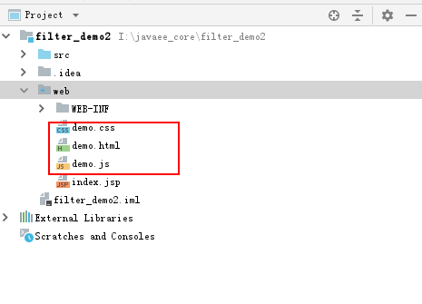

**编写过滤器**

```java
/**
 * 静态资源设置缓存时间
 * 	html设置为1小时
 *  js设置为2小时
 *  css设置为3小时
 * @author 黑马程序员
 * @Company http://www.itheima.com
 */
public class StaticResourceNeedCacheFilter implements Filter {

    private FilterConfig filterConfig;

    public void init(FilterConfig filterConfig) throws ServletException {
        this.filterConfig = filterConfig;
    }


    public void doFilter(ServletRequest req, ServletResponse res,
                         FilterChain chain) throws IOException, ServletException {
        //1.把doFilter的请求和响应对象转换成跟http协议有关的对象
        HttpServletRequest  request;
        HttpServletResponse response;
        try {
            request = (HttpServletRequest) req;
            response = (HttpServletResponse) res;
        } catch (ClassCastException e) {
            throw new ServletException("non-HTTP request or response");
        }
        //2.获取请求资源URI
        String uri = request.getRequestURI();
        //3.得到请求资源到底是什么类型
        String extend = uri.substring(uri.lastIndexOf(".")+1);//我们只需要判断它是不是html,css,js。其他的不管
        //4.判断到底是什么类型的资源
        long time = 60*60*1000;
        if("html".equals(extend)){
            //html 缓存1小时
            String html = filterConfig.getInitParameter("html");
            time = time*Long.parseLong(html);
        }else if("js".equals(extend)){
            //js 缓存2小时
            String js = filterConfig.getInitParameter("js");
            time = time*Long.parseLong(js);
        }else if("css".equals(extend)){
            //css 缓存3小时
            String css = filterConfig.getInitParameter("css");
            time = time*Long.parseLong(css);

        }
        //5.设置响应消息头
        response.setDateHeader("Expires", System.currentTimeMillis()+time);
        //6.放行
        chain.doFilter(request, response);
    }


    public void destroy() {

    }

}
```

**配置过滤器**

```xml
<filter>
    <filter-name>StaticResourceNeedCacheFilter</filter-name>
    <filter-class>com.itheima.web.filter.StaticResourceNeedCacheFilter</filter-class>
    <init-param>
        <param-name>html</param-name>
        <param-value>3</param-value>
    </init-param>
    <init-param>
        <param-name>js</param-name>
        <param-value>4</param-value>
    </init-param>
    <init-param>
        <param-name>css</param-name>
        <param-value>5</param-value>
    </init-param>
</filter>
<filter-mapping>
    <filter-name>StaticResourceNeedCacheFilter</filter-name>
    <url-pattern>*.html</url-pattern>
</filter-mapping>
<filter-mapping>
    <filter-name>StaticResourceNeedCacheFilter</filter-name>
    <url-pattern>*.js</url-pattern>
</filter-mapping>
<filter-mapping>
    <filter-name>StaticResourceNeedCacheFilter</filter-name>
    <url-pattern>*.css</url-pattern>
</filter-mapping>
```

#### 3） 测试结果

> 此案例演示时需要注意一下，chrome浏览器刷新时，每次也都会发送请求，所以看不到304状态码。建议用IE浏览器，因为它在刷新时不会再次请求。

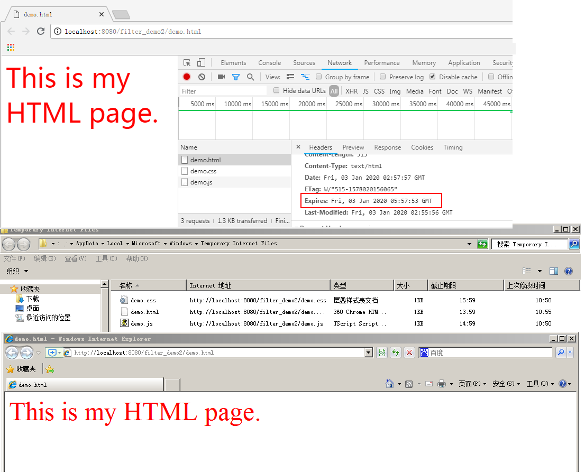

### 11.4 特殊字符过滤器

#### 1）需求说明

在实际开发中，可能会面临一个问题，就是很多输入框都会遇到特殊字符。此时，我们也可以通过过滤器来解决。

> 例如：我们模拟一个论坛，有人发帖问：“在HTML中表示水平线的标签是哪个？”。
> 
> 如果我们在文本框中直接输入`<hr/>`就会出现一条水平线，这个会让发帖人一脸懵。
> 
> 我们接下来就用过滤器来解决一下。

#### 2）编写步骤

**编写Servlet和JSP**

```java
/**
 * @author 黑马程序员
 * @Company http://www.itheima.com
 */
public class ServletDemo1 extends HttpServlet {

    public void doGet(HttpServletRequest request, HttpServletResponse response)
            throws ServletException, IOException {
        String content = request.getParameter("content");
        response.getWriter().write(content);
    }

    public void doPost(HttpServletRequest request, HttpServletResponse response)
            throws ServletException, IOException {
        doGet(request, response);
    }

}
```

```jsp
<servlet>
    <servlet-name>ServletDemo1</servlet-name>
    <servlet-class>com.itheima.web.servlet.ServletDemo1</servlet-class>
</servlet>
<servlet-mapping>
    <servlet-name>ServletDemo1</servlet-name>
    <url-pattern>/ServletDemo1</url-pattern>
</servlet-mapping>
```

```jsp
<%@ page language="java" import="java.util.*" pageEncoding="UTF-8"%>
<!DOCTYPE HTML PUBLIC "-//W3C//DTD HTML 4.01 Transitional//EN">
<html>
<head>
    <title></title>
</head>
<body>
<form action="${pageContext.request.contextPath}/ServletDemo1" method="POST">
    回帖：<textarea rows="5" cols="25" name="content"></textarea><br/>
    <input type="submit" value="发言">
</form>
</body>
</html>
```

**编写过滤器**

```java

/**
 * @author 黑马程序员
 * @Company http://www.itheima.com
 */
public class HTMLFilter implements Filter {

    public void init(FilterConfig filterConfig) throws ServletException {

    }


    public void doFilter(ServletRequest req, ServletResponse res,
                         FilterChain chain) throws IOException, ServletException {
        HttpServletRequest request;
        HttpServletResponse response;
        try {
            request = (HttpServletRequest) req;
            response = (HttpServletResponse) res;
        } catch (ClassCastException e) {
            throw new ServletException("non-HTTP request or response");
        }
        //创建一个自己的Request类
        MyHttpServletRequest2 myrequest = new MyHttpServletRequest2(request);
        //放行：
        chain.doFilter(myrequest, response);
    }

    public void destroy() {
    }
}
class MyHttpServletRequest2 extends HttpServletRequestWrapper {
    //提供一个构造方法
    public MyHttpServletRequest2(HttpServletRequest request){
        super(request);
    }

    //重写getParameter方法
    public String getParameter(String name) {
        //1.获取出请求正文： 调用父类的获取方法
        String value = super.getParameter(name);
        //2.判断value是否有值
        if(value == null){
            return null;
        }
        return htmlfilter(value);
    }

    private String htmlfilter(String message){
        if (message == null)
            return (null);

        char content[] = new char[message.length()];
        message.getChars(0, message.length(), content, 0);
        StringBuilder result = new StringBuilder(content.length + 50);
        for (int i = 0; i < content.length; i++) {
            switch (content[i]) {
                case '<':
                    result.append("&lt;");
                    break;
                case '>':
                    result.append("&gt;");
                    break;
                case '&':
                    result.append("&amp;");
                    break;
                case '"':
                    result.append("&quot;");
                    break;
                default:
                    result.append(content[i]);
            }
        }
        return (result.toString());
    }

}
```

**配置过滤器**

```xml
<filter>
    <filter-name>HTMLFilter</filter-name>
    <filter-class>com.itheima.web.filter.HTMLFilter</filter-class>
</filter>
<filter-mapping>
    <filter-name>HTMLFilter</filter-name>
    <url-pattern>/*</url-pattern>
</filter-mapping>
```

#### 3）测试结果


## 12 注解开发Servlet3.0

### 12.1 自动注解配置

#### 1）配置步骤

**第一步：创建JavaWeb工程，并移除web.xml**

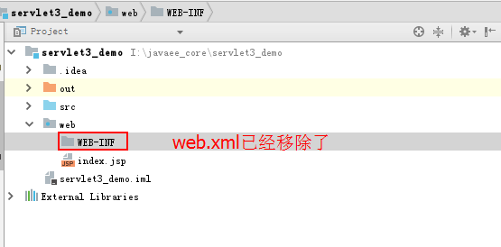

**第二步：编写Servlet**

```java
/**
 * 注解开发Servlet
 * @author 黑马程序员
 * @Company http://www.itheima.com
 */
public class ServletDemo1 extends HttpServlet {

    @Override
    protected void doGet(HttpServletRequest req, HttpServletResponse resp) throws ServletException, IOException {
        doPost(req,resp);
    }

    @Override
    protected void doPost(HttpServletRequest req, HttpServletResponse resp) throws ServletException, IOException {
        System.out.println("Servlet Demo1 Annotation");
    }
}
```

**第三步：使用注解配置Servlet**

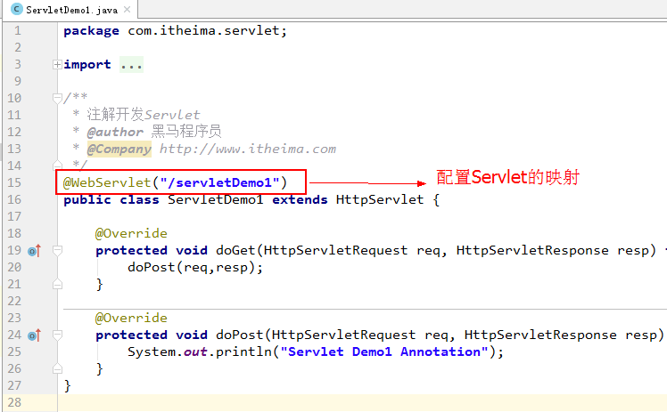

**第四步：测试**

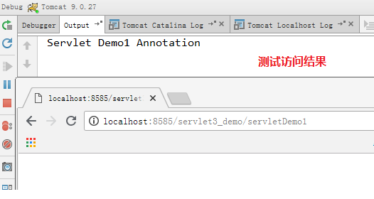

#### 2）注解详解

```java
/**
 * WebServlet注解
 * @since Servlet 3.0 (Section 8.1.1)
 */
@Target(ElementType.TYPE)
@Retention(RetentionPolicy.RUNTIME)
@Documented
public @interface WebServlet {

    /**
     * 指定Servlet的名称。
     * 相当于xml配置中<servlet>标签下的<servlet-name>
     */
    String name() default "";

    /**
     * 用于映射Servlet访问的url映射
     * 相当于xml配置时的<url-pattern>
     */
    String[] value() default {};

    /**
     * 相当于xml配置时的<url-pattern>
     */
    String[] urlPatterns() default {};

    /**
     * 用于配置Servlet的启动时机
     * 相当于xml配置的<load-on-startup>
     */
    int loadOnStartup() default -1;

    /**
     * 用于配置Servlet的初始化参数
     * 相当于xml配置的<init-param>
     */
    WebInitParam[] initParams() default {};

    /**
     * 用于配置Servlet是否支持异步
     * 相当于xml配置的<async-supported>
     */
    boolean asyncSupported() default false;

    /**
     * 用于指定Servlet的小图标
     */
    String smallIcon() default "";

    /**
     * 用于指定Servlet的大图标
     */
    String largeIcon() default "";

    /**
     * 用于指定Servlet的描述信息
     */
    String description() default "";

    /**
     * 用于指定Servlet的显示名称
     */
    String displayName() default "";
}
```

### 12.2 手动创建容器

#### 1）前置说明

在使用Servlet3.1版本的规范时，脱离了web.xml进行注解开发，它除了支持使用注解的配置方式外，还支持纯手动创建Servlet容器的方式。要想使用的话，必须遵循它的编写规范。它是从Servlet3.0规范才开始引入的，加入了一个新的接口：

```java
package javax.servlet;

import java.util.Set;

/**
 * 初始化Servlet容器必须实现此接口
 * 它是Servlet3.0规范提供的标准接口
 * @since Servlet 3.0
 */
public interface ServletContainerInitializer {
     /**
     * 启动容器时做一些初始化操作，例如注册Servlet,Filter,Listener等等。
 	 * @since Servlet 3.0
     */
    void onStartup(Set<Class<?>> c, ServletContext ctx) throws ServletException;
}
```

同时可以利用@HandlesTypes注解，把要加载到onStartup方法中的类字节码传入进来，@HandlesTypes源码如下：

```java
/**
 * 用于指定要加载到ServletContainerInitializer接口实现了中的字节码
 * @see javax.servlet.ServletContainerInitializer
 * @since Servlet 3.0
 */
@Target({ElementType.TYPE})
@Retention(RetentionPolicy.RUNTIME)
public @interface HandlesTypes {

    /**
     * 指定要加载到ServletContainerInitializer实现类的onStartUp方法中类的字节码。
     * 字节码可以是接口，抽象类或者普通类。
     */
    Class[] value();
}
```

#### 2）编写步骤

**第一步：创建工程，并移除web.xml**

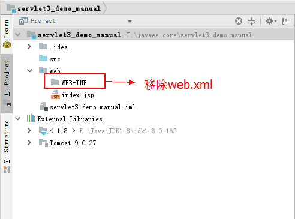

**第二步：编写Servlet**

```java
/**
 * 注解开发Servlet 之 手动初始化容器
 * @author 黑马程序员
 * @Company http://www.itheima.com
 */
public class ServletDemo1 extends HttpServlet {

    @Override
    protected void doGet(HttpServletRequest req, HttpServletResponse resp) throws ServletException, IOException {
        doPost(req,resp);
    }

    @Override
    protected void doPost(HttpServletRequest req, HttpServletResponse resp) throws ServletException, IOException {
        System.out.println("Servlet Demo1 Annotation manual");
    }
}
```

**第三步：创建初始化容器的类，并按照要求配置**

```java
/**
 * 初始化容器操作
 * @author 黑马程序员
 * @Company http://www.itheima.com
 */
public class MyServletContainerInitializer implements ServletContainerInitializer {

    @Override
    public void onStartup(Set<Class<?>> c, ServletContext ctx) throws ServletException {
       
    }
}
```

在脱离web.xml时，要求在src目录下包含一个META-INF目录，位置和及字母都不能改变，且严格区分大小写。在目录中创建一个名称为`javax.servlet.ServletContainerInitializer`的文件，里面写实现了`ServletContainerInitializer`接口的全限定类名。如下图所示：

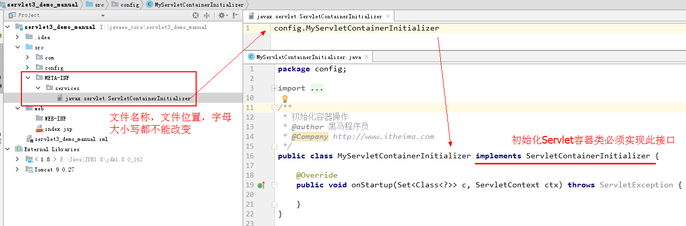

**第四步：编写注册Servlet的代码**

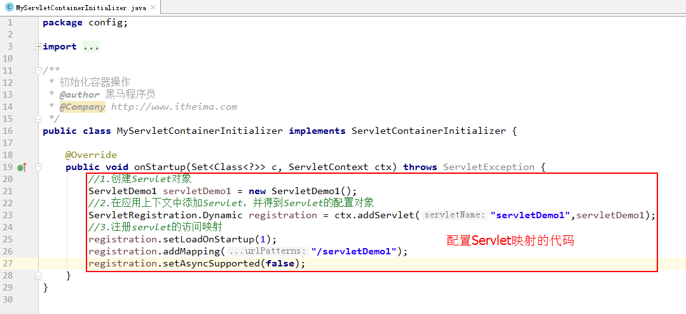

**第五步：测试**

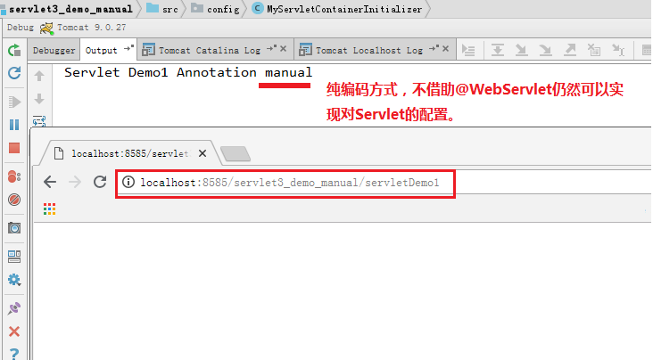

